# Microsoft Windows Installation Instructions

## Brief Instructions

Steps to Install **Excel to Graphviz** on Microsoft Windows

1. [Download and Install *Graphviz*](./README.md#download-and-install-graphviz) 
   - Choose and run either the 32-bit or 64-bit [Graphviz EXE Installer](https://graphviz.org/download/).
   - Ensure the Graphviz `bin` directory is on the `PATH`

2. [Open Command Prompt](./README.md#open-command-prompt) using the `Run as Administrator` option.

   - *Register the Plugins:* Run the command `dot -c` to register Graphviz plugins.
   - *Confirm the Installation:* Run the command `dot -V` to verify the Graphviz version.

3. [Download the *Relationship Visualizer* assets](./README.md#download-the-relationship-visualizer-assets) 
   - Obtain `RelationshipVisualizer.zip` from [SourceForge](https://sourceforge.net/projects/relationship-visualizer/).
   - *Optional:* Validate SHA1 and/or MD5 checksums available [here](https://sourceforge.net/projects/relationship-visualizer/files/) against the file downloaded.

4. [Extract the files from the Zip file](./README.md#extract-files-from-zip-file) 
   - Extract all files to a local directory.
  
5. [Unblock the spreadsheet file](./README.md#unblock-the-spreadsheet-file)
     - Right-click (or `Alt+Enter`) on `Relationship Visualizer.xlsm` and select `Properties`.
     - Check `Unblock` at the bottom of the Properties dialog, then click OK.

6. [Open Microsoft Excel](./README.md#open-microsoft-excel)
   - Enable Macros in Microsoft Excel's `Trust Center` options.
   - Open the `Relationship Visualizer.xlsm` workbook, and grant permissions if prompted.
   - Save the file as a workbook template

## Detailed Instructions

### Download and Install Graphviz

#### Step 1. Download Graphviz Media

Download the installation media from the Windows section of the Graphviz download page at [https://graphviz.org/download/](https://graphviz.org/download/) which appears as:

| 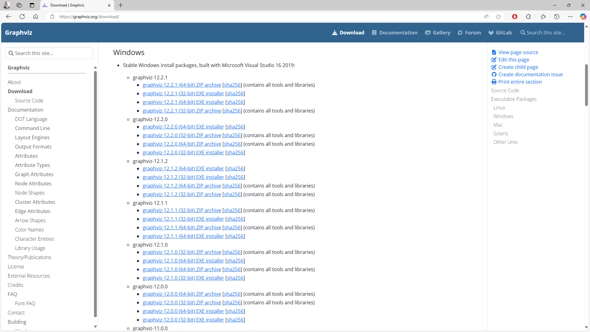 |
| -------------------------------------------------- |

You will be presented with two links: Win32 for the 32-bit installer and x64 for the 64-bit installer. Choose the link that corresponds with the Windows architecture of your machine.

Download the installer file. At the time of this writing (16-Dec-2024) the files are named:

- **graphviz-12.2.1 (64-bit) EXE installer** [windows_10_cmake_Release_graphviz-install-8.0.2-win64.exe](https://gitlab.com/api/v4/projects/4207231/packages/generic/graphviz-releases/12.2.1/windows_10_cmake_Release_graphviz-install-12.2.1-win64.exe)
- **graphviz-12.2.1 (32-bit) EXE installer** [windows_10_cmake_Release_graphviz-install-8.0.2-win32.exe](https://gitlab.com/api/v4/projects/4207231/packages/generic/graphviz-releases/12.2.1/windows_10_cmake_Release_graphviz-install-12.2.1-win32.exe)

::: tip Download blocked?

If you are using Microsoft Edge, ocassionally the download will be blocked. This is usually due to a new release of Graphviz being published and enough downloads have not occurred to tell Microsoft the download is safe.

Follow the steps on [this page](../blocked/) to learn how to override the block and download the file.

:::

#### Step 2 - Launch the installer file.

Click on `Open file` to run the installer.

| 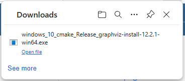 |
| -------------------------------------------------- |

A User Access Control warning will now take over the screen and ask

| User Access Control                                                                                                                                                                                                                                                                        |
| :----------------------------------------------------------------------------------------------------------------------------------------------------------------------------------------------------------------------------------------------------------------------------------------- |
| Do you want to allow this app from an unknown publisher to make changes to your device?  windows_10_cmake_Release_graphviz-install-12.2.1-win64.exe  Publisher unknown  File origin: Hard drive on this computer  Show more details  [ Yes ] [ No ] |

Press the `Yes` button, and the Graphviz installer will begin to run.

#### Step 3 - Select `Next >`

Select `Next >` on the **"Welcome to Graphviz Setup"** splash page.

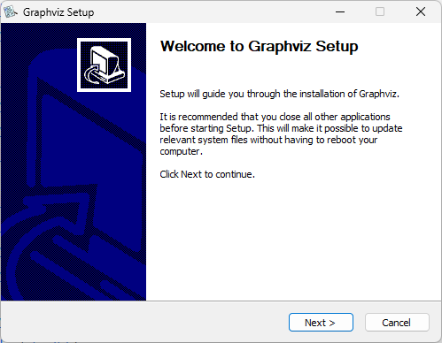

#### Step 4 - Accept the License Agreement

Accept the License Agreement by pressing the `I Agree` button.

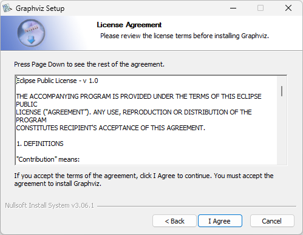

#### Step 5 - Modify PATH

The Graphviz `bin` directory needs to be on your system PATH.

Select the radio button `Add Graphviz to the system PATH for all users`, then click the `Next >` button.

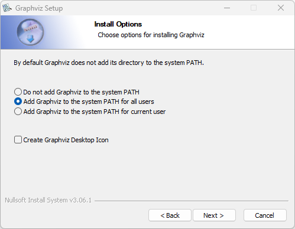

#### Step 6 - Specify Installation Folder

Specify the folder where Graphviz should be installed. Select the `Everyone` radio button, and then select the `Next >` button.

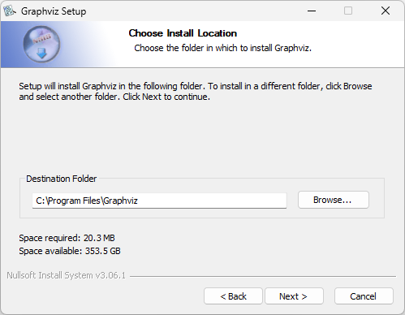

#### Step 7 - Press the `Install` button

Choose the Start Menu Folder and press the `Install` button.

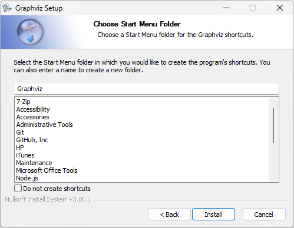

#### Step 8 - Monitor Progress

The installer will copy the files and make Windows configuration changes. A status bar will indicate how the installation is progressing.

#### Step 9 - Click `Finish`

Once the **Completing Graphviz Setup** screen appears press the `Finish` button. The software is installed.

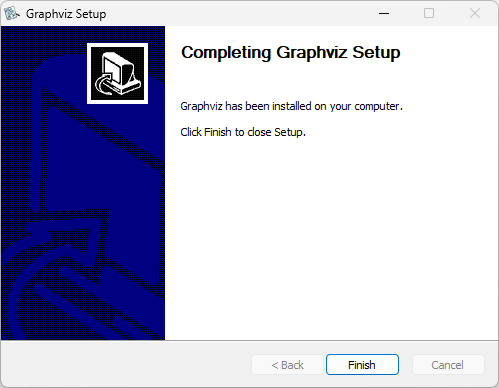

#### Step 10 - Restart Microsoft Windows (Optional)

Technically, restarting Microsoft Windows shouldn't be necessary. However, if you've already been running Excel, it might be holding an outdated copy of your environment variables. Restarting Microsoft Windows ensures that Excel references the current `PATH` environment variable.

### Open Command Prompt

At this point, you have completed the installation steps for the Graphviz software. Now perform a Graphviz Command Line configuration and test.

::: warning Do not skip these steps!

The Relationship Visualizer spreadsheet utilizes command-line programs to generate graph visualizations. You must manually execute a command-line command to configure the Graphviz plugins before using Graphviz properly.

:::

Testing the command line programs prior to using the spreadsheet can help ensure that everything is in place correctly so that the spreadsheet can perform properly.

#### Step 1 - Open a Command Prompt

Open a Command Prompt window using the `Run as Administrator` option. 

Click on the Windows Start Menu icon and begin to type `Command Prompt`. When the `Command Prompt` App appears choose the `Run as administrator` option.

| 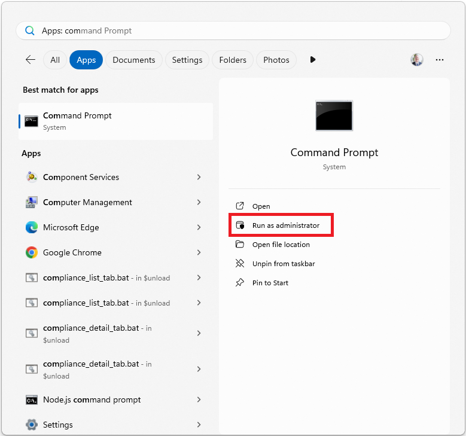 |
| -------------------------------------------------- |

#### Step 2 - Run as Administrator

You will get asked for permission to run a command prompt as Administrator.

Press the `Yes` button.

| User Access Control                                                                                                                                                               |
| :-------------------------------------------------------------------------------------------------------------------------------------------------------------------------------- |
| Do you want to allow this app from an unknown publisher to make changes to your device?  Windows Command Processor Verified Publisher: Microsoft Windows  [ Yes ] [ No ] |

#### Step 3 - Confirm Administrator rights

A command prompt window appears. Confirm that the word **Administrator** appears in the Window title.

| 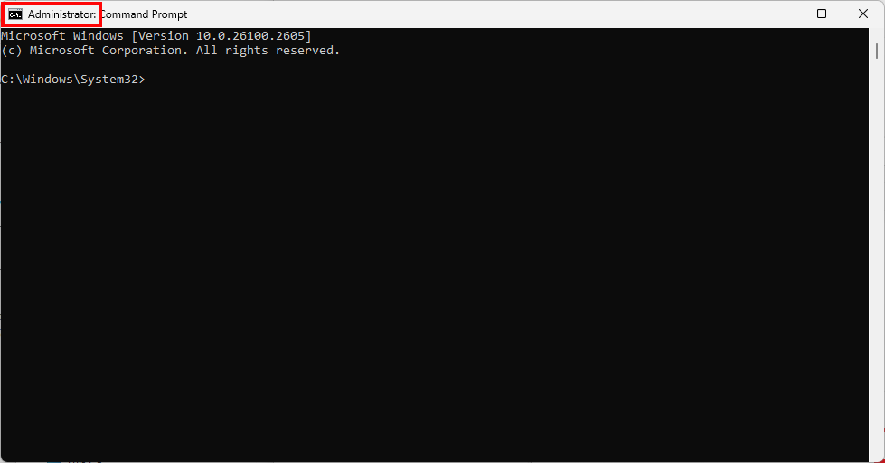 |
| -------------------------------------------------- |

#### Step 4 - Display Graphviz Version

Test that Graphviz is configured properly on the PATH by entering the command:

`dot -V`

noting that the `-V` switch (for version) should be in uppercase, not lowercase. The dot program should respond with the message:

`dot - graphviz version 12.2.1 (20241206.2353)`

in similar fashion to the screen print below:

| 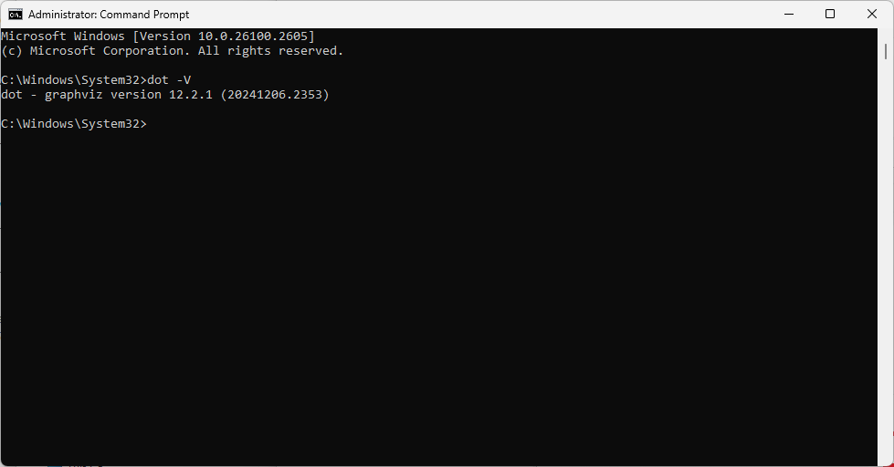 |
| -------------------------------------------------- |

If you receive the message:

`'dot' is not recognized as an internal or external command, operable program or batch file.`

It means one of the following things:

- You have specified the path to the Graphviz executables incorrectly and you should repeat the steps above. Things to check are:
  - Did you remember to add the `bin` subdirectory to the Graphviz directory path?
  - Is the directory placed at the end of the `PATH` such that the length of the `PATH` exceeds the Windows length limit? If so, move the Graphviz bin directory closer to the beginning of the list.
- You opened the `Command Prompt` window prior to updating the `PATH` statement. This command window is still recognizing the old path. Close the `Command Prompt` window, open a new one, and repeat the `dot -V` command.

#### Step 5 - Configure Graphviz Plugins

::: warning
Do not skip this important step!
:::

Configure the plugins by entering the command

`dot -c`

No messages are written when the command executes; the screen will look as follows:

| 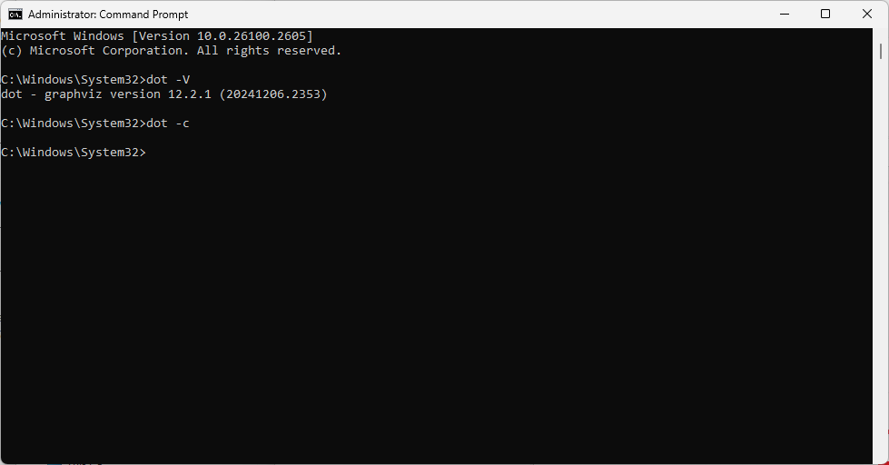 |
| -------------------------------------------------- |

#### Step 6 - View the Plugins List

To see the list of configured plugins type the command

`dot -v`

where the `-v` is **lowercase**. The screen will appear as follows:

| 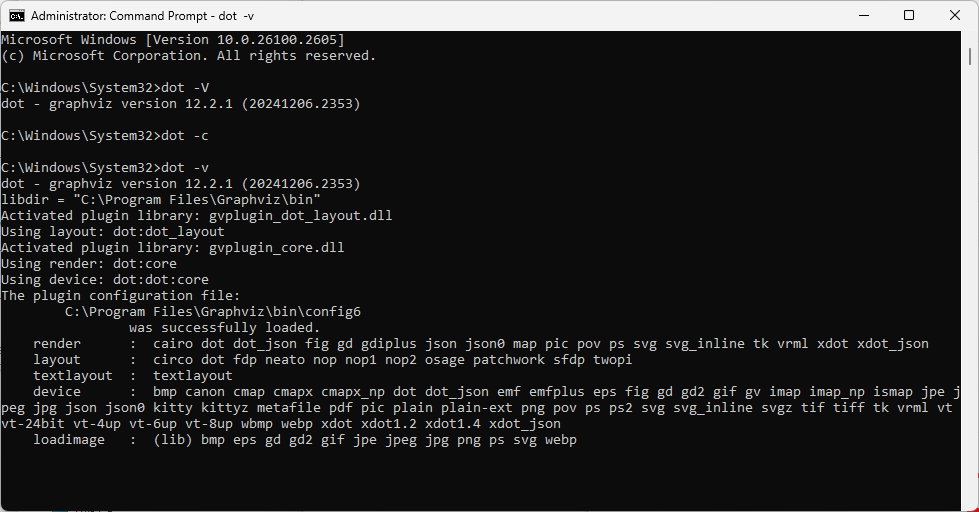 |
| -------------------------------------------------- |

At this point Graphviz is waiting for more input. Pressing the `Ctrl` + `C` keys will break you from the `dot` program.

#### Step 7 - View Command Line Options

To see the list of command line options you can enter the command

`dot -?` or `dot --help`

The screen will appear as follows:

| 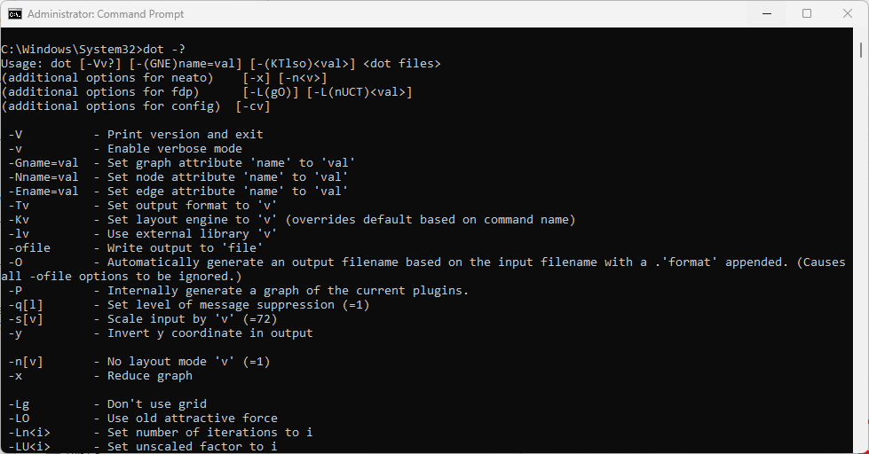 |
| -------------------------------------------------- |

**Congratulations!** Graphviz is installed properly.

### Download the Relationship Visualizer Assets

The *Relationship Visualizer:* is distributed as a Zip file which is hosted at SourceForge, as SourceForge provides virus scanning of assets, and provides checksums to help confirm that files have not been tampered with during download.

Obtain `RelationshipVisualizer.zip` from [SourceForge](https://sourceforge.net/projects/relationship-visualizer/) by clicking the large green `Download` button.

| 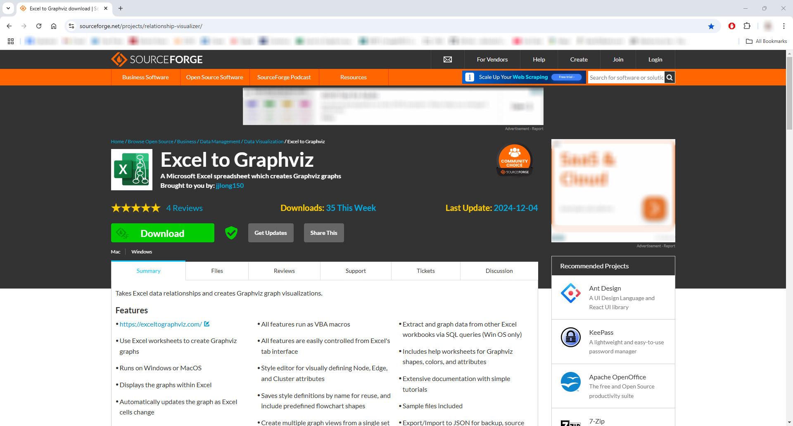 |
| -------------------------------------------------- |

*Optional:* Validate `SHA1` and/or `MD5` checksums available [here](https://sourceforge.net/projects/relationship-visualizer/files/) against the file downloaded.

| 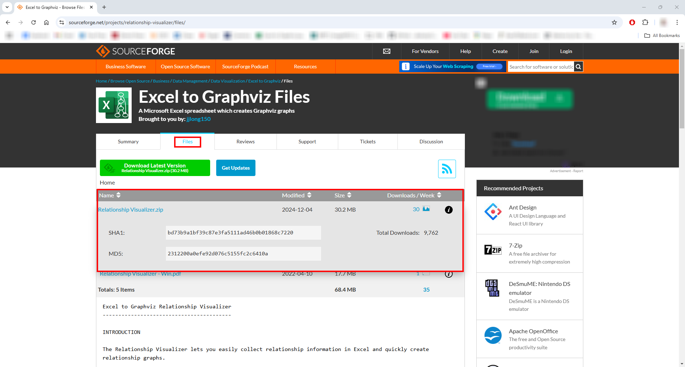 |
| -------------------------------------------------- |

### Extract Files From Zip File

Extract all files to a local directory.

  | 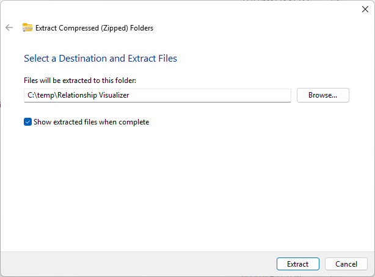 |
  | -------------------------------------------------- |
  
### Unblock the Spreadsheet File

In the directory where you extracted the files, right mouse click (or `Alt+Enter`) on `Relationship Visualizer.xlsm` and select `Properties`.

| 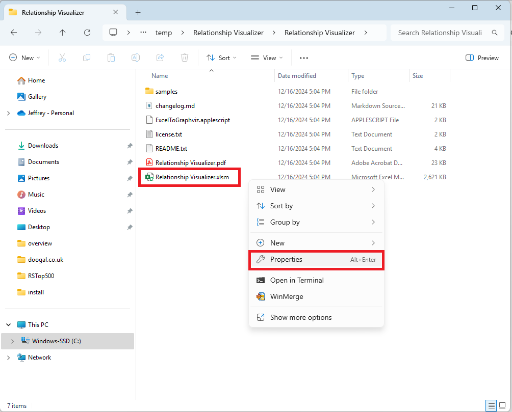 |
| -------------------------------------------------- |

Check `Unblock` at the bottom of the `Properties` dialog, click `Apply`, then click **OK**.

| 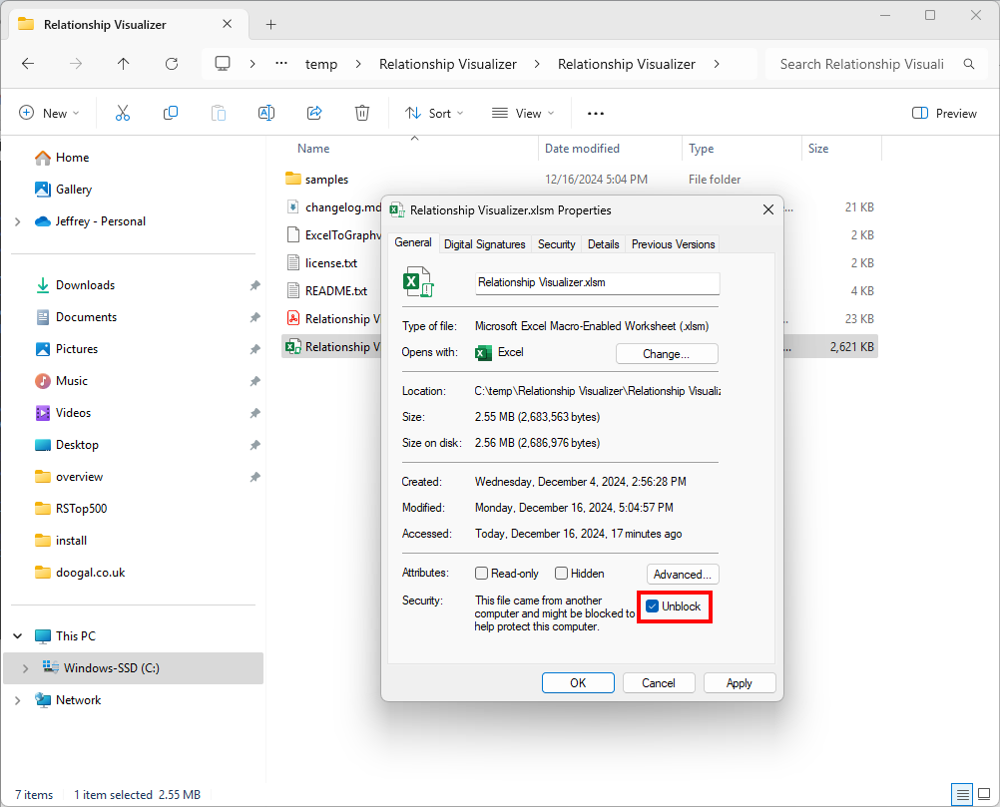 |
| -------------------------------------------------- |

### Open Microsoft Excel

#### Step 1 - Enable Macros

The *Relationship Visualizer* is a VBA-enabled spreadsheet. If you do not trust VBA, or this download this tool is not for you. The *Relationship Visualizer* requires that Excel is configured to allow macros. You configure Microsoft Excel as follows:

From the `File` menu, select `Options` in the lower left corner.

| 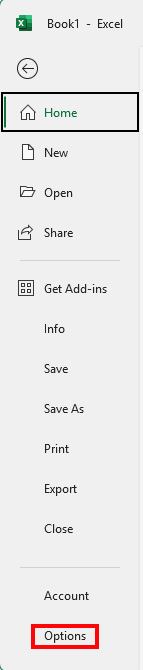 |
| -------------------------------------------------- |

The `Excel Options` dialog will be displayed. The left column has categories of options. Choose `Trust Center`, then press the `Trust Center Settings...` button.

| 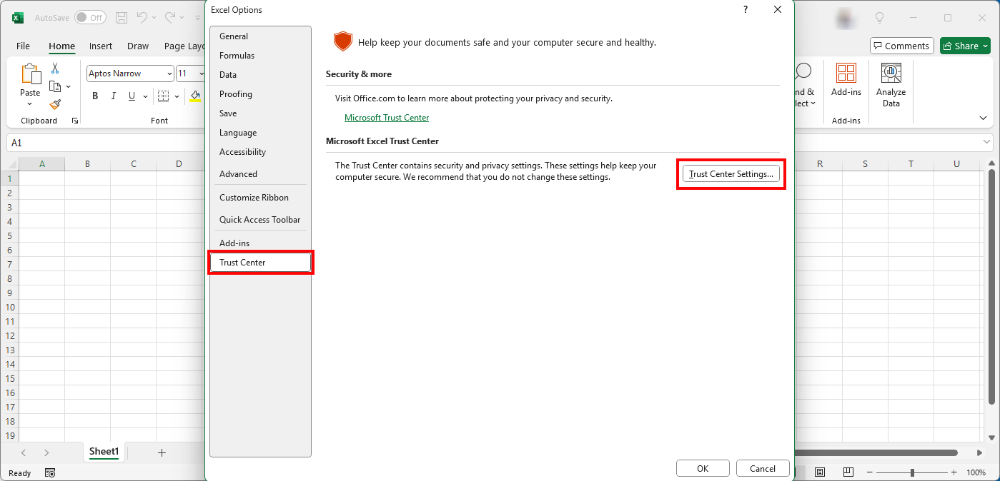 |
| -------------------------------------------------- |

The left column list of categories will change to the Trust Center categories. Select `Macro Settings`.

Next, select the radio button which says `Enable VBA macros (not recommended; potentially dangerous code can run)`.

If you do not want to turn on unlimited macro access, you can choose the `

Click 'OK' to close the Trust Center Settings dialog, then click `OK` to close the `Excel Options` dialog.

| 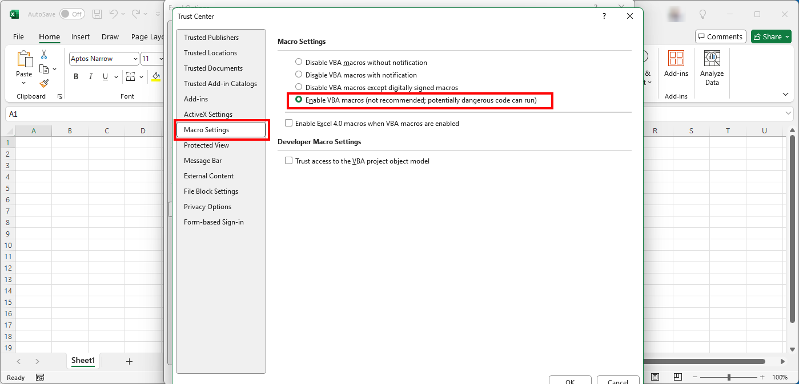 |
| -------------------------------------------------- |

#### Step 2 - Open Workbook

In the root directory of the *Relationship Visualizer* distribution there is a macro-enabled Excel spreadsheet named `Relationship Visualizer.xlsm`. Double-click the mouse on the file to launch Excel. 

If you get the message `SECURITY WARNING Macros have been disabled [Enable Content]` click the `Enable Content` button. Enabling macro support is necessary to use the *Relationship Visualizer* spreadsheet.

| 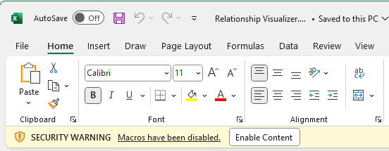 |
| -------------------------------------------------- |

#### Step 3 - Save the File as a Workbook Template

Perform a `File` -> `Save As` operation. 

| 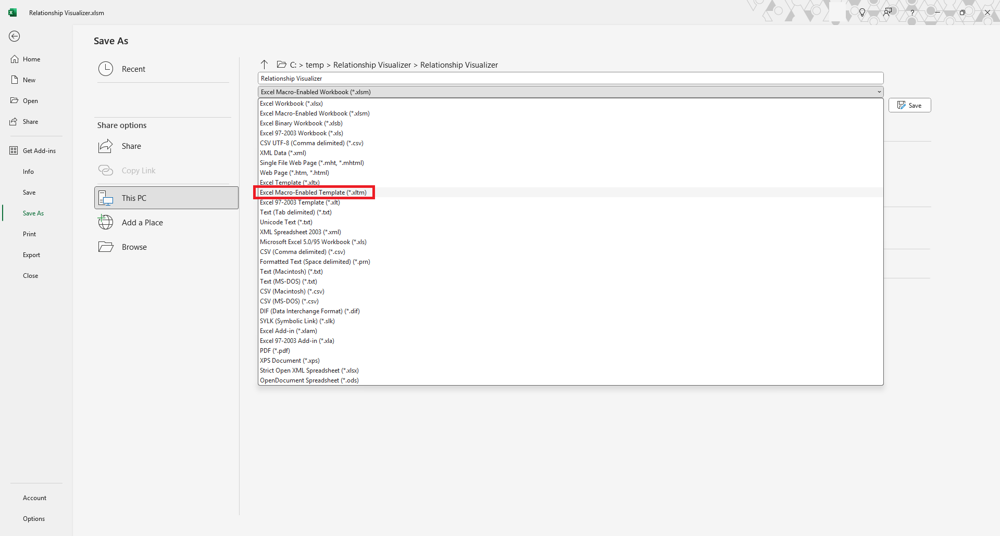 |
| -------------------------------------------------- |

Change the file extension from `Excel Macro-Enabled Workbook (*.xlsm)` to `Excel Macro-Enabled Template (*.xltm)`

The file will be automatically stored in your custom office templates directory (This PC > Documents > Custom Office Templates).

If you select `File` from the menu you will now see `Relationship Visualizer` as a choice. You can choose this template any time in the future when you want to create a fresh new copy of the *Relationship Visualizer* spreadsheet.

| 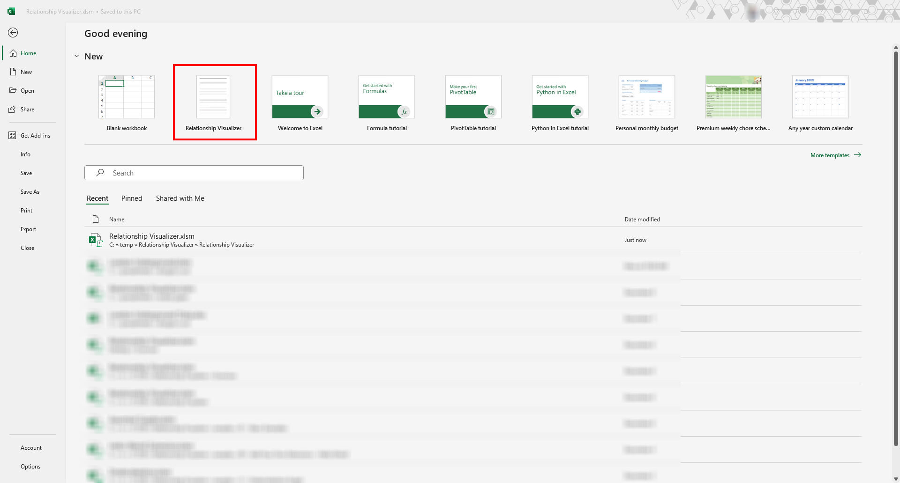 |
| -------------------------------------------------- |
