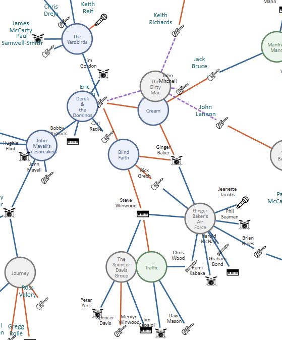
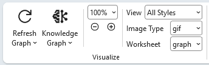
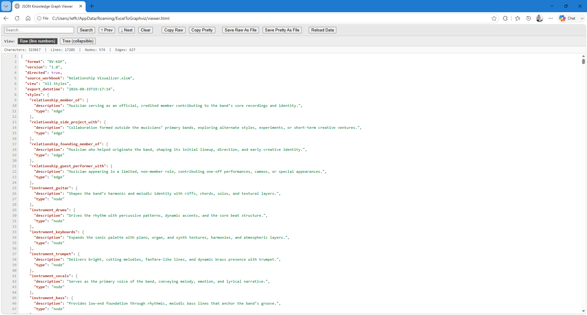
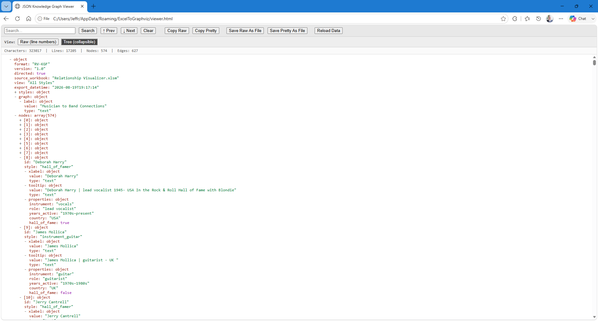
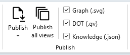

# Tutorial: Musicians to Bands

These kids could really use a graph to follow what their grandfather is explaining:

<center>


*"Thus, the Yardbirds begat Cream, Spencer Davis Group begat Traffic, Cream and Traffic begat Blind Faith, and Blind Faith begat Derek and the Dominos and Ginger Baker's Air Force..."*

*Cartoonist: David Sipress - Publication: The New Yorker - Date: August 7, 2017*

---


<br/>
The **Relationship Visualizer** can help with that!
</center>

## Overview

This package is two tutorials in one, because it turns out they're the same tutorial. The first half shows how to graph connections between musicians and rock bands using the Relationship Visualizer with SQL-driven queries, producing a large, styled Graphviz diagram. The second half takes that exact same SQL-driven data and publishes it as a **Knowledge Graph** — a structured JSON document built for handing to an AI, not for rendering as a picture.

Both outputs come from one worksheet, one set of SQL queries, and one set of style definitions. The diagram is how you — a human — verify the shape of the graph is right. The Knowledge Graph is how you hand that same, now-verified structure to an AI and ask it something you don't already know the answer to. I do exactly that later in this tutorial, using the cartoon above as the test case.

There's a third piece connecting the two: this diagram is large, having 574 nodes, and 627 edges, which is exactly the scenario v11.0's interactive SVG viewer was built for. Publish it as SVG with postprocessing turned on, and the same sprawling diagram that used to be unreadable at any single zoom level becomes navigable: a toolbar that stays put, hover labels for dense clusters, and click-to-highlight filtering. So this one dataset ends up demonstrating all three of v11.0's headline capabilities at once — a diagram you can actually explore, a Knowledge Graph you can hand to an AI, and the same underlying relationships driving both.

The included workbook, `musicians.xlsx`, provides a representative dataset containing 443 real musicians and 131 real bands, suitable for large-scale force-directed diagram layout and, as it turns out, for genuinely interesting graph analysis.

| Musician-to-Band relationships visualized as a force-directed Graphviz graph (png image)  |
| -------------------------------------------------------------------- |
|  |

This sample contains **test data only** sourced from [BandToBand.com](https://bandtoband.com).

## Get the Files

This site doesn't host downloadable spreadsheets directly, so the workbook and sample data for this tutorial live in the [examples repository on GitHub](https://github.com/jjlong150/excel-to-graphviz-examples/tree/main/neato/rock-band-musician-connections). Download or clone the `rock-band-musician-connections` folder from there. You'll need `musicians.xlsx`, `Relationship Visualizer.xlsm`, and the small music instrument images. Come back here and follow along.

## Quick Start: Generate the Diagram

Once you've got the workbook open:

1. Open the **Relationship Visualizer** workbook you downloaded above.
2. Go to the **SQL** worksheet.
3. Click **Run SQL Commands**.
4. After a few seconds, the diagram will appear on the **graph** worksheet.
5. Use the **Graphviz ribbon tab** to adjust layout, arrowheads, zoom, and other visual settings.

## Quick Start: Explore the Diagram Interactively

At 574 nodes and 627 edges, this diagram is big enough that the old choice — zoomed out and unreadable, or zoomed in and lost — was a real problem. Version 11.0's interactive SVG viewer was built for graphs exactly this size, and this dataset is a good excuse to try it.

1. On the **Settings** or **SVG** tab, turn on SVG postprocessing. It ships off by default and asks for a one-time confirmation, since it works by injecting JavaScript into the exported file — see the [Security](/security/) page for why.
2. Publish the diagram as SVG (or check **Graph**, **DOT**, and **Knowledge Graph** together for a matched set, as covered next).
3. Open the exported SVG in a browser. To make it even easier, beneath the "Publish" button is an option to check "Open after publishing". When checked, the files are opened after publishing in whatever tool you have associated with the `json`, `gv`, and `svg` file extensions..

| Interactive SVG                                                      |
| -------------------------------------------------------------------- |
|  |

You get a toolbar that stays a fixed, readable size no matter how far you're zoomed in, scroll-to-zoom and drag-to-pan, hover labels for reading node names in a dense genre cluster without zooming in first, and click-to-highlight filtering — click any musician to see just their bands, or any band to see just its members. Full details are in [Exploring diagrams just got easier](/blog/posts/interactive-diagrams).

It's also a good way to sanity-check the graph's shape before publishing it as a Knowledge Graph — which is where we're headed next.

## Quick Start: Create the Knowledge Graph

Once you've run the SQL above, the same data is one click away from becoming a Knowledge Graph:

### Visualize the Knowledge Graph





On the **Data** tab, press the **Knowledge Graph** button dropdown. The JSON export opens automatically in your default browser, using the viewer built into the workbook. 

Raw JSON text is the default view.

| Knowledge Graph JSON Viewer - Raw Text View                          |
| -------------------------------------------------------------------- |
|                                         |

You can also toggle the viewer to show the Knowledge Graph in a tree view, with the ability to collapse and expand levels in the tree.

| Knowledge Graph JSON Viewer - Tree View                              |
| -------------------------------------------------------------------- |
|                                           |

Controls in the viewer support activities such as text search, copy to clipboard, and saving to files.

### Publish the Knowledge Graph



When the visual representations meet your expectations, its time to publish the artifacts.

1. On the **Data** tab, Check **Knowledge**, or check **Graph**, **DOT**, and **Knowledge** together to publish a matched set of all three from the same data in one pass.
2. (Optional) Open the **Publish** split button dropdown (click the tiny down arrow `v`) and check "Open after publishing" if you want to inspect the published output.
3. Click **Publish**. The JSON export opens automatically in your default browser, using the viewer built into the workbook.

That's it! The files will be present in the output directory specified, or the same directory as the Excel workbook if an output directory was not specified.

The **Publish all views** button can actually generate the selected files for each view you have defined in the 'styles' worksheet.

## Deep Dive: Importing Your Data From a Workbook

To build any graph using Graphviz or as a Knowledge Graph you data must get to the 'data' worksheet. The next sections shows how SQL was used to pull the information from an Excel workbook named `musicians.xlsx`

### Data Dictionary — musicians.xlsx

The `musicians.xlsx` workbook contains four related tables used to model musicians, bands, genres, and their relationships. The structure is designed for use with the Relationship Visualizer and supports SQL-driven graph modeling.

               +----------------------+
               |      musician        |
               +----------------------+
               | Musician (PK)        |
               | AKA                  |
               | BirthYear            |
               | DeathYear            |
               | YearsActive          |
               | PrimaryInstrument    |
               | Role                 |
               | Country              |
               | InRnRHallOfFame      |
               | InRnRHallOfFameWith  |
               +----------+-----------+
                          |
                          | 1-to-many
                          |
               +----------v-----------+
               |   musician-to-band   |
               +----------------------+
               | Musician (FK)        |
               | Band (FK)            |
               | Relationship         |
               +----------+-----------+
                          |
                          | many-to-1
                          |
               +----------v-----------+
               |        band          |
               +----------------------+
               | Band (PK)            |
               | Genre (FK)           |
               | Description          |
               | Origin               |
               | Years Active         |
               | Decade               |
               | Era                  |
               | Year From            |
               | Year To              |
               | Band Type            |
               | Notable Members      |
               | Signature Work       |
               | Notes                |
               +----------+-----------+
                          |
                          | many-to-1
                          |
               +----------v-----------+
               |        genre         |
               +----------------------+
               | Genre (PK)           |
               | Definition           |
               +----------------------+

---

### Worksheet: `musician`

| Column | Definition |
|--------|------------|
| **Musician** | The musician's primary name. Used as the unique identifier across worksheets. |
| **AKA** | Alternate names, stage names, or common aliases. May contain multiple values separated by commas. |
| **BirthYear** | Year the musician was born (YYYY). Unknown values may be blank. |
| **DeathYear** | Year the musician died (YYYY). Blank if still living or unknown. |
| **YearsActive** | A textual range describing the musician's active career span (e.g., "1965–present"). |
| **PrimaryInstrument** | The musician's main instrument (e.g., Guitar, Bass, Drums, Vocals). |
| **Role** | The musician's primary role in a band or musical context (e.g., Vocalist, Guitarist, Drummer, Songwriter). |
| **Country** | Country of origin or nationality. |
| **InRnRHallOfFame** | Indicates whether the musician is individually inducted into the Rock & Roll Hall of Fame (`Yes` / `No`). |
| **InRnRHallOfFameWith** | If inducted as part of a band, lists the band name(s). Blank if not applicable. |

---

### Worksheet: `musician-to-band`

This table models the many-to-many relationship between musicians and bands.

| Column | Definition |
|--------|------------|
| **Musician** | Name of the musician (foreign key to `musician.Musician`). |
| **Band** | Name of the band (foreign key to `band.Band`). |
| **Relationship** | Describes the musician's association with the band: `member_of`, `founding_member_of`, `side_project_with`, or `guest_performer_with`. |

---

### Worksheet: `band`

| Column | Definition |
|--------|------------|
| **Band** | The band's name. Serves as the unique identifier for band-related relationships. |
| **Genre** | Primary musical genre associated with the band (e.g., Rock, Metal, Punk). |
| **Description** | Short narrative description of the band (history, style, significance). |
| **Origin** | City, state, or country where the band was formed. |
| **Years Active** | Textual range describing the band's active years (e.g., "1970–1995"). |
| **Decade** | The decade most associated with the band's peak activity (e.g., 1970s, 1980s). |
| **Era** | A broader classification grouping bands into eras (e.g., Heavy Metal, New Wave). |
| **Year From** | Numeric year the band began (YYYY). |
| **Year To** | Numeric year the band ended or disbanded (YYYY). Blank if still active. |
| **Band Type** | Category describing the band's structure (e.g., Duo, Trio, Quartet, Supergroup, Large Ensemble). |
| **Notable Members** | Key members of the band, typically the most recognized lineup. |
| **Signature Work** | The band's most iconic album or song. |
| **Notes** | Additional context, trivia, or modeling notes. |

---

### Worksheet: `genre`

| Column | Definition |
|--------|------------|
| **Genre** | Name of the musical genre. |
| **Definition** | Short description of the genre's characteristics, influences, or typical sound. |

## SQL Queries for Fetching Data

The Relationship Visualizer supports SQL queries that can distill distinct lists of values and return **From / To** relationships.

This musician to band demonstration uses the following techniques:

- Standard SQL queries to create nodes and edges
- HTML-like labels to create a color legend
- Meaningful tooltips for graphs rendered as SVG
- SQL `IIF` conditional logic
- Data-driven node and edge style names
- Typed Properties — the same facts that go into the human-readable tooltip, also emitted as structured `key=value` pairs for the Knowledge Graph (see below)

## How the SQL Builds the Musician to Band Chart

The SQL behind this example follows a clear, staged process that mirrors how the Relationship Visualizer assembles the final output — diagram, DOT, or Knowledge Graph, all from the same rows. It begins by creating a legend node, then builds the connections between bands and musicians, followed by generating the musician and band nodes themselves, each carrying both a human-readable tooltip and a typed Properties string. Finally, it applies additional styling for Rock & Roll Hall of Fame inductees.

The Relationship Visualizer constructs the chart using this five-step process:

    Selected Musician
            │
            ▼
    [Step 1] Create a legend node using static SQL that emits an HTML‑like label.
            │
            ▼
    [Step 2] Create the edges between Bands and Musicians
            │
            ├── Build relationships from Band to Musician
            └── Use relationship details to style each edge
            ▼
    [Step 3] Create the Musician Nodes
            │
            ├── Use SELECT DISTINCT to eliminate duplicate Musician entries
            ├── Assign the musician's instrument as the node style name
            ├── Build a human-readable Tooltip from role, years active, country, and Hall of Fame status
            └── Build a typed Properties string from the same fields, for the Knowledge Graph
            ▼
    [Step 4] Create the Band Nodes
            │
            ├── Use SELECT DISTINCT to eliminate duplicate Band entries
            ├── Assign the band's genre as the node style name
            └── Build both a Tooltip and a typed Properties string from genre, origin, years active, and band type
            ▼
    [Step 5] Embellish styling for Rock & Roll Hall of Fame musicians
            │
            ├── Identify musicians where InRnRHallOfFame = YES
            └── Emit a second node definition and let Graphviz merge the styles
            ▼
    Final Output (Diagram / DOT / Knowledge Graph)

Together, these steps produce output that reflects both the structural relationships in the data and the visual conventions defined in the workbook, fully driven by the underlying SQL, whether the result lands as a diagram or as JSON.

## From Diagram to Knowledge Graph

The Tooltip and Properties columns carry the same underlying facts, but they're built for different readers. The Tooltip is a formatted sentence meant for a human hovering over a node in an SVG. The Properties column carries the same facts as structured `key=value` pairs, meant for a machine.

Here's Eric Clapton's node, as it actually appears in this workbook's Knowledge Graph export:

```json
{
  "id": "Eric Clapton",
  "style": "hall_of_famer",
  "xlabel": { "value": "Eric Clapton", "type": "text" },
  "tooltip": {
    "value": "Eric Clapton | guitarist 1945- UK  In the Rock & Roll Hall of Fame with The Yardbirds (1992), Cream (1993), & as a solo artist (2000).",
    "type": "text"
  },
  "properties": {
    "instrument": "guitar",
    "role": "guitarist",
    "years_active": "1960s–present",
    "country": "UK",
    "hall_of_fame": true
  }
}
```

Both come from the same `musician` worksheet row. The `Tooltip`'s SQL concatenates those fields into a sentence with `Chr(10)` line breaks, meant to be read. 

The `Tooltip` portion of the SQL SELECT statement is:

``` sql
    [Musician] & 
        IIf( [AKA] IS NOT NULL, ' -aka- ' & [AKA], '' )     & 
        ' | ' & [Role] & Chr(10)                            &  
        IIf( [BirthYear]='Unknown', "", [BirthYear] )       & 
        "-"                                                 & 
        IIf([DeathYear]='Unknown',"",[DeathYear]) & Chr(10) & 
        [Country] & Chr(10) & Chr(10)                       &
        IIf([InRnRHallOfFame]='Yes', 
          "In the Rock & Roll Hall of Fame with " & [InRnRHallOfFameWith], "" ) 
    AS [Tooltip],
```

The `Properties` column's SQL builds the same fields into `instrument="guitar" role="guitarist" ...` — and the add-in parses that into the typed JSON object above, `hall_of_fame` coming out as a real boolean rather than the string `"Yes"`. An AI reading the Properties object doesn't have to parse a sentence to know Clapton plays guitar; it's just there, as data.

The `Properties` portion of the SQL SELECT statement is:

```sql
    IIF([PrimaryInstrument] IS NULL, '', 'instrument="'   & [PrimaryInstrument] & '" ') &
    IIF([Role]              IS NULL, '', 'role="'         & [Role] & '" ')      &
    IIF([YearsActive]       IS NULL, '', 'years_active="' & [YearsActive]       & '" ') &
    IIF([Country]           IS NULL, '', 'country="'      & [Country]           & '" ') &
    'hall_of_fame=' & IIF([InRnRHallOfFame]='Yes','true','false')   
    AS [Properties]
```

If you want to add your own supplemental columns — different data, a different domain entirely — the pattern is the same one used in `musician$` and `band$` in the SQL worksheet: build an `IIF()`-guarded `key="value"` fragment per column you want exposed, concatenate them, and alias the result `AS [Properties]`.

## Ask an AI About the Graph

This is the part that makes the cartoon at the top of this page more than decoration. I published this exact dataset as a Knowledge Graph and, in a brand-new AI conversation with no other context, uploaded the JSON file and asked:

> *Without any other context from me, analyze the graph and find the most interesting multi-band lineage you can — a chain of bands connected because one or more members of an earlier band went on to found or join a later one. Tell the story the way someone would explain a family tree. Then tell me which single musician appears in the most bands in this dataset, and what that reveals about the shape of the graph.*

It didn't reach for the Yardbirds. It found an entirely different lineage buried in this same dataset — the Deranged Diction → Green River → Mother Love Bone → Temple of the Dog split into Pearl Jam and Soundgarden — and correctly named the two most-connected musicians in the whole 574-node graph (a tie between Eric Clapton and Yes's original guitarist, Peter Banks).

I also asked it to check the cartoon's claim directly against the graph, edge by edge:

> *Here's a claim: "Thus, the Yardbirds begat Cream, Spencer Davis Group begat Traffic, Cream and Traffic begat Blind Faith, and Blind Faith begat Derek and the Dominos and Ginger Baker's Air Force." Using only the attached JSON knowledge graph, verify or correct this claim edge by edge, citing the specific musicians who connect each pair of bands.*

It confirmed every link, named the shared musician behind each one, and caught a detail the cartoon's caption glossed over: the Blind Faith → Ginger Baker's Air Force link is actually carried by three shared musicians, not one.

The full write-up, with the complete responses from two different AI models, is here: **[I Let an AI Read My Knowledge Graph](/blog/posts/ai-reads-my-knowledge-graph)**. The short version: a graph built from typed, structured relationships lets an AI trace connections instead of guessing at them from prose — and gives you an answer you can go back and check edge by edge, which is the entire point of asking in the first place.

## Lessons Learned: Scaling Tips for Large Graphs and AI Analysis

This dataset with 574 nodes, and 627 edges is a reasonable stress test, and it exposed a real limit worth planning around: one AI tool I tried truncated the file and couldn't complete the edge-by-edge verification above, even after I eliminated tooltips and using properties-only got the export under 220 KB (with no hand editing of the JSON file). A few things that help:

- **Keep style names short.** Every node and edge references its style by name, and that name repeats once per element that uses it — `relationship_member_of` costs more, at scale, than `member_of`. This dataset had verbose data elements. 
 
  I chose not to alter the data, or alias the values in the SQL statements.
- **Filter before you export, not after.** Use a `WHERE` clause to scope the SQL to the slice of the graph you actually want analyzed, rather than exporting everything and hoping the AI's context window can hold it. 

  You can also take advantage of Relationship Visualizer's [View](/views/) capability to filter out styles. For example, we could have created a view which filtered out music genres such as "Punk Rock", "Psychedelic Rock", etc. to shrink the overall graph.
- **Check the token estimator before you paste.** The Knowledge Graph viewer includes one specifically so you know the cost up front. Character counts and token estimates are displayed in the status bar with each Knowledge Graph visualization.
- **Prefer tools with larger context windows for large graphs.** Not every AI tool handles the same file size equally well. If one truncates your content, that's a signal to shrink the export, and its not necessarily a dead end.

::: tip Tip: Including/Excluding Graph Content

The **Data** tab has a options group with dropdown menus for nodes, edges, and clusters. Here you can toggle the inclusion of labels and tooltips on or off with the click of a mouse.

:::

## Try It on Your Own Data

Everything here, the diagram, the interactive SVG viewer, the Knowledge Graph viewer, the Properties column, and the AI analysis runs on the same SQL-driven pattern. Swap in your own worksheet, adjust the queries in the `SQL` tab to match your columns, and you have the same pipeline working on your own relationships. See [Blog: Exploring diagrams just got easier](/blog/posts/interactive-diagrams) and [Blog: From Spreadsheet to Knowledge Graph](/blog/posts/knowledge-graph-export) for the two feature overviews, and the [full changelog](/changelog/) for everything else new in v11.0.
