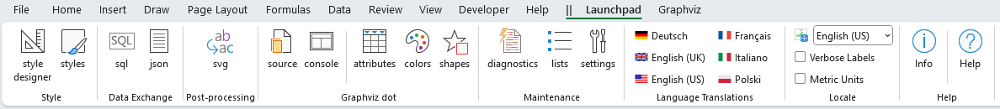
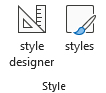
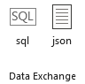
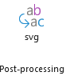
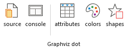
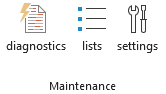
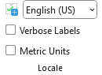
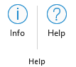

# Launchpad

Version 7.0 of the **Relationship Visualizer** introduced the `Lauchpad` ribbon tab to consolidate all the buttons used to show/hide worksheets which were scattered across various ribbon tabs. 

This new tab provides an easy way to control which worksheets are displayed, which can help you focus on a small set of worksheets, or hide the worksheets which you never use.

## The `Launchpad` Ribbon Tab

The `Launchpad` ribbon tab is always present, and is located as the first **Relationship Visualizer** tab after Excel's `Help` tab. The characters `||` in the ribbon are intended to help identify where Excel's set of tabs end, and where the Relationship Visualizer tabs begin.

The `Launchpad` tab appears as follows on Microsoft Windows:

|  |
| --------------------------- |

The `Launchpad` tab appears as follows on macOS:

|  |
| --------------------------- |

It groups the worksheets into the following sections:
- [Style](./README.md#style)
- [Data Exchange](./README.md#data-exchange)
- [Post-processing](./README.md#post-processing)
- [Graphviz dot](./README.md#graphviz-dot)
- [Maintenance](./README.md#maintenance)
- [Language Translations](./README.md#language-translations)
- [Locale](./README.md#locale)
- [Help](./README.md#help)

### Style

|  |
| ------- |

Shows the worksheets used to create style definitions, and save them for use in the `data` worksheet.

| Label | Control Type  | Description |
| ----- | ------------- | --------------------------------- |
| style designer  | Toggle Button        | Show/Hide the [style designer](../tutorial/#using-the-style-designer-worksheet) worksheet. |
| styles  | Toggle Button        | Show/Hide the [styles](../styles/) worksheet. |

### Data Exchange

|  |
| ------- |

Provides access to the tools which can be used to import and/or export workbook data.

| Label | Control Type  | Description |
| ----- | ------------- | --------------------------------- |
| sql  | Toggle Button        | Show/Hide the [sql](../sql/) worksheet (Windows only). |
| json  | Toggle Button        | Show/Hide the [Exchange](../exchange/) ribbon tab. |

### Post-processing

|  |
| ------- |

Shows the worksheet which controls the post-processing of `svg` files generated by Graphviz.

| Label | Control Type  | Description |
| ----- | ------------- | --------------------------------- |
| svg  | Toggle Button        | Show/Hide the [svg](../svg/) worksheet. |

### Graphviz dot

|  |
| ------- |

Provides access to tools which let you see the `dot` source code generated by the Relationship Visualizer, and the messages emitted by Graphviz when the `dot` command is executed to create the graph. 

Help worksheets are also provided for those people interested in knowing more details regarding Graphviz.

| Label | Control Type  | Description |
| ----- | ------------- | --------------------------------- |
| source  | Toggle Button        | Show/Hide the [source](../source/) worksheet. |
| console  | Toggle Button        | Show/Hide the [console](../console/) worksheet. |
| attributes  | Toggle Button        | Show/Hide the `HELP - attributes` worksheet. |
| colors  | Toggle Button        | Show/Hide the `HELP - colors` worksheet. |
| shapes  | Toggle Button        | Show/Hide the `HELP - shapes` worksheet. |

### Maintenance

|  |
| ------- |

Provides access to the worksheets which are used to maintain the workbook by providing diagnostic information, storing list values used in ribbon tab dropdown lists, or managing run-time settings.

| Label | Control Type  | Description |
| ----- | ------------- | --------------------------------- |
| diagnostics  | Toggle Button        | Show/Hide the [diagnostics](../diagnostics/) worksheet. |
| lists  | Toggle Button        | Show/Hide the `lists` worksheet. |
| settings  | Toggle Button        | Show/Hide the [settings](../settings/) worksheet. |

### Language Translations

|  |
| ------- |

Six language translations are provided. The tool is authored in English in the US. The English translations are then translated to the other languages using the [DeepL Translator](https://www.deepl.com/). 

The translations sometimes need a little modification by geography, so access to the translation worksheets has been provided as of Version 7 so you can tune the translations to your liking. 

| Label | Control Type  | Description |
| ----- | ------------- | --------------------------------- |
| Deutsch  | Toggle Button        | Show/Hide the `locale_de-DE` worksheet containing the German translations. |
| English (UK)  | Toggle Button        | Show/Hide the `locale_en-GB` worksheet containing the UK English translation. |
| English (US)  | Toggle Button        | Show/Hide the `locale_en-US` worksheet containing the US English translation.  This worksheet contains the default values in the event a translation is missing from one of the other translation worksheets. |
| Français  | Toggle Button        | Show/Hide the `locale_en-FR` worksheet containing the French translations. |
| Italiano  | Toggle Button        | Show/Hide the `locale_it-IT` worksheet containing the Italian translations. |
| Polski  | Toggle Button        | Show/Hide the `locale_pl-PL` worksheet containing the Polish translations. |

### Locale

|  |
| ------- |

Provides an easy-to-find setting which controls which language is displayed in ribbon tabs and worksheet headings. 

| Label | Control Type  | Description |
| ----- | ------------- | --------------------------------- |
| Set Language  | Dropdown List       | Establishes the language translation to use in ribbon tabs and worksheet headings. Changing the language has immediate effect, and you do not need to close and reopen the workbook.|
| Verbose Labels  | Checkbox        | Ribbons on MacOS do not show the groups which exist in the ribbon tabs on Windows OS. Verbose labels adding the group to the label were created to compensate, so things like 'Color' can be differentiated as 'Font Color' vs. 'Fill Color'.   By default, verbose labels are displayed on macOS, and short lables on Windows OS. The user is free to choose which style of labels to display.  |
| Metric Units  | Checkbox       | Graphviz uses the imperial units "inches" for measurements. Metric units were introduced into the Relationship Visualizer as display units in version 7.0, with appropriate conversion to imperial units behind the scenes performed. Checking this box switches the display from inches to millimeters.  |

### Help

|  |
| ------- |

Provides the `Help` content for the `Launchpad` ribbon tab.

| Label | Control Type  | Description |
| ----- | ------------- | --------------------------------- |
| Info  | Toggle Button        | Show/Hide the [info](../info/) worksheet. |
| Help  | Button        | Provides a link to this web page. |
