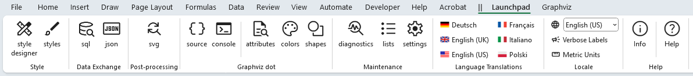
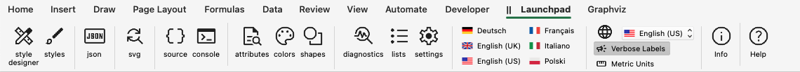
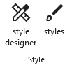
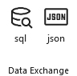
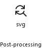
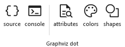
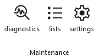
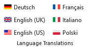
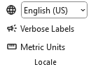
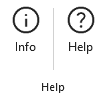

# Launchpad

The **Launchpad** provides a convenient way to manage worksheet visibility, allowing you to focus on a small set of worksheets or hide those you rarely use.

The Launchpad ribbon tab is always present and appears as the first Relationship Visualizer tab after Excel’s `Help` tab. The `||` characters in the ribbon serve as a visual divider, marking where Excel’s built‑in tabs end and the Relationship Visualizer tabs begin.

The tab appears as follows:

`Windows`

`macOS`

It contains the following groups, each of which is described in the sections that follow. You may jump directly to any group using the links in this table:

| Group | Controls  | Description |
| :---- | :--- | :--- |
| [Style](#style) |  | Shows the worksheets used to create style definitions, and save them for use in the `data` worksheet. |
| | |
| [Data Exchange](#data-exchange) |  | Provides access to the tools which can be used to import and/or export workbook data. |
| | |
| [Post-processing](#post-processing) |  | Shows the worksheet which controls the post-processing of `svg` files generated by Graphviz. |
| | |
| [Graphviz dot](#graphviz-dot) |  | Provides access to tools which let you see the `dot` source code generated by the Relationship Visualizer, and the messages emitted by Graphviz when the `dot` command is executed to create the graph. |
| | |
| [Maintenance](#maintenance) |  | Provides access to the worksheets which are used to maintain the workbook by providing diagnostic information, storing list values used in ribbon tab dropdown lists, or managing run-time settings. |
| | |
| [Language Translations](#language-translations) |  | Six language translations are provided. |
| | |
| [Locale](#locale) |  | Provides an easy-to-find setting which controls which language is displayed in ribbon tabs and worksheet headings, and the units of measure. |
| | |
| [Help](#help) |  | Provides the `Help` content for the `Launchpad` ribbon tab. |

## Style

|  |
| ------- |

Shows the worksheets used to create style definitions, and save them for use in the `data` worksheet.

| Label | Control Type  | Description |
| ----- | ------------- | --------------------------------- |
| style designer  | Toggle Button        | Show/Hide the [style designer](../tutorial/#using-the-style-designer-worksheet) worksheet. |
| styles  | Toggle Button        | Show/Hide the [styles](../styles/) worksheet. |

## Data Exchange

|  |
| ------- |

Provides access to the tools which can be used to import and/or export workbook data.

| Label | Control Type  | Description |
| ----- | ------------- | --------------------------------- |
| sql  | Toggle Button        | Show/Hide the [sql](../sql/) worksheet (Windows only). |
| json  | Toggle Button        | Show/Hide the [Exchange](../exchange/) ribbon tab. |

## Post-processing

|  |
| ------- |

Shows the worksheet which controls the post-processing of `svg` files generated by Graphviz.

| Label | Control Type  | Description |
| ----- | ------------- | --------------------------------- |
| svg  | Toggle Button        | Show/Hide the [svg](../svg/) worksheet. |

## Graphviz dot

|  |
| ------- |

Provides access to tools which let you see the `dot` source code generated by the Relationship Visualizer, and the messages emitted by Graphviz when the `dot` command is executed to create the graph. 

Help worksheets are also provided for those people interested in knowing more details regarding Graphviz.

| Label | Control Type  | Description |
| ----- | ------------- | --------------------------------- |
| source  | Toggle Button        | Show/Hide the [source](../source/) worksheet. |
| console  | Toggle Button        | Show/Hide the [console](../console/) worksheet. |
| attributes  | Toggle Button        | Show/Hide the [HELP - attributes](../workbook/#help-attributes-worksheet) worksheet. |
| colors  | Toggle Button        | Show/Hide the [HELP - colors](../workbook/#help-colors-worksheet) worksheet. |
| shapes  | Toggle Button        | Show/Hide the [HELP - shapes](../workbook/#help-shapes-worksheet) worksheet. |

## Maintenance

|  |
| ------- |

Provides access to the worksheets which are used to maintain the workbook by providing diagnostic information, storing list values used in ribbon tab dropdown lists, or managing run-time settings.

| Label | Control Type  | Description |
| ----- | ------------- | --------------------------------- |
| diagnostics  | Toggle Button        | Show/Hide the [diagnostics](../diagnostics/) worksheet. |
| lists  | Toggle Button        | Show/Hide the `lists` worksheet. |
| settings  | Toggle Button        | Show/Hide the [settings](../settings/) worksheet. |

## Language Translations

|  |
| ------- |

Six language translations are provided. The tool is authored in U.S. English, and those English strings are translated into the other languages using the [DeepL Translator](https://www.deepl.com/).

Because translations may require regional adjustments, access to the translation worksheets was added in Version 7, allowing you to fine‑tune the wording to suit your preferences or geographic needs.

| Label | Control Type  | Description |
| ----- | ------------- | --------------------------------- |
| Deutsch  | Toggle Button        | Show/Hide the `locale_de-DE` worksheet containing the German translations. |
| English (UK)  | Toggle Button        | Show/Hide the `locale_en-GB` worksheet containing the UK English translation. |
| English (US)  | Toggle Button        | Show or hide the `locale_en-US` worksheet, which contains the U.S. English translation.  This worksheet also provides the default values used whenever a translation is missing from one of the other locale worksheets. |
| Français  | Toggle Button        | Show/Hide the `locale_en-FR` worksheet containing the French translations. |
| Italiano  | Toggle Button        | Show/Hide the `locale_it-IT` worksheet containing the Italian translations. |
| Polski  | Toggle Button        | Show/Hide the `locale_pl-PL` worksheet containing the Polish translations. |

## Locale

|  |
| ------- |

Provides an easy-to-find setting which controls which language is displayed in ribbon tabs and worksheet headings, and units of measure. 

| Label | Control Type  | Description |
| ----- | ------------- | --------------------------------- |
| Set Language  | Dropdown List       | Establishes the language translation to use in ribbon tabs and worksheet headings. Changing the language has immediate effect, and you do not need to close and reopen the workbook.|
| Verbose Labels  | Toggle Button | Ribbons on macOS do not display the group names that appear in ribbon tabs on Windows. To compensate, verbose labels were introduced—adding the group name directly into each control’s label—so items such as “Color” can be distinguished as “Font Color” or “Fill Color.”  By default, verbose labels are shown on macOS and short labels on Windows. Users may choose whichever labeling style they prefer.  |
| Metric Units  | Toggle Button | Graphviz uses the imperial unit **inches** for size measurements. Metric units were introduced in version 7.0 of the Relationship Visualizer as display units, with automatic conversion to inches performed behind the scenes. Checking this box switches the displayed values from inches to millimeters. |

## Help

|  |
| ------- |

Provides the `Help` content for the `Launchpad` ribbon tab.

| Label | Control Type  | Description |
| ----- | ------------- | --------------------------------- |
| Info  | Toggle Button | Show/Hide the [info](../info/) worksheet. |
| Help  | Button        | Provides a link to this web page. |
