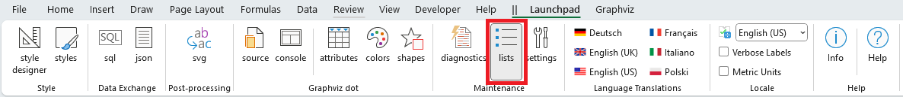

# Lists Worksheet

## The `lists` Worksheet

The `lists` worksheet is reached from the `Graphviz dot` section of the [Maintenance](../launchpad/) ribbon tab.

|  |
| -------------------------------------------------- |

The `lists` worksheet shows maintains a set of lists which are used by either cell validations on the `settings` worksheet, or dropdown lists in the `style designer` ribbon tab.

The lists worksheet appears as follows:

|  |
| -------------------------------------------------- |

A key list pertains to macOS users. On Microsoft Windows it is possible to get a list of the installed fonts, but on macOS it is not possible. The font list displayed on a Mac is the `Fonts` list in column C. You can insert or delete font names in this list according to what is present on your Mac. You must, however, close and reopen the spreadsheet to see these changes take effect.