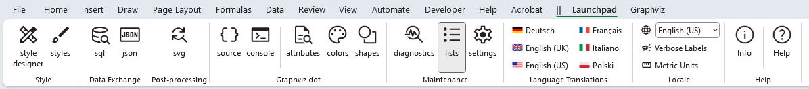
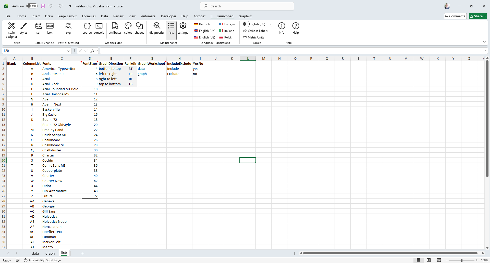

# Lists Worksheet

## The `lists` Worksheet

The `lists` worksheet is reached from the `Maintenance` section of the [Launchpad](../launchpad/) ribbon tab.

The `lists` worksheet maintains a set of lists used by cell validations on the `settings` worksheet and by the dropdown controls in the `style designer` ribbon tab.

The `lists` worksheet appears as follows:

The **Fonts** list is primarily relevant for macOS users. On Windows, the Relationship Visualizer can retrieve the installed fonts automatically, but macOS does not provide a way to obtain this list programmatically. As a result, the font list shown on macOS comes from the `Fonts` list in column C.

You may add or remove font names in this list to match the fonts available on your Mac. After making changes, you must close and reopen the workbook for the updated list to appear.
