# Overview

The *Relationship Visualizer* allows you to effortlessly collect relationship information in Microsoft Excel and rapidly create relationship graphs. The most effective way to demonstrate its capabilities is through visual examples.

## Visualize Relationships

### Collect Data

The `data` worksheet is where you construct your relationships to be graphed. Large data-driven graphs can be constructed easily by simply supplying two columns of data, as shown below:

|  |
| -------------------------------------------------- |

### Display Graphs

The *Relationship Visualizer* leverages Excel's zoom in/zoom out, and scrolling capabilities to display graphis in a `graph` worksheet.

|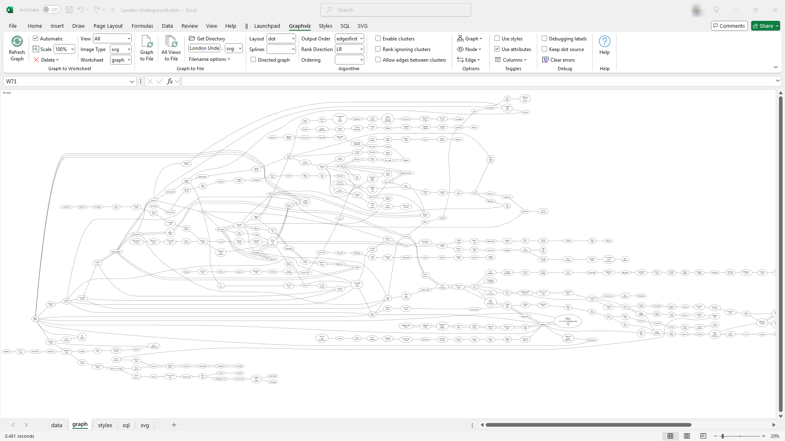 |
| -------------------------------------------------- |

### Choose Graph Options

The *Relationship Visualizer* enhances Excel's menu bar and provides all its User Interface controls through Excel's Fluent UI Ribbon tabs. Each control offers robust screen tips, providing helpful information when you hover the mouse over it.

Here is the screen tip displayed when the mouse hovers over the `Output Order` control.

|  |
| -------------------------------------------------- |

Changing Graphviz options in the Ribbon Tab allows for different Graphviz interpretations of the data. Let's explore examples of *Graph Direction* and *Edge Appearance*.

- **Graph Direction**

    Graph direction can be selected from a dropdown list. Choices include `Top to Botton`, `Bottom to Top`, `Left to Right`, and `Right to Left`.

    | 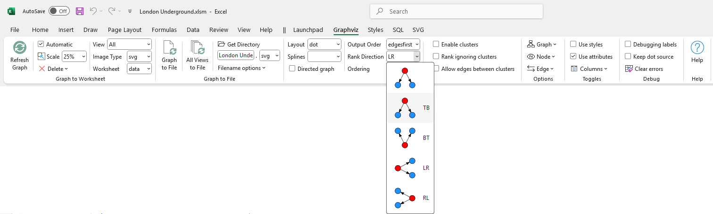 |
    | -------------------------------------------------- |

    Here we see the direction of the previous graph has changed from `Left to Right`, to `Top to Bottom`.

    |  |
    | -------------------------------------------------- |

- **Edge Appearance**

    You can select how edges are drawn from the `Splines` dropdown list. Options include `compound`, `curved`, `line`, `None`, `ortho`, `polyline`, `spline`, `true`, and `false`.

    | 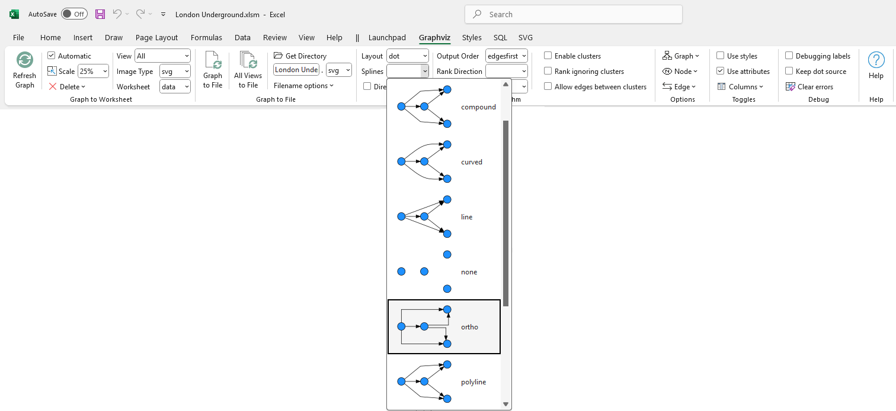 |
    | -------------------------------------------------- |

    This images shows the previous graph with the edges changed from `splines`, to `ortho`

    | 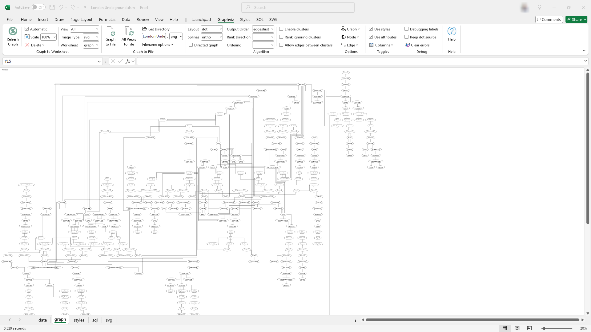 |
    | -------------------------------------------------- |

[Learn more...](../workbook/#fluent-ui-ribbon-tabs)

### Design Styles

The *Relationship Visualizer* makes it easy to create combinations of Graphviz style attributes which can be applied to nodes, edges, or clusters. It provides a `style designer` worksheet to define the styles, and a `styles` worksheet to provide a gallery of styles which can be selected for a given row on the `data` worksheet (similar to CSS on HTML).

Here the `style designer` is being used to create a style of edge which is dark green (Green4) in color, and does not have an arrow head.

| 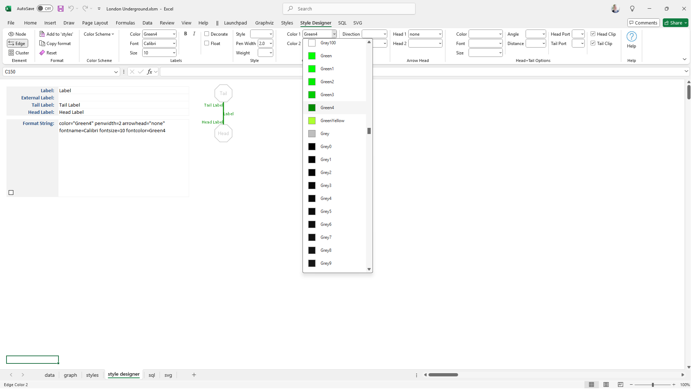 |
| -------------------------------------------------- |

[Learn more...](../tutorial/#using-the-style-designer-worksheet)

### Save Styles

The Green Line on the London Underground is the "District" line. We click the `Add to 'styles'` button. On the `styles` worksheet the format string is saved on a row named **District** along with a preview image showing what the format string looks like.

Notice that Style Names have been created for each of the subway lines, and set to their designated color. We will see them used just ahead.

| 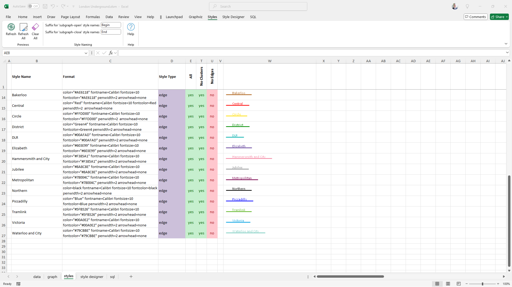 |
| -------------------------------------------------- |

Cluster and node formats are created in similar fashion. This image shows the other elements which have been defined to depict the London Underground. For example, stations are depicted with a square shape, and interchanges are depicted by a circle.

| 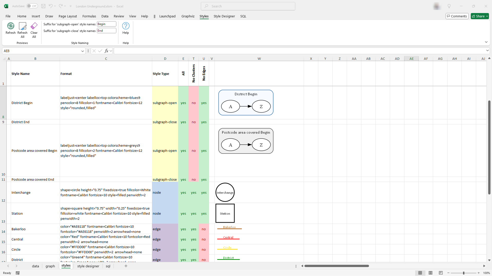 |
| -------------------------------------------------- |

[Learn more...](../styles/)

### Apply Styles

Styles are applied to data rows via a `Style Name` column on the `data` worksheet. Style Names selected from a dropdown list populated with the names on the `styles` worksheet.

In the image below each subway line is now depicted in its assigned colors, and shapes imply if a stop is a regular station, or an interchange.

|  |
| -------------------------------------------------- |

### Cluster Elements

The *Relationship Visualizer* lets you easily cluster nodes by adding rows containing `{` and `}` at the start and end of the cluster respectively. Clusters can have assigned styles, and clusters may contain other clusters.

This graph depicts different areas of London, and the postal districts in which the stations are located.

|  |
| -------------------------------------------------- |

### Split Data into Views

The *Relationship Visualizer* allows you to have multiple views of the same data by enabling or disabling styles on the `styles` worksheet. It generates graphs that include only the elements of the enabled styles.

In this example the `styles` worksheet modified to have one column per subway line, which only enables the styles for that subway line.

|  |
| -------------------------------------------------- |

The column names appear in a `View` dropdown list on the `Graphviz` tab. Selecting a view name redraws the graph to include only the styles where a value of yes is present in that column.

In the image below, selecting the "DLR" subway line from the `View` dropdown highlights the areas of London served by the DLR and its stations, while filtering out the rest of the London Underground.


|  |
| -------------------------------------------------- |

[Learn more...](../views/)

## Publish Graphs

### Graph to File

Once you have created a graph to your satisfaction, a push of a button creates the graph as an external file. 

You can publish graphs in the following formats: `bmp`, `gif`, `jpg`, `pdf`, `png`, `ps`, `svg`, `tiff`, `json`, `dot`

### All Views to File

You can publish a single graph, or use the `All views to file` button to automatically cycle through all the view names, publishing each view as its own file. In this example, Windows Explorer displays the results after all the various London Underground lines have been published as graphs.

|  |
| -------------------------------------------------- |

[Learn more...](../publish/)

## Enhance SVG Output

**SVG**, or Scalable Vector Graphics, is an XML-based file format used for creating and displaying vector images that are scalable to any size without losing quality.

### Add Tooltips

The *Relationship Visualizer* provides a tooltips column where you can provide information to be added to the graph to be displayed when a cluster, node, or edge has the mouse hover over it.

In this example, we see a graph of the DLR Line exported in SVG format. When hovering over the Star Lane station, a pop-up displays its village, district, postal code, latitude, and longitude.

| 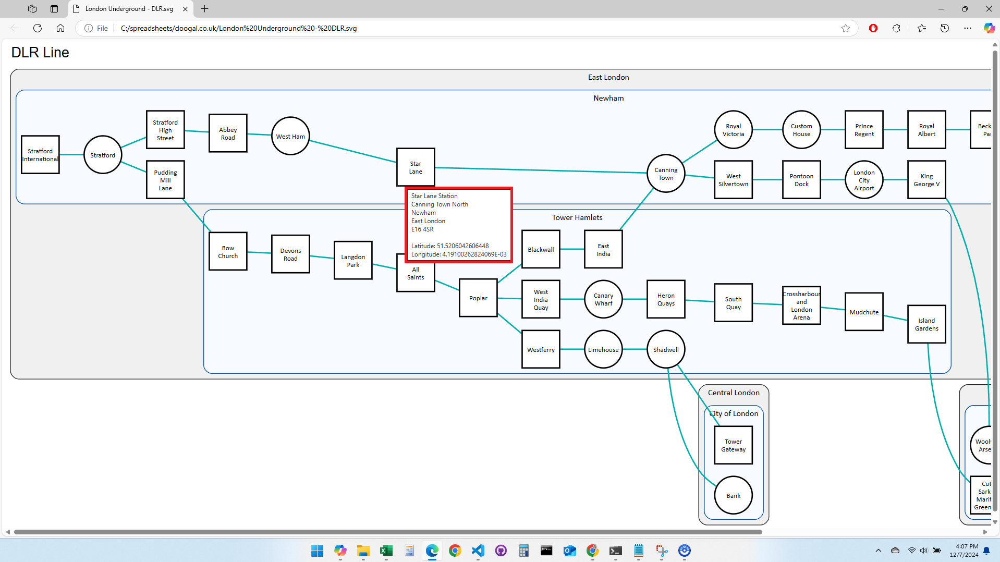 |
| -------------------------------------------------- |

### Add Animation

The *Relationship Visualizer* provides simple post-processing support via a worksheet which can perform find/replace actions against the XML content. Out of the box the *Relationship Visualizer* can post-process SVG to insert JavaScript routines for add animation capabilities. 

The `svg` worksheet containing the find/replace strings appears as follows:

| 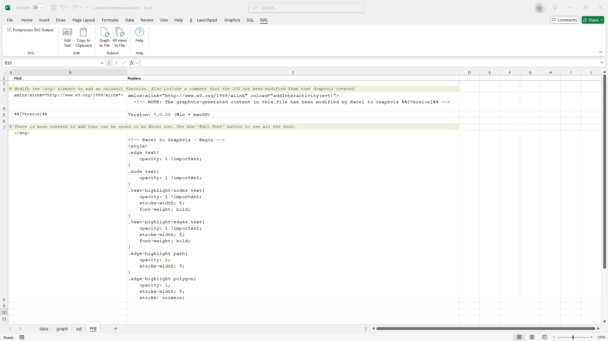 |
| -------------------------------------------------- |

After post-processing (triggered by graphing to a file), we see that buttons have been added to the SVG file.

|  |
| -------------------------------------------------- |

And in the animation below, we see how clicking a node triggers an animation to enlarge the node, and animate the edge connections from the node.

|  |
| -------------------------------------------------- |

[Learn more...](../svg/)

## Exchange Information

### Import Spreadsheet Data Using SQL

Typically, Excel data worksheets are created manually or exported from other applications. With the Relationship Visualizer, creating large graphs from these datasets is straightforward, as it supports importing data from other workbooks using SQL.

In our London Underground example, we have a `London Underground Data.xlsx` workbook containing two worksheets.

- A `London tube lines` worksheet details which stations connect on each tube line.
-  A `London stations` worksheet provides detailed information on each underground station.
 
They appear as follows:

|  |
| -------------------------------------------------- |
|  |


We write a SQL statement to extract data for **edge** relationships:

```
SELECT [From Station] AS [Item], [To Station] AS [Related Item], [Tube Line] AS [Style Name]
FROM   [London tube lines$]
```

And we write a SQL statement to extract data for **nodes**.

```
SELECT [Station] AS [Item], [Station] AS [Label], [Station Type] AS [Style Name]
FROM   [London stations$]
```

The `sql` worksheet in the *Relationship Visualizer* appears as:

| 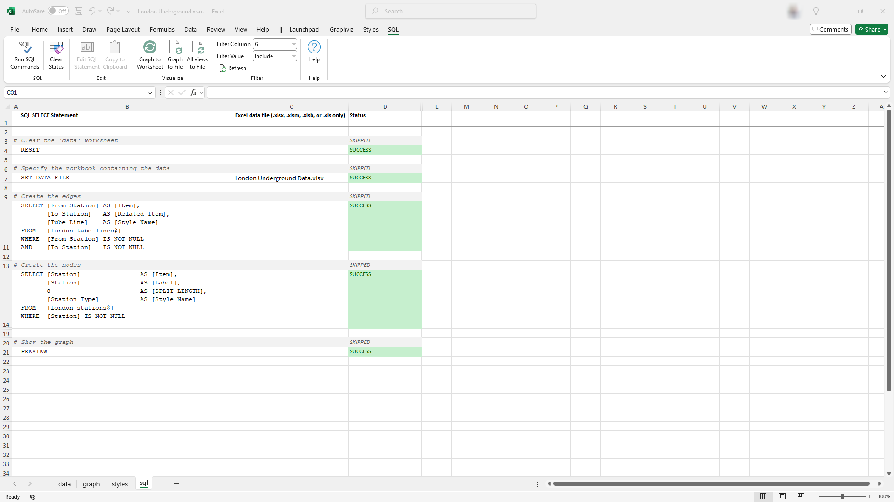 |
| -------------------------------------------------- |

Pressing a button executes the SQL statements, which import the data and map it to the appropriate columns for visualization. It really is that simple!

[Learn more...](../sql/)

### Export to JSON / Import from JSON

The *Relationship Visualizer* provides capabilities to generate a text-based representation of the data, styles, and settings in a JSON format. The features supporting the export and import of spreadsheet data are found in the `Exchange` workbook tab.

|  |
| -------------------------------------------------- |

[Learn more...](../exchange/)

## Learn the Graphviz `dot` Language

The *Relationship Visualizer* includes worksheets designed to help you use Graphviz effectively.

### View/Save `dot` Source Code

The *Relationship Visualizer* includes a `source` worksheet that displays the dot source code generated from the data on the `data` worksheet.

You can save this source code to a file or copy it to the clipboard for use in an external Graphviz tool. Links to multiple external Graphviz websites are also provided.

An example appears as follows:

|  |
| -------------------------------------------------- |

A pop-up source window can be launched, enabling you to view the source while simultaneously examining your data or graph. Below is an example of the source displayed in the pop-up window.

| 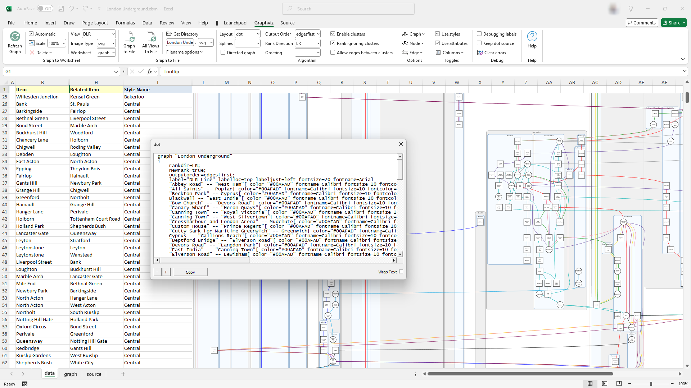 |
| -------------------------------------------------- |

[Learn more...](../source/)

### Learn `dot` Attributes

The `HELP - attributes` worksheet provides a list of the `dot` attributes along with columns which can be filtered by layout (dot, fdp, etc.), and attribute type (node, edge, graph).

|  |
| -------------------------------------------------- |

### Learn Colors

The `HELP - colors` worksheet provides a visual reference of all the color schemes and colors which Graphviz supports.

|  |
| -------------------------------------------------- |

### Learn Shapes

The `HELP - shapes` worksheet provides a visual reference of all the node shapes which Graphviz supports.

|  |
| -------------------------------------------------- |

## Diagnose Problems

### View `dot` Command-line Messages

`dot` is the Graphviz command-line program that the *Relationship Visualizer* utilizes to generate graphs. A `console` worksheet is available, which can be activated to display the output of the `dot` command.

In the example below, `dot` has been executed in `verbose` mode. The `console` worksheet displays `dot`'s diagnostic messages. Notably, the node warnings indicate that two nodes have very long labels exceeding the fixed width of the shape used to depict stations.

|  |
| -------------------------------------------------- |

[Learn more...](../console/)

### View Diagnostic Information

The *Relationship Visualizer* includes a diagnostics worksheet that provides essential information on software versions and directory paths, useful for troubleshooting and addressing questions.

| 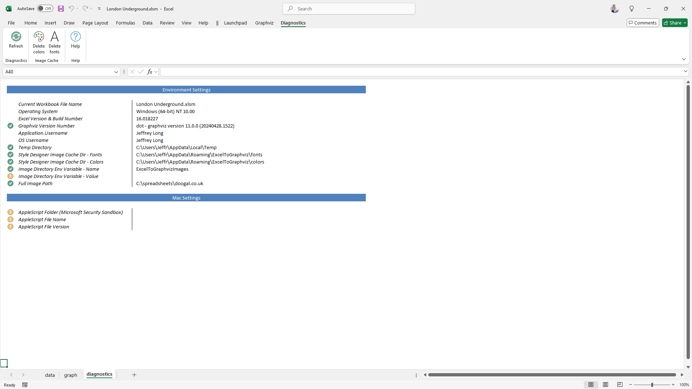 |
| -------------------------------------------------- |

[Learn more...](../diagnostics/)

## Internationalization

The *Relationship Visualizer* supports multiple languages, and measurement units.

### Set Your Language

The *Relationship Visualizer* provides the following language translations:
- English (UK)
- English (US)
- French
- German
- Italian
- Polish

Simply pick your desired language from the `Launchpad` ribbon tab.

|  |
| -------------------------------------------------- |

For example, changing the language to Polski (Polish) makes the `Launchpad` ribbon tab appears as:


| 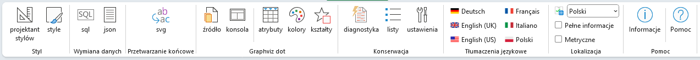 |
| -------------------------------------------------- |

### Edit Language Translations

Translations were performed by machine and may contain minor errors. Fortunately, all language translations are contained in worksheets. From the `Launchpad`, you can unhide the appropriate worksheet and edit the translation as needed.

| 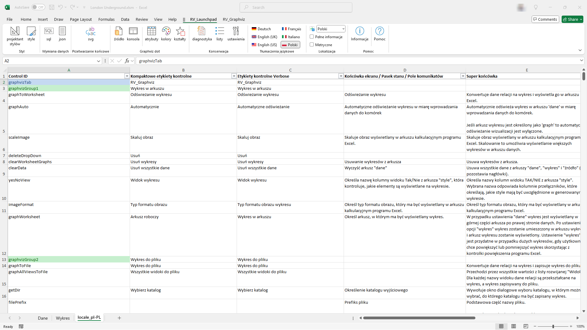 |
| -------------------------------------------------- |

[Learn more...](../launchpad/)

### Set Measurement Units

Graphviz uses inches as its unit of measurement for shapes. The `Launchpad` will let you choose Metric units for `style designer` dropdown lists. When `Metric Units` are chosen, measurements in dropdown lists are presented in centimeters, and converted to inches when passed to `dot'.

## Information and Acknowledgements

### `info` Worksheet

The *Relationship Visualizer* includes an `info` worksheet that provides details about the spreadsheet, the internal technology incorporated into the tool, and the associated open-source licenses and acknowledgements needed to reuse the open-source components in a license-compliant manner.

|  |
| -------------------------------------------------- |

[Learn more...](../info/)

### About...

Copyright, Author, Repositories, and License information are available on this website [here](../about/).

### Thank You

Special thanks to key contributors are acknowledged on this website [here](../acknowledge/README.md#thank-you) as well as in the `info` worksheet.

### Third-Party Notices

Open-source licenses and acknowledgements required to reuse the open-source components in a license-compliant manner are available on this website [here](../acknowledge/README.md#third-party-notices) as well as in the `info` worksheet.

