# Overview

See how the **Relationship Visualizer** turns raw data into clean, meaningful graph diagrams, with styles, views, and publishing built into the workflow.

This quick 2-minute [video](https://youtu.be/0T0CMk4Y3Ls) gives a feel for what's possible.

<YouTube id="0T0CMk4Y3Ls" />

Ready to explore further? 

Use the cards below to jump straight to examples by topic. 

::: tip Building the Graph

Get data onto the page and shape the layout.

<div class="advanced-grid">
  <a class="advanced-card" href="#enter-data">
    <span class="icon">
      <svg xmlns="http://www.w3.org/2000/svg" width="24" height="24" viewBox="0 0 24 24" fill="none" stroke="currentColor" stroke-width="1.5" stroke-linecap="round" stroke-linejoin="round" class="icon icon-tabler icons-tabler-outline icon-tabler-file-excel">
        <path stroke="none" d="M0 0h24v24H0z" fill="none" />
        <path d="M14 3v4a1 1 0 0 0 1 1h4" />
        <path d="M17 21h-10a2 2 0 0 1 -2 -2v-14a2 2 0 0 1 2 -2h7l5 5v11a2 2 0 0 1 -2 2" />
        <path d="M10 12l4 5" />
        <path d="M10 17l4 -5" />
      </svg>
    </span>
    Enter Data
  </a>
  <a class="advanced-card" href="#display-graphs">
    <span class="icon">
      <svg xmlns="http://www.w3.org/2000/svg" width="24" height="24" viewBox="0 0 24 24" fill="none" stroke="currentColor" stroke-width="1.5" stroke-linecap="round" stroke-linejoin="round">
        <path stroke="none" d="M0 0h24v24H0z" fill="none" />
        <path d="M10 5a2 2 0 1 0 4 0a2 2 0 1 0 -4 0" />
        <path d="M6 12a2 2 0 1 0 4 0a2 2 0 1 0 -4 0" />
        <path d="M10 19a2 2 0 1 0 4 0a2 2 0 1 0 -4 0" />
        <path d="M18 19a2 2 0 1 0 4 0a2 2 0 1 0 -4 0" />
        <path d="M2 19a2 2 0 1 0 4 0a2 2 0 1 0 -4 0" />
        <path d="M14 12a2 2 0 1 0 4 0a2 2 0 1 0 -4 0" />
        <path d="M5 17l2 -3" />
        <path d="M9 10l2 -3" />
        <path d="M13 7l2 3" />
        <path d="M17 14l2 3" />
        <path d="M15 14l-2 3" />
        <path d="M9 14l2 3" />
      </svg>
    </span>
    Display Graphs
  </a>
  <a class="advanced-card" href="#choose-graph-options">
    <span class="icon">
      <svg xmlns="http://www.w3.org/2000/svg" width="24" height="24" viewBox="0 0 24 24" fill="none" stroke="currentColor" stroke-width="1.5" stroke-linecap="round" stroke-linejoin="round" class="icon icon-tabler icons-tabler-outline icon-tabler-automation">
        <path stroke="none" d="M0 0h24v24H0z" fill="none" />
        <path d="M13 20.693c-.905 .628 -2.36 .292 -2.675 -1.01a1.724 1.724 0 0 0 -2.573 -1.066c-1.543 .94 -3.31 -.826 -2.37 -2.37a1.724 1.724 0 0 0 -1.065 -2.572c-1.756 -.426 -1.756 -2.924 0 -3.35a1.724 1.724 0 0 0 1.066 -2.573c-.94 -1.543 .826 -3.31 2.37 -2.37c1 .608 2.296 .07 2.572 -1.065c.426 -1.756 2.924 -1.756 3.35 0a1.724 1.724 0 0 0 2.573 1.066c1.543 -.94 3.31 .826 2.37 2.37a1.724 1.724 0 0 0 1.065 2.572c1.492 .362 1.716 2.219 .674 3.03" />
        <path d="M9 12a3 3 0 1 0 6 0a3 3 0 0 0 -6 0" />
        <path d="M17 22l5 -3l-5 -3l0 6" />
      </svg>
    </span>
    Choose Graph Options
  </a>
  <a class="advanced-card" href="#cluster-elements">
    <span class="icon">
      <svg xmlns="http://www.w3.org/2000/svg" width="24" height="24" viewBox="0 0 24 24" fill="none" stroke="currentColor" stroke-width="1.5" stroke-linecap="round" stroke-linejoin="round">
        <path stroke="none" d="M0 0h24v24H0z" fill="none" />
        <path d="M8 8h8v8h-8l0 -8" />
        <path d="M4 6a2 2 0 0 1 2 -2h12a2 2 0 0 1 2 2v12a2 2 0 0 1 -2 2h-12a2 2 0 0 1 -2 -2l0 -12" />
      </svg>
    </span>
    Cluster Elements
  </a>
</div>
:::

::: tip Styling

Apply consistent styles and control visibility.

<div class="advanced-grid">
  <a class="advanced-card" href="#design-styles">
    <span class="icon">
      <svg xmlns="http://www.w3.org/2000/svg" width="24" height="24" viewBox="0 0 24 24" fill="none" stroke="currentColor" stroke-width="1.5" stroke-linecap="round" stroke-linejoin="round" class="icon icon-tabler icons-tabler-outline icon-tabler-palette">
        <path stroke="none" d="M0 0h24v24H0z" fill="none" />
        <path d="M12 21a9 9 0 0 1 0 -18c4.97 0 9 3.582 9 8c0 1.06 -.474 2.078 -1.318 2.828c-.844 .75 -1.989 1.172 -3.182 1.172h-2.5a2 2 0 0 0 -1 3.75a1.3 1.3 0 0 1 -1 2.25" />
        <path d="M7.5 10.5a1 1 0 1 0 2 0a1 1 0 1 0 -2 0" />
        <path d="M11.5 7.5a1 1 0 1 0 2 0a1 1 0 1 0 -2 0" />
        <path d="M15.5 10.5a1 1 0 1 0 2 0a1 1 0 1 0 -2 0" />
      </svg>
    </span>
    Design Styles
  </a>
  <a class="advanced-card" href="#save-styles">
    <span class="icon">
      <svg xmlns="http://www.w3.org/2000/svg" width="24" height="24" viewBox="0 0 24 24" fill="none" stroke="currentColor" stroke-width="1.5" stroke-linecap="round" stroke-linejoin="round" class="icon icon-tabler icons-tabler-outline icon-tabler-device-floppy">
        <path stroke="none" d="M0 0h24v24H0z" fill="none" />
        <path d="M6 4h10l4 4v10a2 2 0 0 1 -2 2h-12a2 2 0 0 1 -2 -2v-12a2 2 0 0 1 2 -2" />
        <path d="M10 14a2 2 0 1 0 4 0a2 2 0 1 0 -4 0" />
        <path d="M14 4l0 4l-6 0l0 -4" />
      </svg>
    </span>
    Save Styles
  </a>
  <a class="advanced-card" href="#apply-styles">
    <span class="icon">
      <svg xmlns="http://www.w3.org/2000/svg" width="24" height="24" viewBox="0 0 24 24" fill="none" stroke="currentColor" stroke-width="1.5" stroke-linecap="round" stroke-linejoin="round" class="icon icon-tabler icons-tabler-outline icon-tabler-paint">
        <path stroke="none" d="M0 0h24v24H0z" fill="none" />
        <path d="M5 5a2 2 0 0 1 2 -2h10a2 2 0 0 1 2 2v2a2 2 0 0 1 -2 2h-10a2 2 0 0 1 -2 -2l0 -2" />
        <path d="M19 6h1a2 2 0 0 1 2 2a5 5 0 0 1 -5 5l-5 0v2" />
        <path d="M10 16a1 1 0 0 1 1 -1h2a1 1 0 0 1 1 1v4a1 1 0 0 1 -1 1h-2a1 1 0 0 1 -1 -1l0 -4" />
      </svg>
    </span>
    Apply Styles
  </a>
  <a class="advanced-card" href="#split-data-into-views">
    <span class="icon">
      <svg xmlns="http://www.w3.org/2000/svg" width="24" height="24" viewBox="0 0 24 24" fill="none" stroke="currentColor" stroke-width="1.5" stroke-linecap="round" stroke-linejoin="round" class="icon icon-tabler icons-tabler-outline icon-tabler-chart-dots">
        <path stroke="none" d="M0 0h24v24H0z" fill="none" />
        <path d="M3 3v18h18" />
        <path d="M7 9a2 2 0 1 0 4 0a2 2 0 1 0 -4 0" />
        <path d="M17 7a2 2 0 1 0 4 0a2 2 0 1 0 -4 0" />
        <path d="M12 15a2 2 0 1 0 4 0a2 2 0 1 0 -4 0" />
        <path d="M10.16 10.62l2.34 2.88" />
        <path d="M15.088 13.328l2.837 -4.586" />
      </svg>
    </span>
    Split Data into Views
  </a>
</div>
:::

::: tip Publishing

Export a finished graph to share.

<div class="advanced-grid">
  <a class="advanced-card" href="#publish-graphs">
    <span class="icon">
      <svg xmlns="http://www.w3.org/2000/svg" width="24" height="24" viewBox="0 0 24 24" fill="none" stroke="currentColor" stroke-width="1.5" stroke-linecap="round" stroke-linejoin="round" class="lucide lucide-image-down-icon lucide-image-down">
        <path d="M10.3 21H5a2 2 0 0 1-2-2V5a2 2 0 0 1 2-2h14a2 2 0 0 1 2 2v10l-3.1-3.1a2 2 0 0 0-2.814.014L6 21"/>
        <path d="m14 19 3 3v-5.5"/>
        <path d="m17 22 3-3"/>
        <circle cx="9" cy="9" r="2"/>
      </svg>
    </span>
    Publish Graphs
  </a>
  <a class="advanced-card" href="#enhance-svg-output">
    <span class="icon">
      <svg xmlns="http://www.w3.org/2000/svg" width="24" height="24" viewBox="0 0 24 24" fill="none" stroke="currentColor" stroke-width="1.5" stroke-linecap="round" stroke-linejoin="round" class="icon icon-tabler icons-tabler-outline icon-tabler-file-type-svg">
        <path stroke="none" d="M0 0h24v24H0z" fill="none" />
        <path d="M14 3v4a1 1 0 0 0 1 1h4" />
        <path d="M5 12v-7a2 2 0 0 1 2 -2h7l5 5v4" />
        <path d="M4 20.25c0 .414 .336 .75 .75 .75h1.25a1 1 0 0 0 1 -1v-1a1 1 0 0 0 -1 -1h-1a1 1 0 0 1 -1 -1v-1a1 1 0 0 1 1 -1h1.25a.75 .75 0 0 1 .75 .75" />
        <path d="M10 15l2 6l2 -6" />
        <path d="M20 15h-1a2 2 0 0 0 -2 2v2a2 2 0 0 0 2 2h1v-3" />
      </svg>
    </span>
    Enhance SVG Output
  </a>
</div>
:::

::: tip Data Exchange

Move data in and out using SQL or JSON.

<div class="advanced-grid">
  <a class="advanced-card" href="#sql-data-import">
    <span class="icon">
      <svg xmlns="http://www.w3.org/2000/svg" width="24" height="24" viewBox="0 0 24 24" fill="none" stroke="currentColor" stroke-width="1.5" stroke-linecap="round" stroke-linejoin="round">
        <path stroke="none" d="M0 0h24v24H0z" fill="none" />
        <path d="M4 6c0 1.657 3.582 3 8 3s8 -1.343 8 -3s-3.582 -3 -8 -3s-8 1.343 -8 3" />
        <path d="M4 6v6c0 1.657 3.582 3 8 3m8 -3.5v-5.5" />
        <path d="M4 12v6c0 1.657 3.582 3 8 3" />
        <path d="M15 18a3 3 0 1 0 6 0a3 3 0 1 0 -6 0" />
        <path d="M20.2 20.2l1.8 1.8" />
      </svg>
    </span>
    SQL Data Import
  </a>
  <a class="advanced-card" href="#json-export-import">
    <span class="icon">
      <svg xmlns="http://www.w3.org/2000/svg" width="24" height="24" viewBox="0 0 24 24" fill="none" stroke="currentColor" stroke-width="1.5" stroke-linecap="round" stroke-linejoin="round" class="lucide lucide-file-braces-icon lucide-file-braces">
        <path d="M6 22a2 2 0 0 1-2-2V4a2 2 0 0 1 2-2h8a2.4 2.4 0 0 1 1.704.706l3.588 3.588A2.4 2.4 0 0 1 20 8v12a2 2 0 0 1-2 2z"/>
        <path d="M14 2v5a1 1 0 0 0 1 1h5"/>
        <path d="M10 12a1 1 0 0 0-1 1v1a1 1 0 0 1-1 1 1 1 0 0 1 1 1v1a1 1 0 0 0 1 1"/>
        <path d="M14 18a1 1 0 0 0 1-1v-1a1 1 0 0 1 1-1 1 1 0 0 1-1-1v-1a1 1 0 0 0-1-1"/>
      </svg>
    </span>
    JSON File Export/Import
  </a>
</div>
:::

::: tip Learning & Reference

Learn `dot`, troubleshoot, and tweak settings.

<div class="advanced-grid">
  <a class="advanced-card" href="#learn-the-dot-language">
    <span class="icon">
      <svg xmlns="http://www.w3.org/2000/svg" width="24" height="24" viewBox="0 0 24 24" fill="none" stroke="currentColor" stroke-width="1.5" stroke-linecap="round" stroke-linejoin="round" class="lucide lucide-monitor-cog-icon lucide-monitor-cog">
        <path d="M12 17v4"/>
        <path d="m14.305 7.53.923-.382"/>
        <path d="m15.228 4.852-.923-.383"/>
        <path d="m16.852 3.228-.383-.924"/>
        <path d="m16.852 8.772-.383.923"/>
        <path d="m19.148 3.228.383-.924"/>
        <path d="m19.53 9.696-.382-.924"/>
        <path d="m20.772 4.852.924-.383"/>
        <path d="m20.772 7.148.924.383"/>
        <path d="M22 13v2a2 2 0 0 1-2 2H4a2 2 0 0 1-2-2V5a2 2 0 0 1 2-2h7"/>
        <path d="M8 21h8"/>
        <circle cx="18" cy="6" r="3"/>
      </svg>
    </span>
    Learn the `dot` Language
  </a>
  <a class="advanced-card" href="#diagnose-problems">
    <span class="icon">
      <svg xmlns="http://www.w3.org/2000/svg" width="24" height="24" viewBox="0 0 24 24" fill="none" stroke="currentColor" stroke-width="1.5" stroke-linecap="round" stroke-linejoin="round" class="icon icon-tabler icons-tabler-outline icon-tabler-stethoscope">
        <path stroke="none" d="M0 0h24v24H0z" fill="none" />
        <path d="M6 4h-1a2 2 0 0 0 -2 2v3.5a5.5 5.5 0 0 0 11 0v-3.5a2 2 0 0 0 -2 -2h-1" />
        <path d="M8 15a6 6 0 1 0 12 0v-3" />
        <path d="M11 3v2" />
        <path d="M6 3v2" />
        <path d="M18 10a2 2 0 1 0 4 0a2 2 0 1 0 -4 0" />
      </svg>
    </span>
    Diagnose Problems
  </a>
  <a class="advanced-card" href="#internationalization">
    <span class="icon">
      <svg xmlns="http://www.w3.org/2000/svg" width="24" height="24" viewBox="0 0 24 24" fill="none" stroke="currentColor" stroke-width="1.5" stroke-linecap="round" stroke-linejoin="round" class="icon icon-tabler icons-tabler-outline icon-tabler-world">
        <path stroke="none" d="M0 0h24v24H0z" fill="none" />
        <path d="M3 12a9 9 0 1 0 18 0a9 9 0 0 0 -18 0" />
        <path d="M3.6 9h16.8" /><path d="M3.6 15h16.8" />
        <path d="M11.5 3a17 17 0 0 0 0 18" />
        <path d="M12.5 3a17 17 0 0 1 0 18" />
      </svg>
    </span>
    Internationalization
  </a>
  <a class="advanced-card" href="#information-and-acknowledgements">
    <span class="icon">
      <svg xmlns="http://www.w3.org/2000/svg" width="24" height="24" viewBox="0 0 24 24" fill="none" stroke="currentColor" stroke-width="1.5" stroke-linecap="round" stroke-linejoin="round" class="icon icon-tabler icons-tabler-outline icon-tabler-info-circle">
        <path stroke="none" d="M0 0h24v24H0z" fill="none" />
        <path d="M3 12a9 9 0 1 0 18 0a9 9 0 0 0 -18 0" />
        <path d="M12 9h.01" />
        <path d="M11 12h1v4h1" />
      </svg>
    </span>
    Information and Acknowledgements
  </a>
</div>
:::

## Enter Data

The `data` worksheet is where you specify the relationships to be graphed. 

Large data-driven graphs can be constructed easily by simply supplying two columns of data, as shown below:

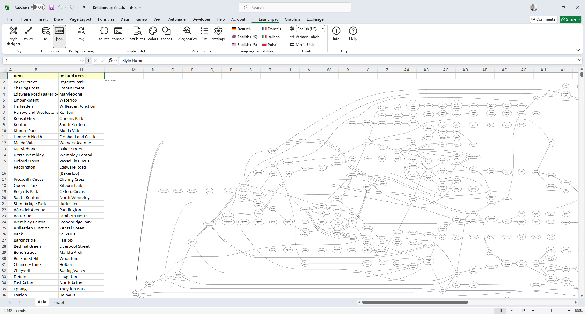

## Display Graphs

The Relationship Visualizer leverages Excel's zoom in/zoom out, and scrolling capabilities to display graphs in a `graph` worksheet.

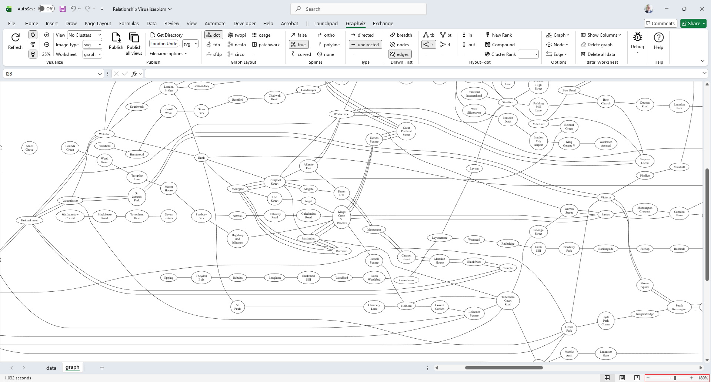

## Choose Graph Options

The Relationship Visualizer enhances Excel's menu bar and provides all its User Interface controls through Excel's Fluent UI Ribbon tabs. Each control offers robust screen tips, providing helpful information when you hover the mouse over it.

Here is the screen tip displayed when the mouse hovers over the `dot` layout control.

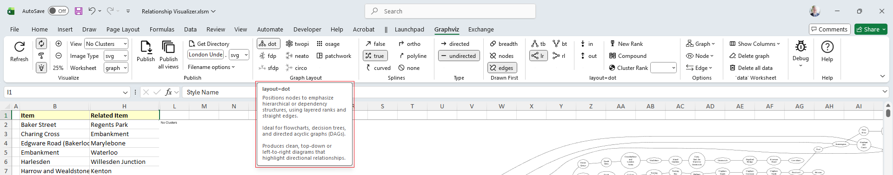

Changing Graphviz options in the Ribbon Tab allows for different Graphviz interpretations of the data. Let's explore examples of *Layout*, *Graph Direction* and *Edge Appearance*.

### Graph Layout
    
The `layout` attribute selects the Graphviz engine that arranges your graph. Different engines use different algorithms, producing distinct structures and visual styles.

Graph layout can be selected with a single button click. 

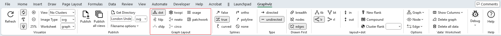

Choices include:
| Button | `layout=` | Button | `layout=` | Button | `layout=` |
| :-: | :-: | :-: | :-: | :-: | :-: |
|  | [dot](../terminology/#dot) |  | [twopi](../terminology/#twopi) |  | [osage](../terminology/#osage) |
|  | [fdp](../terminology/#fdp) |  | [neato](../terminology/#neato) |  | [patchwork](../terminology/#patchwork) |
|  | [sfdp](../terminology/#sfdp) |  | [circo](../terminology/#circo) | |

### Edge Appearance

The `splines` attribute controls how Graphviz draws edges between nodes. It determines whether connections appear as smooth curves, straight segments, orthogonal lines, or are omitted entirely. 

You select how edges are drawn using the `Splines` buttons. 

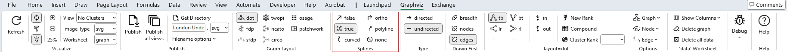

Choices include:

| Button | `splines=` | Button | `splines=` |
| :-: | :-: | :-: | :-: |
|  | [false (alias=line)](../terminology/#line) |  | [ortho](../terminology/#ortho) |
|  | [true (alias=spline)](../terminology/#spline) |  | [polyline](../terminology/#polyline) |
|  | [curved](../terminology/#curved) |  | [none](../terminology/#none) |

This images shows the previous graph with the edges changed from `true`, to `ortho`, which causes straight lines with 90 degree corners.

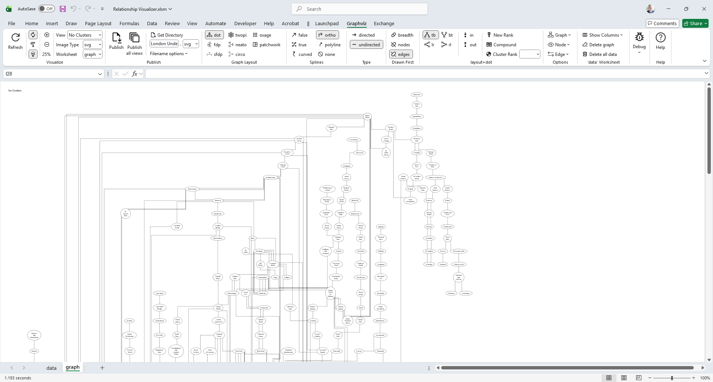
 
### Graph Direction

The `rankdir` attribute controls the overall direction in which the graph is laid out. It tells Graphviz whether to arrange ranks from top to bottom, bottom to top, left to right, or right to left. Changing this setting rotates the diagram's flow without altering the underlying structure of the graph.

[Graph direction](../create/#layout-options) can be selected with a single button click. 

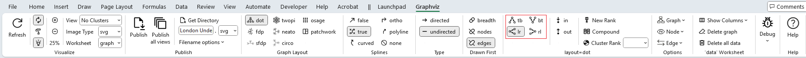

Choices include:
| Button | `rankdir=` | Direction |
| :----: | :-: | --------------|
|  | `tb` | Top to Bottom |
|  | `bt` | Bottom to Top |
|  | `lr` | Left to Right |
|  | `rl` | Right to Left |

Here we see the direction of the previous graph has changed from *Left to Right*, to *Top to Bottom*.

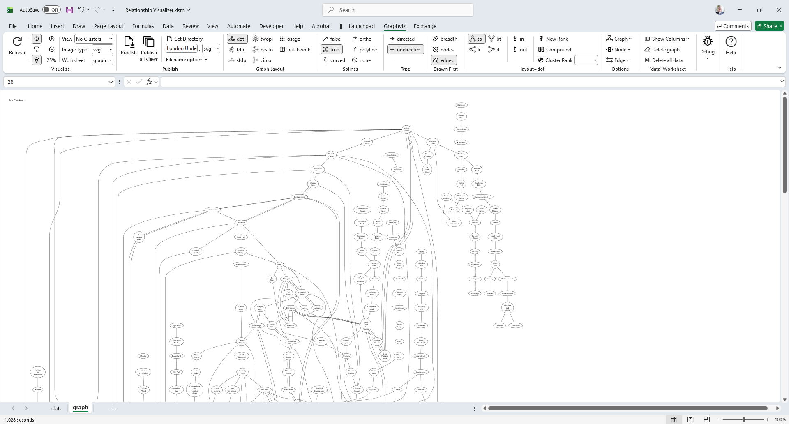

[Learn more...](../workbook/#fluent-ui-ribbon-tabs)

## Design Styles

The Relationship Visualizer makes it easy to create combinations of Graphviz style attributes which can be applied to nodes, edges, or clusters. It provides a `style designer` worksheet to define the styles, and a `styles` worksheet to provide a gallery of styles which can be selected for a given row on the `data` worksheet (similar to CSS on HTML).

Here the `style designer` is being used to create a style of edge which is dark green (Green4) in color, and does not have an arrow head.

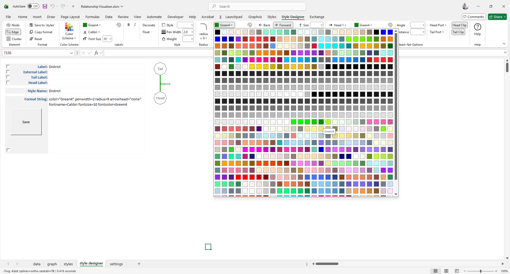

[Learn more...](../designer)

## Save Styles

The Green Line on the London Underground is the "District" line. We click the `Add to 'styles'` button. On the `styles` worksheet the format string is saved on a row named **District** along with a preview image showing what the format string looks like.

Notice that Style Names have been created for each of the subway lines, and set to their designated color. We will see them used just ahead.

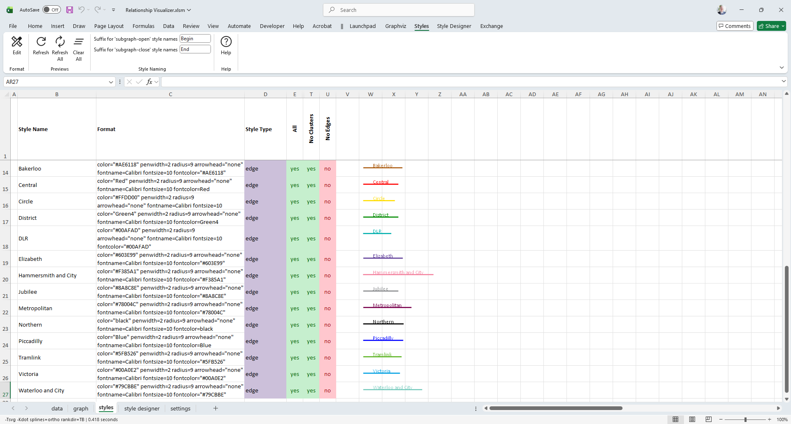

Cluster and node formats are created in similar fashion. This image shows the other elements which have been defined to depict the London Underground. For example, stations are depicted with a square shape, and interchanges are depicted by a circle.

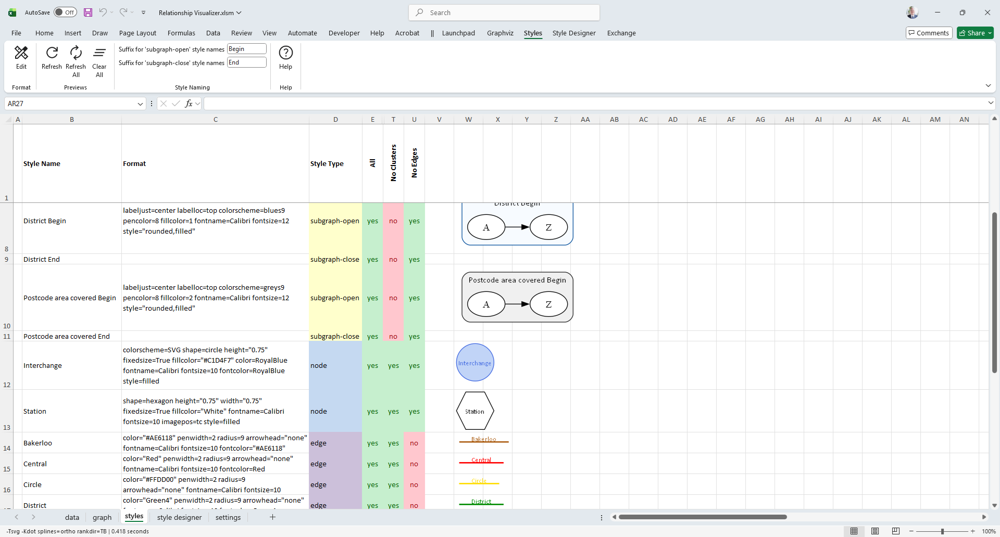

[Learn more...](../styles/)

## Apply Styles

Styles are applied to data rows via a `Style Name` column on the `data` worksheet. Style Names selected from a dropdown list populated with the names on the `styles` worksheet.

In the image below each subway line is now depicted in its assigned colors, and shapes imply if a stop is a regular station, or an interchange.

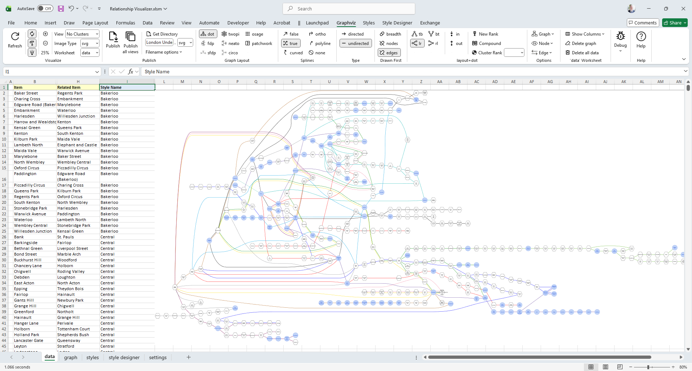

## Cluster Elements

The Relationship Visualizer lets you easily cluster nodes by adding rows containing `{` and `}` at the start and end of the cluster respectively. Clusters can have assigned styles, and clusters may contain other clusters.

This graph depicts different areas of London, and the postal districts in which the stations are located.

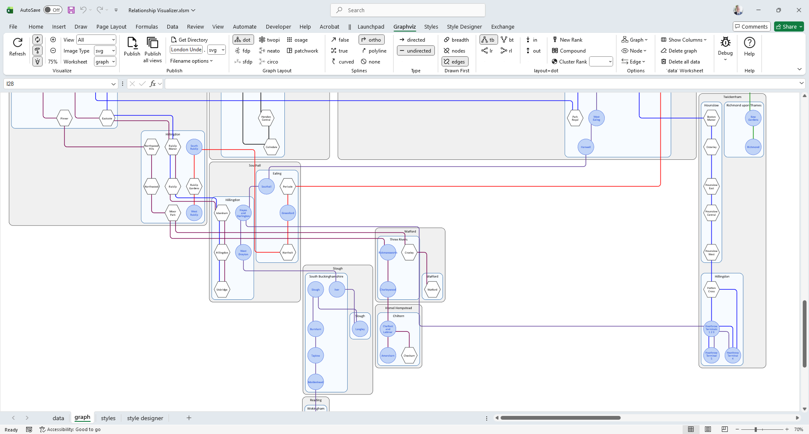

## Split Data into Views

The Relationship Visualizer allows you to have multiple views of the same data by enabling or disabling styles on the `styles` worksheet. It generates graphs that include only the elements of the enabled styles.

In this example the `styles` worksheet modified to have one column per subway line, which only enables the styles for that subway line.

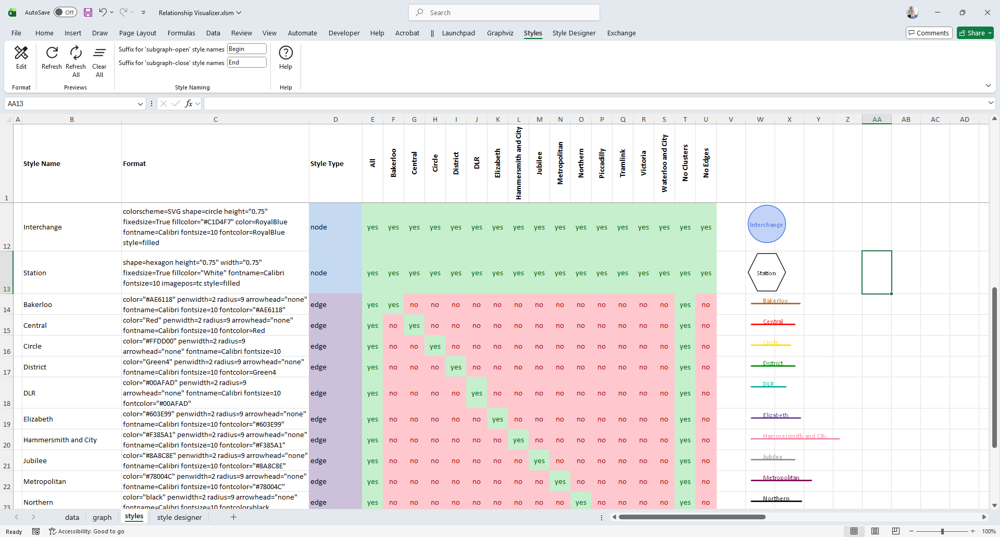

The column names appear in a `View` dropdown list on the `Graphviz` tab. Selecting a view name redraws the graph to include only the styles where a value of yes is present in that column.

In the image below, selecting the "DLR" subway line from the `View` dropdown highlights the areas of London served by the DLR and its stations, while filtering out the rest of the London Underground.

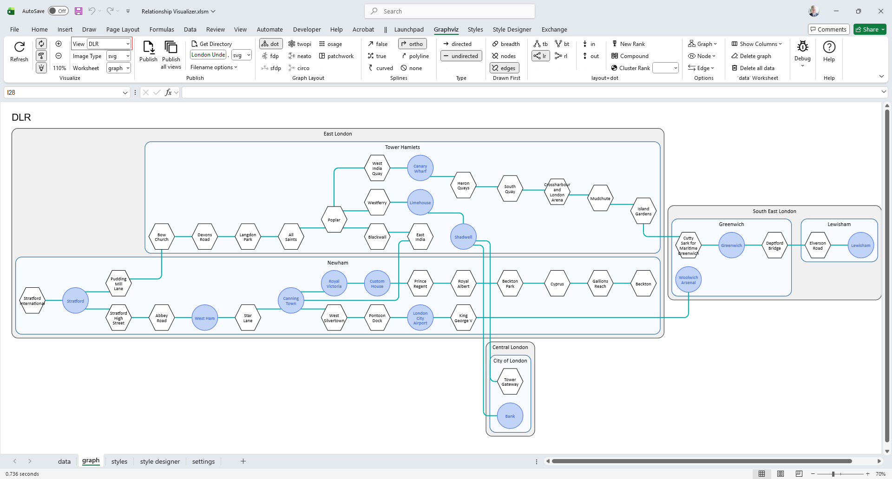

[Learn more...](../views/)

## Publish Graphs

### Graph to File

Once you have created a graph to your satisfaction, a push of a button creates the graph as an external file. 

You can publish graphs in the following formats: `bmp`, `gif`, `jpg`, `pdf`, `png`, `ps`, `svg`, `tiff`, `json`, `dot`

### Publish All Views to File

You can publish a single graph, or use the `Publish all views` button to automatically cycle through all the view names, publishing each view as its own file. In this example, Windows Explorer displays the results after all the various London Underground lines have been published as graphs.

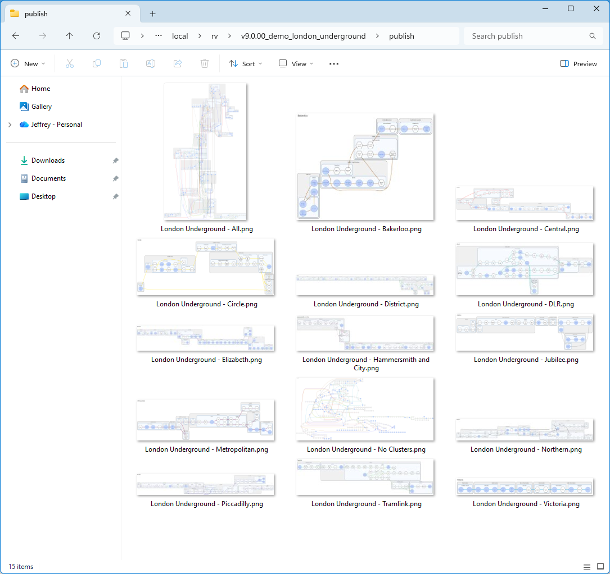

[Learn more...](../publish/)

## Enhance SVG Output

**SVG**, or Scalable Vector Graphics, is an XML-based file format used for creating and displaying vector images that are scalable to any size without losing quality.

### Add Tooltips

The Relationship Visualizer provides a tooltips column where you can provide information to be added to the graph to be displayed when a cluster, node, or edge has the mouse hover over it.

In this example, we see a graph of the DLR Line exported in SVG format. When hovering over the **Star Lane** station, a pop-up displays its village, district, postal code, latitude, and longitude.

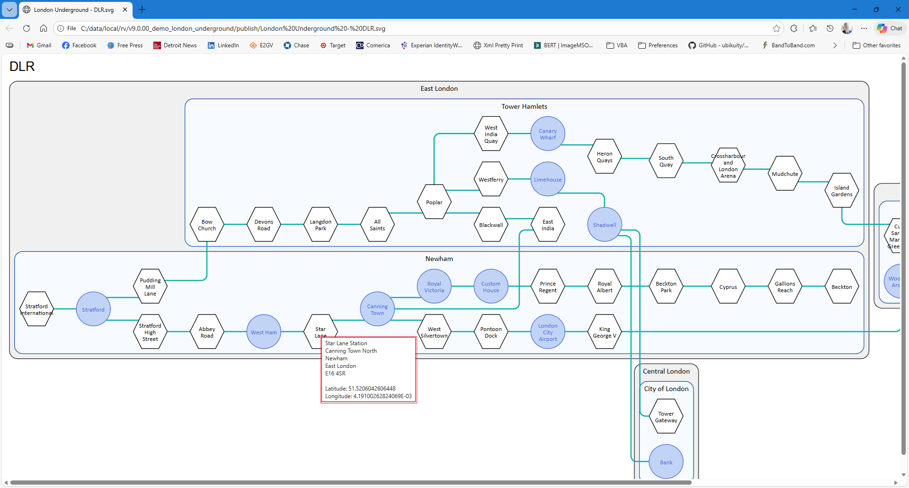

### Add Animation

The Relationship Visualizer provides simple post-processing support via a worksheet which can perform find/replace actions against the XML content. Out of the box the Relationship Visualizer can post-process SVG to insert JavaScript routines for add animation capabilities. 

The `svg` worksheet containing the find/replace strings appears as follows:

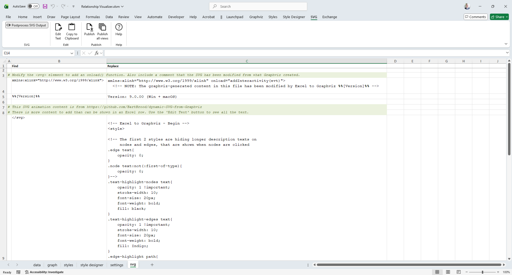

After post-processing (triggered by graphing to a file), we see that buttons have been added to the SVG file.

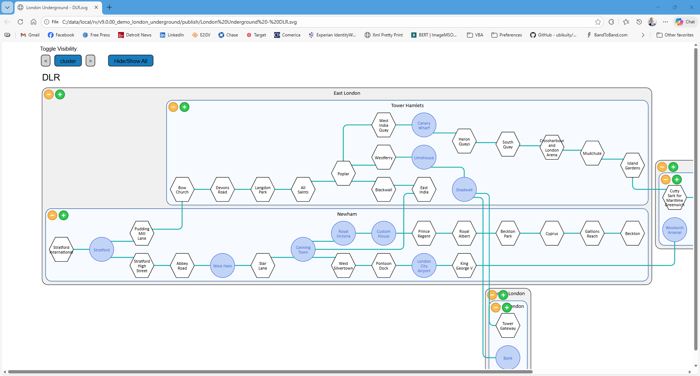

And in the animation below, we see how clicking a node triggers an animation to enlarge the node, and animate the edge connections from the node.

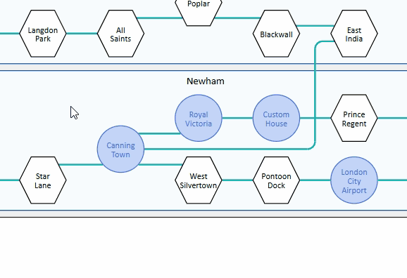

[Learn more...](../svg/)

## SQL Data Import

Typically, Excel data worksheets are created manually or exported from other applications. With the Relationship Visualizer, creating large graphs from these datasets is straightforward, as it supports importing data from other Excel workbooks and Access databases using SQL.

In our London Underground example, we have a `London Underground Data.xlsx` workbook containing two worksheets.

- A `London tube lines` worksheet details which stations connect on each tube line.
-  A `London stations` worksheet provides detailed information on each underground station.
 
They appear as follows:

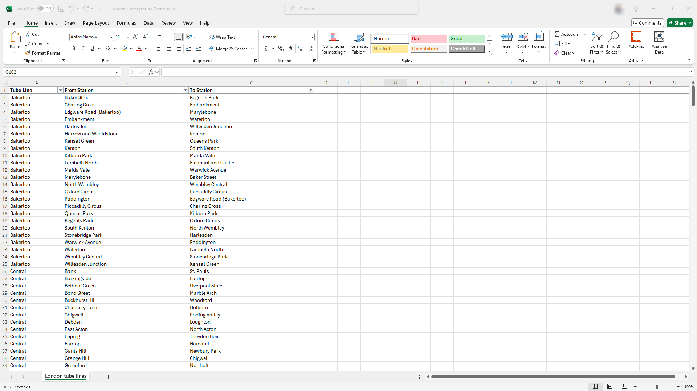

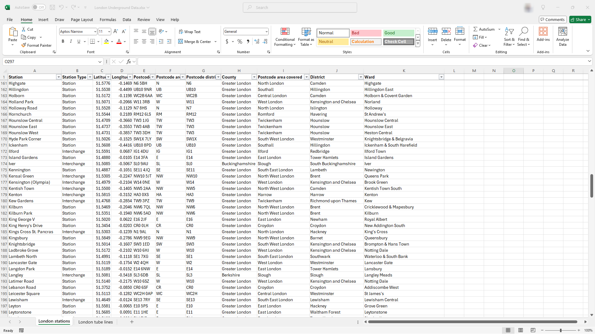

We write a SQL statement to extract data for **edge** relationships:

```sql
SELECT [From Station] AS [Item], [To Station] AS [Related Item], [Tube Line] AS [Style Name]
FROM   [London tube lines$]
```

And we write a SQL statement to extract data for **nodes**.

```sql
SELECT [Station] AS [Item], [Station] AS [Label], [Station Type] AS [Style Name]
FROM   [London stations$]
```

The `sql` worksheet in the Relationship Visualizer appears as:

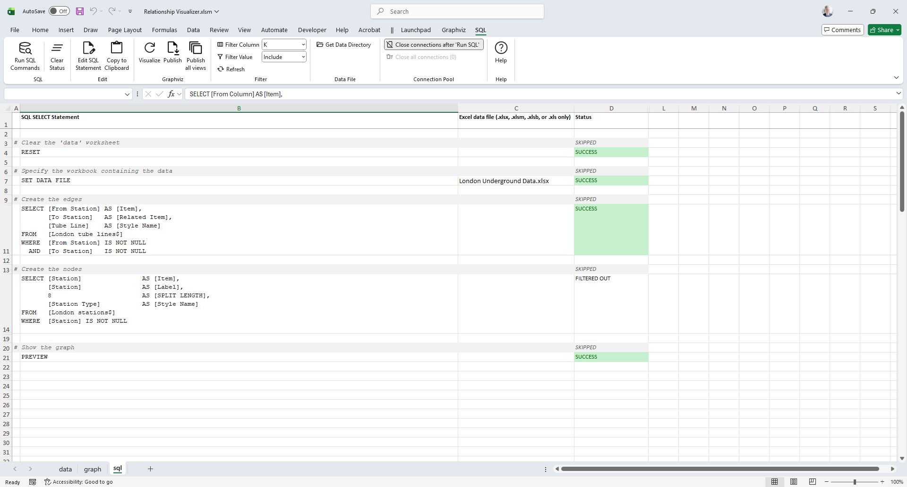

Pressing a button executes the SQL statements, which import the data and map it to the appropriate columns for visualization. It really is that simple!

[Learn more...](../sql/)

## JSON Export/Import

The Relationship Visualizer provides capabilities to generate a text-based representation of the data, styles, and settings in a JSON format. The features supporting the export and import of spreadsheet data are found in the `Exchange` workbook tab.

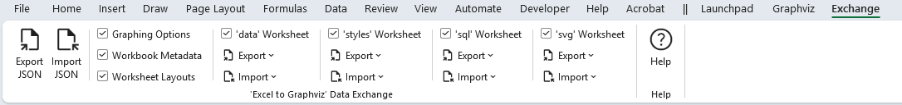

[Learn more...](../exchange/)

## Learn the `dot` Language

The Relationship Visualizer includes worksheets designed to help you use Graphviz effectively.

### View/Save `dot` Source Code

The Relationship Visualizer includes a `source` worksheet that displays the dot source code generated from the data on the `data` worksheet.

You can save this source code to a file or copy it to the clipboard for use in an external Graphviz tool. Links to multiple external Graphviz websites are also provided.

An example appears as follows:

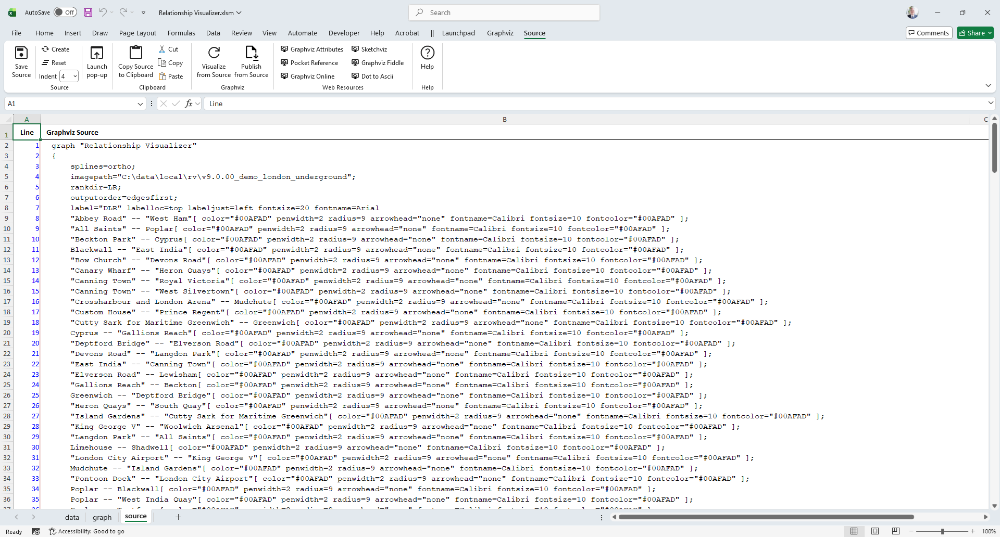

A pop-up source window can be launched, enabling you to view the source while simultaneously examining your data or graph. Below is an example of the source displayed in the pop-up window.

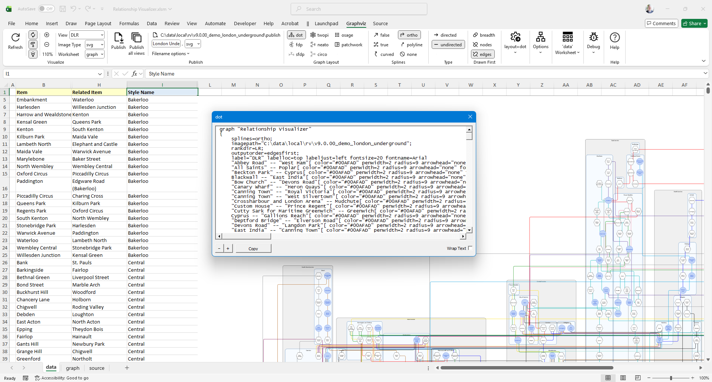

[Learn more...](../source/)

### Learn `dot` Attributes

The `HELP - attributes` worksheet provides a list of the `dot` attributes along with columns which can be filtered by layout (dot, fdp, etc.), and attribute type (node, edge, graph).

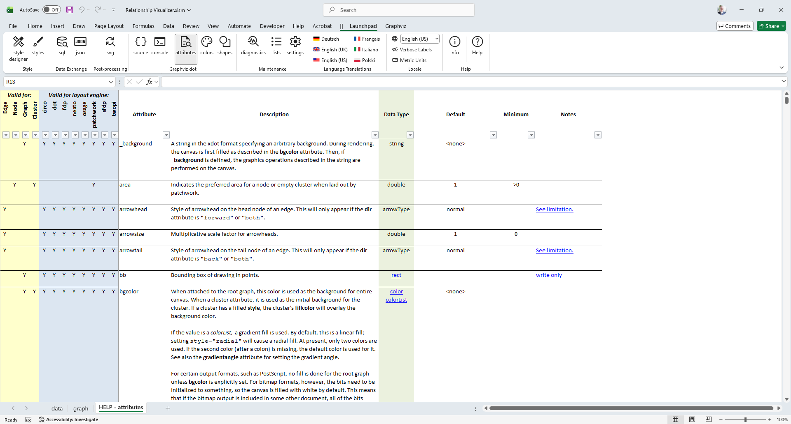

### Learn Colors

The `HELP - colors` worksheet provides a visual reference of all the color schemes and colors which Graphviz supports.

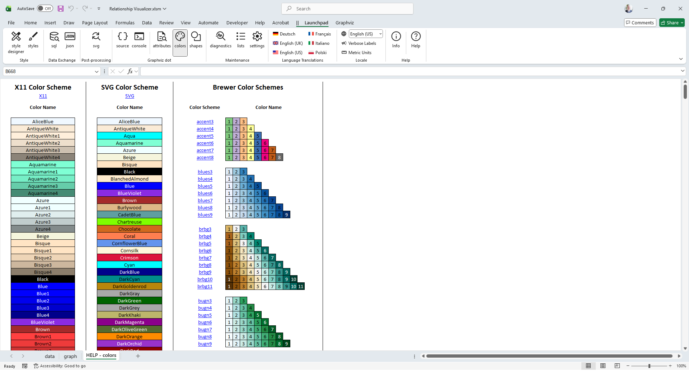

### Learn Shapes

The `HELP - shapes` worksheet provides a visual reference of all the node shapes which Graphviz supports.

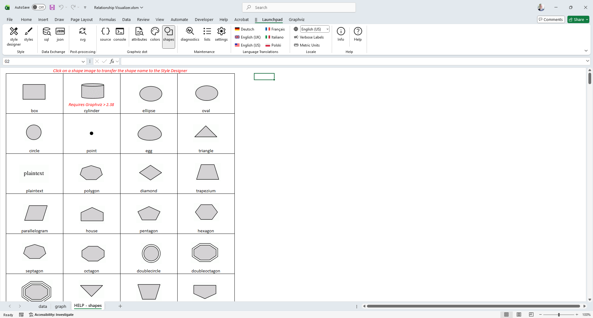

## Diagnose Problems

### View `dot` Command-line Messages

`dot` is the Graphviz command-line program that the Relationship Visualizer utilizes to generate graphs. A `console` worksheet is available, which can be activated to display the output of the `dot` command.

In the example below, `dot` has been executed in `verbose` mode. The `console` worksheet displays `dot`'s diagnostic messages. Notably, the node warnings indicate that two nodes have very long labels exceeding the fixed width of the shape used to depict stations.

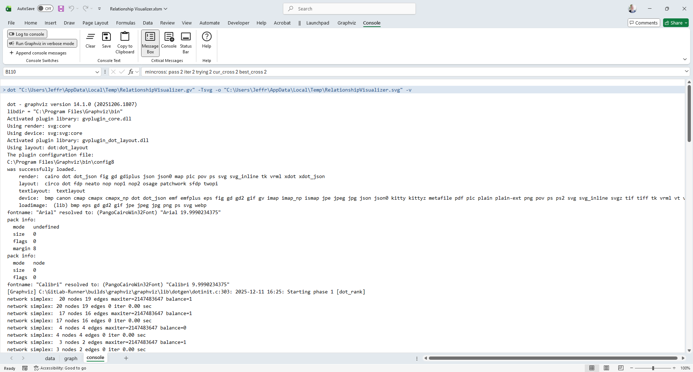

[Learn more...](../console/)

### View Diagnostic Information

The Relationship Visualizer includes a diagnostics worksheet that provides essential information on software versions and directory paths, useful for troubleshooting and addressing questions.

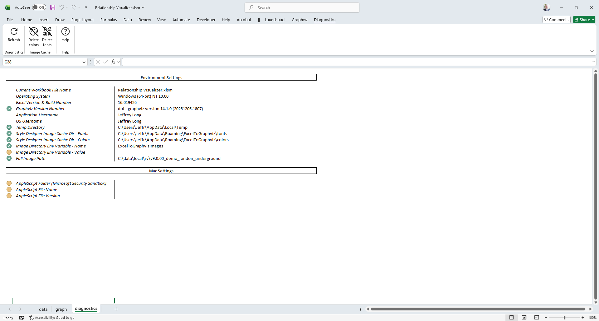

[Learn more...](../diagnostics/)

## Internationalization

The Relationship Visualizer supports multiple languages, and measurement units.

### Set Your Language

The Relationship Visualizer provides the following language translations:
- English (UK)
- English (US)
- French
- German
- Italian
- Polish

Simply pick your desired language from the `Launchpad` ribbon tab.

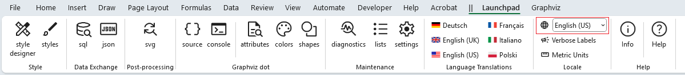

For example, changing the language to Polski (Polish) makes the `Launchpad` ribbon tab appears as:

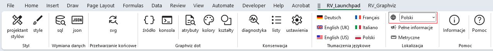

### Edit Language Translations

Translations were performed by machine and may contain minor errors. Fortunately, all language translations are contained in worksheets. From the `Launchpad`, you can unhide the appropriate worksheet and edit the translation as needed.

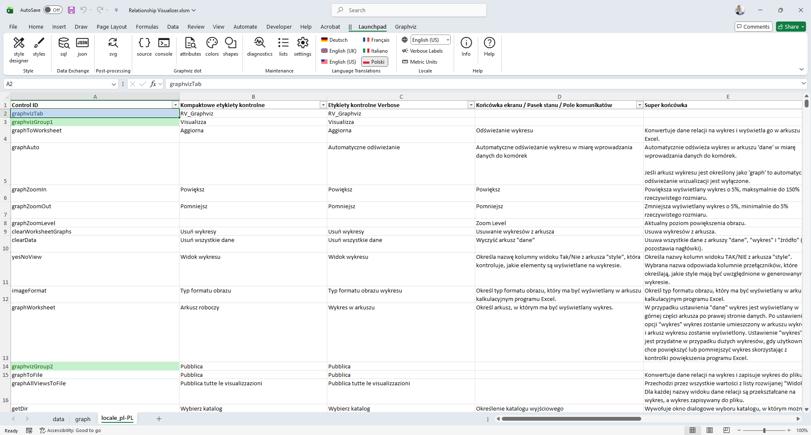

[Learn more...](../launchpad/)

### Set Measurement Units

Graphviz uses inches as its unit of measurement for shapes. The `Launchpad` will let you choose Metric units for `style designer` dropdown lists. When `Metric Units` are chosen, measurements in dropdown lists are presented in centimeters, and converted to inches when passed to `dot'.

## Information and Acknowledgements

### `info` Worksheet

The Relationship Visualizer includes an `info` worksheet that provides details about the spreadsheet, the internal technology incorporated into the tool, and the associated open-source licenses and acknowledgements needed to reuse the open-source components in a license-compliant manner.

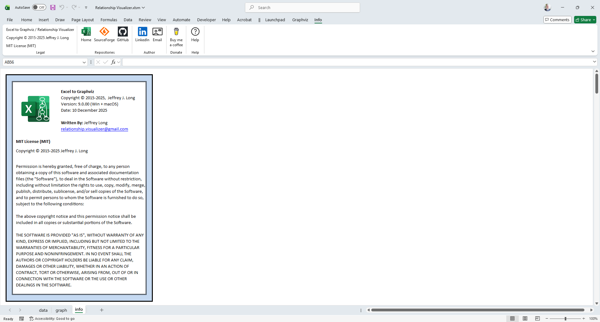

[Learn more...](../info/)

### About...

Copyright, Author, Repositories, and License information are available on this website [here](../about/).

### Thank You

Special thanks to key contributors are acknowledged on this website [here](../acknowledge/#thank-you) as well as in the `info` worksheet.

### Third-Party Notices

Open-source licenses and acknowledgements required to reuse the open-source components in a license-compliant manner are available on this website [here](../acknowledge/#third-party-notices) as well as in the `info` worksheet.
