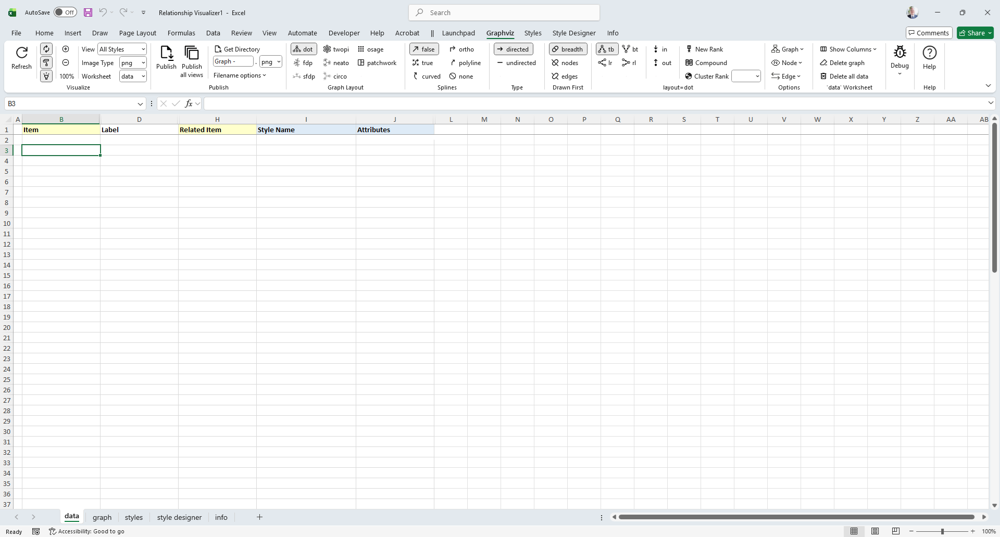
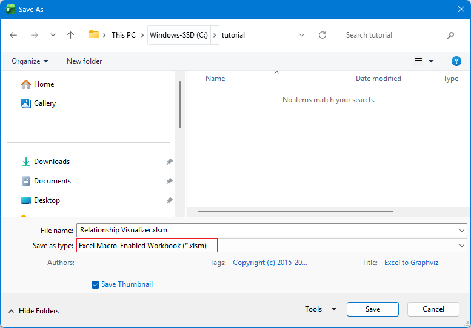

# Create a New Workbook

The first action is to launch Microsoft Excel. When Excel starts, it will suggest sample spreadsheets you can create. This will contain the `Relationship Visualizer` template which you saved as a template as part of the installation steps. 

Select this template to create a new workbook.

## Save the Workbook as a Macro-Enabled Workbook

The workbook will appear as shown below.

Perform a "**FILE -> Save As**" action. Choose a directory where you would like to save the file and change the file name from `Relationship Visualizer1` to something meaningful to you.

The most important step is to set the `Save as type:` dropdown list item as **Excel Macro-Enabled Workbook (*.xlsm)**. You will not be able to run the macros that create the visualizations unless the workbook is _macro-enabled_.

The workbook you just saved may show a **BLOCKED CONTENT** message. If so, click the `Trust Center` button.

The security settings for running macros will be displayed. 

Choose the `Enable VBA macros (not recommended; potentially dangerous code can run)` radio button, and press `OK`.

## Close and Reopen the New Workbook

Assuming that you changed the file name from `Relationship Visualizer1` to something meaningful to you, you should now close the file and reopen it.

When you reopen the workbook the message stating that macros have been blocked will be gone. The spreadsheet will appear as follows, displaying a `data` worksheet and a custom ribbon tab named `Graphviz`.

::: warning WARNING - Ribbon Fails to Update Dynamically After “Save As”
When you use **File → Save As** to change the workbook’s file name, Excel continues to associate the ribbon with the *original* file name. Because of this stale reference, any code that programmatically switches ribbon tabs will stop working.

To work around the issue, you can either manually switch tabs as you move between worksheets, or close and reopen the workbook. Reopening forces Excel to reload the ribbon under the new file name, restoring normal tab‑switching behavior.

This is a known issue in **Microsoft Excel** that affects workbooks using a custom ribbon ([1](https://stackoverflow.com/questions/33673898/macro-button-under-customized-ribbon-tab-tries-to-open-old-excel-file), [2](https://www.mrexcel.com/board/threads/custom-ribbon-macros-point-to-old-workbook.1257482/)). 

:::

::: tip
Any time you save a copy of the spreadsheet using **File → Save As** and change the workbook’s file name, you should close the workbook and reopen it. This forces Excel to reload the custom ribbon under the new file name and restores normal tab‑switching behavior.
:::

