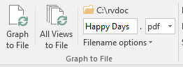

# Publishing Graphs

One of the powers of the Relationship Visualizer is that you can collect large amounts of data and let it and Graphviz determine how to graph it efficiently. Graphs with lots of data tend to grow large; much larger than can easily be viewed in Excel. You may also want to print them, and you will need a tool such as Adobe Acrobat Reader that will provide the means to zoom in and out on the graph, and poster print the diagram using multiple sheets of paper.

## Setting Output File Options

You must specify a directory where you want graph files written to, and provide a filename prefix for the file. Select the `Get Directory` button on the `Graphviz` ribbon tab to bring up the Microsoft Windows directory-picking dialog.

Choose a directory, press OK, and the directory path is transferred to the Output Directory label beneath the `Get Directory` button. At this point, the `Graph to File` button is enabled.

Next, specify a filename prefix. This is a value that the filename will begin with.

The heading value of the view column used to control which styles were included in the diagram will be appended to the prefix as part of the file name. In this example, we will continue to work with the `Spouses` view.

Two additional switches can append a date and time to the filename, and the graph options used (layout engine and spline setting) to create the graph.

- Timestamps in the filename help ensure file creation occurs when you are refining the graphs since Graphviz cannot generate a new file if a file by the same name is open in another tool, such as Acrobat reader.
- Recording graph options in the file name allows you to try different layout engines and spline settings top find the combination that produces the best-looking graph.

Having this information in the filename is a handy way to recall which settings to use once you have made your decision.

In this example, all the options have been enabled.

## Specifying the Output File Format

Graphviz provides numerous file formats that the diagrams can be written as, such as **gif**, **jpeg**, **pdf**, or **tiff**. The Relationship Visualizer provides the most commonly used file formats in the `File Format` dropdown list.

## Graph to File / All Views to File

Press the `Graph to File` button.

A graph is generated in the same fashion as when `Refresh Graph` was press, but the focus will remain on whatever worksheet was active when the button was pressed (the `data`, `styles`, and `settings` worksheets all provide this button). You will receive a message down in the status bar that will tell you what the filename is, and where the file is located.

You may also choose to have one file per view created by selecting the `All Views to File` button.

The list of views will be iterated in a loop, and a file will be published based on the yes/no switches specified for that view. The View Name will be appended to the file prefix allowing you to tell the graphs apart.

## View the File

Bring up Windows Explorer and find your file.

Launch the file, and see it displayed. In this example, the graph is a PDF file. Adobe Acrobat Reader will display the file, and Acrobat Reader's entire zoom, print, and annotation capabilities are available to you.

