# Publishing Graphs

One of the strengths of the Relationship Visualizer is its ability to handle large datasets and let Graphviz determine an efficient layout automatically. However, graphs with substantial amounts of data can become quite large—often far beyond what can be comfortably viewed within Excel.

Publishing the graph to an external file is often the most practical way to work with these larger diagrams. Saving the output allows you to archive versions of the graph as your data evolves, share the results with colleagues who may not be using Excel, and review the structure of the graph independently of the workbook.

If you need to examine these diagrams in detail or print them, you will likely want to use a dedicated viewer such as **Adobe Acrobat Reader**. Tools like this allow you to zoom in and out smoothly and use poster‑printing features to span the diagram across multiple sheets of paper.

::: tip When to Publish Instead of Refresh

Use **Publish** when you want to work with the graph outside of Excel—whether to archive versions, share the diagram with others, or explore the layout at a scale Excel cannot comfortably display. Publishing is also ideal when you are comparing multiple layout engines or spline settings, since each exported file can serve as a snapshot of your experiments. If you plan to print the diagram or examine fine details, publishing to a PDF or SVG and opening it in a dedicated viewer will give you far more flexibility than the in‑workbook preview.
:::

## Setting Output File Options

You must specify a directory where you want graph files written to, and provide a filename prefix for the file. Select the `Get Directory` button in the `Publish` group on the `Graphviz` ribbon tab.

| 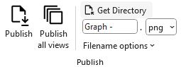 |
| --------------------------------------- |

A directory-picking dialog will appear:

| Windows | macOS |
| :-------------------------------------: | :-------------------------------------: |
| 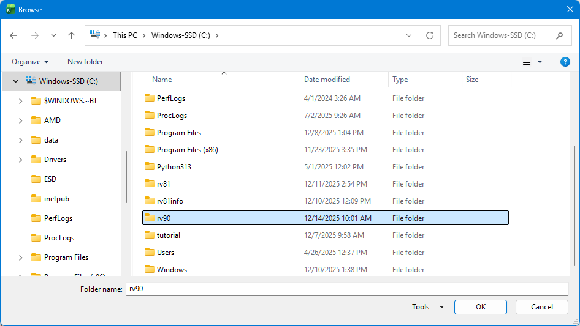 | 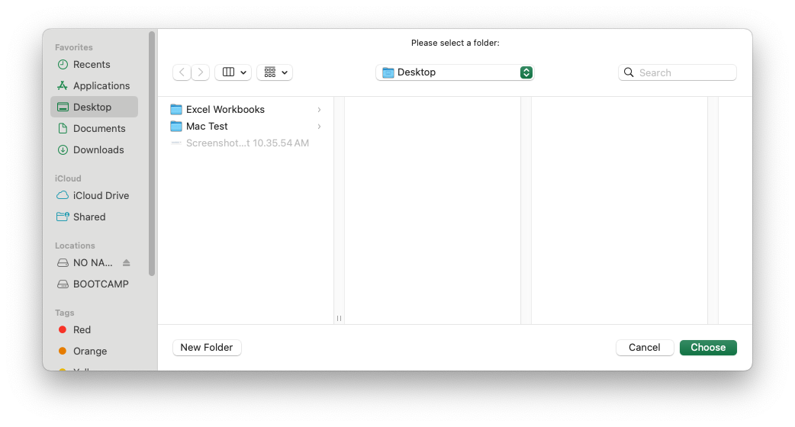 |

Choose a directory, press OK, and the directory path replaces the `Get Directory` text on the selection button.

| 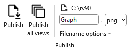 |
| --------------------------------------- |

Next, specify a filename prefix in the edit field below the directory name. This is a value that the filename will begin with. Here the file name prefix is set to `Graph - `.

You control the type of file generated by specifying the extension after the prefix. In this example will are creating a `png` image.

The heading value of the view column used to control which styles were included in the diagram will be appended to the prefix as part of the file name. In this example, we will use the `All Styles` view.

| 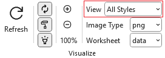 |
| --------------------------------------- |

A dropdown menu below the file prefix provides additional switches to append a date and time to the filename and to include the graph options used (layout engine and spline setting) when generating the graph.

- Adding a timestamp helps ensure that new files can be created during iterative refinement. Graphviz cannot overwrite a file that is currently open in another application, such as Acrobat Reader, so unique filenames prevent interruptions.
- Including the graph options in the filename allows you to experiment with different layout engines and spline settings and easily identify which combination produced the most effective result.

Storing this information directly in the filename provides a convenient way to recall the settings you selected once you have settled on the configuration that works best.

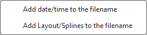

In this example, all the options have been enabled.

## Specifying the Output File Format

Graphviz provides numerous file formats that the diagrams can be written as, such as **gif**, **jpeg**, **pdf**, or **tiff**. The Relationship Visualizer provides the most commonly used file formats in the `File Format` dropdown list.

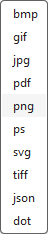

## Publish / Publish all views

Press the `Publish` button.

| 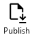 |
| --------------------------------------- |

A graph is generated in the same manner as when `Refresh` is pressed; however, it is not displayed in the Excel workbook. Instead, a message appears in the Excel status bar indicating the name of the file that was created and the folder where it was saved.

You may also choose to have one file per view created by selecting the `Publish all views` button.

| 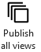 |
| --------------------------------------- |

The list of views will be iterated in a loop, and a file will be published based on the yes/no switches specified for that view. The View Name will be appended to the file prefix allowing you to tell the graphs apart.

## View the File

Bring up Windows Explorer and find your file. Note that the file name is a concatenation of the prefix (`Graph - `) and the View Name (`All Styles`) and the file extension (`.png`).

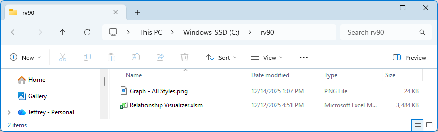

Launch the file, and see it displayed.

The application associated with the file type will display the file. In this example, the graph is a `png` file, which is associated with Windows image viewer. All editing, zoom, print, and annotation capabilities it provides are available to you.

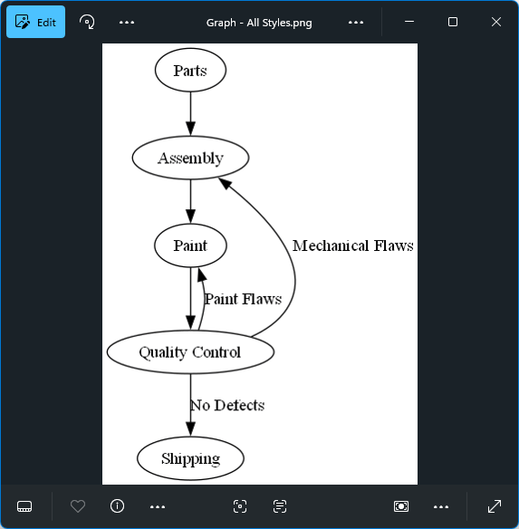
