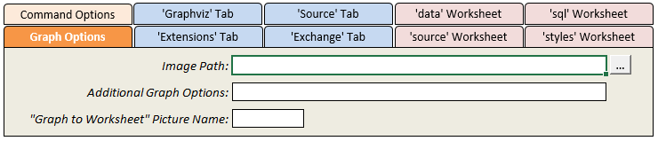
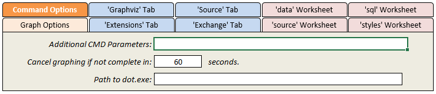
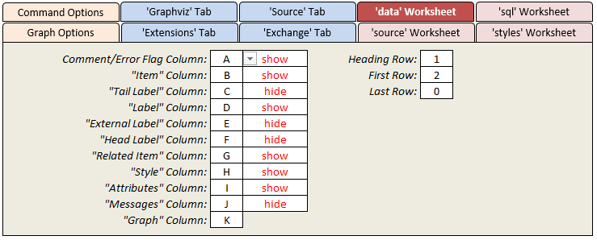
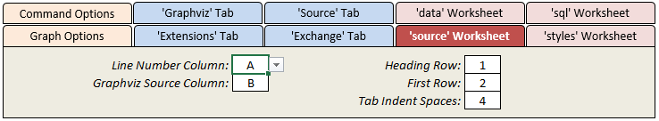
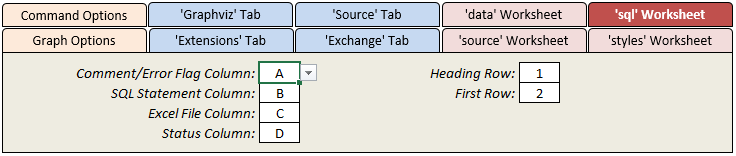
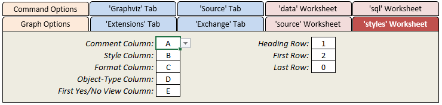

# Changing Master Settings

The 'settings' worksheet is where you can customize overarching settings which control how the graph is created, specify directories containing images to use in the graph, control how long the graphing engine is allowed to run, specify Graphviz command line parameters, and modify the order in which the worksheet columns are laid out. The following sections provide a brief description of the settings:

## Graph Options

These settings control the graph options used to produce the diagrams.

| Setting                           | Description                                                                                                                                                                                                                                                                                                                                                                                                                                                                                                                                                                                                                                                     |
| --------------------------------- | --------------------------------------------------------------------------------------------------------------------------------------------------------------------------------------------------------------------------------------------------------------------------------------------------------------------------------------------------------------------------------------------------------------------------------------------------------------------------------------------------------------------------------------------------------------------------------------------------------------------------------------------------------------- |
| Image Path                        | Specifies one or more directories when images to include in the graph are stored. The Relationship Visualizer looks for images in the same directory where the spreadsheet is stored first, followed by the directory specified here. The folder picker allows you to select one directory, however multiple directories can be specified if the directories are separated by a semi-colon `;`.  If you use the `style designer` worksheet to design an image node the directory containing the image will be automatically appended to the value here, unless the directory is already listed or is the directory where the Excel spreadsheet is stored. |
| Additional Graph Options          | A means to insert additional Graphviz graph directives into the graph at the top-most level. To use this setting, you must understand how Graphviz works. This setting can be used to control aspects such as node spacing.   For example: `sep="+30,300"`                                                                                                                                                                                                                                                                                                                                                                                                |
| “Graph to Worksheet” Picture Name | The name to assign to the picture object containing the bitmap which is created by the `Refresh Graph` button on the `Data` worksheet. If this value is blank, Excel assigns a name.                                                                                                                                                                                                                                                                                                                                                                                                                                                                            |

## Command Options

The 'Command Line Options' settings allow you to pass parameters to the Graphviz command line programs.

| Setting                                         | Description                                                                                                                                                                                                                                                                                     |
| ----------------------------------------------- | ----------------------------------------------------------------------------------------------------------------------------------------------------------------------------------------------------------------------------------------------------------------------------------------------- |
| Additional CMD Parameters                       | A means to pass additional command line parameters to the layout engine program. For example: -Efontsize="8" -Efontname="Arial" would override the default edge format. Setting the font size to 8 points, and the font to Arial for all edges which do not have explicit style specifications. |
| Cancel graphing if not complete in \_\_ seconds | The maximum number of seconds the graphing engine can run. If set to 0, no time limit exists.                                                                                                                                                                                                   |
| Path to dot.exe                                 | The path to the dot executable if Graphviz is not installed/not available via the PATH environment variable.                                                                                                                                                                                    |

## 'data' Worksheet

These settings allow you to rearrange the column layout of the 'data' worksheet, and restrict which rows get processed.

| Setting                     | Description                                                                                                                                                                                                                                                                                                                                                                                      |
| --------------------------- | ------------------------------------------------------------------------------------------------------------------------------------------------------------------------------------------------------------------------------------------------------------------------------------------------------------------------------------------------------------------------------------------------ |
| `Comment/Error Flag` Column | The column used to place '\#' comment characters which indicate that the rows should be treated as a comment and not be included in the data to be graphed. This column also serves a second purpose when errors are found in the data. An exclamation point "!" character is placed in the column to signal an error, and direct you to look in the Messages column for the cause of the error. |
| `Item` Column               | The column within the 'data' worksheet where the `Item` values are located.                                                                                                                                                                                                                                                                                                                      |
| `Label` Column              | The column within the 'data' worksheet where the `Label` values are located.                                                                                                                                                                                                                                                                                                                     |
| `External Label` Column     | The column within the 'data' worksheet where the `External Label` values are located.                                                                                                                                                                                                                                                                                                            |
| `Tail Label` Column         | The column within the 'data' worksheet where the `Tail Label` values are located.                                                                                                                                                                                                                                                                                                                |
| `Head Label` Column         | The column within the 'data' worksheet where the `Head Label` values are located.                                                                                                                                                                                                                                                                                                                |
| `Related Item` Column       | The within the 'data' worksheet column where the `Related Item` values will be found                                                                                                                                                                                                                                                                                                             |
| `Style Name` Column         | The Column within the 'data' worksheet where the `Style Name` name values are located.                                                                                                                                                                                                                                                                                                           |
| `Attributes` Column         | The column within the 'data' worksheet where the `Attributes` style attributes are located.                                                                                                                                                                                                                                                                                                      |
| `Messages` Column           | The column located within the 'data' worksheet where error messages are to be written to.                                                                                                                                                                                                                                                                                                        |
| Heading Row                 | The row containing the column headings                                                                                                                                                                                                                                                                                                                                                           |
| First Row                   | First row of data.                                                                                                                                                                                                                                                                                                                                                                               |
| Last Row                    | Last row of data definitions. When set to 0 all rows after the First Row containing data are used. First Row and Last Row are useful during graph development for specifying a subset of data to process when the overall amount of data is large.                                                                                                                                               |

## 'source' Worksheet

These settings allow you to rearrange the column layout of the 'source' worksheet.

| Setting                  | Description                                                                        |
| ------------------------ | ---------------------------------------------------------------------------------- |
| `Line Number` Column     | The column which contains the line number of the Graphviz DOT source code.         |
| `Graphviz Source` Column | The column where the Graphviz DOT source code gets placed                          |
| Heading Row              | The row containing the column headings                                             |
| First Row                | First row of data.                                                                 |
| Tab Indent Spaces        | The number of blanks to insert based upon the depth of subgraphs within the graph. |

## 'sql' Worksheet

These settings allow you to rearrange the column layout of the 'sql' worksheet, and restrict which rows get processed.

| Setting                     | Description                                                                                                                                                                       |
| --------------------------- | --------------------------------------------------------------------------------------------------------------------------------------------------------------------------------- |
| `Comment/Error Flag` Column | The column used to place '\#' comment characters which indicate that the rows should be treated as a comment and not be included in the set of SQL statements which get executed. |
| `SQL Statement` Column      | The column containing the SQL SELECT statements to execute                                                                                                                        |
| `Excel File` Column         | The column containing the paths to the Excel files containing the data which the SQL SELECT statements should be executed against.                                                |
| `Status` Column             | The column where the status (Success/Failure/Skipped) of the SQL SELECT statement, along with any error messages is written to.                                                   |
| Heading Row                 | The row containing the column headings                                                                                                                                            |
| First Row                   | First row of SQL SELECT statements to execute.                                                                                                                                    |

## 'styles' Worksheet

The ''styles' Worksheet' settings allow you to rearrange the column layout of the 'styles' worksheet, and specify the range of rows to be included in the style collection at run-time.

| Setting                    | Description                                                                                                                                                           |
| -------------------------- | --------------------------------------------------------------------------------------------------------------------------------------------------------------------- |
| `Comment` Column           | The column used to place '\#' comment characters which indicate that the rows should be treated as a comment and not be included in the set of styles.                |
| `Style` Column             | The column where the name of the style is specified                                                                                                                   |
| `Format` Column            | The column where the node, edge, or cluster format string is specified.                                                                                               |
| `Object-Type` Column       | The column where the object-type is specified. The object-type is used to classify the style as a node, edge, subgraph-open, subgraph-close, keyword, or native type. |
| `First Yes/No View` Column | The first column containing Yes/No switches which control which styles will comprise the view.                                                                        |
| Heading Row                | The row which contains the column headings. The heading value of the "Yes/No Switch Column" is included in the graph's file name after the file name prefix.          |
| First Row                  | First row of style definitions (i.e., where the definitions begin)                                                                                                    |
| Last Row                   | Last row of style definitions. When set to 0 all rows after the `First Row` containing data are used.                                                                 |
