# Viewing DOT Source Code

The Relationship Visualizer is designed to let you create Graphviz graphs without needing to learn the [DOT Language](https://graphviz.org/doc/info/lang.html). However, it can also serve as an effective learning tool for DOT itself. This topic explains how to access the DOT source code generated from the Excel worksheets and passed to the Graphviz layout engine. These capabilities allow you to build relationship graphs and then examine the underlying code that produces them.

::: tip Why is this useful?
Understanding how the Relationship Visualizer transforms worksheet data into DOT source code can help you:
- **Learn the DOT language naturally** by seeing real examples generated from your own graphs
- **Validate the structure** of the code being sent to the Graphviz layout engine
- **Troubleshoot layout issues** by comparing the visual output with the underlying DOT
- **Experiment with advanced features** by editing or extending the generated code
- **Build confidence** in how your relationships, attributes, and styles are translated into Graphviz syntax

This makes the tool not only a no‑code graph builder, but also a gentle, hands‑on learning environment for anyone curious about DOT.
:::

## Graph Creation Steps

The diagram below shows the flow from your worksheet data to the final Graphviz output. It highlights how the Relationship Visualizer generates DOT source and passes it to the Graphviz layout engine.

           ┌──────────────────┐
           │   Excel Sheets   │
           │  (data, styles,  │
           │   sql, etc.)     │
           └─────────┬────────┘
                     │
                     ▼
           ┌──────────────────┐
           │   DOT Generator  │
           │ (builds DOT code │
           │   from sheets)   │
           └─────────┬────────┘
                     │
                     ▼
           ┌──────────────────┐
           │ Graphviz Layout  │───────────────┐
           │   Engine (dot)   │               │
           └─────────┬────────┘               ▼
                     │              ┌──────────────────┐
                     ▼              │ (Optional) SVG   │
           ┌──────────────────┐     │ post-processing  │
           │   Final Graph    │     └─────────┬────────┘
           │ (rendered image) │<──────────────┘
           └──────────────────┘

## The `source` Worksheet

The Relationship Visualizer includes a worksheet named `source`, which displays the DOT source code generated each time a graphing button is pressed.

The `source` worksheet is hidden by default. To reveal it, select the **source** button in the **Graphviz dot** section of the `Launchpad` tab.

| 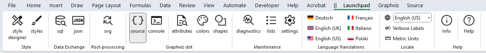 |
| -------------------------------------------------- |

Click the `source` worksheet to make it the active sheet. When `source` is active, the `Source` ribbon tab is automatically displayed. It appears as follows:

*Windows*
| 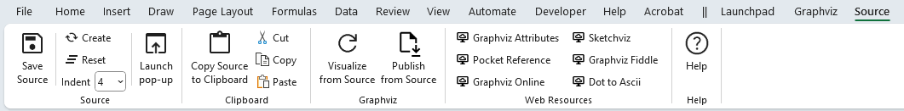 |
| ---------------------------- |

*macOS*
| 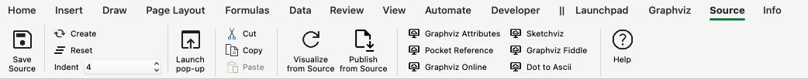 |
| ---------------------------- |

The next image shows the default DOT code when the `data` worksheet does not contain any content. As you create a graph the source worksheet will update.

| 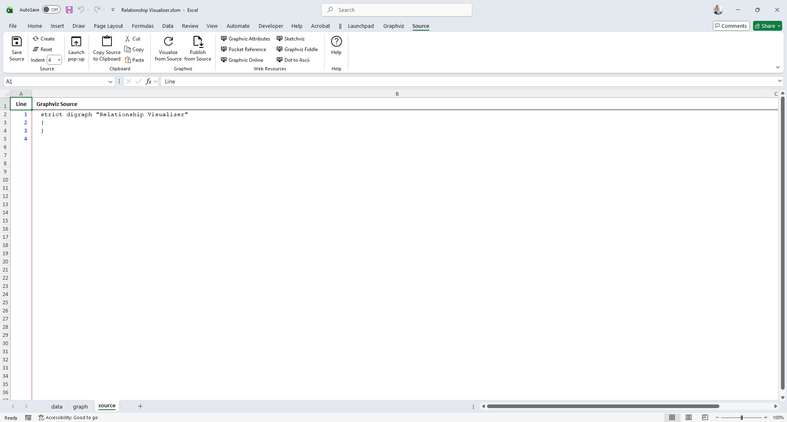 |
| ---------------------------- |

Switch to the `data` worksheet and build a graph. Consider the following example:

| 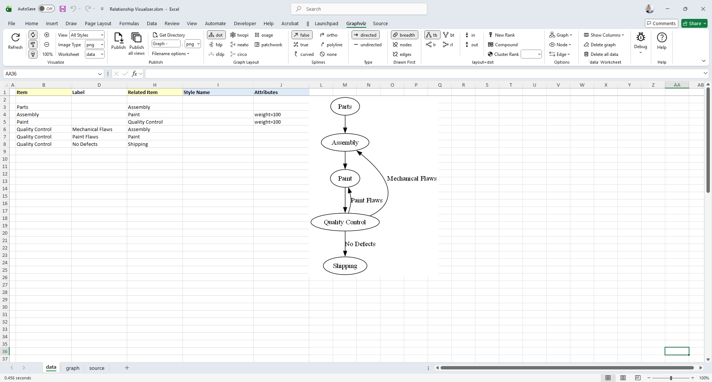 |
| ---------------------------- |

When we switch back to the `source` worksheet the Graphviz source code appears as:

| 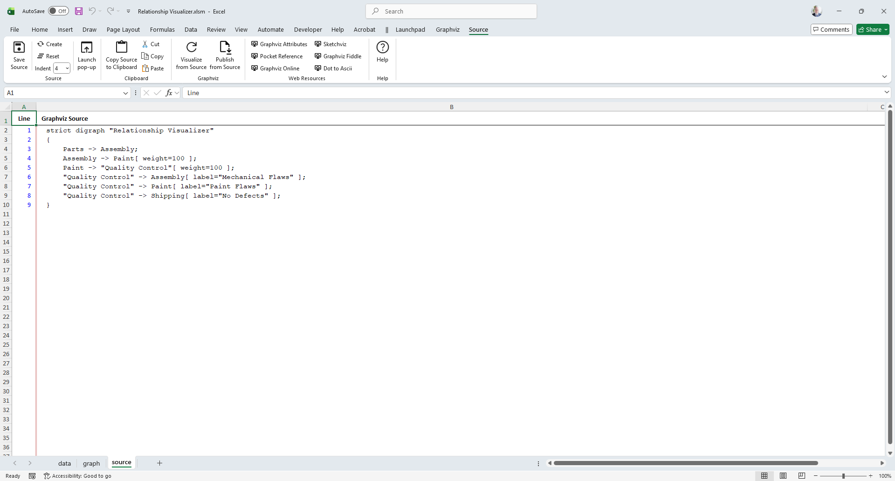 |
| ---------------------------- |

## The `Source` Ribbon Tab

Now that you understand the basics of viewing Graphviz source code, let us look at the features contained in the `Source` ribbon tab. The `Source` ribbon tab is activated whenever the `source` worksheet is activated. It appears as follows:

|  |
| -------------------------------------------------- |

It contains the following groups, each of which is explained in the sections that follow. You may jump directly to any group using the links in this table:

| Group                           | Controls  | Description |
| :----                           | :--- | :--- |
| [Source](#source)               | 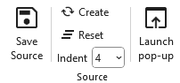 | Controls for viewing and saving `DOT` source code. |
| | |
| [Clipboard](#clipboard)         | 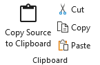 | Controls for copying the `DOT` source to the clipboard. |
| | |
| [Graphviz](#graphviz)           | 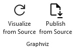 | Generates a graph from the Graphviz data on the `source` worksheet using the settings on the `Graphviz` ribbon tab. |
| | |
| [Web Resources](#web-resources) | 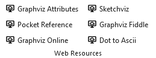 | Six buttons which can launch the user's default browser and display a web page pertaining to a Graphviz topic.
| | |
| [Help](#help)                   | 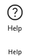 | Provides a link to the `Help` content for the `Source` worksheet (i.e. this web page). |

### Source

|  |
| -------------------------------------------------- |

Controls for viewing and saving `DOT` source code.

| Label         | Control Type  | Description                                                                                                                                                                                                                        |
| ------------- | ------------- | ---------------------------------------------------------------------------------------------------------------------------------------------------------------------------------------------------------------------------------- |
| Save Source   | Button        | Saves the Graphviz source code displayed on the `source` worksheet to a file.                                                                                                                                                      |
| Create        | Button        | Generates fresh Graphviz source code from the data worksheet without invoking Graphviz to render a graph. This is useful when you have manually edited the DOT source and want to restore it to its original, workbook‑generated form. |
| Reset         | Button        | Clears all data on the source worksheet, but leaves the headings.                                                                                                                                                                  |
| Indent        | Dropdown List | Number of spaces equaling a tab indentation                                                                                                                                                                                        |
| Launch pop-up | Button        | Opens a pop‑up window that displays the DOT source code. This window is set to “always on top,” allowing you to switch worksheets while still viewing the source. It is especially useful for observing how the DOT code updates as you modify the data and the graph evolves. |                                                                                                                                                          |

The pop-up version of the DOT source code appears as follows:

| 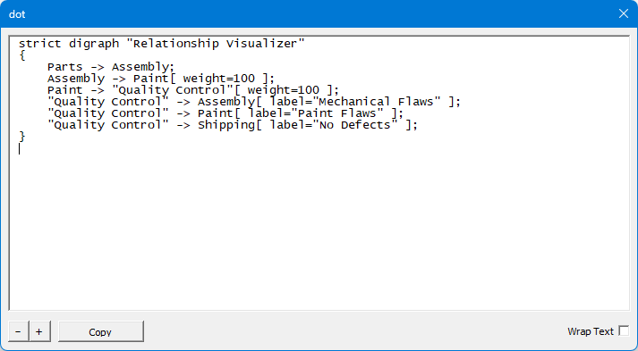 |
| -------------------------------------------------- |

The form is primarily read-only, however you can enlarge or shrink the font size, copy the contents to the clipboard, and word-wrap long text.

### Clipboard

|  |
| -------------------------------------------------- |

Controls for copying the `DOT` source to the clipboard. This capability is only present on Windows, as the Windows API code it relies on is not present on macOS.

| Label                    | Control Type | Description                                                          |
| ------------------------ | ------------ | -------------------------------------------------------------------- |
| Copy Source to Clipboard | Button       | Selects all the Graphviz source code and copies it to the clipboard. |
| Cut                      | Button       | Standard Excel cell-based `Cut`                                                 |
| Copy                     | Button       | Standard Excel cell-based `Copy`                                                |
| Paste                    | Button       | Standard Excel cell-based `Paste`                                               |

### Graphviz

Utilility to visualize the source code as a Graphvis graph. T

|  |
| -------------------------------------------------- |

| Label                 | Control Type | Description                                                                                                                                                                                                                                                                                                                                                                                                                                                                                                                                                                                                                          |
| --------------------- | ------------ | ------------------------------------------------------------------------------------------------------------------------------------------------------------------------------------------------------------------------------------------------------------------------------------------------------------------------------------------------------------------------------------------------------------------------------------------------------------------------------------------------------------------------------------------------------------------------------------------------------------------------------------ |
| Visualize from Source | Button       | Generates a graph from the Graphviz data on the `source` worksheet using the settings on the `Graphviz` ribbon tab, and displays the result on the `graph` worksheet. Note that this data flow is one‑way: changes made on the `data` worksheet can be regenerated as `source`, but edits made directly on the `source` worksheet are not detected and will not flow back into the `data` worksheet. |
| Publish from Source   | Button       | Graphs the Graphviz data on the source worksheet using the settings on the `Graphviz` ribbon tab and writes the graph to a file. All the restrictions noted for the `Refresh Graph` button apply to this action as well.                                                                                                                                                                                                                                                                                                                                                                                                             |

::: tip
You can modify the DOT source code on this worksheet, and update the graph using the visualize buttons.
:::

::: warning
Changes to the DOT source code are not reflected on the `data` worksheet. Any changes made on the `data` worksheet will wipe out any changes you make on the `source` worksheet.
:::

### Web Resources

|  |
| -------------------------------------------------- |

The `Web Resources` group dynamically supports six buttons which can launch the user's default browser and display a web page. Button text, tool tips, and the URL are specified in the `settings` worksheet. The worksheet as distributed contains links to Graphviz documentation and online Graphviz rendering tools.

The default settings are:

| #   | Label                                                           | Control Type | Description                                                                                                                                             |
| --- | --------------------------------------------------------------- | ------------ | ------------------------------------------------------------------------------------------------------------------------------------------------------- |
| 1   | [Graphviz Attributes](https://graphviz.org/doc/info/attrs.html) | Button       | Describes the attributes used by various Graphviz tools.                                                                                                |
| 2   | [Pocket Reference](http://graphs.grevian.org/graph)             | Button       | An on-line code editor for Graphviz written by Josh Hayes-Sheen for Computer Science students.                                                          |
| 3   | [Graphviz Online](http://dreampuf.github.io/GraphvizOnline/)    | Button       | Online Graphviz editor with syntax highlighting.                                                                                                        |
| 4   | [Sketchviz](https://sketchviz.com/new)                          | Button       | Online Graphviz editor which creates the graph as if it were sketched by hand.                                                                          |
| 5   | [Graphviz Fiddle](http://stamm-wilbrandt.de/GraphvizFiddle/)    | Button       | Graphviz Fiddle draws DOT language [directed] graphs. It is a dual-view Graphviz editor and playground for Graphviz written by Hermann Stamm-Wilbrandt. |
| 6   | [Dot to Ascii](https://dot-to-ascii.ggerganov.com/)             | Button       | Renders Graphviz diagrams as ascii art.                                                                                                                 |

The values associated with these buttons can be changed to suit your own preferences. These links are located in the `settings` worksheet in the `Ribbon Options` location, in the `Source` tab

| 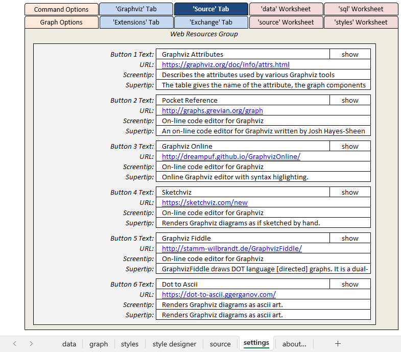 |
| -------------------------------------------------- |

### Help

|  |
| -------------------------------------------------- |

Provides a link to the `Help` content for the `Source` worksheet (i.e. this web page).

| Label       | Control Type  | Description                                                                                                                                                                                                                        |
| ----------- | ------------- | ---------------------------------------------------------------------------------------------------------------------------------------------------------------------------------------------------------------------------------- |
| Help | Button        | Provides a link to this web page. |

## Interactive Graphviz over the Internet

There are many public web sites which will allow you to interactively edit DOT code in a browser window and see the corresponding graph.

Sites you can explore include:

- [Pocket Reference](http://graphs.grevian.org/graph)
- [Graphviz Online](http://dreampuf.github.io/GraphvizOnline/)
- [Sketchviz](https://sketchviz.com/new)
- [Graphviz Fiddle](http://stamm-wilbrandt.de/GraphvizFiddle/)
- [Dot to Ascii](https://dot-to-ascii.ggerganov.com/)
- [Graphviz Visual Editor](http://magjac.com/graphviz-visual-editor/)

These sites work best with small graphs and cannot handle features like displaying images. There is no guarantee that these sites will continue to operate into the future. They do, however, make it easy to edit DOT graphs, quickly see the results, and learn the DOT programming language without having to install Graphviz.

---

Like this tool? [Buy me a coffee! ☕](https://www.buymeacoffee.com/exceltographviz)

