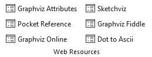

# Viewing DOT Source Code

The Relationship Visualizer is intended to remove the need to learn the DOT language but still create Graphviz graphs. It can, however, also be a very useful tool for learning the DOT language. This chapter will explain how you can access the DOT source code which is generated from the Excel worksheets and passed to the Graphviz layout engine. These capabilities allow you to graph relationships, and then see the underlying code.

## The `source` Worksheet

The Relationship Visualizer contains a worksheet named `source` which shows the source code which was generated whenever a graphing button is pressed.

The `source` worksheet is hidden by default. To expose the `source` worksheet select the `source` button on the `Graphviz` tab.

|  |
| -------------------------------------------------- |

Click on the `source` worksheet to make it the active worksheet. The `Source` ribbon tab is activated whenever the `source` worksheet is activated. It appears as follows:

YThe image above shows the default DOT code when the `data` worksheet does not contain any content. As you create a graph the source worksheet will update.

Switch to the `data` worksheet and build a graph. Consider the following example:

When we switch back to the `source` worksheet the Graphviz source code appears as:

## The `Source` Ribbon Tab

Now that you understand the basics of viewing Graphviz source code, let us look at the features contained in the `Source` ribbon tab. The `Source` ribbon tab is activated whenever the `source` worksheet is activated. It appears as follows:

|  |
| -------------------------------------------------- |

It contains the following major groups:

- Source
- Clipboard
- Visualize
- Web Resources

### Source

|  |
| -------------------------------------------------- |

| Label       | Control Type  | Description                                                                                                                                                                                                                        |
| ----------- | ------------- | ---------------------------------------------------------------------------------------------------------------------------------------------------------------------------------------------------------------------------------- |
| Save Source | Button        | Saves the Graphviz source code displayed on the `source` worksheet to a file.                                                                                                                                                      |
| Create      | Button        | Creates the Graphviz source code from the information in the `data` worksheet without invoking Graphviz to render a graph. This action is useful if you have modified the DOT source and want to restore it to its original state. |
| Reset       | Button        | Clears all data on the source worksheet, but leaves the headings.                                                                                                                                                                  |
| Indent      | Dropdown List | Number of spaces equaling a tab indentation                                                                                                                                                                                        |

### Clipboard

|  |
| -------------------------------------------------- |

| Label                    | Control Type | Description                                                          |
| ------------------------ | ------------ | -------------------------------------------------------------------- |
| Copy Source to Clipboard | Button       | Selects all the Graphviz source code and copies it to the clipboard. |
| Cut                      | Button       | Standard Excel `Cut`                                                 |
| Copy                     | Button       | Standard Excel `Copy`                                                |
| Paste                    | Button       | Standard Excel `Paste`                                               |

### Visualize

|  |
| -------------------------------------------------- |

| Label              | Control Type | Description                                                                                                                                                                                                                                                                                                                                                                                                                                                                                                                                                                                                                          |
| ------------------ | ------------ | ------------------------------------------------------------------------------------------------------------------------------------------------------------------------------------------------------------------------------------------------------------------------------------------------------------------------------------------------------------------------------------------------------------------------------------------------------------------------------------------------------------------------------------------------------------------------------------------------------------------------------------ |
| Graph to Worksheet | Button       | Graphs the Graphviz data on the source worksheet using the settings on the `Graphviz` ribbon tab and displays the resulting graph on the `graph` worksheet. If the graph fails to render you will receive a message saying it failed, but limitations of the code used to invoke Graphviz prevent returning the actual Graphviz error messages. To see those messages, you must use a different tool. Note also that the exchange of data is one direction. Changes made on the `data` worksheet can be generated as `source`, but changes made on the `source` worksheet will not be detected and fed back to the `data` worksheet. |
| Graph to File      | Button       | Graphs the Graphviz data on the source worksheet using the settings on the `Graphviz` ribbon tab and writes the graph to a file. All the restrictions noted for the `Refresh Graph` button apply to this action as well.                                                                                                                                                                                                                                                                                                                                                                                                             |

::: tip
You can modify the DOT source code on this worksheet, and update the graph using the visualize buttons.
:::

::: warning
Changes to the DOT source code are not reflected on the `data` worksheet. Any changes made on the `data` worksheet will wipe out any changes you make on the `source` worksheet.
:::

### Web Resources

|  |
| -------------------------------------------------- |

The `Web Resources` group dynamically supports six buttons which can launch the user's default browser and display a web page. Button text, tool tips, and the URL are specified in the `settings` worksheet. The worksheet as distributed contains links to Graphviz documentation and online Graphviz rendering tools.

The default settings are:

| #   | Label                                                           | Control Type | Description                                                                                                                                             |
| --- | --------------------------------------------------------------- | ------------ | ------------------------------------------------------------------------------------------------------------------------------------------------------- |
| 1   | [Graphviz Attributes](https://graphviz.org/doc/info/attrs.html) | Button       | Describes the attributes used by various Graphviz tools.                                                                                                |
| 2   | [Pocket Reference](http://graphs.grevian.org/graph)             | Button       | An on-line code editor for Graphviz written by Josh Hayes-Sheen for Computer Science students.                                                          |
| 3   | [Graphviz Online](http://dreampuf.github.io/GraphvizOnline/)    | Button       | Online Graphviz editor with syntax highlighting.                                                                                                        |
| 4   | [Sketchviz](https://sketchviz.com/new)                          | Button       | Online Graphviz editor which creates the graph as if it were sketched by hand.                                                                          |
| 5   | [Graphviz Fiddle](http://stamm-wilbrandt.de/GraphvizFiddle/)    | Button       | Graphviz Fiddle draws DOT language [directed] graphs. It is a dual-view Graphviz editor and playground for Graphviz written by Hermann Stamm-Wilbrandt. |
| 6   | [Dot to Ascii](https://dot-to-ascii.ggerganov.com/)             | Button       | Renders Graphviz diagrams as ascii art.                                                                                                                 |

The values associated with these buttons can be changed to suit your own preferences. These links are located in the `settings` worksheet in the `Ribbon Options` location, in the `Source` tab

|  |
| -------------------------------------------------- |

## Interactive Graphviz over the Internet

There are many public web sites which will allow you to interactively edit DOT code in a browser window and see the corresponding graph.

Sites you can explore include:

- [Pocket Reference](http://graphs.grevian.org/graph)
- [Graphviz Online](http://dreampuf.github.io/GraphvizOnline/)
- [Sketchviz](https://sketchviz.com/new)
- [Graphviz Fiddle](http://stamm-wilbrandt.de/GraphvizFiddle/)
- [Dot to Ascii](https://dot-to-ascii.ggerganov.com/)
- [Graphviz Visual Editor](http://magjac.com/graphviz-visual-editor/)

These sites work best with small graphs and cannot handle features like displaying images. There is no guarantee that these sites will continue to operate into the future. They do, however, make it easy to edit DOT graphs, quickly see the results, and learn the DOT programming language without having to install Graphviz.
