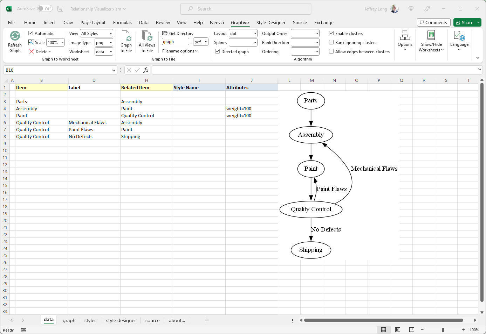
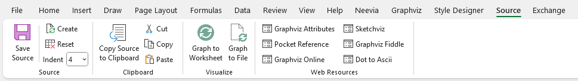
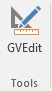
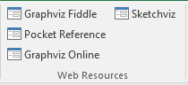
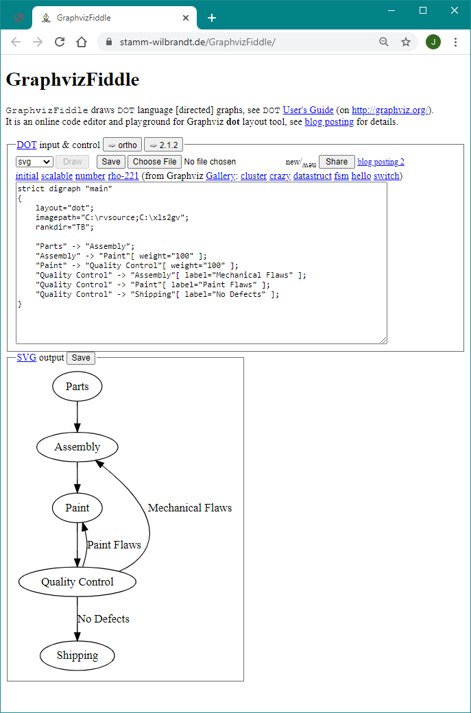
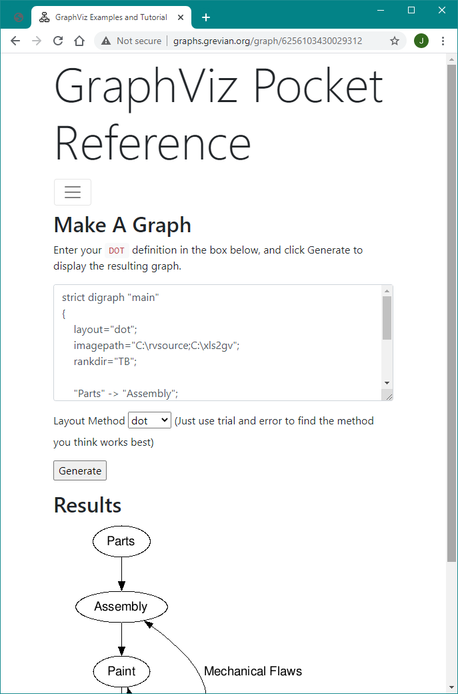
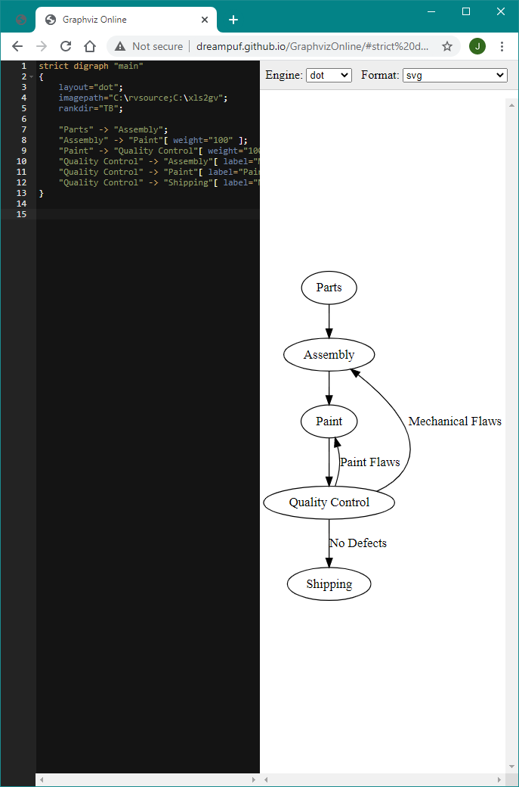
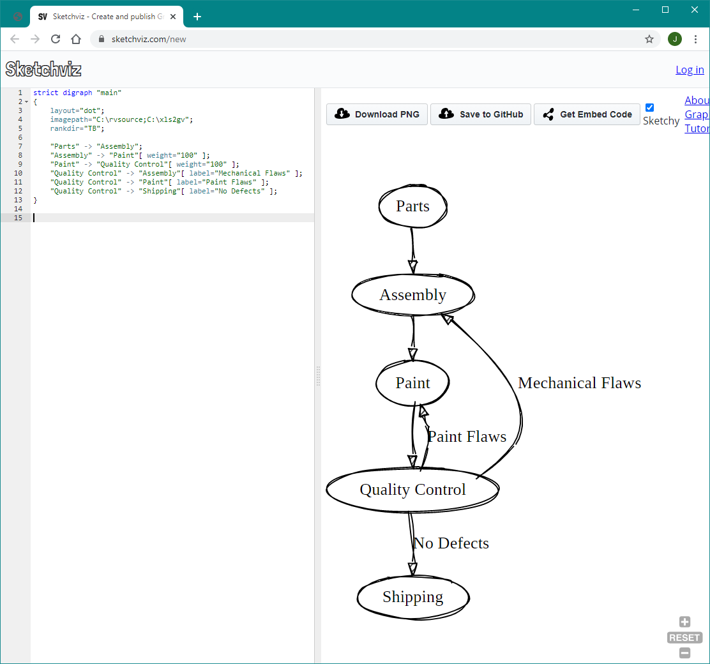

# Viewing DOT Source Code

The Relationship Visualizer is intended to remove the need to learn the DOT language but still create Graphviz graphs. It can, however, also be a very useful tool for learning the DOT language. This chapter will explain how you can access the DOT source code which is generated from the Excel worksheets and passed to the Graphviz layout engine. These capabilities allow you to graph relationships, and then see the underlying code.

## `source` Worksheet

The Relationship Visualizer contains a worksheet named `source` which shows the source code which was generated whenever a graphing button is pressed.

The `source` worksheet is hidden by default. To expose the `source` worksheet select the `source` button on the `Graphviz` tab.

Click on the `source` worksheet to make it the active worksheet. The `Source` ribbon tab is activated whenever the `source` worksheet is activated. It appears as follows:

You are probably thinking "but I don't see any DOT source code". That is correct. Whenever the `Refresh Graph` or `Graph to File` button is pressed the source code will be present.

Consider the following example:

To see the Graphviz source code switch to the `source` worksheet. It appears as:

## The "Source" Ribbon Tab

Now that you understand the basics of viewing Graphviz source code, let us look at the features contained in the `Source` ribbon tab. The 'Source ribbon tab is activated whenever the `source` worksheet is activated. It appears as follows:

It contains the following major groups:

- Source
- Clipboard
- Visualize
- Tools
- Web Resources

### Source

| Label       | Control Type  | Description                                                                                                                                                                                              |
| ----------- | ------------- | -------------------------------------------------------------------------------------------------------------------------------------------------------------------------------------------------------- |
| Save Source | Button        | Saves the Graphviz source code displayed on the `source` worksheet to a file.                                                                                                                            |
| Create      | Button        | Creates the Graphviz source code from the information in the 'data' worksheet without invoking Graphviz to render a graph. This action is useful if you want to change the indentation of the subgraphs. |
| Reset       | Button        | Clears all data on the source worksheet, but leaves the headings.                                                                                                                                        |
| Indent      | Dropdown List | Number of spaces equaling a tab indentation                                                                                                                                                              |

### Clipboard

| Label                    | Control Type | Description                                                          |
| ------------------------ | ------------ | -------------------------------------------------------------------- |
| Copy Source to Clipboard | Button       | Selects all the Graphviz source code and copies it to the clipboard. |
| Cut                      | Button       | Standard Excel 'Cut'                                                 |
| Copy                     | Button       | Standard Excel 'Copy'                                                |
| Paste                    | Button       | Standard Excel 'Paste'                                               |

### Visualize

| Label              | Control Type | Description                                                                                                                                                                                                                                                                                                                                                                                                                                                                                                                                                                                                                          |
| ------------------ | ------------ | ------------------------------------------------------------------------------------------------------------------------------------------------------------------------------------------------------------------------------------------------------------------------------------------------------------------------------------------------------------------------------------------------------------------------------------------------------------------------------------------------------------------------------------------------------------------------------------------------------------------------------------ |
| Graph to Worksheet | Button       | Graphs the Graphviz data on the source worksheet using the settings on the `Graphviz` ribbon tab and displays the resulting graph on the 'graph' worksheet. If the graph fails to render you will receive a message saying it failed, but limitations of the code used to invoke Graphviz prevent returning the actual Graphviz error messages. To see those messages, you must use a different tool. Note also that the exchange of data is one direction. Changes made on the 'data' worksheet can be generated as `source`, but changes made on the `source` worksheet will not be detected and fed back to the 'data' worksheet. |
| Graph to File      | Button       | Graphs the Graphviz data on the source worksheet using the settings on the `Graphviz` ribbon tab and writes the graph to a file. All the restrictions noted for the `Refresh Graph` button apply to this action as well.                                                                                                                                                                                                                                                                                                                                                                                                             |

### Tools

| Label  | Control Type | Description                                                                                                                                                                                                                                                                                                              |
| ------ | ------------ | ------------------------------------------------------------------------------------------------------------------------------------------------------------------------------------------------------------------------------------------------------------------------------------------------------------------------ |
| GVEdit | Button       | Launches the GVEdit tool which comes with Graphviz. **Note:** _This tool may or may not be present in the latest edition of Graphviz for Windows. It is present in the older version 2.38 release so the button has been retained in anticipation that the program will be released again in a future Graphviz release._ |

### Web Resources

The 'Web Resources' group dynamically supports 1-6 buttons which can launch the user's default browser and display a web page. Button text, tool tips, and the URL are specified in the 'settings' worksheet. The worksheet as distributed contains three links to online Graphviz rendering tools. They are:

| Label            | Control Type | Description                                                                                                                                             |
| ---------------- | ------------ | ------------------------------------------------------------------------------------------------------------------------------------------------------- |
| GraphvizFiddle   | Button       | Graphviz Fiddle draws DOT language [directed] graphs. It is a dual-view Graphviz editor and playground for Graphviz written by Hermann Stamm-Wilbrandt. |
| Pocket Reference | Button       | An on-line code editor for Graphviz written by Josh Hayes-Sheen for Computer Science students.                                                          |
| Graphviz Online  | Button       | Online Graphviz editor with syntax highlighting.                                                                                                        |
| Sketchviz        | Button       | Online Graphviz editor which creates the graph as if it were sketched by hand.                                                                          |

The values associated with these buttons are located in the 'settings' worksheet in the 'Ribbon Options' location, in the 'Source Tab

## Working Interactively with Graphviz over the Internet

There are public web sites which will allow you to edit DOT code in a browser window which you may use to edit DOT code interactively. You can launch these sites through the 'Web Resources' button on the `Source` ribbon.

The sites appear as follows:

|  <http://stamm-wilbrandt.de/GraphvizFiddle/> |  <http://graphs.grevian.org/graph> |
| ---------------------------------------------------------------------------------------------- | ------------------------------------------------------------------------------------ |

 

[http://dreampuf.github.io/GraphvizOnline](http://dreampuf.github.io/GraphvizOnline/)/ <https://sketchviz.com/new>

These sites work best with small graphs and cannot handle features like displaying images. There is no guarantee that these sites will continue to operate into the future. They do, however, make it easy to edit DOT graphs, quickly see the results, and learn the DOT programming language without having to install Graphviz.
