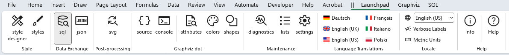
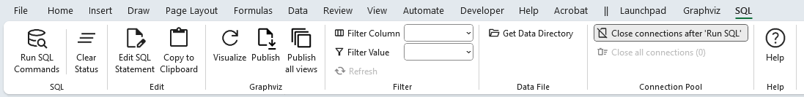
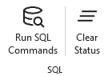
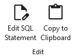
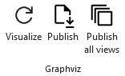
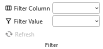
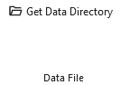
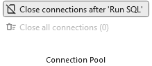
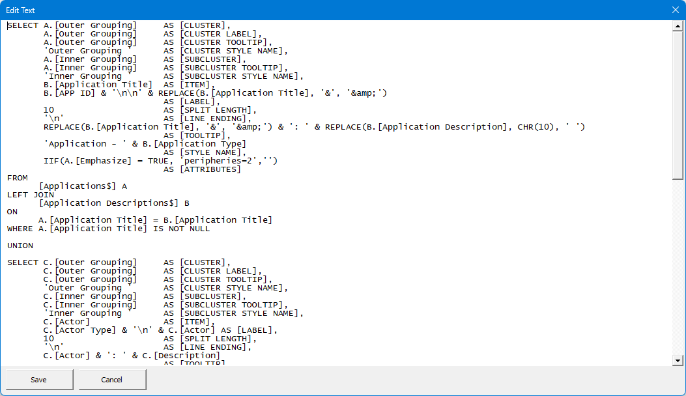

# Using SQL

Unlock the power of SQL to extract and visualize data from your Excel spreadsheets with Relationship Visualizer. This optional feature<sup>[1]</sup> lets you write SQL queries to pull data from multiple worksheets and generate Graphviz graphs with ease.

Ideal for users familiar with SQL, it provides a fast and flexible way to:

- Combine data from multiple Excel worksheets using SQL queries  
- Batch‑process queries to aggregate information across several workbooks  
- Streamline repetitive data‑preparation and transformation tasks

::: tip SQL Topics

<!-- no toc -->
- [What is SQL?](#what-is-sql)
- [Excel SQL Queries](#excel-sql-queries)
- [How to Use SQL in the Relationship Visualizer](#how-to-use-sql-in-the-relationship-visualizer)
- [The `SQL` Worksheet](#the-sql-worksheet)
- [The `SQL` Ribbon Tab](#the-sql-ribbon-tab)
- [SQL Queries for Creating Graphs](./queries/)
- [SQL Extensions](./extensions/)
  - [Grouping Data into Clusters and Subclusters](./extensions/README.md#grouping-data-into-clusters-and-subclusters)
  - [Splitting Labels](./extensions/README.md#splitting-labels)
  - [Chaining Nodes Using Edges](./extensions/README.md#chaining-nodes-using-edges)
  - [Creating Subgraphs With Rank](./extensions/README.md#creating-subgraphs-with-rank)
  - [Traversing Trees Recursively](./recursion/)
  - [Creating Organization Charts](./orgcharts/)
- [SQL syntax](./syntax/)
:::

[1]: The SQL feature is **Windows-only** and requires basic SQL knowledge. If you use macOS, you can still use Relationship Visualizer’s manual data entry options. 

## What is SQL?

**Structured Query Language (SQL)** is a domain-specific language designed for stream processing in a Relational Data Management System (RDMS). It is particularly useful in handling structured data where there are relations between different entities of the data.

SQL `SELECT` statements are designed to query data contained in a relational database. The SQL `SELECT` statement fetches data from a database, by specifying column headings, and tables from which records are to be selected, and the criteria for selection. 

`SELECT *` is used to select all columns from a table. The `FROM` clause specifies the Table from which columns are to be selected. The optional `WHERE` clause specifies the criteria for selection.

_Syntax:_
```sql
    SELECT column_name FROM table_name [WHERE clause]
```
## Excel SQL Queries

Excel can act as a flat‑file RDBMS, accessible through ActiveX Data Objects (ADO) and SQL queries. Its SQL support is provided through a dedicated Excel‑specific dialect implemented by the Jet and ACE database engines.

::: tip
See [SQL Syntax](./syntax/) for detailed information on the Excel SQL dialect.
:::

The Relationship Visualizer includes a worksheet named `sql` that abstracts away most of the complexity involved in writing ADO SQL. It lets you write SQL `SELECT` statements using ADO‑compatible syntax, while the tool automatically manages all connection details. Queries can reference either the Relationship Visualizer workbook itself or any other Excel workbook as the data source.

When a query is executed, the results are written to the `data` worksheet, where they become immediately available for graphing.

ADO supports many capabilities, but the Relationship Visualizer uses only a focused subset—specifically SQL `SELECT` queries of the form:

```sql
SELECT [Country Code] AS [Item],
       [Country Name] AS [Label]
FROM   [Countries$]
```

This is a standard SQL query—one that selects two columns from the database (which, in this context, is an Excel worksheet) and assigns names to the results that match the column names on the `data` worksheet. As with a traditional database, the query specifies the name of a table; however, Excel introduces two small differences. The worksheet name must be enclosed in square brackets, and the actual sheet name—**Countries** in this example—must have a **$** appended to it.

Square brackets are also required around column names, since Excel headers may contain spaces or special characters. Bracketing ensures ADO interprets the text as a column identifier. Quoted values cannot be used for this purpose, because quotes indicate string literals rather than column references.

### Map results to `data` worksheet columns

After the `SELECT` statement runs, the Relationship Visualizer processes the results and places the selected values into the corresponding columns of the `data` worksheet. Only recognized column names are used; all other fields are ignored. The default English column names on the `data` worksheet are:

- `[Comment]`
- `[Item]`
- `[Label]`
- `[External Label]`
- `[Tail Label]`
- `[Head Label]`
- `[Related Item]`
- `[Style Name]`
- `[Attributes]`

### String constants

Excel SQL also allows you to specify string values as selection columns. When used in a `SELECT` statement, the string is repeated for every row returned by the query. This is particularly useful for assigning constant values **such as a style name** to each row of the result set.

For example, suppose the `styles` worksheet defines a style named `Country`. You can modify the query to include this style by adding a constant string column, ensuring that every row in the output is tagged with the `Country` style:

```sql
    SELECT [Country Code] as [Item],
           [Country Name] as [Label],
           'Country'      as [Style Name]
    FROM   [Countries$]
```

### Apply search conditions

SQL allows you to specify `WHERE` conditions to control which records are returned. The `WHERE` clause defines the qualifying criteria for a query. Multiple conditions can be combined using the `AND` and `OR` operators, with optional parentheses to group expressions. Only rows that meet the specified conditions are included in the results.

For example, suppose we want a list of countries that use US Dollars as their national currency. The international code for US Dollars is `USD`, so the SQL query would be modified as follows:

```sql
    SELECT [Country Code] as [Item],
           [Country Name] as [Label],
           'Country' as [Style Name]
    FROM   [Countries$]
    WHERE  [Currency Code] = 'USD'
```

### Eliminate duplicate values

A column often contains duplicate values. To list only the unique entries, use the `SELECT DISTINCT` clause. The `DISTINCT` keyword filters the result set so that each value appears only once, even if it occurs many times in the underlying data.

For example, if the worksheet includes a column listing the continent for each country, you can retrieve a deduplicated list of continents using a query such as:

```sql
    SELECT DISTINCT [Continent] as [Item],
           [Continent]          as [Label],
           'Continent'          as [Style Name]
    FROM   [Countries$]
```

## How to Use SQL in the Relationship Visualizer

Follow these simple steps to create graphs using SQL queries in Relationship Visualizer:

### Open the `sql` Worksheet
  
In your Relationship Visualizer workbook, use the Launchpad to show the `sql` worksheet, then make the `sql` worksheet active.

|  |
| ------------------------ |

|  |
| ------------------------ |

### Write Your SQL Query

Enter a SQL `SELECT` query using ADO syntax. For example, to create nodes for countries in the world, a simple query would look as follows:  

```sql
SELECT [Country Code] as [Item],
       [Country Name] as [Label]
FROM   [Countries$]
```

Reminders:
- Use square brackets `[ ]` for column and worksheet names.
- Worksheet names end with `$` (e.g., `[Countries$]`). 

Assign column names from the data workbook to the Relationship Visualizer column names on the `data` worksheet. The default column names are:
- `[Comment]`
- `[Item]`
- `[Label]`
- `[External Label]`
- `[Tail Label]`
- `[Head Label]`
- `[Related Item]`
- `[Style Name]`
- `[Attributes]`

### Specify the Excel data file 

Data can be queried from any Excel workbook. Specify the workbook name in column C. 

If you leave column C blank the queries will try to use a workbook specified in the Ribbon. If not present there either, it default to looking for the worksheets in the Relationship Visualizer workbook.

### Run the Query

Click the `Run SQL Commands` button to execute your query. The results will populate the `data` worksheet, with status messages in column D (e.g., **SUCCESS**).


### Visualize the Graph

Press the `Refresh` button to generate your Graphviz visualization based on the query results.

## The `SQL` Worksheet

The `sql` worksheet is the worksheet you will write and execute queries to pull data from another Excel workbook. 

Before we run any SQL, lets gain an understanding of the mandatory and optional columns on this worksheet.

The `data` Worksheet has 4 columns (A-D):

| A | B | C | D |
|---|---|---|---|
| [Indicator](./README.md#indicator) | [SQL SELECT Statement](./README.md#sql-select-statement) | [Excel data file](./README.md#excel-data-file) |[Status](./README.md#status) |

### Indicator

The `Indicator` column is used to draw special attention to a row.
- A `#` hash character treats the row as a comment. The text in the row will turn gray, and this row will be skipped when running the SQL. 
- An `!` exclamation mark character will appear if errors are detected in your data on this row. The Status will turn red, and an error message will be displayed in the [Status](./README.md#status) column.

### SQL SELECT Statement

This column is where the SQL Statement is entered. For example:

```sql
SELECT [Country Code] as [Item],
       [Country Name] as [Label]
FROM   [Countries$]
```

### Excel data file

This column specifies the Excel file that contains the data.

- If the column is left blank, the current Relationship Visualizer workbook is used as the data source.  
- If a fully qualified filename (path + file) is provided, that file is used exactly as specified.  
- If a relative filename (file only) is provided, it is assumed to be located in the same directory as the Relationship Visualizer workbook.

### Status

The result of the SQL query. The value will be either:

- 🟩 `SUCCESS` - The query was executed successfully.  
- 🟥 `FAILURE` - The query failed. Any error message will be appended to the status value. 

  Even simple Excel SQL queries can fail for reasons that aren’t obvious at first glance. Keep an eye out for these common issues:
  - **Missing the `$` in worksheet names**  
    ADO requires worksheet names to end with a `$` (e.g., `[Countries$]`). Omitting it will cause the query to fail.

  - **'xyz' is not a valid name. Make sure that it does not include invalid characters or punctuation and that it is not too long** *(where 'xyz' is a worksheet name in your `FROM` clause)*.  

    This error usually means you have referenced a worksheet that cannot be found for one of these reasons:
    - **The worksheet name is misspelled** Verify that the name in your FROM clause exactly matches the worksheet tab name, including capitalization and spacing.
    - **The worksheet does not exist in the Relationship Visualizer workbook.** Ensure that the worksheet is present and has not been renamed or deleted.
    - **No external Excel workbook was specified as a data source.** ADO cannot resolve worksheet names unless a workbook has been specified.
    - **The wrong Excel workbook was selected as the data source.** Double‑check that the workbook you chose contains the worksheet referenced in your query.

  - **Forgetting square brackets around sheet or column names**  
    Brackets are required when names contain spaces, punctuation, or non‑alphanumeric characters.  
    Examples: `[Country Code]`, `[Sales 2024$]`.

  - **Using quotes instead of brackets for identifiers**  
    `"Country Code"` is treated as a string literal, not a column reference. Always use `[Country Code]`.

  - **Header row not in row 1**  
    ADO expects column headers in the first row of the worksheet. If your data starts lower, the query may return no rows or incorrect results.

  - **Mixed data types in a column**  
    Excel may infer the wrong type (e.g., treating numeric IDs as text). This can cause filtering or comparison operations to behave unexpectedly.

  - **Sheet names that look like ranges**  
    Names such as `A1` or `R1C1` can confuse the provider. Renaming the sheet usually resolves the issue.

  - **Hidden or filtered rows**  
    ADO reads the entire sheet, including hidden rows. If you expect filtered results, you must filter them in SQL.

  - **External workbook paths not fully pathed**  
    When referencing another workbook, the full path must be provided.

- ⬜ `SKIPPED` - The row was not processed because either a comment indicator (`#`) was present in Column A, or a [Filter](#filter) was applied and the row did not meet the filter criteria. Rows can be skipped for two independent reasons:

  - Column A begins with `#`, the row is treated as a comment and is never processed.  
  - A [Filter](#filter) is active, and only rows that match the filter criteria are executed; all others are skipped.

## The `SQL` Ribbon Tab

The `SQL` ribbon tab is activated whenever the `sql` worksheet is activated. It appears as follows:



It contains the following groups, each of which is explained in the sections that follow. You may jump directly to any group using the links in this table:

| Group                               | Controls                            | Description |
| :----                               | :---                                | :---        | 
| [SQL](#sql)                         |             | The **SQL** controls let you execute the queries defined on this worksheet and manage the status information associated with each statement. |
|                                     |                                     | |
| [Edit](#edit)                       |            | Provides tools to help get around Excel's inability to display large amounts of cell text. |
|                                     |                                     | |
| [Graphviz](#graphviz)               |        | The `sql` worksheet includes several convenience buttons designed to streamline graph generation after running SQL queries. |
|                                     |                                     | |
| [Filter](#filter)                   |          | The **Filter** controls allow you to limit which rows are processed when running SQL statements.  |
|                                     |                                     | |
| [Data File](#data-file)             |        | The **Data File** controls let you point your SQL queries at external Excel workbooks. |
|                                     |                                     | |
| [Connection Pool](#connection-pool) |  | The Connection Pool group manages how ADO workbook connections are reused, opened, and closed during SQL batch execution to improve performance and control file access. |
|                                     |                                     | |
| [Help](#help)                       |            | Provides a link to the `Help` content for the `sql` worksheet (i.e. this web page). |


### SQL

|  |
| ------------------------ |

The **SQL** controls let you execute the queries defined on this worksheet and manage the status information associated with each statement.

| Label            | Control Type | Description                                                                                          |
| ---------------- | ------------ | ---------------------------------------------------------------------------------------------------- |
| Run SQL Commands | Button       | Sequentially executes all SQL statements in the worksheet and writes the results to the `data` worksheet. |
| Clear Status     | Button       | Clears all values in the **Status** column, allowing you to reset or re‑run SQL statements cleanly. |

### Edit

|  |
| -------------------------------------------------- |

Provides tools to help get around Excel's inability to display large amounts of cell text.

| Label       | Control Type  | Description                                                                                                                                                                                                                        |
| ----------- | :-----------: | ---------------------------------------------------------------------------------------------------------------------------------------------------------------------------------------------------------------------------------- |
| Edit SQL Statement | Button | Launches the [Edit Text](#the-edit-sql-statement-form) form with the contents of the currently selected cell.<br/><br/>A second location where the **Edit SQL Statement** button appears is as a floating pencil button on the right side of any selected SQL cell.&nbsp;&nbsp;&nbsp; <br/><br/>Clicking the pencil button performs the same action as selecting the **Edit SQL Statement** button in the Ribbon. |
| Copy to Clipboard | Button        | Copies the contents of the cell as straight text to the Microsoft Windows clipboard, so it can be pasted into an external editor.<br/><br/>Characters such as quotes are not escaped as would occur when using Excel's copy (Ctrl+C). |


### Graphviz

|  |
| -------------------------------------------------- |

Convenience buttons designed to streamline graph generation after running SQL queries. These controls mirror the commands on the Graphviz ribbon tab but place them closer to where SQL work is performed:

| Label             | Control Type | Description                                                                                                                                                                                                                  |
| ----------------- | ------------ | ---------------------------------------------------------------------------------------------------------------------------------------------------------------------------------------------------------------------------- |
| Visualize         | Button       | Graphs the data in the `data` worksheet and displays the results in Excel. This button mirrors the **Visualize** command on the Graphviz ribbon tab and is provided here for faster graph creation after running SQL queries. |
| Publish           | Button       | Graphs the data in the `data` worksheet and writes the output to a file using the settings on the Graphviz ribbon tab. This duplicates the **Publish** command and streamlines exporting graphs after executing SQL queries.   |
| Publish all views | Button       | Graphs the data in the `data` worksheet using all defined views and writes each graph to a file based on the Graphviz ribbon settings. This matches the Graphviz ribbon's **Publish all views** command and accelerates batch graph generation. |

### Filter

The **Filter** controls allow you to limit which rows are processed when running SQL statements. This is especially useful when working with large datasets or when you want to preview results for a specific subset of data.

|  |
| --------------------------- |

| Label         | Control Type   | Description                                                                                                                                                                                                 |
| ------------- | -------------- | ----------------------------------------------------------------------------------------------------------------------------------------------------------------------------------------------------------- |
| Filter Column | Dropdown list  | Lists column letters **E–Z**. Select the column you want to filter on.                                                                                                                                      |
| Filter Value  | Dropdown list  | Displays all unique (de‑duplicated) values found in the selected **Filter Column**. When a value is chosen, SQL statements will run **only** on rows where that column matches the selected value.          |
| Refresh       | Button         | Updates the **Filter Value** list. Use this after changing data in the selected Filter Column to ensure the dropdown reflects the latest values. 

### Data File

The **Data File** controls let you point your SQL queries at external Excel workbooks. This is especially useful when your data is stored in multiple files—such as monthly extracts, departmental exports, or versioned snapshots—and you want to run the same SQL queries against each file without rewriting anything.

|  |
| ----------------------------- |


| Label             | Control Type | Description                                                                                                      |
| ----------------- | ------------ | ---------------------------------------------------------------------------------------------------------------- |
| Get Data Directory | Button       | Opens a directory‑picker dialog. When a folder is selected, its path replaces the “Get Data Directory” label.   |
| File Name          | Dropdown list | Lists the Excel files found in the selected directory that are suitable for running Excel SQL queries against. This list is only visible when a data directory has been specified.<br/><br/><b>NOTE:</b> Entries in the file name column, and `SET DATA FILE` statements take precedence when resolving conflicts over which data source to use. |
| Reset | Button | Clears the data directory and file name selections. This button is only visible when selections have been made |

**Why would I use this?**  
Many workflows produce recurring Excel extracts—for example, one workbook per month, quarter, or reporting cycle. By selecting a directory and choosing a file from the dropdown, you can run the *same* SQL queries against each extract in turn. This makes it easy to compare periods, regenerate graphs for new data, or batch‑process multiple datasets without modifying your SQL.

### Connection Pool

|  |
| ----------------------------------- |

The **Connection Pool** group manages how ADO workbook connections are reused, opened, and closed during SQL batch execution to improve performance and control file access. 

Connection pooling was added in Version 7.0 in response to a March 2025 Office update that caused ADO connections to take over 12 seconds (previously under 4 milliseconds). See: [Excel ADO connection issue in recent Office 365 update](https://learn.microsoft.com/en-us/answers/questions/5443040/excel-ado-connection-issue-in-recent-office-365-up?forum=msoffice-all&referrer=answers)  

Workbook connections are now reused across all SQL statements during a `Run SQL Statements` batch run.  

Users can choose to close connections after batch execution or keep them open until manually closed or until the workbook exits.  

**Note:** Keeping connections open may improve performance but can prevent access to referenced workbooks.

| Label                                   | Control Type  | Description                                                                                                                                                                                                 |
| --------------------------------------- | ------------- | ----------------------------------------------------------------------------------------------------------------------------------------------------------------------------------------------------------- |
| Close connections after 'Run SQL'       | Toggle Button | Determines whether connections remain open (pooled) after running SQL statements or are closed immediately after execution.                                                                                |
| Close all connections (#)               | Button        | Displays the number of currently open connections. Enabled only when one or more connections are open. Pressing the button closes all open connections.                                                    |

::: tip When should I keep connections open?
Keeping connections open (pooled) is most beneficial when running many SQL statements in a batch, especially if each statement targets external workbooks. Reusing the same connection avoids repeated ADO initialization overhead and can dramatically improve performance.

However, if you need to open, edit, or replace any referenced workbooks, you may prefer to close connections after each run to avoid file‑locking issues.
:::

### Help

Provides a link to the `Help` content for the `sql` worksheet (i.e. this web page).

|  |
| ------------------------ |

| Label       | Control Type  | Description                                                                                                                                                                                                                        |
| ----------- | ------------- | ---------------------------------------------------------------------------------------------------------------------------------------------------------------------------------------------------------------------------------- |
| Help | Button        | Provides a link to this web page. |

## The `Edit SQL Statement` Form

Excel rows can hold a great deal of information, but cells have their quirks. Each cell can store up to 32,767 characters, yet only about 1,024 of them are visible directly in the grid without entering cell‑edit mode. For rows, the practical display limit depends on the combined content of each cell, though in reality screen size and readability become limiting factors long before Excel’s technical limits are reached. These limits get reached quickly if you like to break SQL statements down over multiple lines. In short, you can store a lot—but you may not be able to see it all at once.

To address this, Version 7 introduced an `Edit SQL Statement` form. When you press the **Edit SQL Statement** button, a modal window opens containing the full text of the currently selected cell, making it easier to view and edit long content without fighting Excel’s display constraints. 

|  |
| ----------------------------- |

Horizontal and vertical scroll bars are provided to help navigate the text. You can change the text within the form. 

Pressing the `Save` button transfers the contents from the form back to the active cell.

## Next Steps

The topics above introduce the core ways to use SQL within Relationship Visualizer. For more detailed, step‑by‑step lessons and reference material, explore the following pages:

<!-- no toc -->
- [SQL Queries for Creating Graphs](./queries/)
- [SQL Extensions](./extensions/)
  - [Grouping Data into Clusters and Subclusters](./extensions/README.md#grouping-data-into-clusters-and-subclusters)
  - [Splitting Labels](./extensions/README.md#splitting-labels)
  - [Chaining Nodes Using Edges](./extensions/README.md#chaining-nodes-using-edges)
  - [Creating Subgraphs With Rank](./extensions/README.md#creating-subgraphs-with-rank)
  - [Traversing Trees Recursively](./recursion/)
  - [Creating Organization Charts](./orgcharts/)
- [SQL Syntax](./syntax/)
---

<center>

Like this tool? [Buy me a coffee! ☕](https://www.buymeacoffee.com/exceltographviz)

</center>
