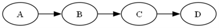

# Chain Nodes Using Edges

Chaining nodes is especially useful whenever your data represents an ordered sequence. Even a simple column of values can become a meaningful visual path once edges are created automatically. Common scenarios include:

- **Timelines:** Turning a list of dates or milestones into a left‑to‑right sequence that shows how events unfold.
- **Workflows and Processes:** Visualizing approval steps, onboarding stages, or any linear process where one step leads to the next.
- **Pipelines:** Representing ETL stages, data transformations, or processing phases in the order they occur.
- **Queues or Ordered Lists:** Showing the exact order in which tasks, tickets, or operations are handled.
- **Version Progression:** Displaying how versions evolve over time, such as `v1.0 → v1.1 → v1.2 → v2.0`.
- **Routes or Paths:** Mapping a sequence of locations, checkpoints, or waypoints into a clear path diagram.
- **Dependency Chains:** Illustrating simple “A must happen before B” relationships without needing a full dependency tree.
- **Learning or Reading Paths:** Presenting a recommended sequence of topics, lessons, or readings.

These scenarios all benefit from the automatic edge generation provided by `CREATE EDGES`, allowing you to transform a basic list into a structured, easy‑to‑read graph with minimal SQL.

Assume you have an Excel workbook with a worksheet named `Alphabet` that contains a column called `letter` with four rows of data: A, B, C, and D. Your goal is to chain these values together in sequence.
  
The following SQL creates nodes `A`, `B`, `C`, `D`:

```sql
SELECT [letter] AS [Item] from [Alphabet$]
```

The **CREATE EDGES** SQL extension automatically generates edges like `A -> B`, `B -> C`, and `C -> D`.

The SQL is specifed as follows:

```sql
SELECT DISTINCT [letter] AS [Item], 
       TRUE              AS [CREATE EDGES] 
FROM [Alphabet$]
ORDER BY [letter] ASC
```

The `DOT` source code appears as:
```
strict digraph "Relationship Visualizer"
{
    rankdir=LR;
    A -> B;
    B -> C;
    C -> D;
}
```

Producing this graph:




