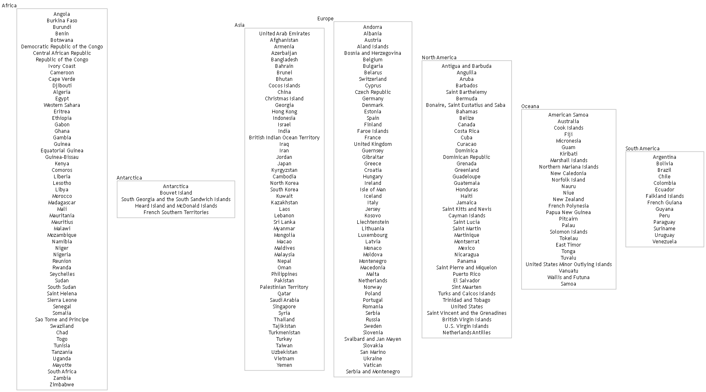
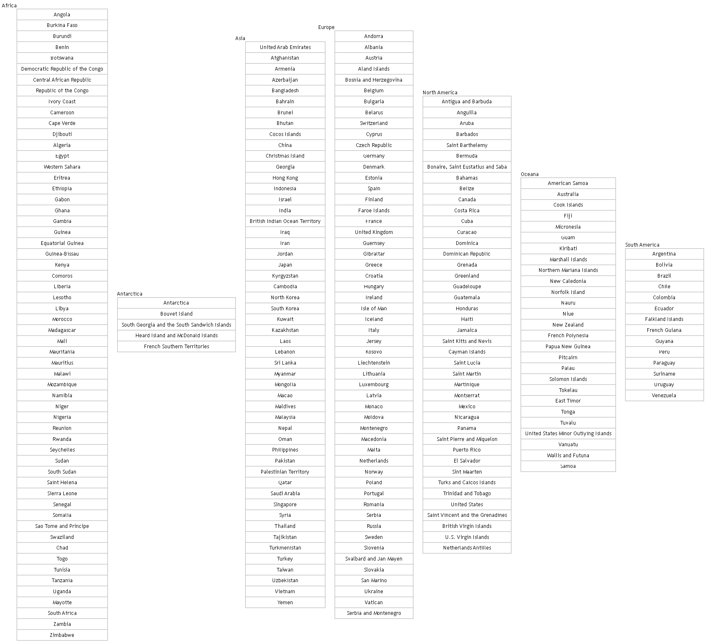

# Concatenating Records into a Single Entry

We’ve shown how iteration identifies distinct values in a dataset and then loops through those values to run a second SQL statement that generates a subgroup for each one. **Concatenation** extends this pattern by combining the iterated values into a single string that can be used directly as a node label. Instead of emitting one row per item, you can aggregate related values—such as countries in a continent, members of a team, or songs on a playlist—into a single, well‑structured label.

This example demonstrates how to add concatenation to an iteration query so that grouped data can be presented as a unified entry in your diagram.

## Country Data

There is a workbook named **countries** in the sample directory. It contains a list of all countries around the world along with their parent continent.

The data is as follows:

### "countries" Worksheet

| Country                | ContinentCode        | Continent        |
| ---------------------- | -------------------- | ---------------- |
| Andorra                | EU                   | Europe           |
| United Arab Emirates   | AS                   | Asia             |
| Afghanistan            | AS                   | Asia             |
| Antigua and Barbuda    | NA                   | North America    |
| Anguilla               | NA                   | North America    |
| Albania                | EU                   | Europe           |
| Armenia                | AS                   | Asia             |
| Angola                 | AF                   | Africa           |
| Antarctica             | AN                   | Antarctica       |
| Argentina              | SA                   | South America    |
| American Samoa         | OC                   | Oceana           |
| Austria                | EU                   | Europe           |
| Australia              | OC                   | Oceana           |
| etc. ...               | ...                  | ...              |


## Examples

The following examples illustrate two different ways to apply concatenation within an [iteration query](../iterate/), each highlighting a distinct labeling style.

### Example 1 - `Rectangle` Shape Nodes

Iteration queries are passed the 2 SQL statements using the `SQL FOR ID` and `SQL FOR DATA` mappings.

The `SQL FOR ID` query first retrieves the distinct continent codes. It then iterates through those codes, running a secondary `SQL FOR DATA` query for each one to fetch all country names associated with that continent. 

Concatenation is activated by the `TRUE AS [CONCATENATE]` value in the query. The country names get concatenated into a single node label, with each name separated by a newline (`\n`) so that every country appears on its own line within the rectangle. The concatenated value is then assigned to the `[Label]` field using the `ASSIGN TO` setting, overriding the label value that would otherwise have been returned by the `SQL FOR ID` query.

Each emitted row in the `data` worksheet represents a single continent and is styled with the `Rectangle` style, which applies `shape="rectangle"`.

``` sql 7
SELECT 
  TRUE                                                     AS [ITERATE],
  'SELECT DISTINCT [ContinentCode] AS [ID], [continent] AS [Item], [Continent] AS [External Label], [Continent] AS [Label], ''Rectangle'' AS [Style Name] FROM [countries$]' 
                                                           AS [SQL FOR ID],
  'SELECT [Country] AS [Label] FROM [countries$] WHERE [ContinentCode] = ''{ID}'' AND [ContinentCode] IS NOT NULL'                                 
                                                           AS [SQL FOR DATA],
  TRUE                                                     AS [CONCATENATE],
  'Label'                                                  AS [FIELD],
  'Label'                                                  AS [ASSIGN TO], 
  ''                                                       AS [PREFIX], 
  ''                                                       AS [SUFFIX], 
  '\n'                                                     AS [SEPARATOR]
```

Since there are seven global continents, the resulting diagram contains seven rectangle‑shaped nodes—one for each continent—each displaying its list of countries on separate lines. This produces a clear, vertically structured layout that makes it easy to compare continents at a glance:



### Example 2 - `Record` Shape Nodes

The `SQL FOR ID` query first retrieves the distinct continent codes. It then iterates through those codes, running a secondary `SQL FOR DATA` query for each one to fetch all country names associated with that continent. Each emitted row in the `data` worksheet represents a single continent and is styled with the `Record` style, which applies `shape="record"`.

Record shapes use a simple brace‑and‑pipe syntax (`{ }` and `|`) to define multi‑row labels: the outer braces enclose the entire record, and each pipe character (`|`) separates one row (or field) from the next.

The country names are concatenated into a single record label row, separated by the pipe (`|`) character so that each name appears on its own line within the record. For this query, we pass `{` as the concatenation `PREFIX`, `|` as the `SEPARATOR`, and `}` as the `SUFFIX`, producing a properly formed record block for the label. The concatenated value is then assigned to the `[Label]` field using the `ASSIGN TO` setting, overriding the label value that would otherwise have been returned by the `SQL FOR ID` query.

``` sql
SELECT 
  TRUE                                                     AS [ITERATE],
  'SELECT DISTINCT [ContinentCode] AS [ID], [continent] AS [Item], [Continent] AS [External Label], [Continent] AS [Label], ''Record'' AS [Style Name] FROM [countries$]' 
                                                           AS [SQL FOR ID],
  'SELECT [Country] AS [Label] FROM [countries$] WHERE [ContinentCode] = ''{ID}'' AND [ContinentCode] IS NOT NULL'                                 
                                                           AS [SQL FOR DATA],
  TRUE                                                     AS [CONCATENATE],
  'Label'                                                  AS [FIELD],
  'Label'                                                  AS [ASSIGN TO], 
  '{'                                                      AS [PREFIX], 
  '}'                                                      AS [SUFFIX], 
  '|'                                                      AS [SEPARATOR]
```

Since there are seven global continents, the resulting diagram contains seven record‑shaped nodes—one for each continent—each displaying its list of countries as separate fields within the record. Because record shapes use the brace‑and‑pipe syntax to define rows, the concatenated country names appear as distinct segments inside the `{ … }` block, producing a clean, vertically structured layout that makes it easy to compare continents at a glance:



## Summary

This sample demonstrates how concatenation can be combined with SQL iteration to produce clear, information‑rich node labels from grouped data. By aggregating multiple rows into a single formatted string, you can present complex relationships—such as countries within a continent—in a compact, visually meaningful way. Whether rendered as record shapes or simple rectangles, concatenated labels allow your diagrams to communicate structure at a glance while keeping the underlying SQL logic straightforward and reusable.

## Sample Content

The files used in these examples are contained in the `\Relationship Visualizer\samples\19 - Using SQL - Concatenation` directory in the zip file download.
