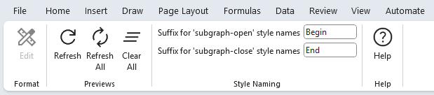
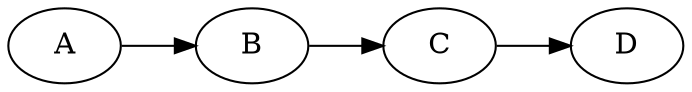
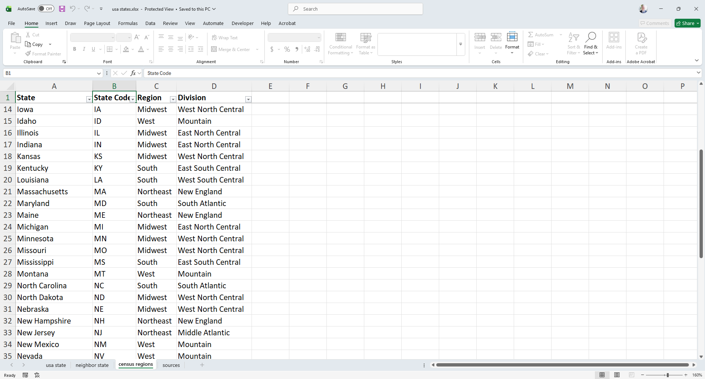
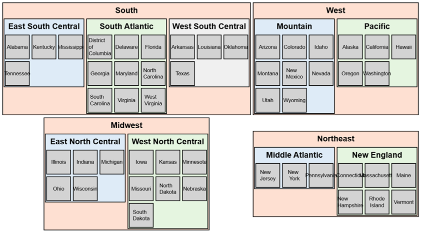

# SQL Extensions

The Relationship Visualizer SQL processing code has several extensions which simplify creating graphs.

## Grouping Data into Clusters and Subclusters

One extension adds the ability to scan SQL statements for specific field names that signal grouping values to be wrapped into a **cluster** or **subcluster** (a cluster within a cluster). The syntax remains pure SQL, but certain field names are reserved and given special meaning.

Clusters and subclusters can specify:

- A mandatory *cluster column*. The presence of this column triggers the additional processing needed to insert cluster braces into the result set.
- A **Label**, which allows you to override the label derived from the cluster column. If no label is provided, the value of the cluster column is used.
- A **Style Name**, which must correspond to a style defined on the `styles` worksheet. This can be:
  - a static string  
  - a composite string using substitution or concatenation  
  - or a column value that matches a style name  
  A common example appears in heat‑map scenarios, where values such as `Critical` and `Standard` map to styles of the same name, each with its own fill color.
- **Attributes**, which allow you to include line‑specific attribute values.
- **Tooltip**, which provides hover text in SVG output.

Although the examples below use uppercase for clarity, the implementation is case‑insensitive. Variants such as `CLUSTER`, `Cluster`, `ClUsTeR`, and `cluster` are all treated identically.

| Column                               | Cluster Field Names        | Subcluster Field Names        |
| ------------------------------------ | --------------------------- | ------------------------------ |
| *cluster column (i.e., group by)*    | `CLUSTER`                   | `SUBCLUSTER`                   |
| **Label**                            | `CLUSTER LABEL`             | `SUBCLUSTER LABEL`             |
| **Style Name**                       | `CLUSTER STYLE NAME`        | `SUBCLUSTER STYLE NAME`        |
| **Attributes**                       | `CLUSTER ATTRIBUTES`        | `SUBCLUSTER ATTRIBUTES`        |
| **Tooltip**                          | `CLUSTER TOOLTIP`           | `SUBCLUSTER TOOLTIP`           |

## Count Substitution

Several substitution strings are available for inserting count values as clusters, subclusters, and records are iterated over. Before data is written to the `data` worksheet, a find‑and‑replace operation substitutes each placeholder with the current counter value. These counters are useful for preserving sort order or for appending values to style names so each cluster or subcluster can receive a distinct style.

| Counter               | Substitution token  |
| --------------------- | :-----------------: |
| **Cluster**           |      `%clc%`        |
| **Subcluster**        |      `%scc%`        |
| **Result set record** |      `%rsc%`        |

These counts are especially helpful when you want to assign different border styles per cluster or subcluster, or when you need to emit a sort order using the `sortv` attribute. The `sortv` attribute is particularly valuable when using the [osage layout](../../terminology/README.md#osage) to create heatmaps or domain models where controlling the order of columns—or the elements within each column—is important.

For example:

```sql
SELECT
    [Continent]       AS [CLUSTER],
    [Continent]       AS [CLUSTER LABEL],
    'Continent_%clc%' AS [CLUSTER STYLE NAME],

    [Region]          AS [SUBCLUSTER],
    [Region]          AS [SUBCLUSTER LABEL],
    'Region_%scc%'    AS [SUBCLUSTER STYLE NAME],

    [Country]          AS [ITEM],
    'sortv=%rsc%'      AS [ATTRIBUTES]
FROM [Countries$]
ORDER BY [Continent], [Region], [Country]
```

This snippet illustrates:
- `%clc%` → increments once per cluster (continent)
- `%scc%` → increments once per subcluster (region)
- `%rsc%` → increments once per record in the result set

### Examples

The following examples show how the `%clc%`, `%scc%`, and `%rsc%` counters are substituted as the SQL iterates through clusters, subclusters, and individual records. These counters allow you to generate unique labels, styles, and sort orders directly from the query output.

::: tip Substitution tokens
There is nothing inherently special about the `%` characters used in the substitution strings—you can change them to any token you prefer on the [settings](../../settings/) worksheet. The only requirement is that the token be something unlikely to appear in your data. The `%` convention simply echoes the C language, where formats like `%d` represent numeric placeholders during string conversion.

**Example:**  
If you prefer more visually distinctive markers, you could change:

- `%clc%` → `<clc>`  
- `%scc%` → `@scc@`  
- `%rsc%` → `{rsc}`

Your SQL would then use these new tokens, and the substitution engine will replace them exactly the same way as the defaults.
:::

### Record, Cluster, and Subcluster Counters

| Row | Continent | Region          | Country | `%clc%` | `%scc%` | `%rsc%` | Cluster Label | Subcluster Label | Attributes |
|----:|-----------|-----------------|---------|--------:|--------:|--------:|------------------------|---------------------------|---------------------|
| 1   | Africa    | East Africa     | Kenya   | 1       | 1       | 1       | Africa               | East Africa             | sortv=1             |
| 2   | Africa    | East Africa     | Uganda  | 1       | 1       | 2       | Africa               | East Africa             | sortv=2             |
| 3   | Africa    | West Africa     | Ghana   | 1       | 2       | 3       | Africa               | West Africa             | sortv=3             |
| 4   | Europe    | Northern Europe | Sweden  | 2       | 1       | 4       | Europe               | Northern Europe         | sortv=4             |
| 5   | Europe    | Northern Europe | Norway  | 2       | 1       | 5       | Europe              | Northern Europe        | sortv=5             |

### Style Name Substitution

| Row | Continent | Region          | `%clc%` | `%scc%` | Cluster Style Name     | Subcluster Style Name |
|----:|-----------|-----------------|--------:|--------:|------------------------|---------------------------|
| 1   | Africa    | East Africa     | 1       | 1       | Continent_1            | Region_1         |
| 2   | Africa    | East Africa     | 1       | 1       | Continent_1            | Region_1         |
| 3   | Africa    | West Africa     | 1       | 2       | Continent_1            | Region_2         |
| 4   | Europe    | Northern Europe | 2       | 1       | Continent_2            | Region_1         |
| 5   | Europe    | Northern Europe | 2       | 1       | Continent_2            | Region_1         |

We would need to create 4 cluster style definitions based on these results. 

The cluster and subcluster style names will be modified at run-time to end with a begin/end suffix. The suffix values are configurable via the `Styles` ribbon tab.

|  |
| :------------------------------: |

The `Style Name` names needed are `Continent_1 Begin`, `Continent_2 Begin`, `Region_1 Begin`, `Region_2 Begin`, with matching paired style names to close the cluster, i.e. `Continent_1 End`, `Continent_2 End`, `Region_1 End`, `Region_2 End`, with matching 

Remember to include that trailing space if you are using the five pre-defined borders on the [styles](../../styles/) worksheet.

These counters are especially powerful when generating heatmaps, osage layouts, or any diagram that relies on controlled ordering or dynamic styling. By embedding `%clc%`, `%scc%`, and `%rsc%` directly into labels, style names, or attributes, you can assign unique visual treatments to each cluster or subcluster and enforce a predictable sort order. This makes it easy to highlight categories, create graded color schemes, or arrange elements consistently across multiple graph views.

## Splitting Labels

Splitting labels is helpful whenever long text needs to be broken into readable, well‑structured lines. By inserting controlled line breaks and choosing the justification for each line, you can make dense information easier to scan and visually balanced within a node. Common scenarios include:

- **Long Titles or Descriptions:** Breaking a lengthy name or description into multiple lines so it fits neatly inside a node.
- **Key–Value Formatting:** Presenting structured information such as “Name / Role / Status” on separate lines for clarity.
- **Improving Readability:** Preventing wide, stretched labels that distort node shapes or push the graph layout outward.
- **Aligning Text for Emphasis:** Using left, center, or right justification to match the visual style of your diagram or highlight certain information.
- **Displaying Metadata:** Showing attributes like IDs, timestamps, or categories on separate lines without overwhelming the main label.
- **Creating Consistent Layouts:** Ensuring that nodes with varying text lengths still appear uniform by controlling where lines break.
- **Designing Compact Diagrams:** Reducing horizontal sprawl by stacking text vertically instead of letting labels grow sideways.

These scenarios benefit from the label‑splitting capability because it gives you precise control over how text appears inside each node, resulting in cleaner, more readable, and more intentional diagrams.

A Relational Visualizer SQL extension allows you to split long strings into multi‑line labels and specify the line ending that controls whether each line is left‑, center‑, or right‑justified

| Action           | Column Name         |
| ---------------- | :-----------------: |
| **Split Length** | `SPLIT LENGTH`      |
| **Line Ending**  | `LINE ENDING`       |

To split labels add the fragment below to your SQL statement:

```sql
        '5'  as [SPLIT LENGTH], 
        '\n' as [LINE ENDING],
```

In this example, the label will be split into multiple lines at boundaries as close as possible to 12 characters. Splits occur only at spaces, so any word longer than 12 characters will remain unbroken at its full length.

Line endings can be any string<sup>[1]</sup>. The most commonly used line endings are:

| Line Ending | Meaning / Usage                           |
| :----------:|------------------------------------------ |
| `\n`        | New line with center alignment            |
| `\r`        | New line with right alignment             |
| `\l`        | New line with left alignment              |
| `\|`        | Pipe delimiter (useful for Record shapes) |
| `<br/>`     | HTML line break (for HTML‑like labels)    |

<sup>[1]</sup> New line `\n` is the default if `SPLIT LENGTH` is specified, but `LINE ENDING` is omitted.

Here is an example:

*Before:*

| This is a very long label that stretches the node |
| :-------------------------------------------: |

*After:*

| This is a very<br/>long label<br/>that stretches<br/>the node |
| :-------------------------: |


## Chaining Nodes Using Edges

Chaining nodes is especially useful whenever your data represents an ordered sequence. Even a simple column of values can become a meaningful visual path once edges are created automatically. Common scenarios include:

- **Timelines:** Turning a list of dates or milestones into a left‑to‑right sequence that shows how events unfold.
- **Workflows and Processes:** Visualizing approval steps, onboarding stages, or any linear process where one step leads to the next.
- **Pipelines:** Representing ETL stages, data transformations, or processing phases in the order they occur.
- **Queues or Ordered Lists:** Showing the exact order in which tasks, tickets, or operations are handled.
- **Version Progression:** Displaying how versions evolve over time, such as `v1.0 → v1.1 → v1.2 → v2.0`.
- **Routes or Paths:** Mapping a sequence of locations, checkpoints, or waypoints into a clear path diagram.
- **Dependency Chains:** Illustrating simple “A must happen before B” relationships without needing a full dependency tree.
- **Learning or Reading Paths:** Presenting a recommended sequence of topics, lessons, or readings.

These scenarios all benefit from the automatic edge generation provided by `CREATE EDGES`, allowing you to transform a basic list into a structured, easy‑to‑read graph with minimal SQL.

Assume you have an Excel workbook with a worksheet named `Alphabet` that contains a column called `letter` with four rows of data: A, B, C, and D. Your goal is to chain these values together in sequence.
  
The following SQL creates nodes `A`, `B`, `C`, `D`:

```sql
SELECT [letter] AS [Item] from [Alphabet$]
```

The **CREATE EDGES** SQL extension automatically generates edges like `A -> B`, `B -> C`, and `C -> D`.

The SQL is specifed as follows:

```sql
SELECT DISTINCT [letter] AS [Item], 
       TRUE              AS [CREATE EDGES] 
FROM [Alphabet$]
ORDER BY [letter] ASC
```

The `DOT` source code appears as:


Producing this graph:

|  |
| --------------------- |


## Creating Subgraphs With Rank

Ranking is useful whenever you want certain nodes to align visually in a consistent row or column. By placing nodes into a shared subgraph with a defined rank, you can control the layout and make structural relationships easier to understand. Common scenarios include:

- **Grouping Peers:** Aligning team members, departments, or sibling categories on the same horizontal level to emphasize equal standing.
- **Highlighting Stages:** Showing phases of a project or lifecycle (e.g., Planning, Execution, Review) on a single rank for clarity.
- **Organizing Layers:** Keeping all “input” nodes at the top, “processing” nodes in the middle, and “output” nodes at the bottom.
- **Comparing Alternatives:** Placing multiple options or branches side‑by‑side so users can visually compare them.
- **Clarifying Hierarchies:** Ensuring that children of the same parent appear on the same rank, preventing uneven or zig‑zag layouts.
- **Creating Swimlanes:** Using ranks to form horizontal lanes that separate categories, roles, or functional areas.
- **Stabilizing Layouts:** When Graphviz’s automatic layout shifts nodes unpredictably, explicit ranks help lock the structure into a predictable shape.

These scenarios benefit from the `CREATE RANK` extension because it gives you precise control over how nodes align, making your graphs cleaner, more readable, and more intentional.

Assume you have an Excel workbook containing a worksheet named `Alphabet` with a column heading `letter` and four rows of data: A, B, C, and D. You want all of these nodes to appear on the same rank.

The **CREATE RANK** SQL extension produces subgraphs whose nodes share the same rank.

The SQL is specifed as follows:

```sql
SELECT [letter] AS [Item], 
      TRUE      AS [CREATE RANK], 
      'same'    AS [RANK] 
FROM [Alphabet$]
```

The SQL above results in one row added to the `data` worksheet with: 
- Item = `>`
- Label = `{rank="same"; "A"; "B"; "C"; "D";}`

The values you can pair with `RANK` are `same`, `min`, `source`, `max`, and `sink`. The Graphviz `rankdir` attribute appears to treat these values as case‑sensitive, so be sure to specify them in **lowercase**.

## Combined Example

### Our Use Case

Use US census information to depict the 50 US states, grouping the states by by region of the country, and census division. State names should be in alphabetical order.

### Source Data

This is the Excel worksheet to graph:

|  |
| :---------------------------: |

### SQL Statement

This SQL statement will process the complete Use Case. It combines clusters, subclusters, split text, and count substitution.

```sql
SELECT 
  [State Code]                      as [item],       
  'Medium Square'                   as [style name],
  'sortv=%rsc%'                     as [attributes],
  [State]                           as [label],
  5                                 as [split length],
  '\l'                              as [line ending], 
  [State Code]                      as [external label],
  [State]                           as [tooltip],
  [Region]                          as [cluster],
  'Border 6 '                       as [cluster style name],
  [Region]                          as [cluster tooltip],
  'sortv=%clc% packmode=array_utr3' as [cluster attributes],
  [Division]                        as [subcluster],
  'Border %scc% '                   as [subcluster style name],
  [Division]                        as [subcluster tooltip],
  'sortv=%scc% packmode=array_utr3' as [subcluster attributes]
FROM 
  [census regions$] 
ORDER BY 
  [Region]     ASC, 
  [Division]   ASC, 
  [State Code] ASC
```

### Graph Created

This is the graph produced by the data plus the SQL query.

|  |
| :---------------------------: |

### Try it Yourself

This example is included in the samples in the Relationship Visualizer zip file in the directory `06 - Using SQL - Clusters and Subclusters`.
