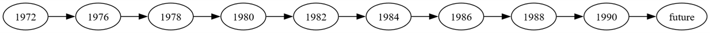
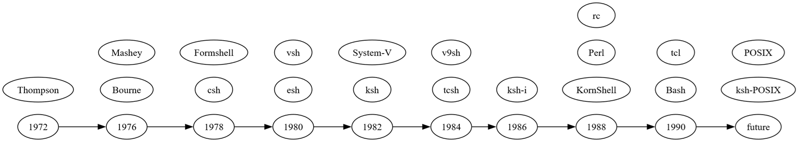
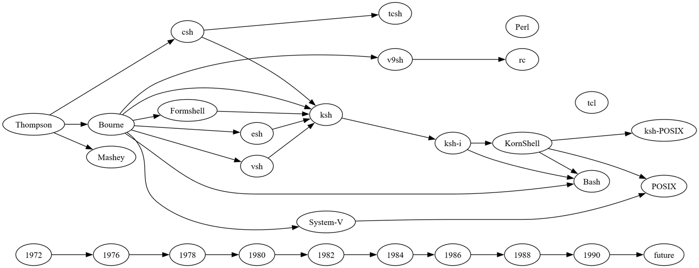
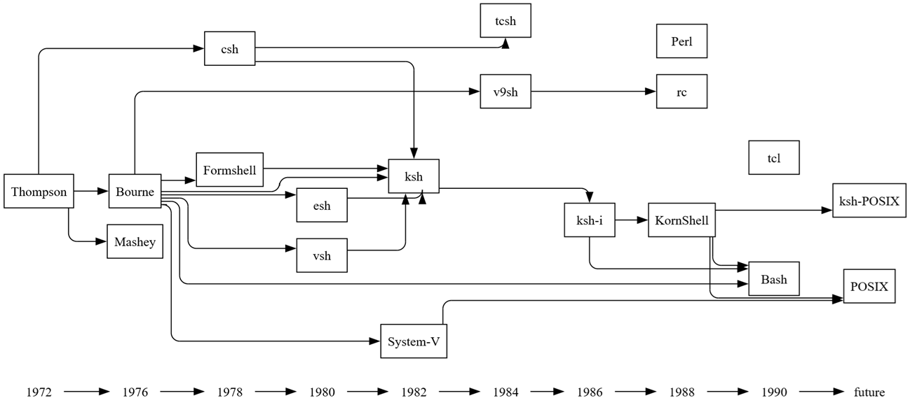

# Iteration Queries

## Introduction

*Relationship Visualizer* Version 10.0 added support for **iterative** SQL queries, allowing a query to use a result value produced by a previous query.

::: tip Iterate vs. Enumerate?

Within Relationship Visualizer, a distinction is made between **iteration** and **enumeration**:

- **Iterate** refers to stepping through each item in a result set one by one — without tracking position or count. Each item becomes input for a follow-up SQL query.

- **Enumerate** refers to iteration **with explicit tracking of position, index, or count**, using a counter that increments from a starting value to a stopping value. Enumeration is used when the logic depends on the numeric sequence itself. For example, “generate rows from 1 to 12,” “step through values by 5,” or “fill in missing years.”

:::

## Scenario

You want to build a timeline graph showing the evolution of Unix shells. Assume you have an Excel workbook with a worksheet named `shells` that contains two columns: one for the year and one for a piece of information associated with that year. In this example, each year is linked to the names of Unix shells introduced during that time. The goal is to process the data so that all shells from the same year appear on the same rank in the final visualization.

The data appears as:

| <b>Year</b> | <b>Shell</b> |
| ----------- | ------------ |
| future      | ksh-POSIX    |
| future      | POSIX        |
| 1972        | Thompson     |
| 1976        | Bourne       |
| 1976        | Mashey       |
| 1978        | Formshell    |
| 1978        | csh          |
| 1980        | esh          |
| 1980        | vsh          |
| 1982        | ksh          |
| 1982        | System-V     |
| 1984        | v9sh         |
| 1984        | tcsh         |
| 1986        | ksh-i        |
| 1988        | rc           |
| 1988        | KornShell    |
| 1988        | Perl         |
| 1990        | Bash         |
| 1990        | tcl          |

## Step By Step Guide

### Step 1 – Place all the values for a given year in a subgroup

Relationship Visualizer includes a SQL extension that lets you define subgroups directly within a query. This is useful when you want multiple items to share the same position or rank in the final diagram. In this scenario, each year may have several shells associated with it, and we want all shells from the same year to appear together.

You can create these subgroups using the `CREATE RANK` clause, shown below:

``` SQL
TRUE AS [CREATE RANK]
```

If we want to place all the shells from 1988 on the same rank, we would write the query as follows:

``` SQL
SELECT [Shell] AS [ITEM], 
       TRUE    AS [CREATE RANK], 
       'same'  AS [RANK] 
FROM  [shells$] 
WHERE [YEAR] = '1988'
```

This will insert the following subgroup into the DOT source:

``` dot
{ rank="same"; "1988"; "KornShell"; "Perl"; "rc"; }
```

### Step 2 – Get a list of unique years

The previous approach works for a single year, but we want to repeat the process for every year in the dataset without hard‑coding values into the SQL. The next step is to retrieve a list of all years, removing duplicates by using the standard `SELECT DISTINCT` command:

``` SQL
SELECT DISTINCT [Year] AS [ID] FROM [shells$]
```

| <b>ID</b> |
| ----------- |
| future      |
| 1972        |
| 1976        |
| 1978        |
| 1980        |
| 1982        |
| 1984        |
| 1986        |
| 1988        |
| 1990        |

### Step 3 – Iterate the unique years, generating a subgroup for each year

This step combines Step 2 with Step 1. For this step, we supply an additional SQL extension flag introduced in Version 10.

``` SQL
TRUE AS [ITERATE]
```

This flag tells Relationship Visualizer that the query is a special iterative query. It instructs the engine to run two SQL statements: the first generates the list of IDs, and the second is executed once for each ID in that list.

You pass the queries using the column names 
- `[SQL FOR ID]`
- `[SQL FOR DATA]`

The `[SQL FOR ID]` query producing the ID values is:

``` sql
SELECT DISTINCT [Year] AS [ID] FROM [shells$]
```

The `[SQL FOR DATA]` query to iterate the ID values is:

``` sql
SELECT [Shell] AS [ITEM], TRUE AS [CREATE RANK], ''same'' AS [RANK] FROM [shells$] WHERE [YEAR] = '{ID}'
```
Combining these into a single SQL statement looks like this. Note that because the SQL statements are being passed as strings, any string values inside the query—such as `'{ID}'`—must be escaped with doubled single quotes, like `''{ID}''`.

``` SQL
SELECT 
  'SELECT DISTINCT [Year] AS [ID] FROM [shells$]' AS [SQL FOR ID],
  'SELECT [Shell] AS [ITEM], TRUE AS [CREATE RANK], ''same'' AS [RANK] FROM [shells$] WHERE [YEAR] = ''{ID}'' ' AS [SQL FOR DATA],
  TRUE AS [ITERATE]
```

Relationship Visualizer will loop through the ID list produced by the first query. Each ID value is substituted into the second query wherever the `{ID}` placeholder appears. The modified query is then executed, and the results are written to the `data` worksheet.

Using the sample data above, this pair of SQL statements adds the following entries to the `data` worksheet:

``` dot
{ rank="same"; "Thompson"; }
{ rank="same"; "Bourne"; "Mashey"; }
{ rank="same"; "csh"; "Formshell"; }
{ rank="same"; "esh"; "vsh"; }
{ rank="same"; "ksh"; "System-V"; }
{ rank="same"; "tcsh"; "v9sh"; }
{ rank="same"; "ksh-i"; }
{ rank="same"; "KornShell"; "Perl"; "rc"; }
{ rank="same"; "Bash"; "tcl"; }
{ rank="same"; "ksh-POSIX"; "POSIX"; }
```
### Step 4 – Add the year to the subgroups

The subgroups based on year have been created, but notice that the year itself is not included. How do we know which shells belong to which years?

In SQL, the `UNION` operator functions like an “AND” that allows you to run additional queries and return the unique combined results.

The following statement can supply the year:

``` sql
SELECT [Year] AS [ITEM] WHERE [YEAR] = '{ID}'
```

`UNION` has a restriction that all SQL statements must return the same list of fields. To comply with this rule, the statement becomes:

``` sql
SELECT [Year]  AS [ITEM], TRUE AS [CREATE RANK], 'same' AS [RANK] FROM [shells$] WHERE [YEAR] = '{ID}'
```

The `UNION` is added to the statement as follows:

``` sql
SELECT 
  'SELECT DISTINCT [Year] AS [ID] FROM [shells$]' AS [SQL FOR ID],
  'SELECT [Year]  AS [ITEM], TRUE AS [CREATE RANK], ''same'' AS [RANK] FROM [shells$] WHERE [YEAR] = ''{ID}'' 
      UNION
   SELECT [Shell] AS [ITEM], TRUE AS [CREATE RANK], ''same'' AS [RANK] FROM [shells$] WHERE [YEAR] = ''{ID}'' ' AS [SQL FOR DATA],
  TRUE AS [ITERATE]
```

When the query is run, the following subgroups are produced:

``` dot
{ rank="same"; "1972"; "Thompson"; }
{ rank="same"; "1976"; "Bourne"; "Mashey"; }
{ rank="same"; "1978"; "csh"; "Formshell"; }
{ rank="same"; "1980"; "esh"; "vsh"; }
{ rank="same"; "1982"; "ksh"; "System-V"; }
{ rank="same"; "1984"; "tcsh"; "v9sh"; }
{ rank="same"; "1986"; "ksh-i"; }
{ rank="same"; "1988"; "KornShell"; "Perl"; "rc"; }
{ rank="same"; "1990"; "Bash"; "tcl"; }
{ rank="same"; "future"; "ksh-POSIX"; "POSIX"; }
```

Now the subgroups contain both the year and the shells introduced during that year.

### Step 5 – Build a timeline

Next, we want to build a timeline. For this, we use another Relationship Visualizer SQL extension.

Similar to the `CREATE RANK` keyword, there is a `CREATE EDGES` keyword, specified as:

``` sql
TRUE AS [CREATE EDGES]
```

When this query runs, it generates a set of rows in the `data` worksheet that create an edge from each item to the next. If the data contains `a`, `b`, `c`, the resulting edges will be `a` → `b` → `c`.

The single statement:

``` sql
SELECT DISTINCT [Year] AS [ITEM], 
       TRUE            AS [CREATE EDGES] 
FROM   [Shells$] 
WHERE  [Year] IS NOT NULL 
ORDER BY [Year] ASC
```

produces the following chain of edges from year to year.

|  |
| --------------------------------- |

### Step 6 – Connect the subgroups to the timeline

This step combines the SQL statements from Step 5 and Step 6. The resulting graph becomes:

|  |
| --------------------------------- |

### Step 7 – Depict relationships between items

Our data also includes a worksheet named `evolution`, which tells us which shells preceded other shells. The data looks as follows:

| <b>From Shell</b> | <b>To Shell</b> |
| ----------------- | --------------- |
| Thompson          | Bourne          |
| Thompson          | Mashey          |
| Thompson          | csh             |
| Bourne            | v9sh            |
| Bourne            | ksh             |
| Bourne            | esh             |
| Bourne            | vsh             |
| Bourne            | Formshell       |
| Bourne            | Bash            |
| Bourne            | System-V        |
| Formshell         | ksh             |
| csh               | ksh             |
| ksh               | ksh-i           |
| csh               | tcsh            |
| System-V          | POSIX           |
| v9sh              | rc              |
| KornShell         | ksh-POSIX       |
| KornShell         | POSIX           |
| KornShell         | Bash            |
| esh               | ksh             |
| vsh               | ksh             |
| ksh-i             | KornShell       |
| ksh-i             | Bash            |

It is a simple change to add the following SQL statement:

``` sql
SELECT [From Shell] AS [ITEM], 
       [To Shell]   AS [RELATED ITEM] 
FROM   [evolution$]

```

which changes the graph to:

|  |
| -------------------------- |

### Step 8 – Add style and adjust layout

The last step is to create styles and apply them to the nodes and edges. This is standard Relationship Visualizer work, so it won’t be detailed here. Refer to the sample spreadsheet if you’d like to explore the styling options.

The fully styled graph becomes:

|  |
| ------------------------- |

## Try it Yourself

This example is included in the samples in the Relationship Visualizer zip file in the directory `16 - Using SQL - Iteration`.

---

<center>

Like this tool? [Buy me a coffee! ☕](https://www.buymeacoffee.com/exceltographviz)

</center>


