# Using SQL - Organization Charts

## Introduction

*Relationship Visualizer* Version 7.2 added support for recursive SQL queries, enabling the creation of hierarchies such as organization charts. 

The candidate dataset should include the following key columns which define relationships, allowing hierarchical traversal.
  - A parent node.
  - A child node. 

A recursive query consists of 2 parts:
1. *Anchor the Base Case*: Define the starting point for recursion (e.g., the top-level parent in the hierarchy, like the CEO).
2. *Define the Recursive Member*: Specify how to recursively join results back to the table to construct subsequent levels.

Four new keywords have been defined to enable recursive queries:
- `TREE QUERY` - Passed as a literal string, the presence of `TREE QUERY` in the SQL result set tells the SQL engine to execute the associated SQL recursively. 

    The SQL **must** contain the symbolic value `''{WHERE VALUE}''` which will be replaced as each node is traversed with the value of the current node.

    Note that since `TREE QUERY` is passed as a literal string, any strings in the SQL which would normally be specified with `'` delimiters must be escaped as `''`.

- `WHERE VALUE` provides the value which anchors the base case. For example, in an organization chart it could be the ID of the CEO. For a subway line, it could be the starting subway station.

- `WHERE COLUMN` - Specifies the name of the column which defines the recursive member. It is the name of the column containing the value which should be searched next. For example, in an organization chart it could be column name of the column containing the ID of the employee's manager.

- `MAX DEPTH` - Specifies an **optional** integer value which specifies the maximum number of branches preceding, or following the node specified by `WHERE VALUE`. For example, `3 AS [MAX DEPTH]` says to constrain the search to 3 edge ranks which follow a node , or 3 edge ranks which precede a node , depending upon the direction of the search.

## Scenario

You want to create an organization chart of the Executive Branch of the the United States government. (No politics intended, AI was used to create a sample data set). 

Assume you have an Excel workbook with a worksheet named `US Executive Branch` containing information such as Name, Title, Department, and who reports to who. The data appears as:

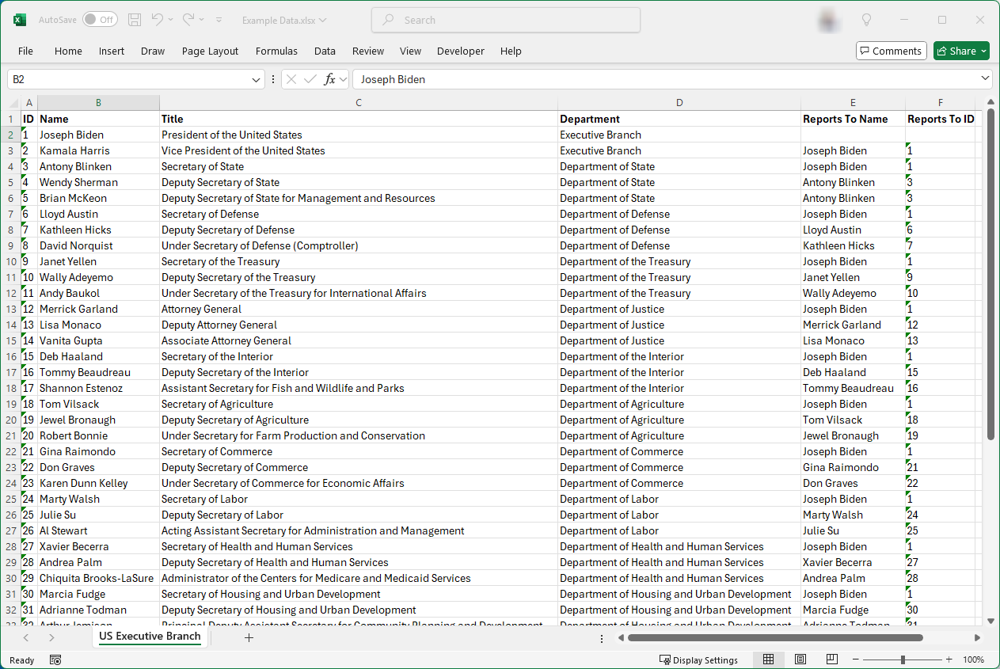

## Standard Query

The traditional way to graph this data was to use a query such as:

``` sql
SELECT [Reports To ID] AS [ITEM],    [ID]        AS [RELATED ITEM], 
       [Department]    AS [CLUSTER], 'Border 2 ' AS [CLUSTER STYLE NAME]
FROM   [US Executive Branch$]
```

which relates the `Reports To ID` to the `ID`, and clusters the nodes by Department, using the `Border 2` style on the `styles` worksheet. 

Running the SQL produces the following (undirected) graph:

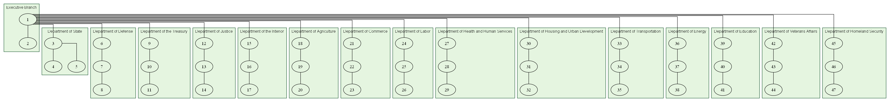

The issue with this approach is that it graphs the entire organization. For instance, if you only want to graph the department heads, there isn't a specific column in the data to filter by.

## Tree Query

### Max Depth

A tree query which specifies a `Max Depth` will allow us to extract just the department heads from the full organization.

We write the Tree Query as follows:

``` sql
SELECT 
  'SELECT [ID], [Reports To ID] AS [ITEM],    [ID] AS [RELATED ITEM], 
                [Department]    AS [CLUSTER], ''Border 2 '' AS [CLUSTER STYLE NAME]
          FROM [US Executive Branch$] WHERE [Reports To ID] = ''{WHERE VALUE}''' 
       AS [TREE QUERY], 
  '1'  AS [WHERE VALUE], 
  'ID' AS [WHERE COLUMN],
  1    AS [MAX DEPTH]
```

### Where Value

In  this query we are using `ID = 1` (*President of the United States*), and a `Max Depth = 1`. The graph changes to:

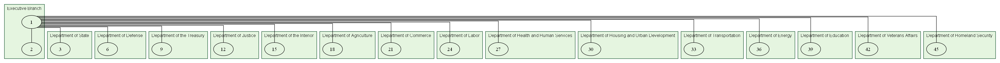

If we change the `Max Depth` to `2`, the graph changes to:

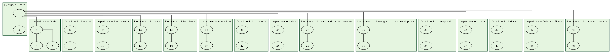

Likewise we can choose the `ID` of department head and obtain the organzation chart for a single department. `15` is the `ID` for the head of the *Department of the Interior*. If we change the `WHERE VALUE` in query to `15`, and `MAX DEPTH` to `2`, the query becomes:

``` sql
SELECT 
  'SELECT [ID], [Reports To ID] AS [ITEM],    [ID] AS [RELATED ITEM], 
                [Department]    AS [CLUSTER], ''Border 2 '' AS [CLUSTER STYLE NAME]
          FROM [US Executive Branch$] WHERE [Reports To ID] = ''{WHERE VALUE}''' 
       AS [TREE QUERY], 
  '15' AS [WHERE VALUE], 
  'ID' AS [WHERE COLUMN],
  2    AS [MAX DEPTH]
```

and the graph changes to:

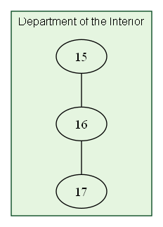

## Styling the Nodes

### Named Styles

The tree structure has been determined, now we want to create styled nodes with department detail. 

The first step is to create a style definition on the `styles` worksheet. We use the `style designer` tab to create a style named `Department` which appears as follows:

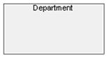

### Label Text Format

We would also like the name of the department head to appear in bold text, and the job title to appear as normal text on its own line, separated by a blank line. Graphviz supports HTML-like labels which can be used. The HTML-like label needs to follow the pattern 

`<<b>Name</b><BR/><BR/>Title>`

for example:

`<<b>Deb Haaland</b><BR/><BR/>Secretary of the Interior>`

### Label Line Splits

We are also concerned about the length of the names or titles being larger than the width of the rectangle we have defined. The Relationship Visualizer SQL interpreter has features which allow you to split text at the nearest blank character after a specified length, and a feature to allow you to specify a string at the point the the split.

In the SQL we can specify 
- `'25' AS [SPLIT LENGTH]` to split each line in the label as close as possible to the 25th position
-  `'<BR/>' [AS LINE ENDING]` as the line ending of each break in the string. The label is HTML-like, so we use an HTML break representation `<BR/>`. 

    **FYI**, if we were using plain-text labels the line ending choices would be `\l` for left justied breaks, `\n` for centered breaks, or `\r` for right-justified breaks. If we were using a Graphviz `record` shape the line ending could be `|`. You have complete flexibility to insert any text at the point of a split in the text.

The label will be emitted to fit within the rectangle, as follows:

`<<b>Deb Haaland</b><BR/><BR/>Secretary of the<BR/>Interior>`

## Writing the Node Query

Our first query traverses the tree and writes the `Item` is related to `Related Item` edge relationships. We now repeat the query to traverse the tree a second time, but we will only output information specific to the nodes.

The Node query is specified as:

``` sql 
SELECT 
      'SELECT [ID] AS [ID], 
              [ID] AS [ITEM], 
              ''<<b>'' & [Name] & ''</b><br/><br/>'' & [Title] & ''>'' AS [LABEL], 
              ''25''         AS [SPLIT LENGTH],
              ''<BR/>''      AS [LINE ENDING],
              ''Department'' AS [STYLE NAME]
       FROM   [US Executive Branch$] 
       WHERE  [Reports To ID] = ''{WHERE VALUE}''' 
                    AS [TREE QUERY], 
      '15'  AS [WHERE VALUE], 
      'ID' AS [WHERE COLUMN],
      2 AS [MAX DEPTH],

      [ID] AS [ITEM], 
      '<<b>' & [Name] & '</b><br/><br/>' & [Title] & '>' AS [LABEL], 
      '25'         AS [SPLIT LENGTH],
      '<BR/>'      AS [LINE ENDING],
      'Department' AS [STYLE NAME]
FROM  [US Executive Branch$] 
WHERE [ID] = '15'
```

where the label is specified as

``` sql
              ''<<b>'' & [Name] & ''</b><br/><br/>'' & [Title] & ''>'' AS [LABEL], 
```

to concatenate column values with literal strings to create the HTML-like label described above.

The line splitting is specified as:

``` sql
              ''25''         AS [SPLIT LENGTH],
              ''<BR/>''      AS [LINE ENDING],
```

The Node style is specified as:

``` sql
              ''Department'' AS [STYLE NAME]
```

One additional thing you **must** notice is that this syntax repeats as:

``` sql
      [ID] AS [ITEM], 
      '<<b>' & [Name] & '</b><br/><br/>' & [Title] & '>' AS [LABEL], 
      '25'         AS [SPLIT LENGTH],
      '<BR/>'      AS [LINE ENDING],
      'Department' AS [STYLE NAME]
```

The reason for this repeated syntax is related to the dual-query nature of a recursive tree query. At the beginning of this document, the concept of *Anchoring the Base Case* is discussed. This syntax outputs the node information for the base case (in this example, `ID = 25`). To create a complete organization chart, we must output the node information for the base case and for each branch of the tree as it is traversed.

**Important:** Pay very close attention to how literal strings are represented in the *Base Case* query, and the *Recursive Member Case* query to avoid SQL syntax errors.

- The *Base Case* query uses 1 single quote to denote a string.

    ``` sql
    '<<b>' & [Name] & '</b><br/><br/>' & [Title] & '>' AS [LABEL], 
    '25'         AS [SPLIT LENGTH],
    ```

- The *Recursive Member* query uses 2 single quotes to denote a string within the `TREE QUERY` string (i.e. strings within a string require 2 single quotes).

    ``` sql
    ''<<b>'' & [Name] & ''</b><br/><br/>'' & [Title] & ''>'' AS [LABEL], 
    ''25''         AS [SPLIT LENGTH],
    ```

When we run the query, the nodes are output as:

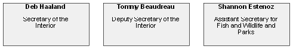

### Combining the Edges and Nodes

Now it just a matter of running both SQL statements to combine the edges and nodes. 

``` sql
SELECT 
  'SELECT [ID], [Reports To ID] AS [ITEM],    [ID] AS [RELATED ITEM], 
                [Department]    AS [CLUSTER], ''Border 2 '' AS [CLUSTER STYLE NAME]
          FROM [US Executive Branch$] WHERE [Reports To ID] = ''{WHERE VALUE}''' 
       AS [TREE QUERY], 
  '15' AS [WHERE VALUE], 
  'ID' AS [WHERE COLUMN],
  2    AS [MAX DEPTH]

SELECT 
      'SELECT [ID] AS [ID], 
              [ID] AS [ITEM], 
              ''<<b>'' & [Name] & ''</b><br/><br/>'' & [Title] & ''>'' AS [LABEL], 
              ''25''         AS [SPLIT LENGTH],
              ''<BR/>''      AS [LINE ENDING],
              ''Department'' AS [STYLE NAME]
       FROM   [US Executive Branch$] 
       WHERE  [Reports To ID] = ''{WHERE VALUE}''' 
                    AS [TREE QUERY], 
      '15'  AS [WHERE VALUE], 
      'ID' AS [WHERE COLUMN],
      2 AS [MAX DEPTH],

      [ID] AS [ITEM], 
      '<<b>' & [Name] & '</b><br/><br/>' & [Title] & '>' AS [LABEL], 
      '25'         AS [SPLIT LENGTH],
      '<BR/>'      AS [LINE ENDING],
      'Department' AS [STYLE NAME]
FROM  [US Executive Branch$] 
WHERE [ID] = '15'  
```

The organization chart for the *Department of the Interior* `ID=15` appears as:

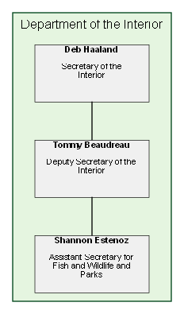

Running the queries starting with the *President of the United States* (`ID=1`) and `Max Depth = 1` shows the Presidents cabinet.

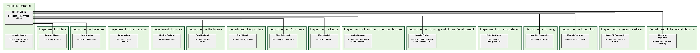

with `Max Depth = 2` we see the Secretaries and Deputy Secretaries

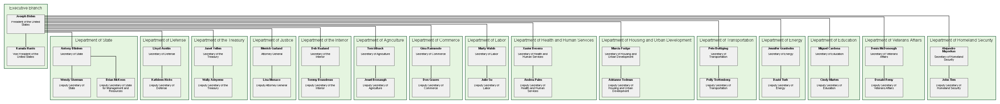

Specifying `Max Depth = 0` removes the depth limit, and we get the full organization chart.

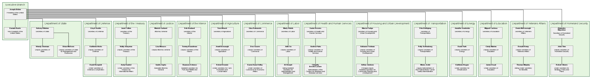

## Sample Content

The files used in these examples are contained in the `\Relationship Visualizer\samples\13 - Using SQL - Organization Charts` directory in the zip file download.


