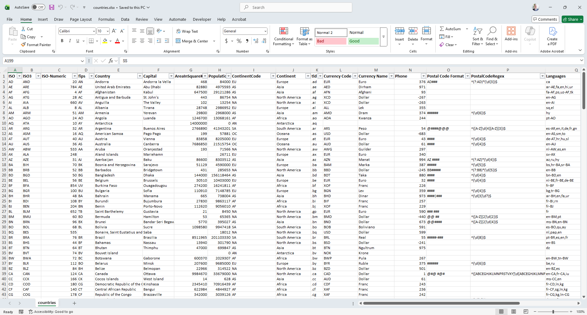
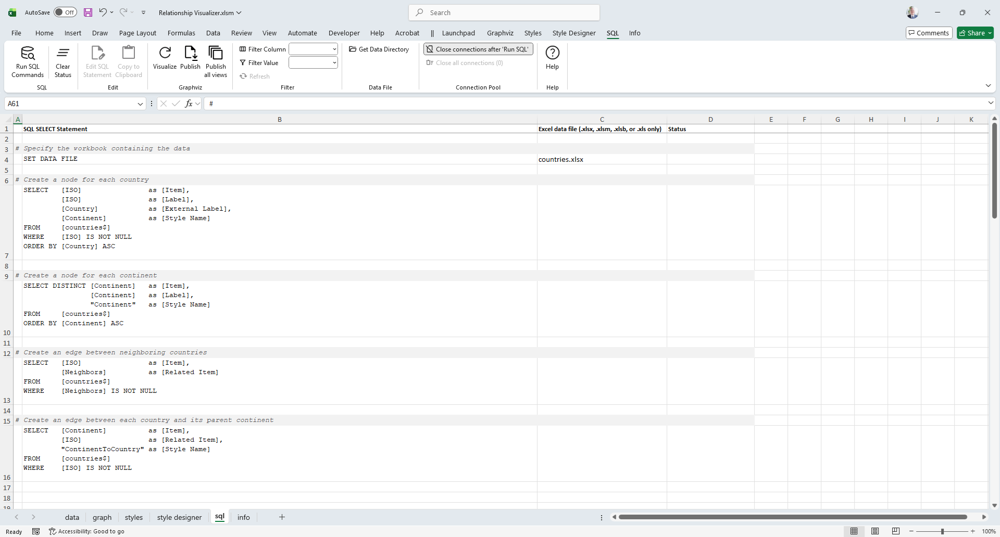
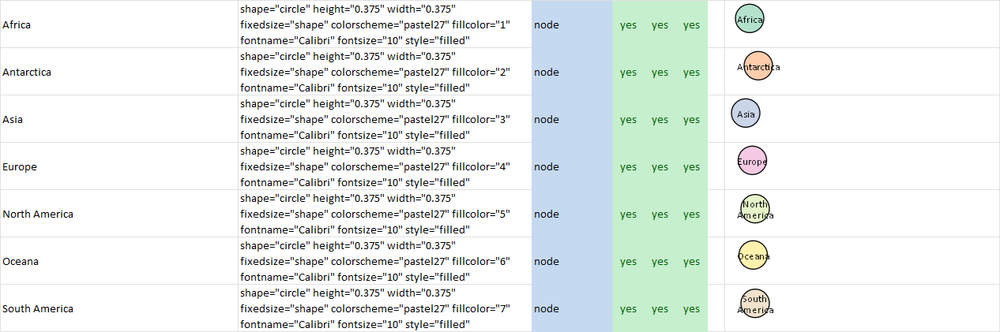
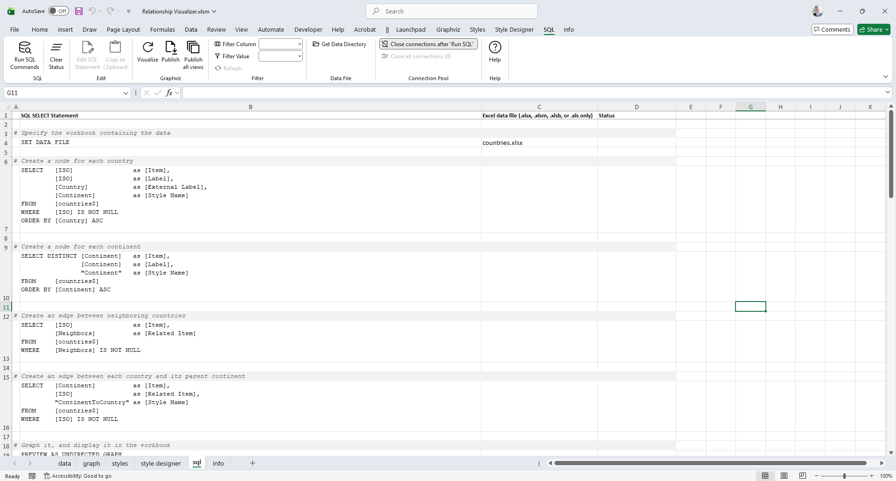
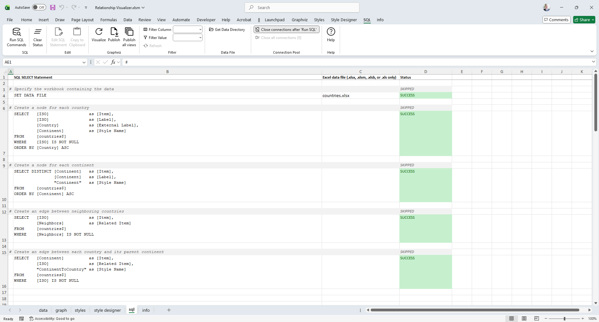
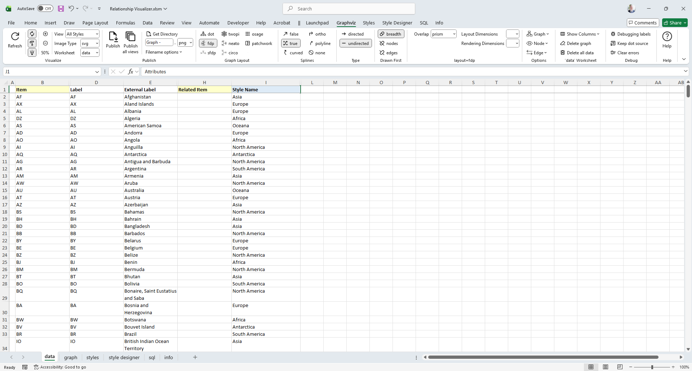
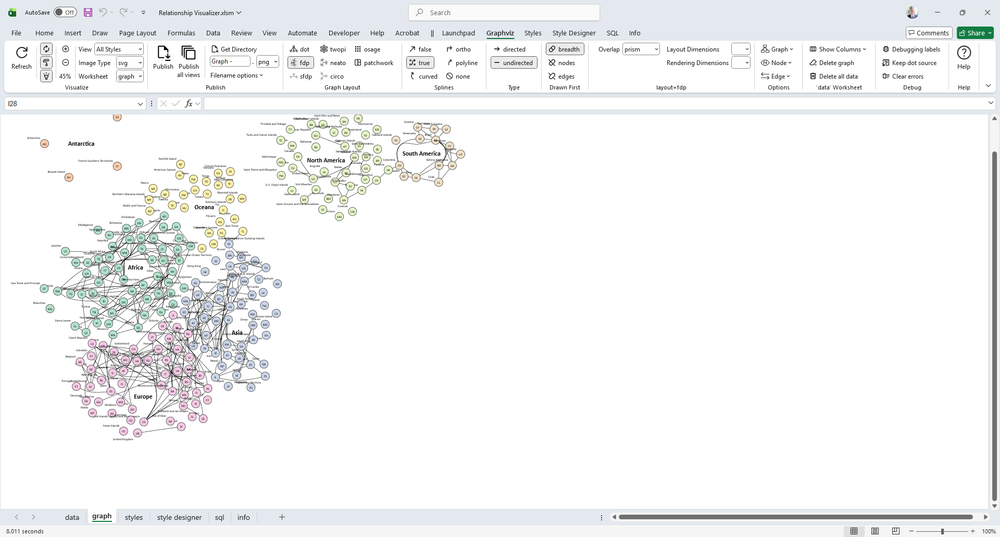

# SQL to Graph Example

The easiest way to learn SQL‑driven graph generation is by example. The `15 - Using SQL - World Map` sample in the `samples` folder will guide our walkthrough of the `sql` worksheet.

Our goal is to create a logical world map by graphing each country, linking it to its continent, and assigning a distinct color to every continent.

The `SQL - World Map` directory contains:

- A copy of the Relationship Visualizer workbook with SQL statements already defined  
- Preconfigured styles on the `styles` worksheet  
- A `countries.xlsx` workbook containing the data we will query  

An example of the `countries` workbook appears as follows:




## Style Elements

If we file on the `Continent` column we see there are 7 continents.



Using the [Style Designer](../../designer/) we create a unique style for each country by assigning different Fill Colors. The styles are stored on the [styles](../../styles/) worksheet using the Continent Name as the Style Name.

This snipped from the `styles` worksheet shows the 7 node style definitions which correspond to the continent names.



## Building the SQL Queries and Directives

Next, open `Relationship Visualizer.xlsm` workbook. From the Launchpad ribbon tab select `SQL`. 


The `sql` worksheet will appear. You’ll rows containing SQL statements, and some additional directives which. These queries extract values from the `countries` workbook and are used to generate a graph showing continents, countries, and their shared borders.

The `sql` worksheet appears as follows:



### Specify the Data Source

The first directive statement on row 4 is `SET DATA FILE`. It informs the Relationship Visualizer to use the file specified in column C (`countries.xlsx`) to be the default data source.

### Create the Country Nodes

The first SQL statement on row 7 selects the column `ISO` to represent the `Item`, as well as the node `label`. The `Country` name is selected to be an `External Label`, and the `Continent` name is selected to be the `Style Name`. 

The SQL is written as follows:

```sql
SELECT [ISO]       as [Item],
       [ISO]       as [Label],
       [Country]   as [External Label],
       [Continent] as [Style Name]
FROM  [countries$]
WHERE [ISO] IS NOT NULL
ORDER BY [Country] ASC
```

### Create the Continent Nodes

The second SQL statement on row 10 will extract the 7 seven unique continent names from the list of countries by using the `DISTINCT` clause. The `Continent` name will be used as the `Item ID` as well as the node `label`. A `Style Name` of **Continent** will be used for all the rows.

The SQL is written as follows:

```sql
SELECT DISTINCT [Continent] as [Item],
                [Continent] as [Label],
                'Continent' as [Style Name]
FROM [countries$]
ORDER BY [Continent]
```

### Create the Country-to-Country Edges

The third SQL statement on row 13 creates edge relationship rows by selecting the ISO value as the `Item ID`, and the `Neighbors` column as the `Related Item` value. The `Neighbors` column in the source worksheet contains comma-delimited `ISO` values which are neighboring countries to that row. The Relationship Visualizer has built-in logic to expand the comma-delimited list into multiple relationships. No style name is provided, so the default edge style will be used. Note that on the `WHERE` clause the directive `IS NOT NULL` has been added. This clause causes the query to skip rows with empty cells, as there are no values with which to express relationships.

The SQL is written as follows:

```sql
SELECT [ISO]       as [Item],
       [Neighbors] as [Related Item]
FROM   [countries$]
WHERE [Neighbors] IS NOT NULL
```

### Create the Continent-to-Country Edges

The fourth SQL statement on row 16 is used to group countries by continent. It creates edge relationships by placing the Continent name as the `Item ID`, and the ISO country code in the `Related Item` column. The `Style Name` is specified as **ContinentToCountry** which has been defined as an invisible edge.

The SQL is written as follows:

```sql
SELECT [Continent]          as [Item],
       [ISO]                as [Related Item],
       'ContinentToCountry' as [Style Name]
FROM [countries$]
WHERE [ISO] IS NOT NULL
```

### Run the SQL Queries

At this point our queries are complete. Press the `Run SQL Commands` button.


The SQL commands are run in sequence from top to bottom. Results are written to the `data` worksheet, and the query result status is displayed in column D such as:



If we switch worksheets to the `data` worksheet, it appears as follows:



The data is all present and in the appropriate columns for graphing. In this example **678 rows of data have been created using 4 SQL statements!** 

### Graph the Data

Press the `Refresh` button to graph the data. Since this is a large data set, be prepared to wait a little while for the results.

When Graphviz completes its work, you should see a logical world graph which appears as follows :



*Options used: Worksheet = `graph`, Zoom = 45%, layout=fdp, splines=true, graphtype=undirected.*

In a few short minutes we have gone from tabular Excel data to a graph visualization.

