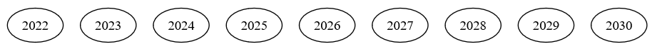
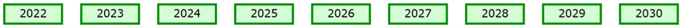
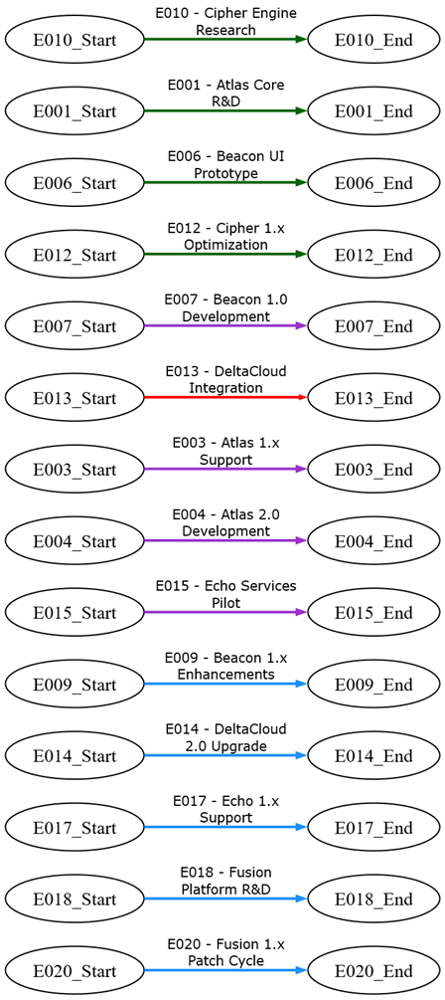
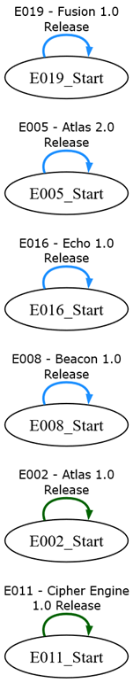
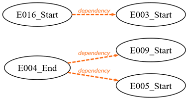
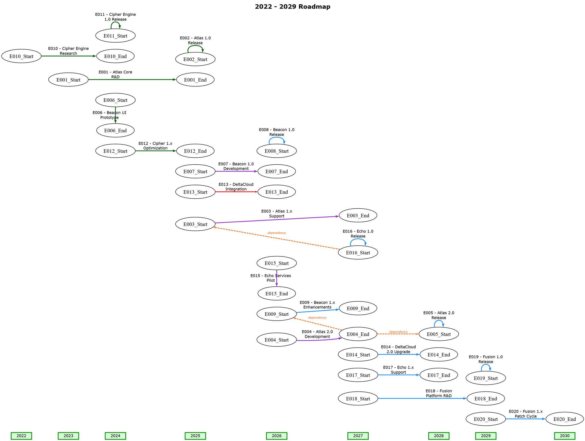
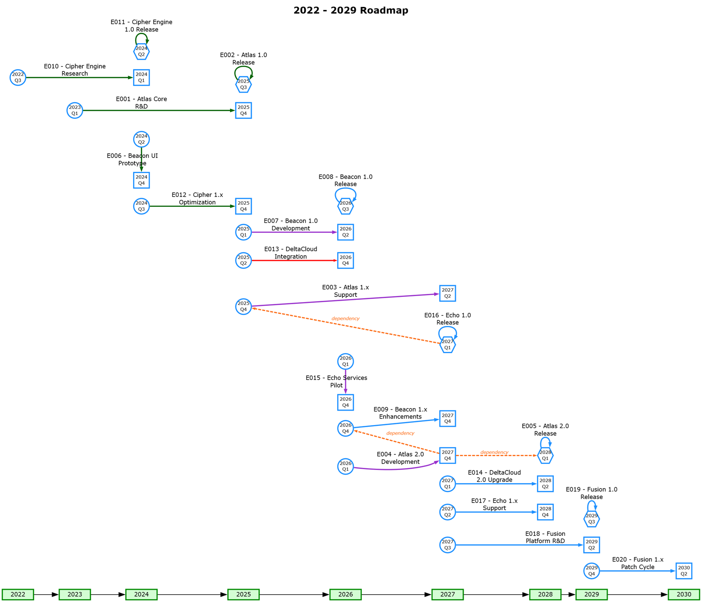

# Combining Iteration and Enumeration

## Introduction

The previous examples focused on [iteration](../iterate/README.md) (processing what already exists in the data) and [enumeration](../enumerate/README.md) (sequentially generating what should exist). A roadmap requires both. Real‑world timelines rarely contain perfectly aligned events: some years have many activities, others have none, and events may span multiple quarters or depend on one another. To visualize this cleanly, Relationship Visualizer must combine synthetic structure with data‑driven detail.

This example demonstrates how to build a complete roadmap by layering enumerated year scaffolding, iterative subgrouping, event‑to‑event edges, and dependency relationships into a single coherent diagram.

## Timeline Data

Timeline events and dependencies are tracked in two worksheets. The data is as follows:

### "timeline" Worksheet

This timeline is composed of a set of 20 hypothetical events which are tracked to a year and quarter where they begin or end.

| EventID | EventName                 | StartYear | StartQuarter | EndYear | EndQuarter |     Status      |
| :-----: | ------------------------- | :-------: | :----------: | :-----: | :--------: | :-------------: |
|  E001   | Atlas Core R&amp;D        |   2023    |      Q1      |  2025   |     Q4     |    Completed    |
|  E002   | Atlas 1.0 Release         |   2025    |      Q3      |  2025   |     Q3     |    Completed    |
|  E003   | Atlas 1.x Support         |   2025    |      Q4      |  2027   |     Q2     |   On Schedule   |
|  E004   | Atlas 2.0 Development     |   2026    |      Q1      |  2027   |     Q4     |   On Schedule   |
|  E005   | Atlas 2.0 Release         |   2028    |      Q1      |  2028   |     Q1     |     Planned     |
|  E006   | Beacon UI Prototype       |   2024    |      Q2      |  2024   |     Q4     |    Completed    |
|  E007   | Beacon 1.0 Development    |   2025    |      Q1      |  2026   |     Q2     |   On Schedule   |
|  E008   | Beacon 1.0 Release        |   2026    |      Q3      |  2026   |     Q3     |     Planned     |
|  E009   | Beacon 1.x Enhancements   |   2026    |      Q4      |  2027   |     Q4     |     Planned     |
|  E010   | Cipher Engine Research    |   2022    |      Q3      |  2024   |     Q1     |    Completed    |
|  E011   | Cipher Engine 1.0 Release |   2024    |      Q2      |  2024   |     Q2     |    Completed    |
|  E012   | Cipher 1.x Optimization   |   2024    |      Q3      |  2025   |     Q4     |    Completed    |
|  E013   | DeltaCloud Integration    |   2025    |      Q2      |  2026   |     Q4     | Behind Schedule |
|  E014   | DeltaCloud 2.0 Upgrade    |   2027    |      Q1      |  2028   |     Q2     |     Planned     |
|  E015   | Echo Services Pilot       |   2026    |      Q1      |  2026   |     Q4     |   On Schedule   |
|  E016   | Echo 1.0 Release          |   2027    |      Q1      |  2027   |     Q1     |     Planned     |
|  E017   | Echo 1.x Support          |   2027    |      Q2      |  2028   |     Q4     |     Planned     |
|  E018   | Fusion Platform R&amp;D   |   2027    |      Q3      |  2029   |     Q2     |     Planned     |
|  E019   | Fusion 1.0 Release        |   2029    |      Q3      |  2029   |     Q3     |     Planned     |
|  E020   | Fusion 1.x Patch Cycle    |   2029    |      Q4      |  2030   |     Q2     |     Planned     |

### "dependencies" Worksheet

 In a small number of cases the start of an event is dependent upon the finish of another event. 

| Must Complete | Before the Start Of |
| :-----------: | :-----------------: |
|     E004      |        E009         |
|     E004      |        E005         |
|     E016      |        E003         |

## Steps Taken

### Step 1 — Title the Roadmap

The roadmap begins by giving the graph a title derived from the earliest and latest years in the dataset. This ensures the diagram is self‑describing and automatically adapts as new events are added. The title is styled separately so it appears as a page‑level heading in the final visualization.

``` sql
SELECT 'graph'                                                              AS [Item], 
       CStr(MIN([StartYear])) & ' - ' & CStr(MAX([StartYear])) & ' Roadmap' AS [Label], 
       'Page Title'                                                         AS [Style Name] 
FROM   [timeline$]
```

|  |
| ---------------- |

### Step 2 — Create a Continuous Year Backbone

A roadmap must show every year in the planning horizon, not just the years that contain events. **Enumeration** is used to generate a complete numeric sequence from the minimum start year to the maximum end year. This produces a clean chain of year‑to‑year edges, filling in any gaps where no events occur.

``` sql
SELECT TRUE AS [ENUMERATE], MIN(CLng([StartYear])) AS [START AT], MAX(CLng([EndYear])) AS [STOP AT], 1 AS [STEP BY], 
       '{step}' AS [Item], 'Transparent Edge' AS [Style Name],
       TRUE AS [CREATE EDGES]
FROM   [timeline$]
WHERE  IsNumeric([StartYear])
```

These edges are styled with a **transparent** appearance so they provide structure without overwhelming the event‑level details.

|  |
| ------------------------- |

### Step 3 — Style the Year Nodes

Once the year nodes have been generated, a second **enumerated** query applies a consistent style to each one. 

``` sql
SELECT TRUE AS [ENUMERATE], MIN(CLng([StartYear])) AS [START AT], MAX(CLng([EndYear])) AS [STOP AT], 1 AS [STEP BY], 
       '{step}' AS [Item], 
       '{step}' AS [Label], 
       'Year'   AS [Style Name]
FROM   [timeline$]
WHERE  IsNumeric([StartYear])
```

This separates the visual identity of the timeline backbone from the event nodes that will be added later. Labels are applied directly from the enumerated step value, ensuring each year is clearly marked.

|  |
| -------------------------- |

### Step 4 — Connect Multi‑Quarter Events

Many events span multiple quarters or even multiple years. To represent this, the roadmap creates edges from each event’s start node to its end node. 
- These edges carry the event’s name as a label
- They use the event’s status to determine styling
- A split length of 20 characters is applied to improve readability when labels are long.

``` sql
SELECT [EventID] & '_Start'            AS [Item], 
       [EventID] & '_End'              AS [Related Item],
       [EventID] & ' - ' & [EventName] AS [Label] , 
       [Status]                        AS [Style Name], 
       20                              AS [SPLIT LENGTH]
FROM   [timeline$]
WHERE  [StartYear] IS NOT NULL 
AND    [EndYear]   IS NOT NULL
AND    [StartYear] & [StartQuarter] <> [EndYear] & [EndQuarter]
ORDER BY [StartYear]    DESC, 
         [StartQuarter] DESC
```

This produces a clear visual representation of duration: long events will stretch across the timeline, while shorter events will appear more compact.

|  |
| -------------------------- |

### Step 5 — Handle Single‑Quarter Events

Events that start and finish in the same quarter require special handling. Instead of drawing a start‑to‑end edge, the roadmap connects the event’s start node to itself. 

```sql
SELECT [EventID] & '_Start'            AS [Item], 
       [EventID] & '_Start'            AS [Related Item],
       [EventID] & ' - ' & [EventName] AS [Label] , 
       [Status]                        AS [Style Name], 
       20                              AS [SPLIT LENGTH]
FROM   [timeline$]
WHERE  [StartYear] IS NOT NULL 
AND    [EndYear]   IS NOT NULL
AND    [StartYear] & [StartQuarter] = [EndYear] & [EndQuarter]
ORDER BY [StartYear]    ASC, 
         [StartQuarter] ASC
```

This preserves the visual semantics of “this event occurs entirely at this point in time” while still allowing the event to be styled and labeled consistently.

|  |
| -------------------------- |

### Step 6 — Add Dependency Edges

Roadmaps often include dependencies: one event must finish before another can begin. These relationships are drawn by joining the dependencies worksheet to the timeline data and determining whether the dependency should originate from the event’s start or end node.

``` sql
SELECT 
    'dependency' AS [Label],
    SWITCH(
        t.[StartYear] & t.[StartQuarter] = t.[EndYear] & t.[EndQuarter],
            d.[Must Complete] & '_Start',
        True,
            d.[Must Complete] & '_End'
    ) AS [Item],
    d.[Before the Start Of] & '_Start' AS [Related Item],
    'Dependency' AS [Style Name]
FROM 
    [dependencies$]        AS d
    INNER JOIN [timeline$] AS t
        ON t.[EventID] = d.[Must Complete]
WHERE
    d.[Must Complete]       IS NOT NULL
AND d.[Before the Start Of] IS NOT NULL;
```

The resulting edges are styled distinctly so dependencies stand out from duration edges and timeline structure.

|  |
| -------------------------- |

### Step 7 — Group Events by Year Using Iteration

To keep the roadmap readable, all events belonging to the same year are placed on the same rank. This is accomplished using **iteration** and **UNION**. A normal query would place all items into a single subgroup, but iteration allows Relationship Visualizer to create one subgroup per year.

``` sql
SELECT TRUE AS [ITERATE],
  'SELECT DISTINCT [StartYear] AS [ID] FROM [timeline$]' 
  AS [SQL FOR ID],

  'SELECT TRUE AS [CREATE RANK], ''same'' AS [RANK], [StartYear]            AS [ITEM] FROM [timeline$] 
   WHERE [StartYear] = {ID} AND [StartYear] & [StartQuarter] <> [EndYear] & [EndQuarter]
      UNION
   SELECT TRUE AS [CREATE RANK], ''same'' AS [RANK], [EventID] & ''_Start'' AS [ITEM] FROM [timeline$] 
   WHERE [StartYear] = {ID} AND [StartYear] & [StartQuarter] <> [EndYear] & [EndQuarter]
      UNION
   SELECT TRUE AS [CREATE RANK], ''same'' AS [RANK], [EventID] & ''_Start''  AS [ITEM] FROM [timeline$] 
   WHERE [StartYear] = {ID} AND [StartYear] & [StartQuarter] = [EndYear] & [EndQuarter]
      UNION
   SELECT TRUE AS [CREATE RANK], ''same'' AS [RANK], [EndYear]              AS [ITEM] FROM [timeline$] 
   WHERE [EndYear]   = {ID} AND [StartYear] & [StartQuarter] <> [EndYear] & [EndQuarter]
      UNION
   SELECT TRUE AS [CREATE RANK], ''same'' AS [RANK], [EventID] & ''_End''   AS [ITEM] FROM [timeline$] 
   WHERE [EndYear] = {ID} AND  [StartYear] & [StartQuarter] <> [EndYear] & [EndQuarter]
  '
  AS [SQL FOR DATA]
```

For each year:

- The year node is added to the subgroup  
- All event start nodes for that year are added  
- All event end nodes for that year are added (when appropriate)

This ensures that events align vertically with the year in which they occur, producing a clean, structured layout.


|  |
| -------------------------- |

### Step 8 — Style the Event Nodes

Finally, the roadmap applies styles to the event start and end nodes. Events that span multiple quarters receive distinct **“Start”** (round) and **“Finish”** (square) styles, while single‑quarter events receive a unified **“Same”** (hexagon) style. 

#### Start Quarter

|  |
| -------------------------- |

``` sql
SELECT [EventID] & '_Start'                AS [Item], 
       [StartYear] & '\n' & [StartQuarter] AS [Label], 
       'Start'                             AS [Style Name] 
FROM   [timeline$]
WHERE  [StartYear] & [StartQuarter] <> [EndYear] & [EndQuarter]
```

#### End Quarter

|  |
| -------------------------- |

``` sql
SELECT [EventID] & '_End'                AS [Item], 
       [EndYear] & '\n' & [EndQuarter]   AS [Label], 
       'Finish'                          AS [Style Name] 
FROM   [timeline$] 
WHERE  [StartYear] & [StartQuarter] <> [EndYear] & [EndQuarter]
```

#### Same Quarter

|  |
| -------------------------- |

``` sql
SELECT [EventID] & '_Start'                AS [Item], 
       [StartYear] & '\n' & [StartQuarter] AS [Label],  
       'Same'                              AS [Style Name] 
FROM   [timeline$]
WHERE  [StartYear] & [StartQuarter] = [EndYear] & [EndQuarter]
```

Node labels include both the year and quarter, making it easy to see exactly when each event begins and ends.

The finished, complete roadmap appears as:

|  |
| ---------------------------- |

## Try it Yourself

This example is included in the samples in the Relationship Visualizer zip file in the directory `18 - Using SQL - Timeline`.

## Summary

This roadmap example demonstrates how iteration and enumeration work together to produce a rich, data‑driven visualization:

- Enumeration creates the continuous timeline backbone.  
- Iteration groups events by year for clean alignment.  
- Event edges show duration.  
- Dependency edges show sequencing.  
- Styling layers bring clarity and structure.

By combining these features, Relationship Visualizer turns a basic event list into a fully navigable roadmap that reveals timing, duration, dependencies, and the overall flow of work. Healthy dependencies read naturally from left to right, while problematic or mis‑aligned relationships surface instantly as right‑to‑left arrows, making potential issues easy to spot. Because all event dates live in a simple worksheet, the entire roadmap can be updated instantly—eliminating the tedious, error‑prone task of redrawing timelines by hand.

---

<center>

Like this tool? [Buy me a coffee! ☕](https://www.buymeacoffee.com/exceltographviz)

</center>
