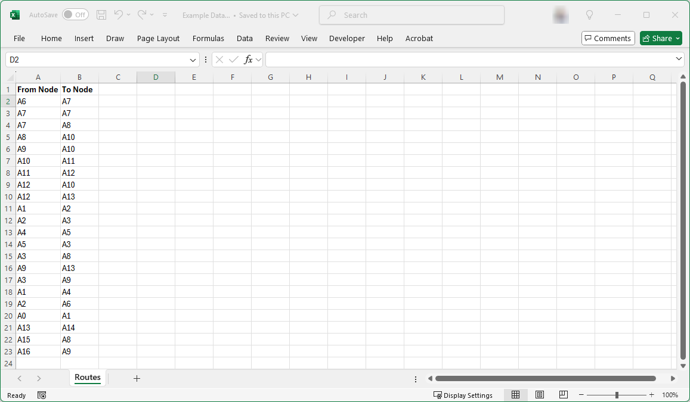
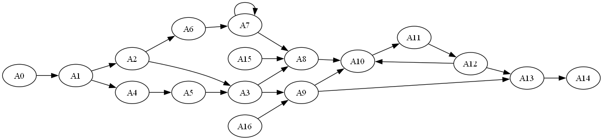
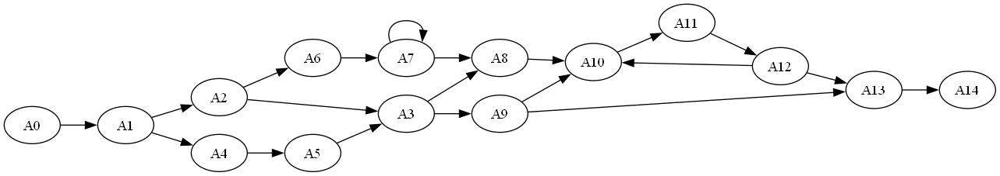
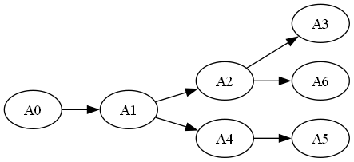
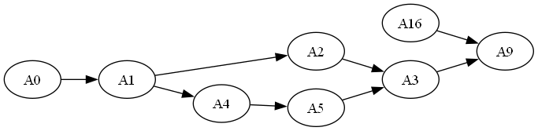
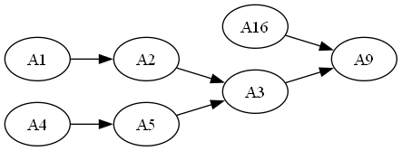
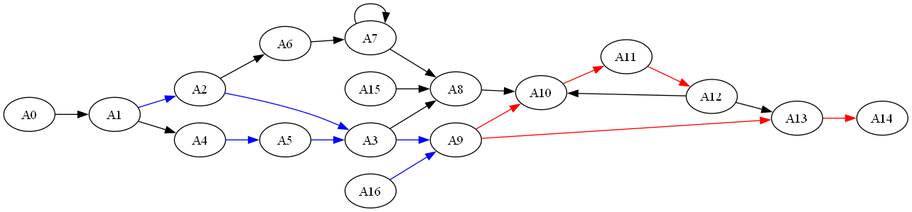

# Using SQL - Trees

## Introduction

*Relationship Visualizer* Version 7.2 added support for recursive SQL queries, enabling the creation of hierarchies such as organization charts and connected data paths. 

The candidate dataset should include the following key columns which define relationships, allowing hierarchical traversal.
  - A parent node.
  - A child node. 

A recursive query consists of 2 parts:
1. *Anchor the Base Case*: Define the starting point for recursion (e.g., the top-level parent in the hierarchy, like the CEO).
2. *Define the Recursive Member*: Specify how to recursively join results back to the table to construct subsequent levels.

Four new keywords have been defined to enable recursive queries:
- `TREE QUERY` - Passed as a literal string, the presence of `TREE QUERY` in the SQL result set tells the SQL engine to execute the associated SQL recursively. 

    The SQL **must** contain the symbolic value `''{WHERE VALUE}''` which will be replaced as each node is traversed with the value of the current node.

    Note that since `TREE QUERY` is passed as a literal string, any strings in the SQL which would normally be specified with `'` delimiters must be escaped as `''`.

- `WHERE VALUE` provides the value which anchors the base case. For example, in an organization chart it could be the ID of the CEO. For a subway line, it could be the starting subway station.

- `WHERE COLUMN` - Specifies the name of the column which defines the recursive member. It is the name of the column containing the value which should be searched next. For example, in an organization chart it could be column name of the column containing the ID of the employee's manager.

- `MAX DEPTH` - Specifies an **optional** integer value which specifies the maximum number of branches preceding, or following the node specified by `WHERE VALUE`. For example, `3 AS [MAX DEPTH]` says to constrain the search to 3 edge ranks which follow a node ([Use Case 3](./README.md#use-case-3---forward-search-from-a-node-with-max-depth)), or 3 edge ranks which precede a node ([Use Case 4](./README.md#use-case-4---backward-search-from-a-node)), depending upon the direction of the search.

## Scenario

Assume you have an Excel workbook with a worksheet named `Routes` containing 2 columns listing nodes in random order. The columns specify which node is the next node (i.e. `From Node` -> `To Node`). 

The data appears as:



## Use Case 1 - Graph Everything

The simplest way to graph this data is to use the following SQL query:

``` SQL
SELECT [From Node] AS [ITEM], [To Node] AS [RELATED ITEM] FROM [Routes$]
```



The issue with this query is that it only displays the entire graph and cannot be used to extract a subset tree. Lets resolve the issue by using a Tree Query.

## Use Case 2 - Forward Search from a Node

This recursive query specifies a **START** node. It will show all the branches which flow from node `A0`. 

``` sql
SELECT 
  'SELECT [To Node], [From Node] AS [ITEM], [To Node] AS [RELATED ITEM]
     FROM [Routes$] WHERE [From Node] = ''{WHERE VALUE}''' 
              AS [TREE QUERY], 
  'A0'        AS [WHERE VALUE], 
  'To Node'   AS [WHERE COLUMN]
```



Notice that this graph looks very similar to the graph in Use Case 1, however nodes `A15` and `A16` are not present as there are no branches originating from node `A0` which connect to `A15` or `A16`.

## Use Case 3 - Forward Search from a Node, with Max Depth

This query specifies a **START** node. It will show **up to 3 levels** of branches which flow from node `A0` (i.e. root node + 3 branches).

``` sql
SELECT 
  'SELECT [To Node], [From Node] AS [ITEM], [To Node] AS [RELATED ITEM]
     FROM [Routes$] WHERE [From Node] = ''{WHERE VALUE}''' 
              AS [TREE QUERY], 
  'A0'        AS [WHERE VALUE], 
  'To Node'   AS [WHERE COLUMN],
  3           AS [MAX DEPTH]
```



Notice that the tree stops after 3 levels of branches originating from node `A0` have been recursed.

## Use Case 4 - Backward Search from a Node

This query specifies an **END** node. It will show **all** the branches which flow to node `A9`.

Notice that this query is changed from Use Case 3 to use `[To Node]` in the base case portion of the query `WHERE [From Node] = ''{WHERE VALUE}''` and set `From Node` as the `WHERE COLUMN` as the recursive member.

``` sql
SELECT 
  'SELECT [From Node], [From Node] AS [ITEM], [To Node] AS [RELATED ITEM]
     FROM [Routes$] WHERE [To Node] = ''{WHERE VALUE}''' 
              AS [TREE QUERY], 
  'A9'        AS [WHERE VALUE], 
  'From Node' AS [WHERE COLUMN]
```



Notice in this Use Case the graph stops when node `A9` is reached. In this example node `A16` is present because it connects directly to node `A9`. Nodes `A6`, `A7`, and `A8` are not present as those routes never connect to node `A9`.

## Use Case 5 - Backward Search from a Node, with Max Depth

This query specifies an **END** node, and the `[MAX DEPTH]` parameter. It will show **up to 3 levels** of branches which precede and flow to node `A9` (i.e. 3 branches + final node).

``` sql
SELECT 
  'SELECT [From Node], [From Node] AS [ITEM], [To Node] AS [RELATED ITEM]
     FROM [Routes$] WHERE [To Node] = ''{WHERE VALUE}''' 
              AS [TREE QUERY], 
  'A9'        AS [WHERE VALUE], 
  'From Node' AS [WHERE COLUMN],
  3           AS [MAX DEPTH]
```



Notice in this Use Case that 3 levels of branches preceding node `A9` are present. The connection between node `A1` and `A4` is not present because the `MAX DEPTH` limit was reached with node `A1`, therefore `A1` was not recursed to determine its connections.

## Use Case 6 - Combining Queries to Highlight Edges

This Use Case shows how you can highlight edges in a graph by recursing nodes and applying style attributes. It combines the examples above to show the entire graph. It then shows 3 levels of routes leading to node `A9` in blue, and 3 levels of routes departing node `A9` in red.

*Note: the `strict` edge option on the `Graphviz` ribbon tab is enabled to prevent duplicate edges from being drawn.*

``` sql
-- Step 1 - Get all the routes

SELECT [From Node] AS [ITEM], [To Node] AS [RELATED ITEM] FROM [Routes$]

-- Step 2 - Recurse 3 branches of nodes which converge on node A9. 
-- Change the edge color to blue

SELECT 
  'SELECT [From Node], [From Node] AS [ITEM], [To Node] AS [RELATED ITEM], 
     ''color=blue'' as [Attributes]
     FROM [Routes$] WHERE [To Node] = ''{WHERE VALUE}''' 
              AS [TREE QUERY], 
  'A9'        AS [WHERE VALUE], 
  'From Node' AS [WHERE COLUMN],
  3           AS [MAX DEPTH]

-- Step 3 - Recurse 3 branches of nodes which branch out from node A9. 
-- Change the edge color to red

SELECT 
  'SELECT [To Node], [From Node] AS [ITEM], [To Node] AS [RELATED ITEM], 
     ''color=red'' AS [Attributes]
     FROM [Routes$] WHERE [From Node] = ''{WHERE VALUE}''' 
              AS [TREE QUERY], 
  'A9'        AS [WHERE VALUE], 
  'To Node'   AS [WHERE COLUMN], 
  3           AS [MAX DEPTH]

```



## Sample Content

The files used in these examples are contained in the `\Relationship Visualizer\samples\12 - Using SQL - Trees` directory in the zip file download.


