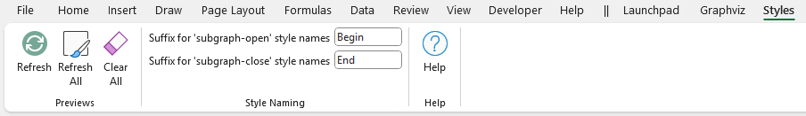
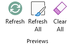
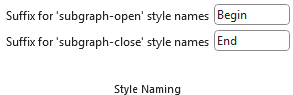
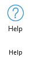

# Styles

## Overview

A key component of the Relationship Visualizer is a style gallery where you can create style definitions for nodes and edges. It works in theory in a manner like an HTML Cascading Style Sheet where you can define a style name, and how the style should appear (shape, color, font, etc.). A defined style can then be associated with many nodes or edges in the `data` Worksheet.

## The `styles` Worksheet

The `styles` worksheet is reached from the `Style` section of the [Launchpad](../launchpad/) ribbon tab.

|  |
| --------------------------- |

The default `styles` worksheet appears as follows:

|  |
| --------------------------- |

The columns are as follows:

- Column A - The **Indicator** column. It allows you to place a "\#" character to denote a comment. It can be used to comment out the style, so it is excluded from the renderings.
- Column B - The **Style** column. This column is where you specify the Style name.
- Column C - The **Format** column. This column is where you paste the style definitions created on the `style designer` worksheet to create the visual definition for any graph elements which get associated with this style in the `data` worksheet.
- Column D - The **Style Type** column. This column must have a value of `node`, `edge`, `subgraph-open`, `subgraph-close`, `keyword`, or `native`. This string value tells the macros inside the Relationship Visualizer how to interpret the row and convert it into DOT language commands.
- Column E and beyond - The view switch columns. These columns are used for creating views of the data. It must contain a `Yes` or `No` value to indicate if the style should be included in the graph. This column's use is discussed in [Creating Views](#creating-views).   All spreadsheets created from the Relationship Visualizer Excel template will have the Column E heading row set to `All Styles`, with `yes` values set for the style switches. This means that all styles should be included in the graphs when Column E controls the view.

Beginning with Version 7.0, a preview image of the style can be placed after the last view column. The preview images are created using the [Styles](./README.md#the-styles-ribbon-tab) ribbon tab.

## The `Styles` Ribbon Tab

The `Styles` ribbon tab is activated whenever the `styles` worksheet is activated. It appears as follows:

It contains the following major groups:

- [Previews](./README.md#previews)
- [Style Naming](./README.md#style-naming)
- [Help](./README.md#help)

### Previews

|  |
| -------------------------------------------------- |

The `Previews` section provides the action buttons for managing the style preview images on the `Styles` worksheet.

| Label       | Control Type  | Description                                                                                                                                                                                                                        |
| ----------- | ------------- | ---------------------------------------------------------------------------------------------------------------------------------------------------------------------------------------------------------------------------------- |
| Refresh | Button        | Creates a new version of the preview image for the current row. This action is useful if you modify a single style definition, and want to see the change in appearance. |
| Refresh All      | Button        | Deletes all the images on the `styles` worksheet, and generates a completely new set. This action is useful if you make a bulk change to *all* style definitions, such as changing a font name or height. |
| Clear All       | Button        | Deletes all the images on the `styles` worksheet. |

### Style Naming

|  |
| -------------------------------------------------- |

Two rows get created when you use the `style designer` to create a style definition for a cluster. These settings allow you to specify the suffix for the end of the style name to denote when the cluster begins and ends. 

The default values are "Begin" and "End", however you may prefer to use values such as "Start"/"Stop" or "Open"/"Close". 

These values are also used by the `sql` worksheet when emitting rows when `CLUSTER` and `SUBCLUSTER` clauses are used in the `SQL` statement. See the [sql](../sql/) topic for more information.

| Label       | Control Type  | Description                                                                                                                                                                                                                        |
| ----------- | ------------- | ---------------------------------------------------------------------------------------------------------------------------------------------------------------------------------------------------------------------------------- |
| Suffix for 'subgraph-open' style names | Text Edit        | Suffix to append to cluster names to indicated the beginning of a cluster. |
| Suffix for 'subgraph-open' style names      | Text Edit        | Suffix to append to cluster names to indicated the end of a cluster. |

### Help

|  |
| -------------------------------------------------- |

Provides a link to the `Help` content for the `Info` worksheet (i.e. this web page).

| Label       | Control Type  | Description                                                                                                                                                                                                                        |
| ----------- | ------------- | ---------------------------------------------------------------------------------------------------------------------------------------------------------------------------------------------------------------------------------- |
| Help | Button        | Provides a link to this web page. |
