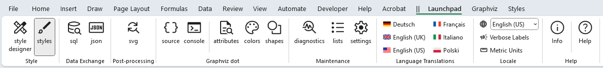
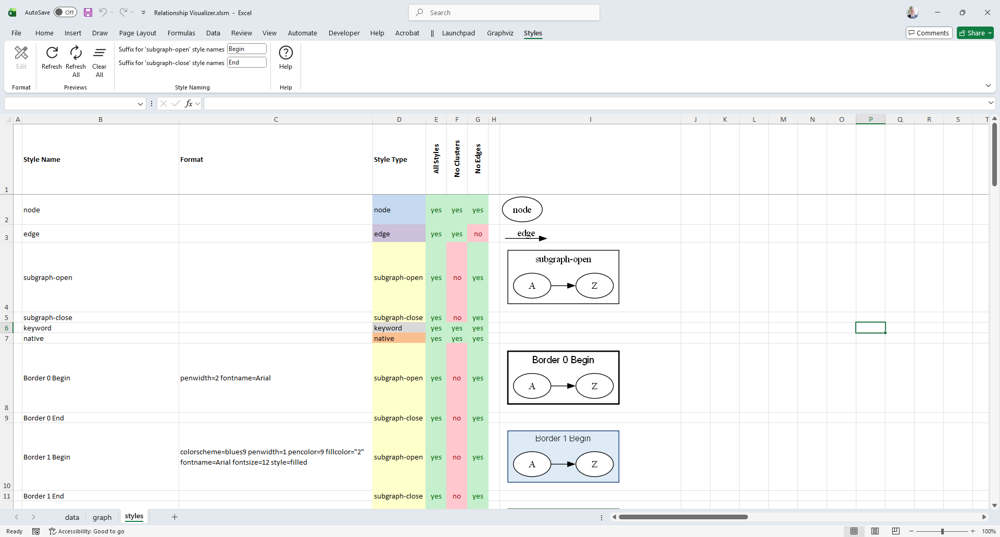
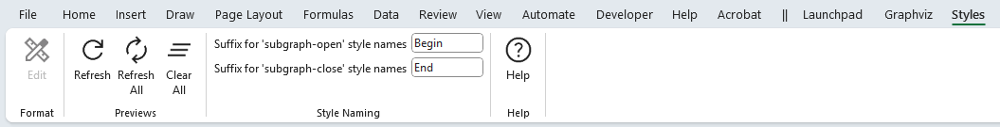
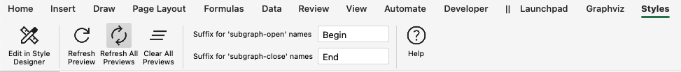
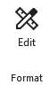
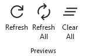
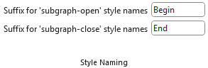
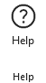
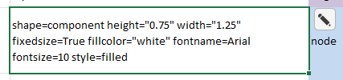

# Style Gallery

A key component of the Relationship Visualizer is the `styles` worksheet, where you can create style definitions for nodes, edges, and clusters. Conceptually, it works much like an HTML Cascading Style Sheet: you define a style name and specify how that style should appear (shape, color, font, and so on). Once defined, a style can be applied to any number of nodes or edges in the `data` worksheet.

## The `styles` Worksheet

The `styles` worksheet is accessed from the **Style** section of the [Launchpad](../launchpad/) ribbon tab.

The default `styles` worksheet appears as follows:

The `data` Worksheet has the following columns:

| A | B | C | D | E (and beyond) | Last switch column + 2 |
|---|---|---|---|---|---|
| [Indicator](./#a-indicator) | [Style](./#b-style) | [Format](./#c-format) |[Style Type](./#d-style-type) | [View Switches](./#e-view-switches) | [Preview Image](./#i-preview-image) |

The columns are as follows:

### (A) Indicator  
Allows you to place a `#` character to denote a comment. This can be used to comment out a style so it is excluded from the renderings.

### (B) Style
Specifies the style name.

### (C) Format
Contains the style definition pasted from the `style designer` worksheet. This definition determines the visual appearance of any graph elements associated with this style in the `data` worksheet.

### (D) Style Type  
Must contain one of the following values: `node`, `edge`, `subgraph-open`, `subgraph-close`, `keyword`, or `native`. This value tells the Relationship Visualizer macros how to interpret the row and convert it into the appropriate DOT language commands.

### (E) View Switches 
Used for creating different views of the data. Each column must contain `Yes` or `No` to indicate whether the style should be included in the graph. These columns are described further in [Creating Views](../views/).

All spreadsheets created from the Relationship Visualizer Excel template include a default Column E labeled **All Styles**, with all style switches set to `Yes`. When this column controls the view, every style is included in the graph.

### (I) Preview Image
A preview image of the style can be placed after the last view column. These preview images are generated using the [Styles](./#the-styles-ribbon-tab) ribbon tab.

## The `Styles` Ribbon Tab

The `Styles` ribbon tab is activated whenever the `styles` worksheet is activated. It appears as follows:

*Windows*  

*macOS*  

It contains the following groups, each of which is explained in the sections that follow. You may jump directly to any group using the links in this table:

| Group                               | Controls                            | Description |
| :----                               | :---                                | :---        | 
| [Format](#format)                   |             | Facilitates editing the style format. |
|                                     |                                     | |
| [Previews](#previews)               |            | Provides the action buttons for managing the style preview images on the `Styles` worksheet. |
|                                     |                                     | |
| [Style Naming](#style-naming)       |        | Allows you to specify the suffix for the end of the style name to denote when the cluster begins and ends. |
|                                     |                                     | |
| [Help](#help)                       |            | Provides a link to the `Help` content for the `styles` worksheet (i.e. this web page). |

### Format

The `Format` group controls facilitate editing the style format.

|  |
| -------------------------------------------------- |

| Label       | Control Type  | Description    |
| ----------- | :----------: | -------------- |
| Edit        |  Button | The **Edit** button becomes enabled whenever a single format cell in Column C is selected, and the row defines a style for a node, edge or cluster. When pressed, the format string in that cell is parsed, and the resulting values are used to initialize the [Style Designer](../designer/) worksheet, where the style definition can be edited.  A second location where the **Edit** button appears is as a floating button on the right side of any selected format cell. This button displays a pencil icon, as shown in the following example:    Clicking the pencil button performs the same action as selecting the **Edit** button in the Ribbon.|

### Previews

|  |
| -------------------------------------------------- |

The **Previews** group provides the action buttons used to manage the style preview images on the `Styles` worksheet.

| Label       | Control Type  | Description                                                                                                                                                                                                                        |
| ----------- | ------------- | ---------------------------------------------------------------------------------------------------------------------------------------------------------------------------------------------------------------------------------- |
| Refresh     | Button        | Creates a new preview image for the current row. This is useful when you manually modify a single style definition and want to see the updated appearance. |
| Refresh All | Button        | Deletes all preview images on the `styles` worksheet and generates a completely new set. This is useful when you make a bulk change to *all* style definitions, such as updating a font name or size. |
| Clear All   | Button        | Deletes all the images on the `styles` worksheet. |

### Style Naming

|  |
| -------------------------------------------------- |

Two rows are created when you use the [`style designer`](../designer/) to define a style for a cluster. These settings allow you to specify the suffix appended to the style name to indicate where the cluster begins and ends.

The default suffixes are **" Begin"** and **" End"**, but you may choose alternatives such as **" Start"/" Stop"** or **" Open"/" Close"**.

These values are also used by the `sql` worksheet when emitting rows when `CLUSTER` and `SUBCLUSTER` clauses are used in the `SQL` statement. See the [sql](../sql/) topic for more information.

Two rows are created when you use the [`style designer`](../designer/) to define a style for a cluster. These settings specify the suffix appended to the style name to indicate where the cluster begins and ends. The default suffixes are **"Begin"** and **"End"**, but you may choose alternatives such as **"Start"/"Stop"** or **"Open"/"Close"**.

These suffix values are also used by the `sql` worksheet when generating rows for `CLUSTER` and `SUBCLUSTER` clauses in an `SQL` statement. For more details on how SQL-driven clustering works, see the [Grouping Data into Clusters and Subclusters](../sql/extensions/#grouping-data-into-clusters-and-subclusters) topic.

| Label       | Control Type  | Description                                                                                                                                                                                                                        |
| ----------- | ------------- | ---------------------------------------------------------------------------------------------------------------------------------------------------------------------------------------------------------------------------------- |
| Suffix for 'subgraph-open' style names | Text Edit        | Suffix to append to cluster names to indicated the beginning of a cluster. |
| Suffix for 'subgraph-open' style names | Text Edit        | Suffix to append to cluster names to indicated the end of a cluster. |

### Help

|  |
| -------------------------------------------------- |

Provides a link to the `Help` content for the `Info` worksheet (i.e. this web page).

| Label       | Control Type  | Description                                                                                                                                                                                                                        |
| ----------- | ------------- | ---------------------------------------------------------------------------------------------------------------------------------------------------------------------------------------------------------------------------------- |
| Help        | Button        | Provides a link to this web page. |
