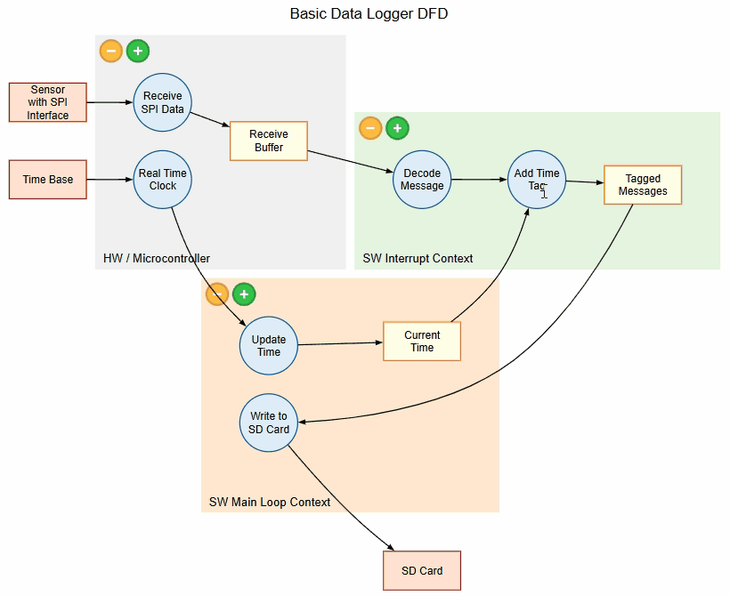
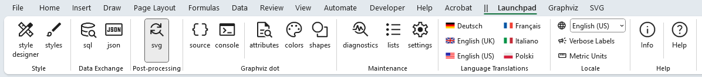
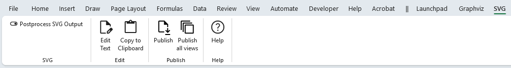
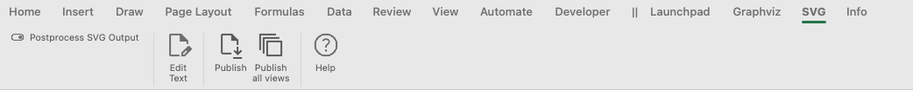
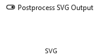
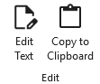
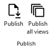
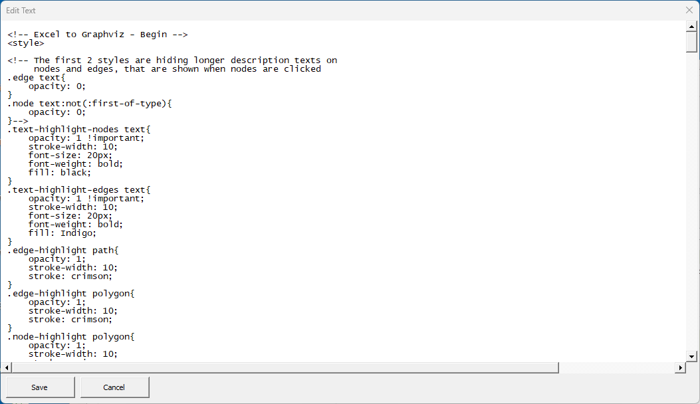

# SVG File Post‑processing

## Introduction

Graphviz can generate output in SVG format, and this is one of the formats supported by the `Publish` and `Publish all views` features.

The Relationship Visualizer extends this capability by allowing you to post‑process the generated SVG. Through simple find‑and‑replace rules, you can modify the SVG’s XML to add styling, adjust structure, or even inject JavaScript for animations and interactive behaviors.

:::tip What is SVG?

**SVG** stands for *Scalable Vector Graphics*, an XML‑based format for describing two‑dimensional vector graphics. SVG images scale infinitely without losing quality, making them ideal for diagrams, illustrations, and web‑based visuals. They are lightweight, text‑based, and support interactivity and animation.
:::

:::tip What is Post-processing?
Post‑processing refers to the transformations applied to an SVG *after* Graphviz has finished generating it. While Graphviz produces a structurally correct diagram, the raw SVG often benefits from additional cleanup or enhancement.
:::

The animated GIF below shows a screen capture of a Graphviz‑generated SVG with animation added through post‑processing:

|  |
| ----------------------- |

Post‑processing allows you to apply additional styling to nodes, edges, polygons, and polylines. It also enables the insertion of JavaScript for interactive behaviors such as click‑event animations and zooming. In short, post‑processing turns a technically valid SVG into a polished, presentation‑ready graphic.

The `svg` worksheet defines a series of **Find** and **Replace** operations, with optional comments. Any row can be commented out by placing a `#` in column A.

When SVG post‑processing is active, each newly created SVG file is loaded into memory, and the `svg` worksheet is processed from top to bottom. Each row’s **Find** value is searched for in the SVG’s XML, and any matches are replaced with the corresponding **Replace** value.

Post‑processing is **disabled by default** and must be explicitly enabled.

## The `svg` Worksheet

The `svg` worksheet is reached from the `Post-processing` section of the [Launchpad](../launchpad/) ribbon tab.

|  |
| ------------------------------------------- |

The default `svg` worksheet appears as follows:

|  |
| ------------------------ |

The `svg` Worksheet has the following columns:

| A | B | C |
|---|---|---|
| [Indicator](./README.md#a-indicator) | [Find](./README.md#b-find) | [Replace](./README.md#c-replace) |

The columns are as follows:

### (A) Indicator  
Allows you to place a `#` character to denote a comment. This can be used to comment out a find/replace pair so it is excluded from the post-processing.

### (B) Find
Specifies the string to seach for.

### (C) Replace
Contains the string to substitute for the string in column B.

## The `SVG` Ribbon Tab

The `SVG` ribbon tab is activated whenever the `svg` worksheet is activated. It appears as follows:

*Windows*
|  |
| ------------------------- |

*macOS*
|  |
| ------------------------------------------- |

It contains the following groups, each of which is explained in the sections that follow. You may jump directly to any group using the links in this table:

| Group               | Controls                          | Description |
| :----               | :---                              | :--- |
| [SVG](#svg)         |      | Controls when post-processing is performed. |
|                     |                                   ||
| [Edit](#edit)       |     | Provides tools to help get around Excel's inability to display large amounts of cell text. |
|                     |                                   ||
| [Publish](#publish) |  | Provides convenience buttons to invoke the [publishing buttons](../publish/#graph-to-file-all-views-to-file) which reside on the `Graphviz` ribbon tab. |
|                     |                                   ||
| [Help](#help)       |     | Provides a link to the `Help` content for the `svg` worksheet (i.e. this web page). |

### SVG

|  |
| -------------------------------------------------- |

Controls when post-processing is performed.

| Label       | Control Type  | Description                                                                                                                                                                                                                    |
| ----------- | ------------- | ---------------------------------------------------------------------------------------------------------------------------------------------------------------------------------------------------------------------------------- |
| Postprocess SVG Output | Checkbox        | Disabled by default. When checked, post-processing Find/Replace is performed whenever a graph is written to file in `SVG` format. |

### Edit

|  |
| -------------------------------------------------- |

Provides tools to help get around Excel's inability to display large amounts of cell text.

| Label       | Control Type  | Description                                                                                                                                                                                                                        |
| ----------- | ------------- | ---------------------------------------------------------------------------------------------------------------------------------------------------------------------------------------------------------------------------------- |
| Edit Text | Button        | Launches the [Edit Text](./README.md#the-edit-text-form) form with the contents of the currently selected cell.   A second location where the **Edit Text** button appears is as a floating pencil button on the right side of any selected `Replace` cell.&nbsp;&nbsp;&nbsp;  Clicking the pencil button performs the same action as selecting the **Edit Text** button in the Ribbon. |
| Copy to Clipboard | Button        | Copies the contents of the cell as straight text to the Microsoft Windows clipboard, so it can be pasted into an external editor.  Characters such as quotes are not escaped as would occur when using Excel's copy (Ctrl+C). |

### Publish

|  |
| -------------------------------------------------- |

Provides convenience buttons to invoke the [publishing buttons](../publish/#graph-to-file-all-views-to-file) which reside on the `Graphviz` ribbon tab. As you tune your post-processing code, having these buttons eliminates the need to bounce back and forth to the `Graphviz` ribbon tab.

| Label       | Control Type  | Description                                                                                                                                                                                                                        |
| ----------- | ------------- | ---------------------------------------------------------------------------------------------------------------------------------------------------------------------------------------------------------------------------------- |
| Publish | Button        | Creates a graph, using the [View](../create/#graph-to-worksheet) currently chosen on the `Graphviz` tab worksheet and performs the SVG post-processing on the generated file.|
| Publish all views | Button        | Creates one graph file per view on the [styles](../styles/) worksheet and performs the post-processing on each file. |

### Help

|  |
| -------------------------------------------------- |

Provides a link to the `Help` content for the `svg` worksheet (i.e. this web page).

| Label       | Control Type  | Description                                                                                                                                                                                                                        |
| ----------- | ------------- | ---------------------------------------------------------------------------------------------------------------------------------------------------------------------------------------------------------------------------------- |
| Help | Button        | Provides a link to this web page. |

## The `Edit Text` Form

Excel rows can hold a great deal of information, but cells have their quirks. Each cell can store up to 32,767 characters, yet only about 1,024 of them are visible directly in the grid without entering cell‑edit mode. For rows, the practical display limit depends on the combined content of each cell, though in reality screen size and readability become limiting factors long before Excel’s technical limits are reached. In short, you can store a lot—but you may not be able to see it all at once.

To address this, Version 7 introduced an `Edit Text` form. When you press the **Edit Text** button, a modal window opens containing the full text of the currently selected cell, making it easier to view and edit long content without fighting Excel’s display constraints. 

|  |
| ----------------------------- |

Horizontal and vertical scroll bars are provided to help navigate the text. You can change the text within the form. 

Pressing the `Save` button transfers the contents from the form back to the active cell.

## Best Practices for SVG Post‑processing

Post‑processing is a powerful feature, but it works best when the Find/Replace rules are written with care. The following guidelines help ensure reliable, predictable results:

- **Target specific patterns.**  
  Use Find values that are precise enough to avoid unintended matches. For example, search for `fill="#000000"` instead of just `fill=` to prevent altering unrelated elements.

- **Avoid overly broad replacements.**  
  Replacing short or common strings (such as `id=` or `stroke=`) can lead to accidental changes throughout the SVG. When in doubt, narrow the scope.

- **Use comments to document intent.**  
  Add a brief comment in column C explaining why a rule exists. This makes the worksheet easier to maintain and helps future you remember what each rule was meant to accomplish.

- **Disable rules instead of deleting them.**  
  Prefix a row with `#` to temporarily disable it. This preserves the rule for later use and makes troubleshooting far easier.

- **Order matters.**  
  The worksheet is processed from top to bottom. Place general rules first and more specific overrides later, or vice‑versa, depending on the effect you want.

- **Test incrementally.**  
  Add or modify one rule at a time, then publish a single SVG to confirm the result. This prevents multiple changes from interacting in unexpected ways.

- **Keep Find/Replace pairs reversible when possible.**  
  If you may need to undo a transformation later, choose patterns that can be cleanly reversed or re‑applied.

- **Be mindful of JavaScript injection.**  
  When adding scripts for animation or interactivity, ensure the inserted code is self‑contained and does not rely on external libraries unless you explicitly include them.

- **Use unique markers for custom elements.**  
  If you add custom classes, IDs, or attributes, prefix them with something distinctive (e.g., `rv-zoom-`, `rv-animate-`) to avoid collisions with Graphviz‑generated names.

- **Validate the final SVG.**  
  After post‑processing, open the SVG in a browser or viewer to confirm that the XML remains well‑formed and that the intended visual changes appear correctly.

---

Like this tool? [Buy me a coffee! ☕](https://www.buymeacoffee.com/exceltographviz)

