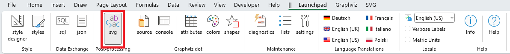
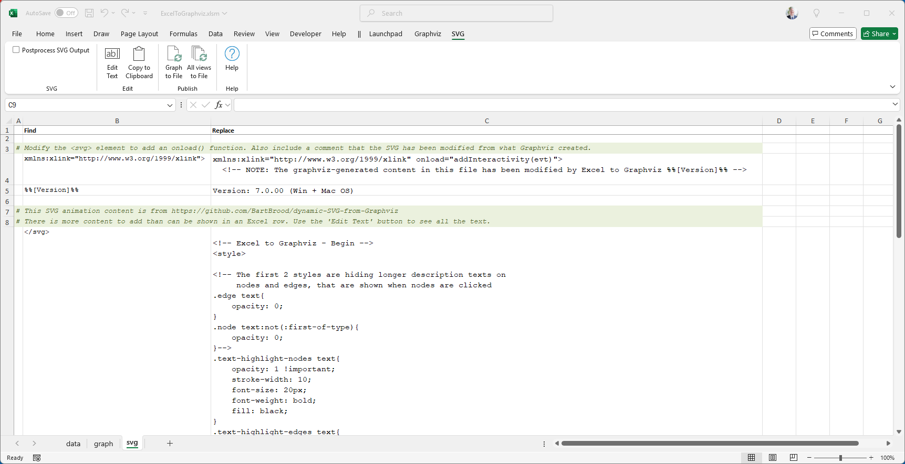
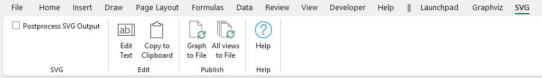
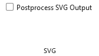
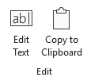
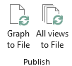

# Post-processing SVG Files

**SVG** stands for Scalable Vector Graphics. It’s an XML-based format for describing two-dimensional vector graphics. SVG images can scale infinitely without losing quality, making them perfect for web design, logos, and illustrations. They're lightweight and support interactivity and animation.

Graphviz has the ability to create `SVG` output, and it is one of the output formats available for use with the `Graph to File` feature.

The Relationship Visualizer provides the ability to post-process the file to perform find and replace actions against the XML in the SVG file. One use of this capability is to insert Javascript routines for animating clusters, nodes and edges.

This diagram illustrates a Graphviz graph published as SVG with animation added.

|  |
| ----------------------- |

## The `SVG` Worksheet

The `svg` worksheet is reached from the `Post-processing` section of the [Launchpad](../launchpad/) ribbon tab.

|  |
| ------------------------------------------- |

The `svg` worksheet specifies Find and Replace columns, with the ability to specify a comment, or comment-out a Find/Replace pair with a "#" in column A

|  |
| ------------------------ |

Post-processing is disabled by default. You must take conscious action to enable post-processing.

When post-processing of SVG is enabled, each time a new SVG file is created the XML contents are loaded into memory. The `svg` worksheet is iterated one row at a time from top to bottom, searching for the "Find" value, and substituting the "Replace" value.

## The `SVG` Ribbon Tab

The `SVG` ribbon tab is activated whenever the `svg` worksheet is activated. It appears as follows:

|  |
| ------------------------- |

It contains the following major groups:

- [SVG](./README.md#svg)
- [Edit](./README.md#edit)
- [Publish](./README.md#publish)
- [Help](./README.md#help)

### SVG

|  |
| -------------------------------------------------- |

Controls when post-processing is performed.

| Label       | Control Type  | Description                                                                                                                                                                                                                    |
| ----------- | ------------- | ---------------------------------------------------------------------------------------------------------------------------------------------------------------------------------------------------------------------------------- |
| Postprocess SVG Output | Checkbox        | Disabled by default. When checked, post-processing Find/Replace is performed whenever a graph is written to file in `SVG` format. |

### Edit

|  |
| -------------------------------------------------- |

Provides tools to help get around Excel's inability to display large amounts of cell text.

| Label       | Control Type  | Description                                                                                                                                                                                                                        |
| ----------- | ------------- | ---------------------------------------------------------------------------------------------------------------------------------------------------------------------------------------------------------------------------------- |
| Edit Text | Button        | Launches the [Edit Text](./README.md#the-edit-text-form) form with the contents of the currently selected cell. |
| Copy to Clipboard | Button        | Copies the contents of the cell as straight text to the Microsoft Windows clipboard, so it can be pasted into an external editor.  Characters such as quotes are not escaped as would occur when using Excel's copy (Ctrl+C). |

### Publish

|  |
| -------------------------------------------------- |

Provides convenience buttons to invoke the [publishing buttons](../publish/#graph-to-file-all-views-to-file) which reside on the `Graphviz` ribbon tab. As you tune your post-processing code, having these buttons eliminates the need to bounce back and forth to the `Graphviz` ribbon tab.

| Label       | Control Type  | Description                                                                                                                                                                                                                        |
| ----------- | ------------- | ---------------------------------------------------------------------------------------------------------------------------------------------------------------------------------------------------------------------------------- |
| Graph to File | Button        | Creates a graph, using the [View](../create/#graph-to-worksheet) currently chosen on the `Graphviz` tab worksheet and performs the SVG post-processing on the generated file.|
| All view to File | Button        | Creates one graph file per view on the [styles](../styles/) worksheet and performs the post-processing on each file. |

### Help

|  |
| -------------------------------------------------- |

Provides a link to the `Help` content for the `svg` worksheet (i.e. this web page).

| Label       | Control Type  | Description                                                                                                                                                                                                                        |
| ----------- | ------------- | ---------------------------------------------------------------------------------------------------------------------------------------------------------------------------------------------------------------------------------- |
| Help | Button        | Provides a link to this web page. |

## The `Edit Text` Form

Excel rows are the patient carriers of data, but cells have their quirks. Each cell can hold up to 32,767 characters, but it can only display about 1,024 of them directly in the cell without editing the cell. When it comes to rows, the display limit is dictated by the combined number of characters in each cell, but usually, practical limitations like screen size and readability come into play long before Excel's actual limits. So, while you can stuff quite a bit in there, whether or not you can see it all at once is another story!

An `Edit Text` form was created in Version 7 to help deal with these limitations. A modal form is displayed when the `Edit Text` button is pressed, and will contain the text from the cell having focus. 

|  |
| ----------------------------- |

Horizontal and vertical scroll bars are provided to help navigate the text. You can change the text within the form. 

Pressing the `Save` button transfers the contents from the form back to the active cell.
