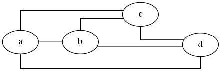

# Visualization Terminology

In mathematics and computer science, _graph theory_ is the study of graphs, which are mathematical structures used to model pairwise relations between objects.

The terms described in this chapter are used throughout the rest of this manual to explain how to construct visualizations. These terms have their roots in graph theory and/or the Graphviz tool.

## Graph

The following picture illustrates a "graph".

## Node

A "graph" in this context is comprised of "nodes".

## Edge

"Edges" are lines that connect nodes.

## Undirected Graph

A graph may be "undirected", meaning that there is no distinction between the two nodes associated with each edge.

## Directed Graph

A graph may be "directed" meaning that there is an explicit direction from one node to another.

## Labels

Nodes can have "labels". Labels can be placed inside the node, and outside the node.

Edges can also have labels. Edge labels can be placed on the edge,

at the tail and/or head of the edge,

Or outside the edge (however in my experience they tend to not always render well)

Edge labels are helpful in stating what the relationship between the nodes is. For example, a set of family relationships might look as follows:

## Splines

The way in which edges are routed and drawn are called "splines". Several spline types are available in Graphviz. The spline type and a depiction of each follows:

### curved

Edges are drawn as curved arcs between nodes

### line

Edges are drawn as straight lines between nodes

### none

dges (and edge labels) are not drawn between nodes, but the relationships described by the edges affects the placement of the nodes.

### ortho

Edges are drawn with 90-degree angles in the routes between nodes.

### polyline

Edges are drawn with straight lines and angular bends in the routes between nodes.

### spline

Edges are drawn with straight and free-flowing (curvy) lines in the routes between nodes.

## ports

A port name can be combined with the node name to indicate where to attach an edge to the node. Graphviz has built-in port names N, S, E, W, NE, NW, SE, SW, C corresponding to compass points North, South, East, West, North East, North West, South East, South West and Center respectively.

Custom ports can also be specified when using HTML labels or "record" as the node shape. This feature is explained later in this manual.

## Clusters / Subgraphs

"Clusters" is a feature to draw nodes and edges in a separate rectangular layout region. Clusters exist as subgraphs of a parent graph internal to Graphviz.

Only the "dot", "fdp", "neato" and "osage" layout engines (described in the next section) draw clusters.

In the example that follows, the rectangles labeled "process \#1" and "process \#2" are clusters (subgraphs) within the overall graph.

## Layout Algorithms

Graphviz contains several programs for drawing graphs. Each program has specializations in how they determine how to layout the nodes and edges. Choosing a layout algorithm to use is sometimes a trial-and-error exercise to find which output looks the best.

A description of the layout engines available (as documented on the Graphviz homepage) are as follows:

### circo

circular layout, after Six and Tollis 99, Kauffman and Wiese 02. This is suitable for certain diagrams of multiple cyclic structures, such as certain telecommunications networks.

### dot

"hierarchical" or layered drawings of directed graphs. This is the default tool to use if you want to have some control regarding the direction of how the graph is drawn.

### fdp

"spring model'' layouts like those of neato but does this by reducing forces rather than working with energy.

### neato

"spring model'' layouts. This is the default tool to use if the graph is not too large (about 100 nodes) and you do not know anything else about it. Neato attempts to minimize a global energy function, which is equivalent to statistical multi-dimensional scaling.

### osage

The _osage_ layout algorithm is for large undirected graphed with multiple subgraphs. It separates the graph into "levels" (clusters) and lays out each level in a rectangle. The rectangles are then packed together. Within each rectangle, the subgraph/cluster is laid out.

### patchwork

The patchwork layout engine draws the graph as a squarified treemap. The clusters on the graph are used to create the tree.

### sfdp

Multiscale version of _fdp_ for the layout of large graphs.

### twopi

Radial layouts, after Graham Wills 97. Nodes are placed on concentric circles depending their distance from a given root node.

