# Terminology

In mathematics and computer science, **graph theory** is the study of graphs—mathematical structures used to model pairwise relationships between objects.

The terminology introduced here is used throughout the remainder of this website to describe how visualizations are built. These concepts originate in graph theory and the Graphviz tool.

## Graph

A **graph** is a collection of nodes and the edges that connect them. 
The illustration below shows a simple example of a graph.

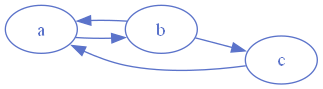

## Node

A graph is composed of **nodes**, which represent the objects or entities in the visualization.

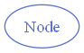

## Edge

**Edges** are the connections between nodes. They represent the relationships or interactions between the entities.

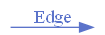

## Undirected Graph

An **undirected graph** is one in which edges have no inherent direction.  
The relationship between the two connected nodes is mutual.

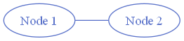

## Directed Graph

A **directed graph** (or **digraph**) uses edges with explicit direction, indicating a one‑way relationship from one node to another.

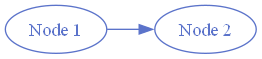

## Labels

Nodes can have **labels**, which provide text describing the node.  Labels may appear **inside** the node or **outside** the node, depending on the node shape and the label attributes.

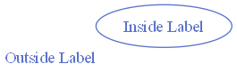

Edges can also have labels. The main edge label appears **on the edge** itself:

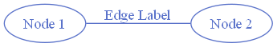

Labels may also be placed at the **tail** and/or **head** of the edge using the `taillabel` and `headlabel` attributes:

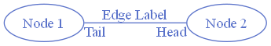

A label can also be positioned **outside** the edge using the `xlabel` attribute, although this placement may vary depending on the [layout algorithm](#layout-algorithms) and [spline routing](#splines):

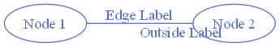

Edge labels are especially useful for describing the **relationship** between nodes. For example, a set of family relationships might be labeled as follows:

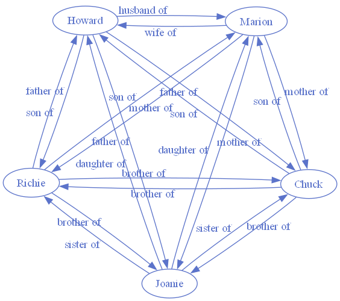

## Splines

The way edges are routed and drawn in a graph is controlled by the **splines** setting.  Graphviz supports several spline types, each producing a different style of edge routing.  

The available options are described below.

---

### curved

Edges are drawn as smooth, continuous curves between nodes.  

This style produces flowing, organic connections.

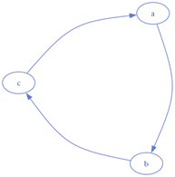

---

### line

Edges are drawn as single straight lines between nodes.  

This is the simplest and most geometric routing style.

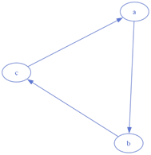

---

### none

Edges (and edge labels) are **not drawn**, but the underlying relationships still influence node placement.  

Useful when you want layout guidance without visible edges.

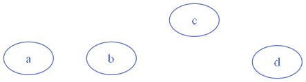

---

### ortho

Edges are routed using horizontal and vertical segments with **90‑degree bends**.  

Ideal for diagrams that benefit from clean, rectilinear structure.

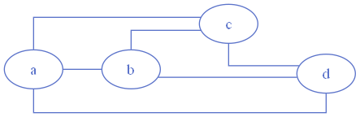

---

### polyline

Edges are drawn as straight segments with **angular bends**.  

This style preserves sharp turns without enforcing strict right angles.

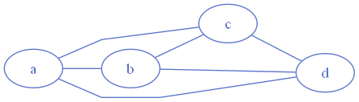

---

### spline

Edges are drawn using a combination of straight segments and **free‑flowing curves**.  

This is the most flexible routing style and often reduces visual clutter in dense graphs.

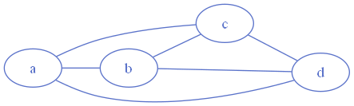

## Ports

A **port** can be combined with a node name to specify exactly where an edge should attach to that node.  

Graphviz provides several built‑in port names that correspond to compass points:

| Port Name | Represents |
| :-------: | :--------: |
| `c`       | Center     |
| `n`       | North      |
| `s`       | South      |
| `e`       | East       |
| `w`       | West       |
| `ne`      | North-East |
| `nw`      | North-West |
| `se`      | South-East |
| `sw`      | South-West |

Ports allow you to control the entry and exit points of edges, which can help reduce crossings or emphasize directional flow.

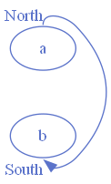

Custom ports can also be defined when using [HTML‑like labels](../advanced/#html-like-labels) or the [record](../advanced/#shape-record) node shape. 

This allows edges to connect to specific fields or sub‑components within a node.  

## Clusters / Subgraphs

A **cluster** is a special type of subgraph that groups related nodes and edges inside a distinct rectangular region. 

Clusters are defined as subgraphs within the parent graph, and Graphviz automatically draws a bounding box around each one.

Only the [dot](#dot), [fdp](#fdp), [neato](#neato), and [osage](#osage) layout engines support visual cluster rendering.

In the example below, the rectangles labeled **process #1** and **process #2** are clusters (subgraphs) contained within the overall graph.

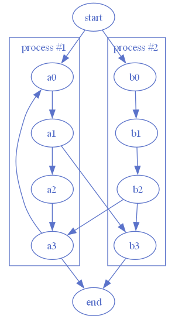

## Layout Algorithms

Graphviz provides several layout engines, each using a different algorithm to position nodes and route edges. Some layouts are optimized for hierarchical structures, others for clusters, radial patterns, or force‑directed placement. 
Choosing the best layout is often a matter of experimentation to see which representation communicates your data most effectively.

Descriptions of the available layout engines (based on the Graphviz documentation) are as follows:

---

### circo

*Circular / Cyclic*

Produces **circular** layouts.  

Designed for graphs with multiple cyclic structures and is useful for telecommunications diagrams or any network with repeating loops.

- Best for: Cycles, rings, telecommunications networks  
- Strengths: Emphasizes circular symmetry  
- Avoid for: Hierarchies or tree structures 

---

### dot

*Hierarchical / Layered*

Creates **hierarchical** or **layered** drawings of directed graphs.  

Ideal when you want clear top‑to‑bottom or left‑to‑right flow, making it the default choice for most structured diagrams.

- Best for: Directed graphs, workflows, org charts, dependency trees  
- Strengths: Clear direction (TB, LR), predictable structure  
- Avoid for: Dense undirected networks  

---

### fdp

*Spring Model (Force Reduction)*

A **force‑directed placement** algorithm similar to *neato*, but it reduces forces directly rather than minimizing an energy function.  

Useful for undirected graphs where a natural, organic layout is desired.

- Best for: Undirected graphs needing organic spacing  
- Strengths: Similar to neato but uses force reduction  
- Avoid for: Very large graphs (use sfdp instead)  

---

### neato

*Spring Model (Energy Minimization)*

A classic **spring‑model** layout engine.  

Best for small to medium‑sized undirected graphs (roughly up to 100 nodes).  

Neato attempts to minimize a global energy function, producing layouts similar to multidimensional scaling.

- Best for: Small–medium undirected graphs (~100 nodes)  
- Strengths: Balanced, natural layouts  
- Avoid for: Very large graphs  

---

### osage

*Clustered Rectangular Packing*

Designed for **clustered** or **multi‑level** undirected graphs.  

Osage arranges clusters into rectangular regions (“levels”) and then packs these regions together.  

Within each region, the subgraph is laid out independently.

- Best for: Multi‑level clustered graphs  
- Strengths: Separates clusters into rectangles and packs them  
- Avoid for: Flat, non‑clustered graphs  

---

### patchwork

*Squarified Treemap*

Draws the graph as a **squarified treemap**, using cluster structure to determine the hierarchy.

Ideal for visualizing nested groupings or proportional areas.

- Best for: Hierarchical clusters, proportional areas  
- Strengths: Treemap‑style visualization  
- Avoid for: Non‑clustered graphs  

---

### sfdp

*Multiscale Force‑Directed*

A **multiscale** version of *fdp*, optimized for **very large** graphs.

It uses a hierarchical approximation to compute force‑directed layouts efficiently at scale.

- Best for: Very large undirected graphs  
- Strengths: Scales efficiently, good for thousands of nodes  
- Avoid for: Small graphs (overkill)  

---

### twopi

*Radial / Concentric Circles*

Produces **radial** layouts.

Nodes are placed on concentric circles based on their distance from a chosen root node, making it ideal for tree‑like structures or distance‑based visualizations.

- Best for: Rooted trees, distance‑based layouts  
- Strengths: Clear radial structure  
- Avoid for: Dense or cyclic graphs  

## Layout Engine Comparison

| Layout Engine | Primary Style / Algorithm | Best For | Not Ideal For | Notes |
|---------------|---------------------------|----------|---------------|-------|
| **circo** | Circular / cyclic placement | Cycles, rings, telecommunications networks | Strict hierarchies or tree structures | Emphasizes repeated loops and circular symmetry |
| **dot** | Hierarchical / layered | Directed graphs, workflows, dependency trees | Dense undirected networks | Most control over direction (TB, LR, etc.) |
| **fdp** | Force‑directed (force reduction) | Undirected graphs needing organic spacing | Very large graphs (use sfdp instead) | Similar to neato but uses force reduction rather than energy minimization |
| **neato** | Force‑directed (energy minimization) | Small–medium undirected graphs (~100 nodes) | Large graphs or strict hierarchies | Produces layouts similar to multidimensional scaling |
| **osage** | Cluster‑level rectangular packing | Multi‑level clustered graphs | Non‑clustered or flat graphs | Lays out each cluster in its own rectangle, then packs them |
| **patchwork** | Squarified treemap | Hierarchical clusters, proportional areas | Non‑clustered graphs | Uses cluster structure to build a treemap‑style layout |
| **sfdp** | Multiscale force‑directed | Very large undirected graphs | Small graphs (overkill) | Scales well using hierarchical approximations |
| **twopi** | Radial / concentric circles | Rooted trees, distance‑based layouts | Dense or cyclic graphs | Places nodes on circles based on distance from a root |

## Quick‑Reference: Choosing a Graphviz Layout

Use this guide to quickly select the layout engine that best fits your graph’s structure and purpose.

---

### If your graph is…

- **Hierarchical or directional** → Use **dot**  
  Clear top‑to‑bottom or left‑to‑right flow; ideal for workflows, org charts, dependency trees.

- **Small–medium and undirected** → Use **neato**  
  Produces balanced, natural layouts using a spring‑model energy function.

- **Undirected and organic‑looking** → Use **fdp**  
  Similar to neato but uses force reduction; good for medium‑sized networks.

- **Very large and undirected** → Use **sfdp**  
  Multiscale force‑directed algorithm optimized for thousands of nodes.

- **Cyclic or ring‑structured** → Use **circo**  
  Best for loops, cycles, and circular network patterns.

- **Clustered into multiple groups** → Use **osage**  
  Places each cluster in its own rectangle and packs them together.

- **Hierarchical clusters or treemap‑style visuals** → Use **patchwork**  
  Converts cluster structure into a squarified treemap layout.

- **Rooted or distance‑based** → Use **twopi**  
  Radial layout placing nodes on concentric circles around a root.

---

### Quick Tips

- **Start with dot** for anything directional.  
- **Try neato or fdp** for undirected graphs when you want a natural look.  
- **Switch to sfdp** if the graph becomes too large or slow.  
- **Use circo** when cycles are the main feature.  
- **Use osage or patchwork** when clusters matter more than edges.  
- **Use twopi** when distance from a root node is the key story.

---

### When in doubt

Generate previews with **dot**, **neato**, and **sfdp** first — these three cover most practical cases and quickly reveal which style fits your data.
