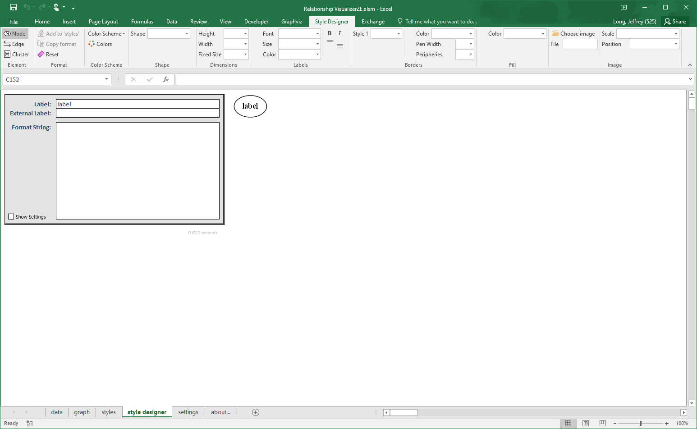
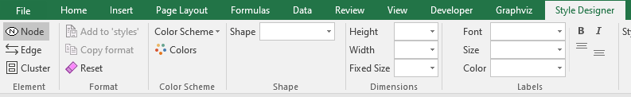
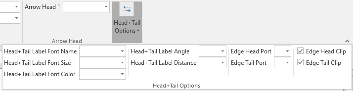
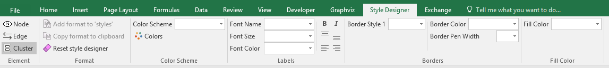
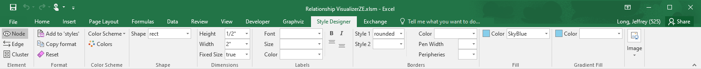
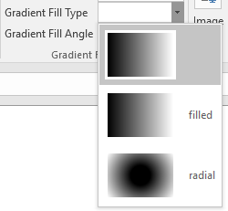
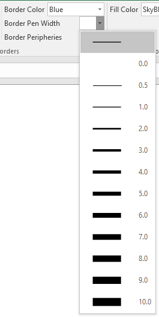
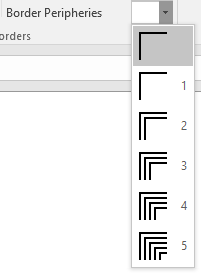
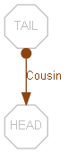

# Adding Style

## Introduction

In the previous topic, we saw how to use the basic features to create graphs. Now we will turn our attention to showing how to depict relationships and add meaningful elements of style to the nodes and edges that help distinguish the relationships.

Readers of this manual work in different industries, so the example we will use is not industry specific. This example uses the relationships between family and friends that should resonate across all readers. For this example, I am using the fictional Cunningham family from the 1970's television program Happy Days.

## 'Happy Days' Example

Happy Days is an American television situation comedy that aired first-run from January 15, 1974, to September 24, 1984, on American television network ABC. Created by Garry Marshall, the series presents an idealized vision of life in the mid-1950s to mid-1960s United States.


Set in Milwaukee, Wisconsin, the series revolves around teenager Richie Cunningham and his family: his father, Howard, who owns a hardware store; traditional homemaker and mother, Marion; younger sister Joanie; and high school dropout, biker, auto mechanic and suave ladies' man Arthur "Fonzie"/"The Fonz" Fonzarelli, who would eventually become the Cunningham's upstairs tenant. The earlier episodes revolve around Richie and his friends, Warren "Potsie" Weber and Ralph "Hector" Malph, with Fonzie as a secondary character. However, as the series progressed, Fonzie proved to be a favorite with viewers and soon more story lines were written to reflect his growing popularity. Fonzie befriended Richie and the Cunningham family. In later seasons, other characters were introduced including Fonzie's young cousin, Charles "Chachi" Arcola, who became a love interest for Joanie Cunningham, and married Joanie in a spin-off television series "Joanie Loves Chachi".

Restating this information in terms of relationships:

- **Howard Cunningham** ("Mr. C") is the husband of Marion, Father of Richie, Father of Joanie, Landlord of Fonzie, and a Customer of Fonzie's auto repair garage
- **Marion Cunningham** ("Mrs. C") is the wife of Howard, Mother of Richie, Mother of Joanie
- **Richard Cunningham** ("Richie") is the son of Howard, son of Marion, brother of Joanie, and friend of Fonzie, Ralph, and Potsie
- **Joanie Cunningham** ("Shortcakes") is the daughter of Howard, daughter of Marion, sister of Richie, and eventually the wife of Chachi
- **Ralph Malph** ("Hector") is a friend of Richie, Potsie, and Fonzie
- **Warren Weber** ("Potsie") is a friend of Richie, Ralph, and Fonzie
- **Arthur Fonzarelli** ("Fonzie", "The Fonz") is a friend of Richie, Ralph, and Potsie; a tenant of Howard, Howard's auto mechanic, and a cousin of Chachi
- **Charles Arcola** ("Chachi") is a cousin of Fonzie, and eventually becomes Joanie's husband.

Collecting this information into an Excel spreadsheet table, it would look as follows:


Let us put this information into the Relationship Visualizer spreadsheet and observe the connections.

**Step 1** - Create a new spreadsheet from the template and save it as an **"Excel Macro-enabled Workbook**" (xslm format) as previously described.

**Step 2** - Take the information in Columns A, B and create nodes in the Relationship Visualizer spreadsheet. Do this by copying the "Name" values to the `Item` column, and the "Full Name" values to the `Label` column.

TIP: The Relationship Visualizer supports multi-line labels. Simply use Excel's "Alt+Enter" keystroke combination to insert a carriage return within the label text. This tip has been illustrated below by entering carriage returns to place the nicknames in parenthesis below the formal names.

Your data should look as follows:


When you press the `Refresh Graph` button, you will see a graph such as:


**Step 3** - Create the edges. Copy into the Relationship Visualizer spreadsheet:

- the "Name" values in Column A into the `Item` column B
- the "Kind of Relationship" values in Column C into the `Label` column C
- the "Relationship To" values in Column D into the `Related Item` E

  Your data should now look as follows:


If you press `Refresh Graph` you will see a graph such as: 

We have successfully drawn the relationships between the main Happy Days characters!

Let us not be content, we can do better. The interconnections of the relationships determine the node placement, a very powerful concept. A shortcoming is that it is hard to distinguish the types of data, and the types of relationships. For example, it would be nice to know at a glance who are members of the Cunningham family, and who are not. It would also be nice to know at a glance what are the spouse relationships, the parent/child relationships, the friend relationships, and the business relationships. This is where the "styles" and `Style Designer` worksheets come into play.

## Using the `style designer` worksheet

The Graphviz DOT language supports many attributes that can control the appearance of nodes and edges. The `style designer` worksheet makes it easy for you to compose style specifications without having to know all the details of the DOT language. The `style designer` worksheet appears as follows:



## The `Style Designer` ribbon tab

The Style Designer ribbon tab has three dynamic design modes controlled by the 'Element' radio buttons in the upper left corner that allow you to create node styles, edge styles, and cluster styles. The ribbon controls change dynamically as you make selections.

### `Node` design mode




### `Edge` design mode




### `Cluster` design mode



You define the styles by making selections on the `Style Designer` ribbon tab. As you make selections a format string is created, and a sample rendering of the node/edge/cluster is created using the graphing engine and splines values from the `Graphviz` ribbon tab (more on that later).

Use these elements as an aid to make your selections on the `style designer` worksheet so that appropriate Graphviz attributes are used in context. For example, _Element = Edge_ will not offer attributes such as `shape` which would not be appropriate for an edge.

We can use the `Node` design mode to create a unique style for members of the Cunningham family. Let's play with different values and until we obtain something visually pleasing.

### Label Values

Enter "Richard Cunningham" into the `Node Label Text:` cell as representative of the labels. This is the longest name, and we want to make sure the shape is large enough to hold it.


You can bold, italicize, align to shape top, or align to shape bottom using the toggle buttons shown below. The default value of "centered" will automatically apply.


### Color

Color is an important aspect of any visualization, and the Style Designer provides complete support for all Graphviz color schemes.

Graphviz defines a color scheme as the context for interpreting color names.

In particular, if a color value has form `"xxx"` or `"/xxx"`, then the color xxx will be evaluated according to the current color scheme. If no color scheme is set, the standard X11 naming is used. For example, if `colorscheme="bugn9"`, then `color="7"` is interpreted as `/bugn9/7`.

Sounds complicated, doesn’t it. Let’s simplify it.

The `Colors` button on the `Style Designer` ribbon will show/hide the `HELP - colors` worksheet. You will see on this worksheet that Graphviz supports 267 color schemes, and each color scheme has from 3 to 656 colors per scheme.


::: tip

If you see a collection of colors you would like to use on the `HELP - colors` worksheet, simply click on the color scheme name hyperlink to transfer the color name to the `style designer` worksheet ribbon.
:::

### Color Schemes

This worksheet is used behind the scenes to create preview images for color choices. In the `Style Designer` ribbon you will see a `Color Scheme` drop-down.


When you click on this drop down, a gallery where you can choose a color scheme appears such as:


When you choose a color scheme, all the color related drop-down lists will be refreshed to contain the color names for that color scheme. For example, if you choose color scheme 'greens3' the dropdown lists will have the values '1', '2', and '3'.


If you switch the color scheme, all the color related drop-down lists will be refreshed to contain the color names for the new color scheme. For example, if after choosing 'greens3' you choose color scheme 'rdbu11' the dropdown lists will have the values '1', '2', '3', ‘4’, ‘5’, ‘6’, ‘7’, ‘8’, ‘9’, ‘10’, ‘11’.


Leave the `Color Scheme` setting as blank for now. When the `Color Scheme` setting is blank the default `X11` color scheme colors will be listed. X11 is the largest set of defined colors and provides 656 color choices to pick from.


::: warning Why does it take so long for the Style Desinger tab to load?
A drawback of having 656 color choices to choose from is that the X11 color scheme slows the loading of the ribbon. Dropdown list images such as the color scheme gallery images are stored in the spreadsheet, but Microsoft Excel requires using image files from the file system for dynamic lists such as the color names. A 20x20 pixel preview image for each color in a color scheme is created for the dropdown color lists the first time a color scheme is selected using color information in the “HELP - colors” worksheet cells. The status bar is updated as this process occurs to let you know that Excel is not frozen.

X11 is Graphviz’s default color scheme, resulting in 656 preview images being created one time. The names of all 656 colors also have to be added to seven dropdown lists of color names, i.e. 4,592 list entries. The time to display the ribbon can range from 2-30 seconds depending upon the speed and power of your computer.
:::

### Shape

Click on the `Node Shape` drop-down list. A list of shapes supported by Graphviz is presented along with a sample image of the shape. Specify the `Node Shape` as `rect` (i.e., rectangle).


Note that the format string now says `shape="rect"` and the node shape changes to a rectangle in the preview.


### Border Styles

Up to 3 border styles are selectable and are additive making it possible to have styles such as bold edge and rounded corners. When you click on any of the 'Border Style' drop-down lists you will be presented with the list of choices along with a sample image of the style.

Set the 'Border Style 1' as "rounded" to give the rectangle rounded corners.


### Height and Width

Set the 'Height:' to ½" and 'Width:' to 2" inches (inches are Graphviz's unit of measure). Also, set 'Fixed Size' to "true" to lock the size of the shape. Leave 'Fixed Size' blank or set it to "false" to allow the shape to grow if the label size exceeds the height and width specified.


### Fill Color

Set the 'Fill Color:' to "SkyBlue".


This setting will give the shape a background color, and automatically add "filled" to the list of 'Style' attributes. The preview image changes to look like:


### Gradient Fill Color

Notice that the ribbon dynamically changes once a Fill Color is specified to display a new choice for 'Gradient Fill Color'.



A "Gradient Fill Color" allows you to select a second color which the Fill Color will gradually transition to. If you select "yellow" as the Gradient Fill Color the preview image changes to look like:


### Gradient Type

Another set of dynamic changes occur as two additional choices 'Type' and 'Angle' appear beneath Gradient Fill Color which allow you to define how the transition occurs. The Gradient Type is either "filled" (i.e., linear) or "radial".

 

The differences are illustrated below:

|  |  |
| -------------------------------------------------- | -------------------------------------------------- |
| **Gradient Type: filled**                          | **Gradient Type: radial**                          |

Changing the Gradient Angle moves the angle of the gradient fill. For linear fills, the colors transform along a line specified by the angle and the center of the object. For radial fills, a value of zero causes the colors to transform radially from the center; for non-zero values, the colors transform from a point near the object's periphery as specified by the value.

If you change the Gradient Angle to 180 degrees, the preview images now appear as:

|  |  |
| -------------------------------------------------- | -------------------------------------------------- |
| **Gradient Type: filled, Gradient Angle: 180**     | **Gradient Type: radial, Gradient Angle: 180**     |

For our Happy Days example, we do not want to use Gradient Fills as they will not add much visual impact to this example. Delete "yellow" from the 'Gradient Fill Color:' choice. Notice that the preview image reverts to the solid 'skyblue' background, and the options for Gradient Type, and Gradient Angle have disappeared. The preview image now looks as follows:


### Border Color

Set the 'Border Color' to 'blue'.


The preview image now appears as follows:


### Border Pen Width

Border Pen Width can make the line around the shape thicker. We are content with the current thickness, so leave the 'Border Pen Width' setting blank to use the default border line width.



### Border Peripheries

'Border Peripheries' can be used to add concentric borders to the shape Leave the 'Border Peripheries' setting blank to maintain a single border around the shape.



### Label Font

For the label, set the 'Font Name:' to "Arial", the 'Font Size:" to "10" points, and the 'Font Color:' to "black". The preview image now appears as follows:


Notice that as we have been making selections the format string cell has been building a list of Graphviz style attributes in the cell highlighted below:


This cell is also an active cell. You can make edits directly into this cell to tweak settings to use values not supplied in the dropdown lists. For example, the font size list jumps from 36 to 48, but if you want a font size of 40 you may type in the value.

Be aware that any change in the ribbon will cause any hand-made edits in the format string to be wiped out as ribbon changes result in a new format string being built. Conversely, deleting the contents of the format string cell will result in the ribbon settings getting reset to default values.

## Using the `styles` Worksheet

### Overview

The `styles` worksheet is where you can create style definitions for nodes and edges. It works in theory in a manner like an HTML Cascading Style Sheet where you can define a style name, and how the style should appear (shape, color, font, etc.). A defined style can then be associated with many nodes or edges in the `data` Worksheet.

The default `styles` worksheet appears as follows:


The columns are as follows:

- Column A - The **Indicator** column. It allows you to place a "\#" character to denote a comment. It can be used to comment out the style, so it is excluded from the renderings.
- Column B - The **Style** column. This column is where you specify the Style name.
- Column C - The **Format** column. This column is where you paste the style definitions created on the `style designer` worksheet to create the visual definition for any graph elements which get associated with this style in the `data` worksheet.
- Column D - The **Style Type** column. This column must have a value of `node`, `edge`, `subgraph-open`, `subgraph-close`, `keyword`, or `native`. This string value tells the macros inside the Relationship Visualizer how to interpret the row and convert it into DOT language commands.
- Column E and beyond - The view switch columns. These columns are used for creating views of the data. It must contain a `Yes` or `No` value to indicate if the style should be included in the graph. This column's use is discussed in [Creating Views](#creating-views). All spreadsheets created from the Relationship Visualizer Excel template will have the Column E heading row set to `All Styles`, with `yes` values set for the style switches. This means that all styles should be included in the graphs when Column E controls the view.

### Add to Styles

Now that you understand the purpose of the `styles` worksheet, let's add in the style definition we just created for the Cunningham family. Select the _Add to `styles`_ button to transfer the style to the `styles` worksheet.


- **Step 1** - A row has been inserted at the bottom of the list within the range marked by the dark border so that the style name is contained within the named range and will appear in the dropdown list of style choices on the `data` worksheet. The `Style Name` cell is selected, and you may type over the temporary name (e.g., _Node style 21_) which has been assigned.


- **Step 2** - Type "Cunningham Family" as the "Style Name" name
- **Step 3** - Observe that the style definition has been copied from the `Style Designer`.
- **Step 4** - Observe that the "Style Type" value has been set to "node"
- **Step 5** - Observe that the switches in the remaining columns are all set to "yes".

The 'styles" worksheet should now look as follows:


Next, we will return to the `data` Worksheet and use the new style definition.

## Applying custom styles

### Show the `Style Name` Column

Return to the `data` worksheet and unhide the 'Style Name' column by checking 'Style Name' on the 'Show/Hide Columns' dropdown list on the Graphviz tab.


If you click on a cell in the `Style Name` column you should see that "Cunningham" family is now a choice in the dropdown list:


Change the style from "node" to "Cunningham Family" for Howard, Marion, Richard, and Joanie Cunningham. The `data` worksheet should now look as follows:


Press the `Refresh Graph` button and the relationship graph now appears as:


### Add More Node Styles

This change has made it very easy to see who the members of the Cunningham family are. Without repeating the details, let's create two more node styles called "Fonzarelli Family" and "Friends". Their styles look as follows:

| Style             | Format                                                                                                                                                                       | Preview                                            |
| ----------------- | ---------------------------------------------------------------------------------------------------------------------------------------------------------------------------- | -------------------------------------------------- |
| Fonzarelli Family | shape="rect" color="red" fillcolor="lightpink" fixedsize="True" fontcolor="black" fontname="Arial" fontsize="10" style="rounded,filled" height="0.50" width="2.00"           |  |
| Friends           | shape="rect" color="darkorange" fillcolor="lemonchiffon" fixedsize="True" fontcolor="black" fontname="Arial" fontsize="10" style="rounded,filled" height="0.50" width="2.00" |  |

After creating new rows, pasting the style definitions into the `styles` worksheet, and filling in the other row cells the completed `styles` worksheet with all 3 styles looks as follows:


Returning to the `data` worksheet, Arthur Fonzarelli and Charles Arcola are members of the Fonzarelli Family so associate that style with their names.

Ralph Malph, and Warren Weber are friends of the Cunningham and the Fonzarelli families, so associate the "Friends" style with them.

The `data` worksheet now appears as:


Press the `Refresh Graph` button and the relationship graph now appears as:


## Edge styling

Edges can have styles just as we have seen for nodes. If we return to the `style designer` worksheet and change the design mode Element to "Edge", we can create edge style definitions using the same method we used for nodes.

Press the `Reset` button to clear all style values carried over from the node definitions and change the Label Text to "Spouse".


Let us create edge relationships definitions for the relationships "spouse", "parent/child", "friend" and "business associate".

For the "Spouse" definition:

- Set `Edge Style` to blank


- Set `Edge Color 1` to `blue`
- Set `Edge Font Name:` to `Arial`
- Set `Edge Font Size:` to `10` points
- Set `Edge Font Color:` to `blue`

The preview image of the edge now appears as:


You will notice there are values of `Tail Label` and `Head Label `present in the preview image.


You can specify different fonts, colors and other options by choosing the 'Head+Tail Options'. Notice these options may appear below the ribbon. That behavior occurs when the ribbon is wider than the window size, so a pane is presented below the ribbon.


### Arrowheads

Arrowheads are another popular option for edges, and Graphviz provides a robust set of choices. You may stack arrowhead choices to build custom arrowheads. The Relationship Visualizer ribbon provides up to 3 arrowheads. When you specify the first arrowhead, a new dropdown list will appear. Likewise, after specifying a second arrowhead, a 3rd dropdown list will appear.


Each change generates the "Edge" Format' string and renders a sample graph showing how the edge will look based upon the _Layout Engine_ and _Splines_ settings on the `settings` worksheet. Note that the appearance may change due to how the layout engines render splines, head ports, and tail ports. For more information on these settings, see the section [Graph Options](#graph-options).

### Add to `styles`

When the edge style is the way you want it to look, pressing the 'Add format to `styles`' button copies the format string to `styles` worksheet. Assign the style the name "Spouse".

The `styles` worksheet should now look as follows:


Without repeating all the details, let us create three more node styles called "Parent Child", "Friend", and "Business Associate".

The edge styles definitions and previews look as follows:

| Style              | Format                                                                                 | Preview                                            |
| ------------------ | -------------------------------------------------------------------------------------- | -------------------------------------------------- |
| Parent Child       | `style="solid" color="darkgreen" fontcolor="darkgreen" fontname="Arial" fontsize="10"` |  |
| Friend Of          | `style="dashed" color="deeppink" fontcolor="deeppink" fontname="Arial" fontsize="10"`  |  |
| Business Associate | `style="dotted" color="red" fontcolor="red" fontname="Arial" fontsize="10"`            |  |

After pasting the style definitions into the `styles` worksheet, and assigning the style names the completed `styles` worksheet should now look as follows:


### Assign Edge styles

Returning to the `data` worksheet, assign the appropriate style to the relationship rows based upon the kind of relationship documented. The `data` worksheet now appears as:


Press the `Refresh Graph` button and the relationship graph now appears as:


### Create more edge styles

Now we begin to visualize the various types of relationships. We can also see that there are still a few rows remaining that do not have styles assigned. These rows represent the "Sister", "Brother", and "Cousin" relationships. These relationships are drawn in the default Graphviz style. We need to go back and create a "Sibling", and a "Cousins" edge style. Using the previous method, define two additional edge styles to look as follows:

| Style   | Format                                                                                                            | Preview                                            |
| ------- | ----------------------------------------------------------------------------------------------------------------- | -------------------------------------------------- |
| Sibling | style="solid" color="purple" fontcolor="purple" fontname="Arial" fontsize="10"                                    |  |
| Cousin  | style="solid" color="chocolate4" arrowtail=`dot` dir="both" fontcolor="chocolate4" fontname="Arial" fontsize="10" |  |

### Arrow Tails

Notice that for the "Cousin" style we have added a filled circle to the Arrow tail. To achieve this effect, you must specify the 'Arrow Direction' as 'Both'.


A new set of choices for `Arrow Tail 1` appear.


Arrow tails have the same set of choices as arrow heads. Like arrow heads, Relationship Visualizer allows you to choose up to 3 styles for Arrow Tails.

Choose `dot` for the filled, rounded tail used in the "Cousin" style.


The arrow now appears with the round tail, and the pointed arrow head as shown below.


Returning to the `data` worksheet, assign the "Sibling" and "Cousin" style to the remaining rows which currently use the built-in style of "edge" based upon the kind of relationship documented.

Press the `Refresh Graph` button and the relationship graph now appears as:


At this point, it is up to an interested reader to divide the relationships to lower levels and add more styles. It is possible to split the styles we just created down to smaller levels such as Father, Son, Mother, Daughter, Sister, and Brother or even by business relationships such as Landlord and Tenant. There are additional relationships that can be added. For example, when Joanie married Chachi, Howard became Chachi's father-in-law, Marion became Chachi's Mother-in-Law, Chachi became Howard and Marion's Son-in-Law. Add these relationships to expand the model. Have fun with it.

## Modifying the style of individual elements

There may be times when you want to embellish the style of a single node or an edge. The introduction to this manual described how to determine the route between two states. Perhaps you want to show the shortest route in a different color, make the lines thicker, or use a different style.

The Relationship Visualizer has capabilities to support this requirement.

### DOT Attributes

Display of the `HELP - attributes` worksheet is toggled from the `Graphviz` ribbon tab ribbon tab. It contains filters on graph elements and layout engine columns which allow you to narrow down the list of attribute you seek. In the illustration below we are filtering on `edge` attributes, and the `dot` layout engine to learn which attributes are eligible for use:


### Show the `Attributes` column

The `data` worksheet provides a column called `Attributes`. Adding additional style or control attributes here will only apply to that row of data. The `Graphviz` ribbon tab controls the `Attributes` capability which can be turned on or off depending upon how you wish to depict the graph.

If the `Attributes` column is hidden, make it visible by selecting it from the `Show/Hide Columns` drop-down menu on the `Graphviz` tab.


### Override a shape

The **Happy Days** introduction mentioned that Fonzie emerged as the star of the television show. In this case, it might be useful to use a 'star' shape to identify his node.

Use the `Style Designer` to define a 2-inch by 2-inch star.

Next, instead of adding the format to the `styles` worksheet, copy the format to the clipboard.


Find the row with Fonzie's name (row 8) and paste the style attributes

```dot
shape="star" height="2.0" width="2.0" fixedsize="true"
```

within the `Attributes` column on his row.

The height and width are changed to make the star a little larger than the other nodes, and the fixedsize attribute tells Graphviz to make the star exactly 2.0 x 2.0 inches (i.e., do not grow or shrink the star based upon the size of the label).

The spreadsheet appears as:


Press the `Refresh Graph` button and the relationship graph now appears as:


Notice that the `Attributes` attributes are additive. The star has rounded points because the "Fonzarelli Family" style associated with Arthur Fonzarelli has an attribute which includes `style="rounded"`, and the border and fill colors remain unchanged.

## Grouping information in clusters

The `DOT` layout engine supports the cluster concept described previously in this manual. Other layout engines such as `FDP` and `SFDP` do not. This means that some of the style techniques described here will not work if you are not using the `DOT` layout engine.

The Relationship Visualizer allows you to denote the start of a cluster with open brace `{` and close brace `}` characters in the `Item` column. The `Label`, `Style Name`, and `Attributes` columns all work for clusters as was previously described for nodes and edges.

In the previous graph Richie Cunningham is located at the bottom of the graph, while the other members of his family are at the top of the graph. We would like to group all the members of the Cunningham family together, so let's add an open brace `{` above their rows with a label of "Cunningham Family", and a close brace `}` below the row of the last Cunningham family member. We will also group the Fonzarelli family members and group the Friends.

To make the data more readable, we will also add comments by placing a `#` character in Column A, and comment text in the `Item` cells

The spreadsheet now appears as:


Press the `Refresh Graph` button and the relationship graph now appears as:


We can use the `Attributes` capabilities for clusters, just as we did for nodes. For example, add the attribute bgcolor="gray87" in the `Attributes` column on the three rows containing the open cluster "**{**" characters:


Press the `Refresh Graph` button and the relationship graph now appears as:


The `style designer` worksheet contains a "Cluster" design mode for creating Cluster style definitions. It works the same way as was explained for nodes and edges, and therefore an additional explanation here would probably bore the reader. The following picture provides an example of a "Cluster" style definition.


## Adding native Graphviz directives

The Relationship Visualizer is intended to hide as much of Graphviz's DOT language as possible so that you only manipulate rows and columns in Excel. You can take greater control of the diagram's presentation by adding in Graphviz statements, assuming you take the time to learn the DOT language.

::: tip
Readers interested in learning more about the DOT language should refer to <https://graphviz.org/documentation/> and <http://www.graphviz.org/pdf/dotguide.pdf>
:::

You can insert Graphviz commands into the DOT language file by specifying the character `>` in the Item column. The `>` character identifies the row as having a "**native**" command. When an Item of `>` is encountered the Excel macro code takes the value in the `Label` column and writes it verbatim to the text file which will be sent to the layout engine.

::: warning
Labels are processed to convert Excel-style carriage returns into Graphviz-style carriage returns, as well as filter out special characters that Graphviz cannot process. Rows with native Graphviz commands are not inspected, and the value in the Label column is written directly **as-is** into the Graphviz file.
:::

For example, the Graphviz statements which will depict Howard and Marion Cunningham on a common plane, and Richie and Joanie Cunningham on a separate, yet common plane are:

```dot
{rank="same"; "Howard"; "Marion";}
```

```dot
{rank="same"; "Richie"; "Joanie";}
```

These directives must be placed within the cluster where the Cunningham family is defined.

Add two rows above the close brace `}`. In the `Item` column enter the character `>`, and in the `Label` column enter the Graphviz statements listed above.

The Excel data now appears as:


Press the `Refresh Graph` button and the relationship graph now appears as:


## Adding images

As you develop more advanced relationship graphs you may want to use images to represent the nodes in combination with, or in place of the node shapes. Graphviz supports an "image=" attribute where you can provide a file name of an image to include in a node.

The Relationship Visualizer by default will look in the directory where the spreadsheet is saved. If you wish to store the images in other locations, you must make a configuration change on the `settings` worksheet to specify the location(s). The image path must be specified before you can use the "image=" attribute in a style definition.

### Add an image path

Switch to the `settings` worksheet and locate the "Image Path:" setting in the 'Graph Options' section. To the right of the cell is a button with three dots […]. If you press that button it will bring up the standard directory selection dialog which you can use to choose the directory where the images are stored. Navigate to the directory and press the "OK" button to transfer the path to the cell.


Your settings should appear like this:


### Specify an image

Image name is an option on the `style designer` worksheet that is useful when you want to create a common style definition where all nodes of a given style use a common icon. For example, it is possible to depict computers with one image, depict databases with another image, and depict computer programmers with yet another image.

For our example, we are going to take it a step further by using the `Attributes` column to insert a photograph of each character.

The characters of Potsie and Ralph have not gotten very much attention in this example, so let us shift the focus to them. We have obtained JPEG images of these characters off the internet, cropped them to be square, scaled then down to a common size, and placed them in the directory where the Excel workbook is saved.

**Step 1** - Press the "Reset style designer" button to clear the format string and reset the ribbon controls.


**Step 2** - Press the "Choose Image" button in the Image section of the tab


**Step 3** - Navigate to the directory containing the images and choose Ralph Malph's picture.


**Step 4** - We want the image aspect ratio maintained so that the image does not get stretched vertically or horizontally. Choose "Keep aspect ratio" from the Image Scale dropdown list.


Note that the image is full sized, and centered in the default oval shape.

**Step 5** - We want to shift the image position to the left edge so that it is placed beside the character's name. Select "Middle Left" from the Image Position dropdown list.


**Step 6** - At this point you may be thinking "What about the shape and font, they are not right?" We don't worry about them because this attribute string will be pasted into the "Attribute" and will be added to, and potentially override any Graphviz attribute defined by the saved style specified in the "Style Name" column.

For Ralph, we will add these attributes:

```dot
image="Ralph_Malph.jpg" imagescale="True" imagepos="ml"
```


and for Potsie we will add:

```dot
image="Potsie_Weber.jpg" imagescale="True" imagepos="ml"
```


The `imagepos` attribute will move the label location from the default center position to the middle left of the shape. The `imagescale` attribute will scale the image down to fit within the shape, while maintaining the aspect ratio.

The Excel data now appears as follows: 

Press the `Refresh Graph` button and the relationship graph now appears as:


We now see the graph contains the images specified on the two lines. The shape is still rectangular of fixed height and width, with a light-yellow background and orange border as dictated by the "Friends" style. The image attributes have been added to the style definition. The images have been scaled down to fit the height of the shape and are aligned with the left edge of the rectangle.

**Step 7 -** Next, we repeat these steps for the other characters (and remove shape="star" for Fonzie). The graph now appears as follows:


We can make additional changes to the graph by trying different Graphviz graph attributes. For example, Graphviz has two algorithms for ranking nodes when clusters are used.

### Trying different layouts

We can play with some of the other Graphviz options now to see different ways the graph can be displayed. If we choose a different layout algorithm, let's see what happens to the graph. Choose `circo` from the Layout dropdown:


The graph now appears as:


Notice that the cluster are gone, as `circo` does not support clusters. Now repeat, but choose algorithm `fdp` which does support clusters. The graph now appears as:


### Return to the `dot` layout

Now return to the original layout by selecting the `dot` algorithm. Once again the diagram appears as:


### Change layout direction

The default layout for dot assumes a top to bottom layout. When the Layout is specified as `dot` a "Direction" dropdown list is dynamically added to the ribbon tab.


Choose `LR` from the list of choices and the graph will appear as:


I prefer the previous layout, so select `TB` from the Direction dropdown list. The graph returns to:


### Change cluster layout algorithm

Having seen what different layout algorithms can do, let's see what fine tuning some of the graph and edge options can accomplish. Return to the `Graphviz` tab and select `Rank Ignoring Clusters` from the `Graph Options` dropdown list.


Checking this option causes the graph attribute `newrank="true"` to be added to the graph options. The newrank attribute specifies whether to use a single global ranking, ignoring clusters.

The original ranking algorithm in dot is recursive on clusters. This can produce fewer ranks and a more compact layout, but sometimes at the cost of a head node being place on a higher rank than the tail node. It also assumes that a node is not constrained in separate, incompatible subgraphs. For example, a node cannot be in a cluster and also be constrained by `rank="same"` with a node not in the cluster.

This allows nodes to be subject to multiple constraints. Rank constraints will usually take precedence over edge constraints.

The graph is now more compact, and appears as:


### Hiding Edge Labels

The edge labels have served their purpose, so let's hide them. On the "Edge Options" dropdown list within the Label Columns section you can turn on or off the 4 different types of labels (Label, External Label (i.e., xlabel), Head, and Tail) which Graphviz supports.

Remove the checkmark from `Include "Label"` under the `Label Column` heading

The relationship labels are removed, and the graph now appears as:


### Change the Spline algorithm

Now let's see what effect changing the `spline` attribute has on the graph. The `Splines` dropdown list contains examples of how a particular value will cause the edges to be drawn. Choose `ortho` for orthogonal edges.


The graph now appears as:


And this representation is a good place to stop.

## Summary

In summary, we quickly built a relationship graph using Excel column data. Then using the `style designer` worksheet styles were placed in the `styles` worksheet which we associated to rows of data in the `data` worksheet. Additional style attributes were added to individual rows.

These actions have allowed us to transform the

visualization from this default graph:

|  | to this style-based depiction:  |
| -------------------------------------------------- | --------------------------------------------------------------------------------- |

and finally, this style-based depiction with row and graph option refinements:


