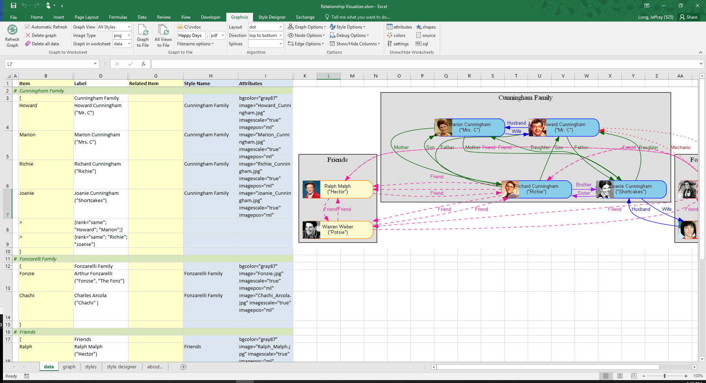
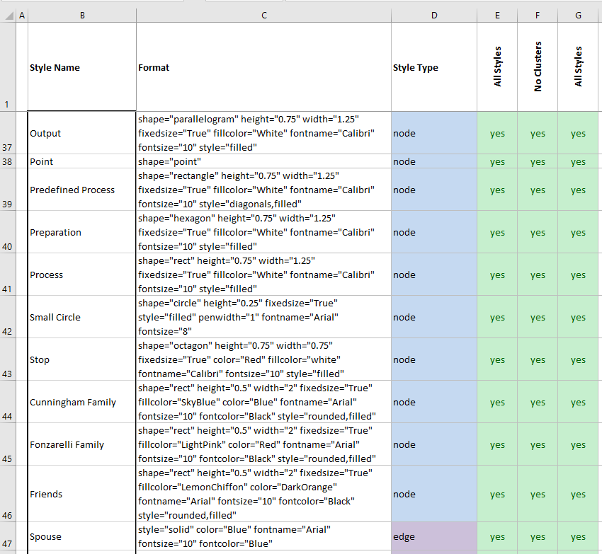
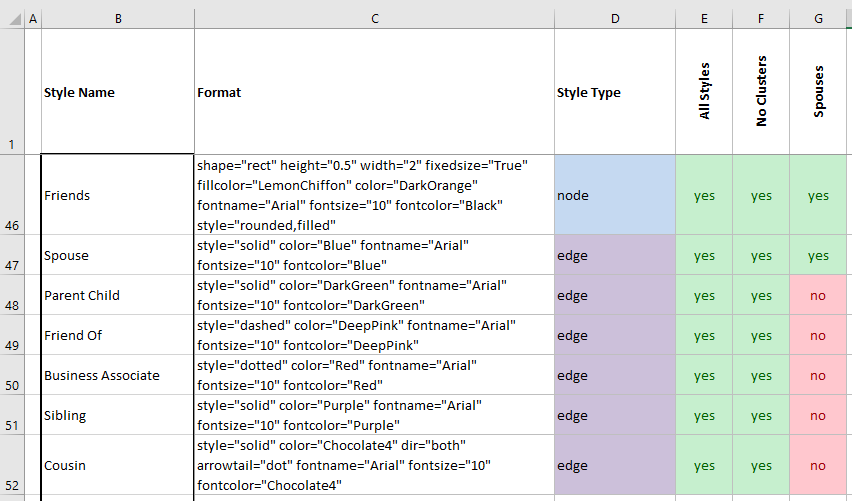
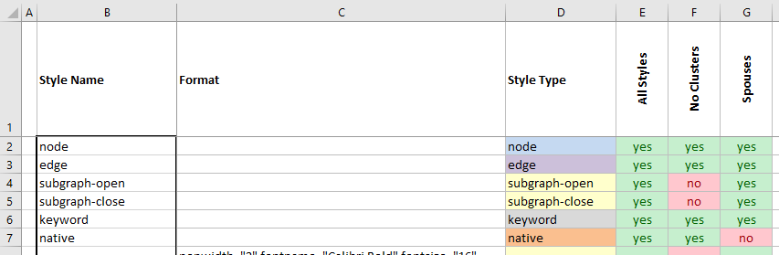
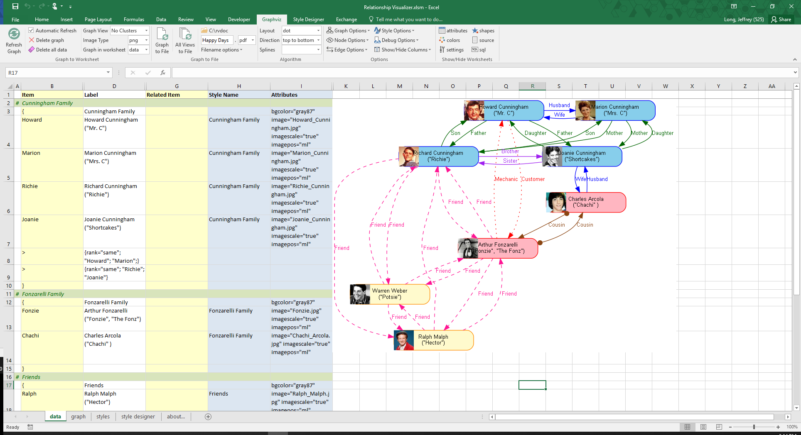
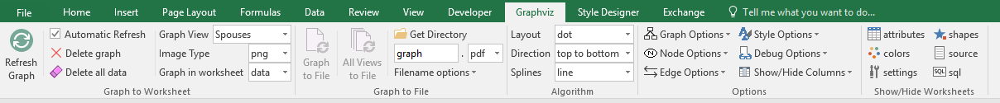
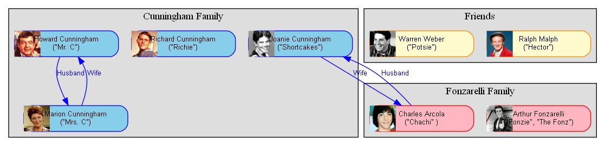
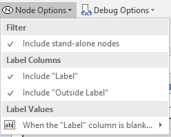
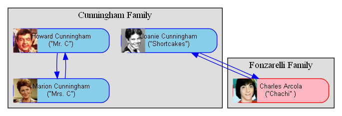

# Creating Views

## Introduction

The Relationship Visualize is capable of handling much larger data sets than can be illustrated in this manual. As the data sets get larger it sometimes becomes useful to see just certain portions of the data. The Relationship Visualizer supports views by providing a mechanism on the `styles` worksheet which provides **Yes** or **No** switches to indicate which data styles to include in the graph.

## Views vs. Layers

In this manual, the term "Views" is meant to represent a redrawing of the graph with just a subset of nodes and edges. Graphviz likes to optimize the layout of the nodes and edges based upon the connections, so often the shapes will move to new locations.

Contrast "Views" to the term "Layers". Layers are a concept in tools such as Microsoft Visio where shapes can be layered in a manner so that they can be hidden or exposed. In a layered tool, the shapes never change position; they are just visible or invisible. Graphviz also has a concept of layers, but Graphviz layers are outside the scope of this manual.

The Relationship Visualizer spreadsheet's `styles` worksheet specifies two columns for every style definition. One column has the heading **All Styles** where every row containing a style definition contains the value **Yes**, and a column with heading **No Clusters** where any row with style definition of Style Type `subgraph-open` or `subgraph-close` contains the value of **No**.

When the graph is created, any row with a Style having a value of **Yes** is included in the graph, and any row with a Style having a value of **No** is omitted from the graph.

The column used to make these decisions is specified on the Graphviz tab in the dropdown list named `Graph View`. The **All Styles** column is the default view. Our graph looks like this with **All Styles** selected.

If `Graph View` is changed to **No Clusters** the graph is redrawn and appears as

## Continuing Our Example with a Custom View

Let us continue our "Happy Days" example. We have built a data set and a graph of the primary characters and their relationships, but what if we want to see a subset graph of just who is married? The way we do that is by defining a column of View switches in the `styles` worksheet, and direct the Relationship Visualizer to create the graph using just the styles enabled in that column.

Let us create a view for **Spouse** relationships

**Step 1** - Switch to the `styles` worksheet.

**Step 2** - Copy Column E with heading **All** to Column G. The `styles` worksheet will appear as follows:

**Step 3** - Change the heading in cell G1 to **Spouses** and change all the switches in Column F from **yes** to **no** where the `Style Type` is `edge` EXCEPT for the row with the style named **Spouse**.

The `styles` worksheet should now appear as:

We will also turn off the ability to add Graphviz directives by changing the `native` style's switch from **yes** to **no**. Removing the native directives will cause the rank statements to we discussed earlier to be filtered out.

**Step 4** - We now have to change a setting on the `Graphviz` ribbon tab to tell the Relationship Visualizer to use only the styles we have enabled through **yes** settings in column F. Switch to the `data` worksheet. The `data` worksheet should appear as follows:

**Step 5** - Notice that **Spouses** is now a value in the dropdown list. The dropdown selections in this list are updated every time a new View column is added to the `styles` worksheet.

Change the name of the `Graph View` from **No Clusters** to **Spouses** in the `Graphviz` ribbon tab.

**Step 6** - Press the `Refresh Graph` button. The new graph with just the view of the marriage relationships will appear as follows:

As you can see, the other relationship edges are no longer in the graph. Graphviz has moved the nodes around to make the drawing compact. The graph continues to show all the Happy Days characters; regardless of if they do or do not have a marriage relationship.

Sometimes when the amount of data is large, having nodes in the graph without any edges depicting relationships can be distracting. In the example above, we are interested in the marriage relationships, yet Richard Cunningham, Arthur Fonzarelli, Ralph Malph, and Warren Weber are also depicted. The Relationship Visualizer has switches to remove these island nodes when the island nodes serve no purpose in the graph.

**Step 7** - Remove the check mark on the `Graphviz` ribbon from the `Nodes` - `Include stand-alone nodes` switch control. This means only include nodes that have an edge connection to another node.

**Step 8** - Press the `Refresh Graph` button. The graph should now appear as follows:

Notice that the "Friends" cluster has disappeared along with the characters without a Spouse relationship. That is because Graphviz does its own filtering and will not draw a cluster that does not contain any nodes.
