# Creating Views

## Introduction

The Relationship Visualizer is capable of handling much larger data sets than can be easily viewed. As data sets grow, it often becomes useful to focus on specific portions of the information. The Relationship Visualizer supports this by providing view controls on the `styles` worksheet, where **Yes** and **No** switches determine which data styles are included in the graph.

## Views vs. Layers

In Relationship Visualizer terminology, the term **Views** refers to redrawing the graph using only a subset of nodes and edges. Because Graphviz optimizes layout based on the visible connections, the positions of shapes often change when a view is applied.

This differs from **Layers**, a concept used in tools such as Microsoft Visio, where shapes can be assigned to layers that are simply shown or hidden. In a layered system, shapes do not move; they are merely visible or invisible. Graphviz also supports a concept of layers, but Graphviz layers are outside the scope of this topic.

The Relationship Visualizer’s `styles` worksheet defines three columns for each style definition. 
1. The **All Styles** column contains **Yes** for every style definition. 
2. The **No Clusters** column contains **No** for any style whose Style Type is `subgraph-open` or `subgraph-close`.
3. The **No Edges** column contains **No** for any style whose Style Type is `edge`.

When the graph is created, any row whose Style value is **Yes** is included in the graph, and any row whose Style value is **No** is omitted.

The column used to make these decisions is selected on the Graphviz tab in the `Graph View` dropdown list. The **All Styles** column is the default view. With **All Styles** selected, the graph appears as shown below.

If `Graph View` is changed to **No Clusters** the graph is redrawn and appears as

## Custom View Example

The [Overview](../overview/) page shows several illustrations of a graph of the London Underground.

We began by creating edge styles using the official London Underground line colors.

| 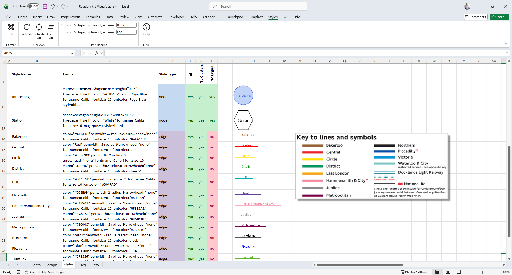 |
| ----------------------------- |

These styles were applied to a data set of the subway stations and the station‑to‑next‑station relationships that connect each station to the next. The graph of the complete London Underground appears as:

| 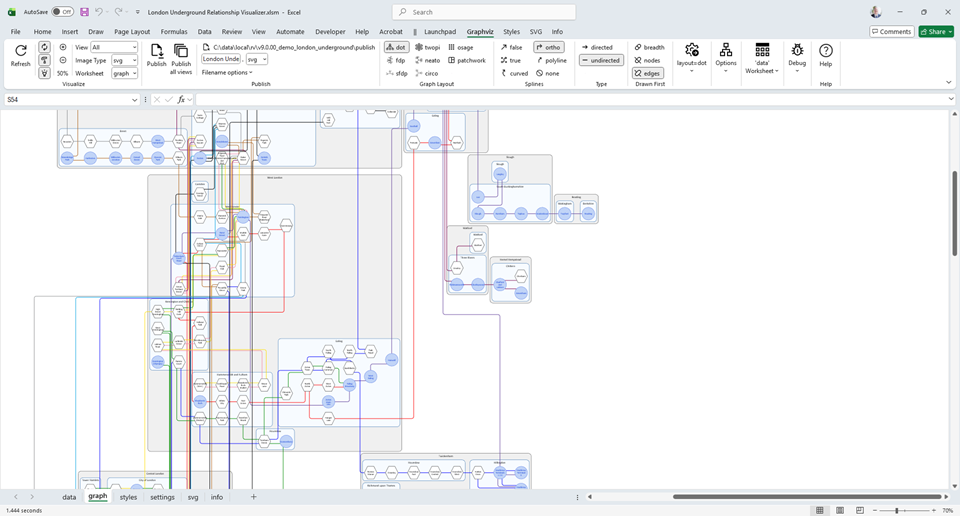 |
| ----------------------------- |

This gives us a full data set and a complete graph, with each connection styled according to its line color. But what if we want to view only a single subway line?

To do this, we define a column of View switches in the `styles` worksheet and instruct the Relationship Visualizer to generate the graph using only the styles enabled in that column.

Let us create a view that restricts the graph to only the **Bakerloo** subway line relationships.

**Step 1** — Switch to the `styles` worksheet.

**Step 2** — Copy Column E (with the heading **All**) and insert the copy as Column F. The `styles` worksheet will then appear as follows:

| 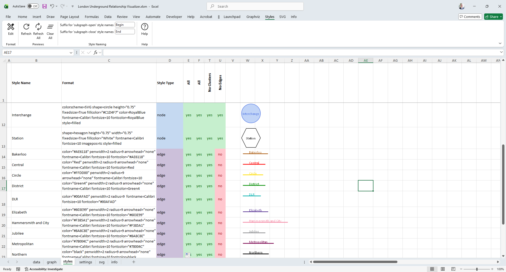 |
| ----------------------------- |

**Step 3** — Change the heading in cell F1 to **Bakerloo**, and change all the switches in Column F from **Yes** to **No** for every row where the `Style Type` is `edge`, **except** for the row whose style name is **Bakerloo**.

The `styles` worksheet should now appear as:

| 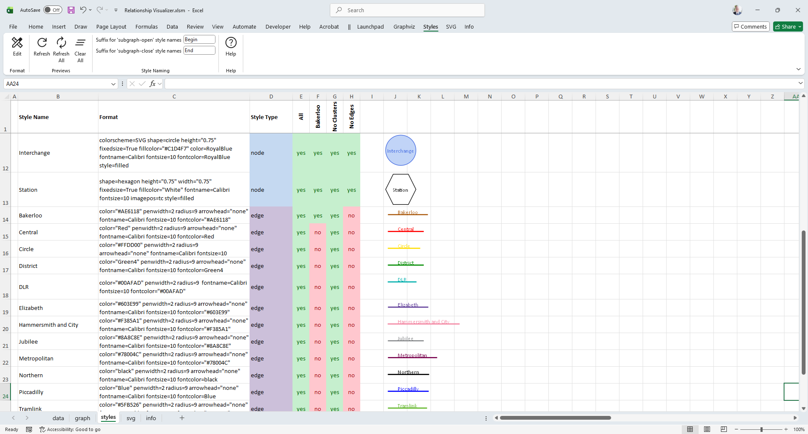 |
| ----------------------------- |

**Step 4** — We now need to change a setting on the `Graphviz` ribbon tab so the Relationship Visualizer uses only the styles enabled with **Yes** in Column F. Switch to the `data` worksheet. The `data` worksheet should appear as follows:

| 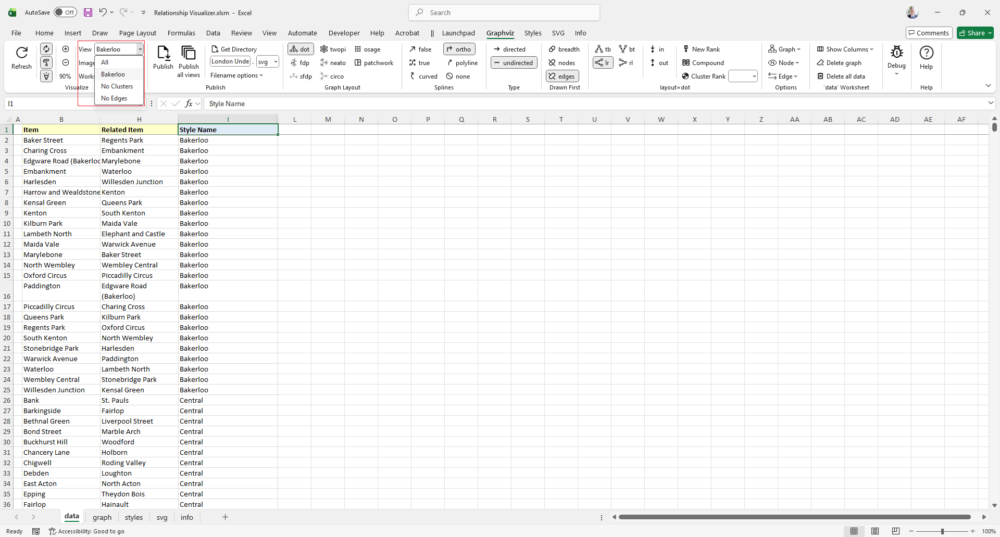 |
| ----------------------------- |

**Step 5** — Notice that **Bakerloo** now appears as a value in the dropdown list. The selections in this list are refreshed automatically whenever a new View column is added to the `styles` worksheet.

Change the selected `View` from **All** to **Bakerloo** on the `Graphviz` ribbon tab.

**Step 6** — Press the `Refresh` button. The new graph for the Bakerloo view does **not** appear as we might expect. All stations are still visible, and most are no longer connected to anything. What gives?

| 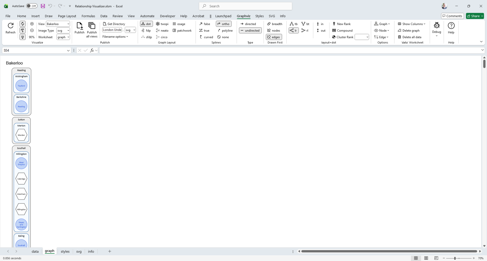 |
| ----------------------------- |

The reason is that we filtered the **edges**, but we did not filter the **nodes**. Every station still has a node style set to **Yes** in the selected View column, so Graphviz dutifully draws all of them. However, because only the Bakerloo edges remain enabled, most stations no longer have any connecting relationships. The result is a graph full of isolated nodes. To fix this, we must also restrict the node styles so that only the stations belonging to the Bakerloo line are included in the view.

The Relationship Visualizer includes switches that can automatically remove these “island” nodes when they serve no purpose in the graph. When enabled, this option hides any node that has no incoming or outgoing edges in the selected view, ensuring that the resulting graph contains only the stations and relationships relevant to the Bakerloo line.

**Step 7** - Remove the check mark on the `Graphviz` ribbon from the `Nodes` - `Include stand-alone nodes` switch control. This means only include nodes that have an edge connection to another node.

| 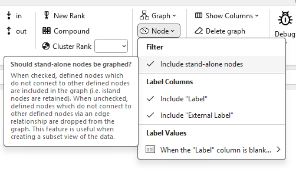 |
| ----------------------------- |

**Step 7** — Remove the check mark on the `Graphviz` ribbon from the `Nodes` → `Include stand‑alone nodes` switch. This tells the Relationship Visualizer to include only those nodes that have at least one edge connection to another node.

| 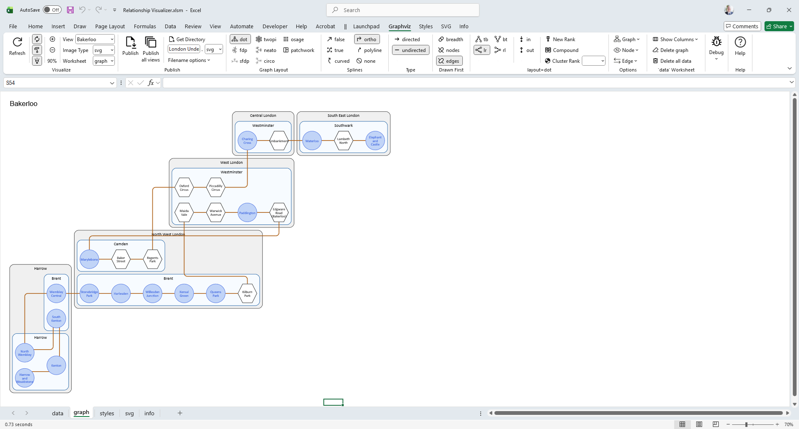 |
| ----------------------------- |

Notice that the various clusters have disappeared along with the stations and interchanges that do not participate in a Bakerloo‑style relationship. This happens because the Relationship Visualizer is now excluding stand‑alone nodes, and Graphviz performs its own additional filtering: it will not draw a cluster that contains no nodes. The result is a clean graph showing only the stations and connections that belong to the Bakerloo line.

> **Note:** This behavior differs from tools like Microsoft Visio, where layers simply hide or show shapes without affecting their layout or grouping. In Graphviz, filtering out nodes or edges can also remove entire clusters, because clusters only exist if they contain at least one visible node. As a result, the structure of the graph can change when a view is applied.

**Step 9** — Repeat Steps 2 and 3 for all the remaining Underground lines. The `styles` worksheet should now show a diagonal pattern of **Yes** values across the View columns, and will appear similar to the following:

| 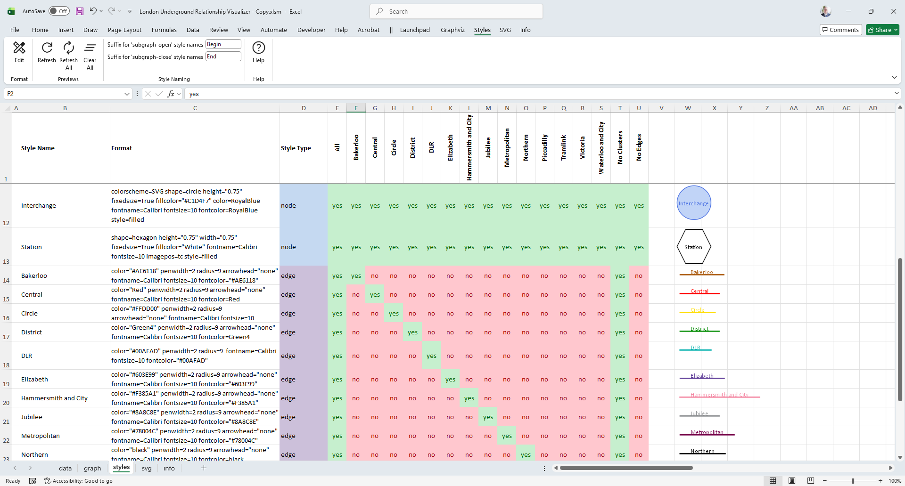 |
| --------------------------------------- |

The list of available views on the Graphviz tab expands automatically to match the new column headings. It will appear as:

| 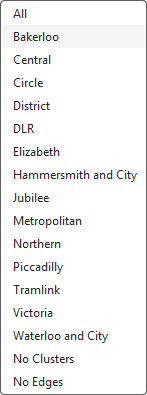 |
| ------------------------- |

**Step 10** — Pick another subway line, such as **DLR**. The graph updates to:

| 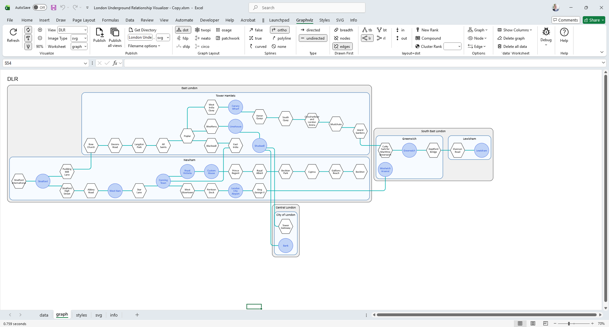 |
| ------------------------------- |

You now have the ability to switch between subway lines using a single shared data set. You can also use the `Publish all views` button to quickly generate one output file per view, allowing you to produce a complete set of line‑specific graphs with a single command.

With these views in place, the Relationship Visualizer becomes a powerful exploration tool. A single shared data set can now produce a family of focused, line‑specific graphs, each generated on demand or published in bulk. Whether you are analyzing connectivity, documenting infrastructure, or simply exploring the network, Views give you a flexible, repeatable way to highlight exactly the relationships you care about.

 

Like this tool? <a href="https://www.buymeacoffee.com/exceltographviz">Buy me a coffee! ☕</a>

