# Workbook Structure

## Overview

The **Relationship Visualizer** tool is a macro-enabled Excel workbook. It allows you to collect data in Excel's familiar table format and use Excel's wide set of functions.

The Relationship Visualizer uses multiple worksheets to accomplish its mission. Some worksheets provide the basic functions, while others assist in creating advanced visualizations, or presentation customizations. 

The sections that follow provide a basic overview of the worksheets to help you navigate the workbook. Later chapters describe how to use each worksheet.

## Worksheets

### `data` Worksheet

The `data` worksheet is the core of the Relationship Visualizer. 

The `data` worksheet is the place where you will list the nodes and edge relationships to build your visualizations.

This worksheet is described in more detail in the section [Creating Your First Graph](../create/#creating-your-first-graph).

|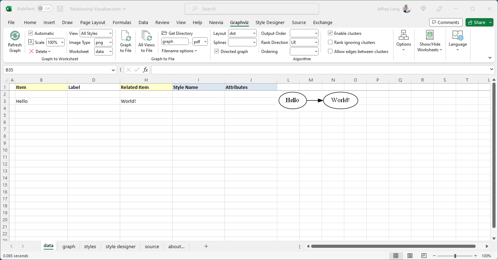|
|-------------------------------|

### `graph` Worksheet

The `graph` worksheet is where image representations of data in the `data` worksheet is displayed whenever the worksheet to display the graph in is specified as `graph` and the `Refresh Graph` button is pressed. This sheet provides zoom in/out and scrolling capabilities for large graphs.

|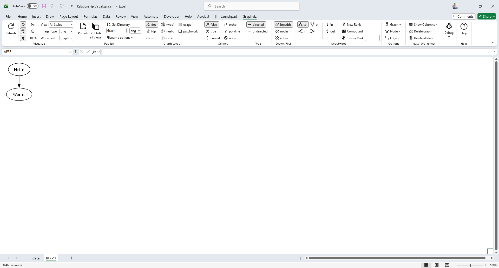|
|-------------------------------|

### `styles` Worksheet

The `styles` worksheet is where you can create style definitions for nodes and edges. 

The `styles` worksheet acts in a manner like an HTML Cascading Style Sheet where you can define a style name, and how the style should appear (shape, color, font, etc.). 

A defined style can then be easily associated with many nodes or edges in the `data` Worksheet.

This worksheet is described in more detail in the section [Using the `styles` Worksheet](../tutorial/#using-the-styles-worksheet).

|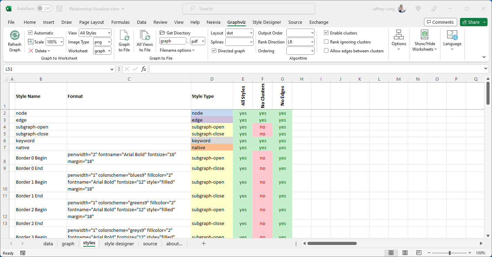|
|-------------------------------|

### `style designer` Worksheet

The `style designer` makes it easy for you to create style definitions for nodes and edges. It removes the burden of knowing the Graphviz attributes required to achieve a visual effect. 

The `style designer` provides the capability to change settings using dropdown lists, and see a preview example of how Graphviz renders the node, edge, or cluster from the attributes. It lets you adjust the attributes until you are happy with the look, then allows you to save the style definition in the `styles` worksheet.

This worksheet is described in the section [Using the `style designer` Worksheet](../tutorial/#using-the-style-designer-worksheet).

|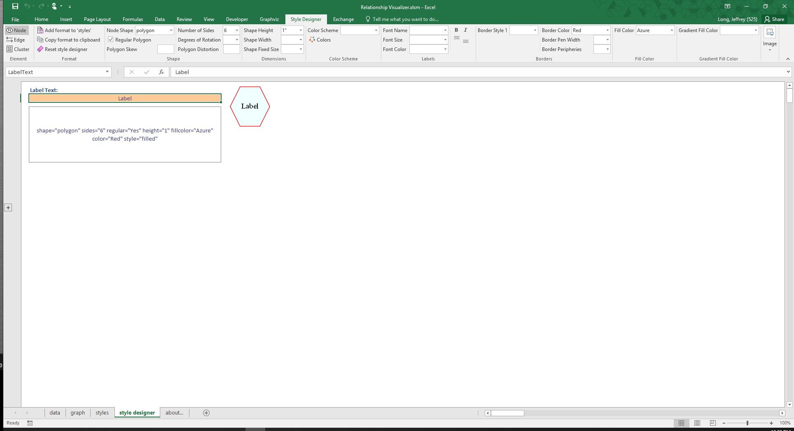|
|-------------------------------|

### `sql` Worksheet

The `sql` worksheet provides capabilities to run SQL statements to bring data from external Excel spreadsheets into the `data` Worksheet for graphing.

This worksheet is described in the section [Using SQL to Import Data from other Excel Spreadsheets](../sql/).

|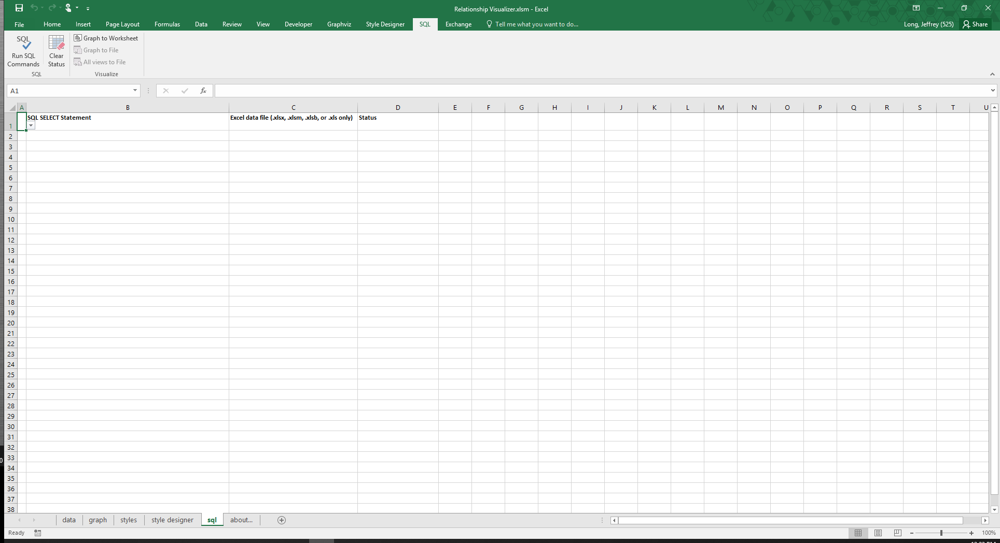|
|-------------------------------|

::: details SQL is not available on Mac OS
Microsoft does not provide the libraries needed to execute SQL statements on Mac OS. The `sql` worksheet is never visible when using the Relationship Visualizer spreadsheet on Mac OS.
:::

### `svg` Worksheet

The `svg` worksheet provides capabilities to perform find and replace commands against graphs published in Scalable Vector Grapics (SVG) format. The find and replace statements act as post-processing commands which allow you to do things such as insert Javascript code to make the graphs dynamic.

This worksheet is described in the section [Post-processing SVG Files](../svg/).

|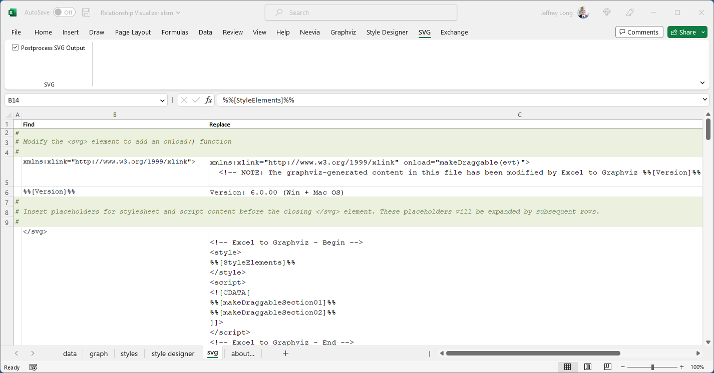|
|-------------------------------|

### `source` Worksheet

The `source` worksheet is where you can see the DOT language source code created from the data in the `data` worksheet when a graph has been created. 

The `source` worksheet also contains links to Graphviz language editing/rendering tools that for experimenting with the DOT language.

This worksheet is described in the section [Viewing DOT Source Code](../source/).

|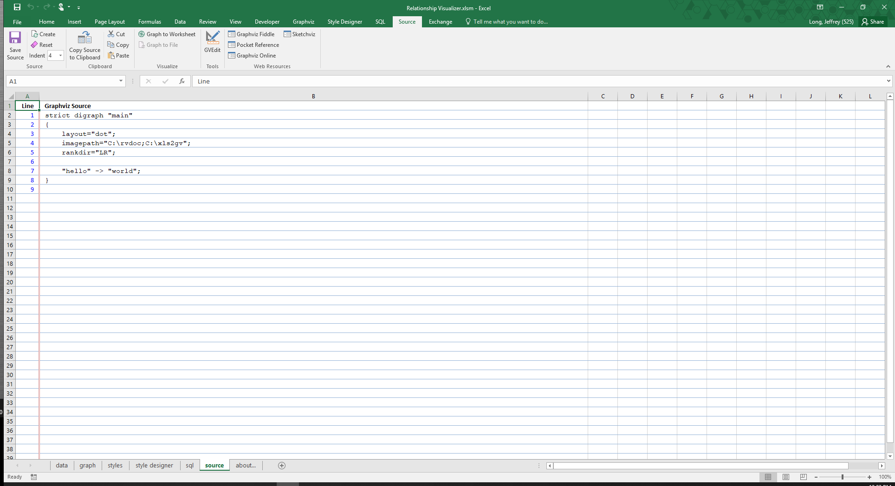|
|-------------------------------|

### `settings` Worksheet

The `settings` worksheet provides capabilities to customize how Graphviz runs, persistent storage of ribbon settings, and configuration options for various worksheets.

This worksheet is described in the section [Changing Master Settings](../settings/).

|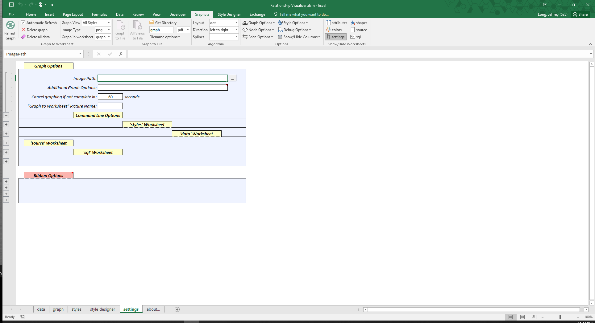|
|-------------------------------|

### `HELP - shapes` Worksheet

The `HELP - shapes` worksheet is intended to provide a glossary of the node shapes which Graphviz supports along with the shape names.

|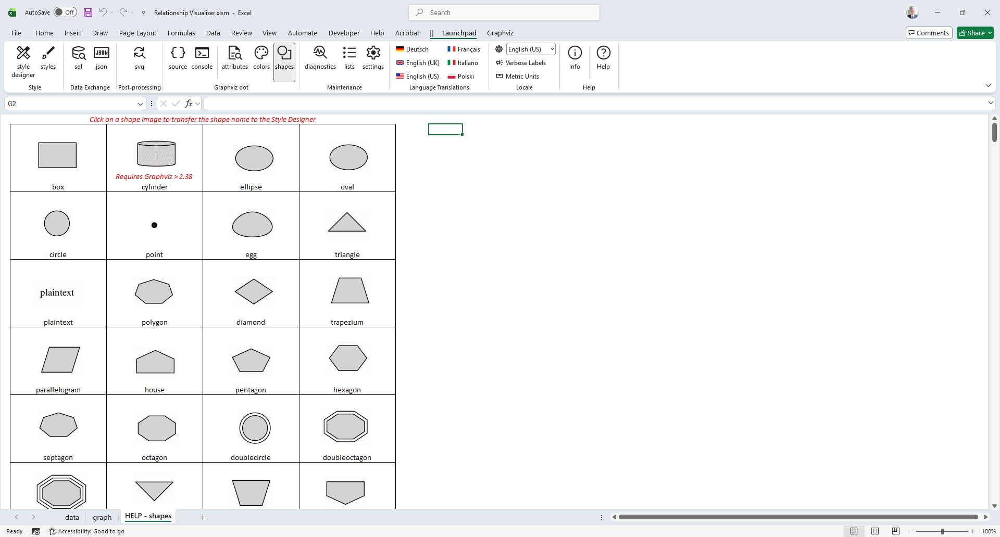|
|-------------------------------|

### `HELP - colors` Worksheet

The `HELP - colors` worksheet provides a glossary of the color schemes and color names which Graphviz uses and what the color looks like. 

This worksheet is also used to create the preview images displayed in the color dropdown lists on the `style designer` tab.

|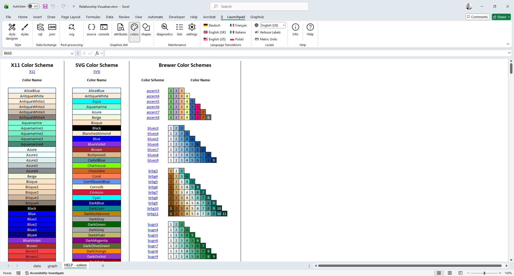|
|-------------------------------|

### `HELP - attributes` Worksheet

The `HELP - attributes` worksheet provides detailed descriptions of the Graphviz language attributes and a cross-reference of where they are used, and what graphing layout programs recognize them.

|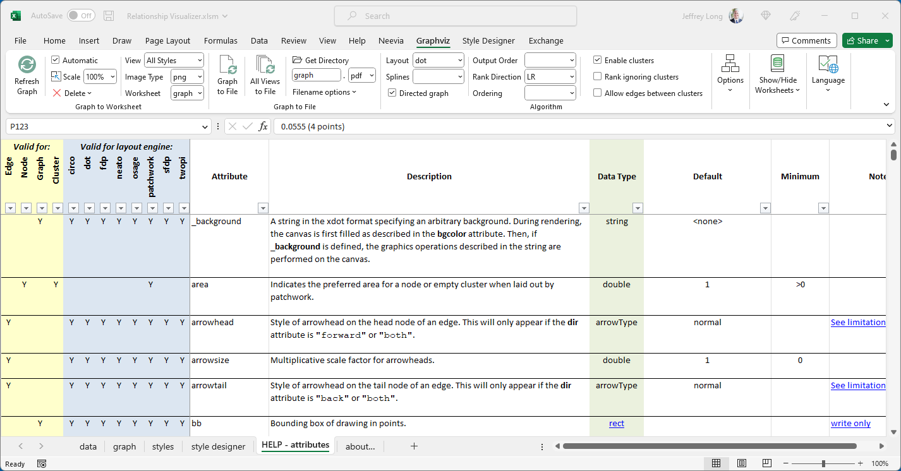|
|-------------------------------|

### `about…` Worksheet

The `about...` worksheet provides the Relationship Visualizer version number, contact information for reaching the program's author, and licenses of the Relationship Visualizer and the open-source components it incorporates.

|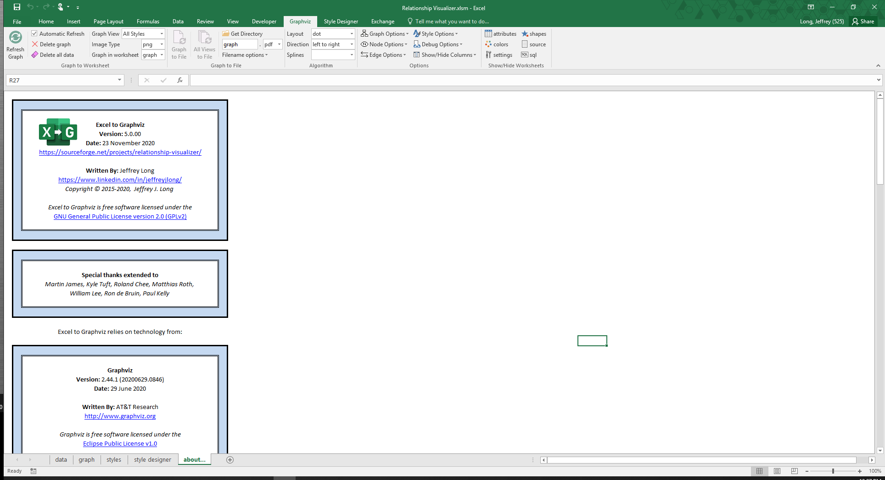|
|-------------------------------|

## Fluent UI Ribbon Tabs

The Office Fluent ribbon replaced Microsoft's previous system of layered menus, toolbars, and task panes from previous versions of Office. The ribbon has a simpler system of interfaces that is optimized for efficiency and discoverability. The ribbon has improved context menus, screen tips, a mini toolbar, and keyboard shortcuts that improve user efficiency and productivity.

The Relationship Visualizer spreadsheet has extended Excel's ribbon interface with additional tabs for performing Relationship Visualizer related actions.

### `Graphviz` Tab

The `Graphviz` tab provides action buttons to create the graphs, and many Graphviz option choices to control how the graph will look. See the section [The `Graphviz` Ribbon Tab](../create/#the-graphviz-ribbon-tab) for full details.

|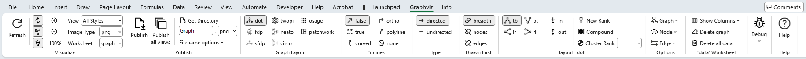|
|-------------------------------|

### `Style Designer` Tab

The `Style Designer` ribbon tab contains the action buttons and settings to create style attribute strings for nodes, edges, and clusters. The 'style designer' worksheet uses this tab exlusively.

The `Style Designer` ribbon tab is explained in more detail in [Using the `style designer` Worksheet](../tutorial/#using-the-style-designer-worksheet).

|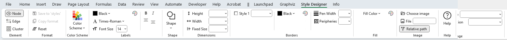|
|-------------------------------|

### `SQL` Tab

The `SQL` tab provides action buttons and run-time option choices pertaining to the `sql` worksheet. The `SQL` ribbon tab contains the action buttons to run Excel SQL statements. The `sql` worksheet uses this tab exlusively.

See the section [SQL Ribbon Controls](../sql/#sql-ribbon-controls) for full details.

|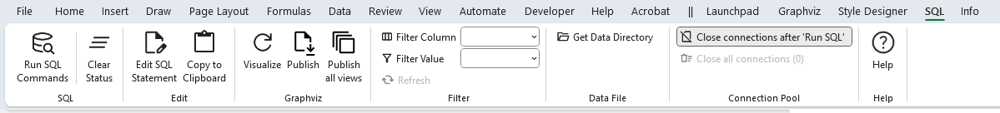|
|-------------------------------|

### `SVG` Tab

The `SVG` tab provides action buttons and run-time option choices pertaining to the `svg` worksheet. The `SVG` ribbon tab contains a checkbox which can turn post-processing of SVG files `on` or `off`. The `svg` worksheet uses this tab exlusively.

See the section [Post-processing SVG files](#sql-ribbon-controls) for full details.

|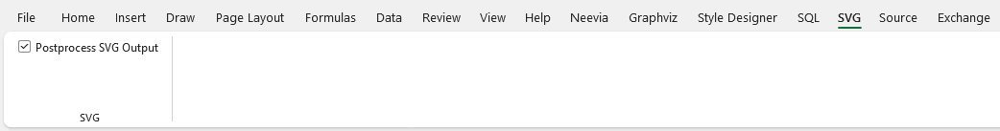|
|-------------------------------|

### `Source` Tab

The `Source` tab provides action buttons and run-time option choices pertaining to the 'source' worksheet. The `Source` ribbon tab contains the action buttons to creating, viewing, and saving Graphviz source code from the information in the 'data' worksheet. The 'source' worksheet uses this tab exlusively.

The `Source` ribbon tab is explained in more detail in [Viewing DOT Source Code](../source/). See the section [The `Source` Ribbon Tab](../source/#the-source-ribbon-tab) for full details.

|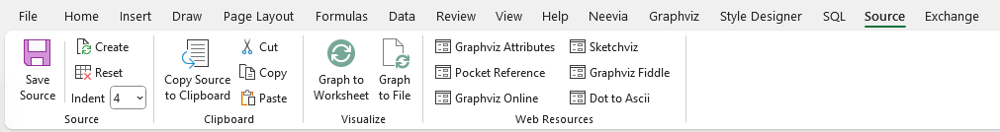|
|-------------------------------|

### `Exchange` Tab

The `Exchange` tab provides action buttons and run-time option choices pertaining to the Export and Import of Relationship Visualizer data utilizing text files in the JSON format. There is no worksheet associated with this tab as it accesses data from multiple worksheets.

See the section [The `Exchange` Ribbon Tab](../exchange/#the-exchange-ribbon-tab) for more details.

|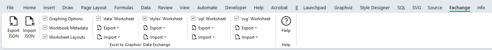|
|-------------------------------|

## Tooltips

All ribbon controls contain tool tips which explain their purpose, such as example below for the `Refresh Graph` button on the `Graphviz` ribbon tab. Simply pause the mouse over the control to make the tool tips appear.

|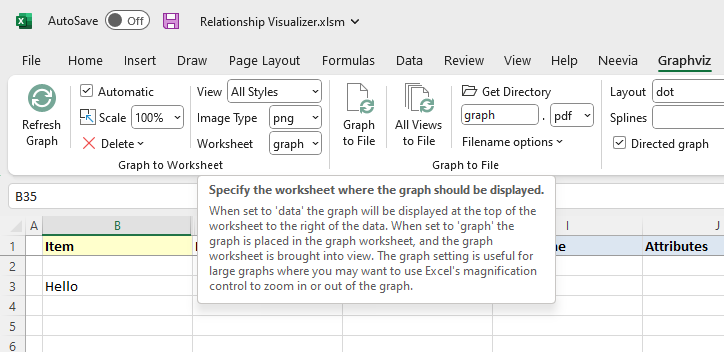|
|-------------------------------|