# Workbook Structure

## Overview

The Relationship Visualizer is a macro‑enabled Excel workbook that lets you collect data using Excel’s familiar table format while taking advantage of its full range of functions.

The workbook is organized into multiple worksheets, each serving a specific purpose. Some provide the core functionality, while others support advanced visualizations or presentation‑level customization.

The sections that follow offer a high‑level overview of these worksheets to help you navigate the workbook. 

## Worksheets

### `data` Worksheet

The `data` worksheet is the core of the Relationship Visualizer.

It is where you list the nodes and edge relationships that form the basis of your visualizations.

This worksheet is described in greater detail in [Creating Your First Graph](../create/#creating-your-first-graph).

|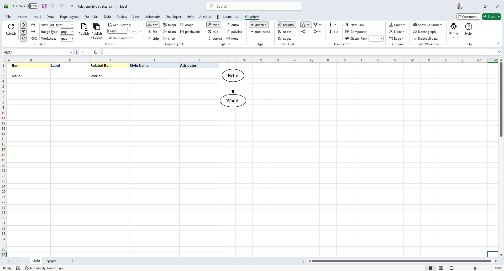|
|-------------------------------|

### `graph` Worksheet

The `graph` worksheet displays the image representation of the data from the `data` worksheet whenever the output worksheet is set to `graph` and the **Refresh** button is pressed. This sheet also provides zoom‑in, zoom‑out, and scrolling capabilities for navigating large graphs.

|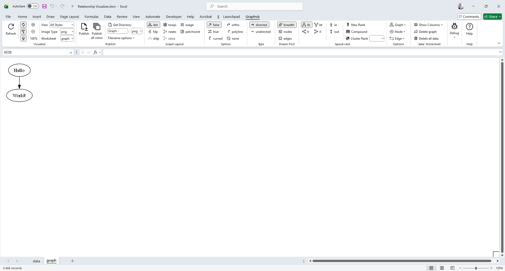|
|-------------------------------|

### `styles` Worksheet

The `styles` worksheet is where you create style definitions for nodes and edges.

It functions much like an HTML Cascading Style Sheet: you define a style name and specify how that style should appear (shape, color, font, and other visual attributes).

Once defined, a style can be easily associated with multiple nodes or edges in the `data` worksheet.

This worksheet is described in greater detail in [Using the `styles` Worksheet](../styles/README.md#the-styles-worksheet).

|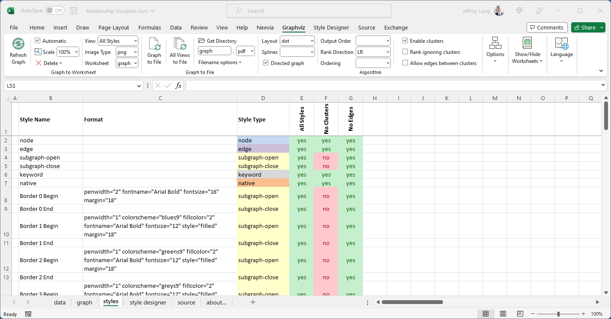|
|-------------------------------|

### `style designer` Worksheet

The `style designer` makes it easy to create style definitions for nodes and edges. It removes the need to know the specific Graphviz attributes required to achieve a desired visual effect.

The `style designer` lets you adjust settings through dropdown lists and immediately see a preview of how Graphviz will render the node, edge, or cluster. You can fine‑tune the attributes until you are satisfied with the appearance, then save the resulting style definition to the `styles` worksheet.

This worksheet is described in more detail in [Using the `style designer` Worksheet](../designer/#using-the-style-designer-worksheet).

||
|-------------------------------|

### `sql` Worksheet

The `sql` worksheet provides the capability to run SQL statements that pull data from external Excel spreadsheets into the `data` worksheet for graphing.

This worksheet is described in more detail in [Using SQL](../sql/).

|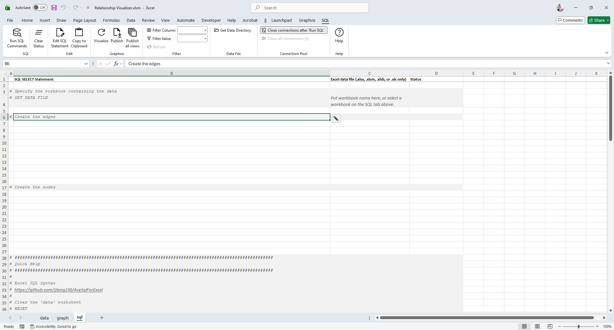|
|-------------------------------|

::: details SQL is not available on Mac OS
Microsoft does not provide the libraries required to execute SQL statements on macOS. As a result, the `sql` worksheet is not visible when using the Relationship Visualizer on Mac OS.
:::

### `svg` Worksheet

The `svg` worksheet provides tools for performing find‑and‑replace operations on graphs published in Scalable Vector Graphics (SVG) format. These operations act as post‑processing commands, allowing you to modify the generated SVG—for example, by inserting JavaScript to make the graphs interactive or dynamic.

This worksheet is described in more detail in [Post‑processing SVG Files](../svg/).

|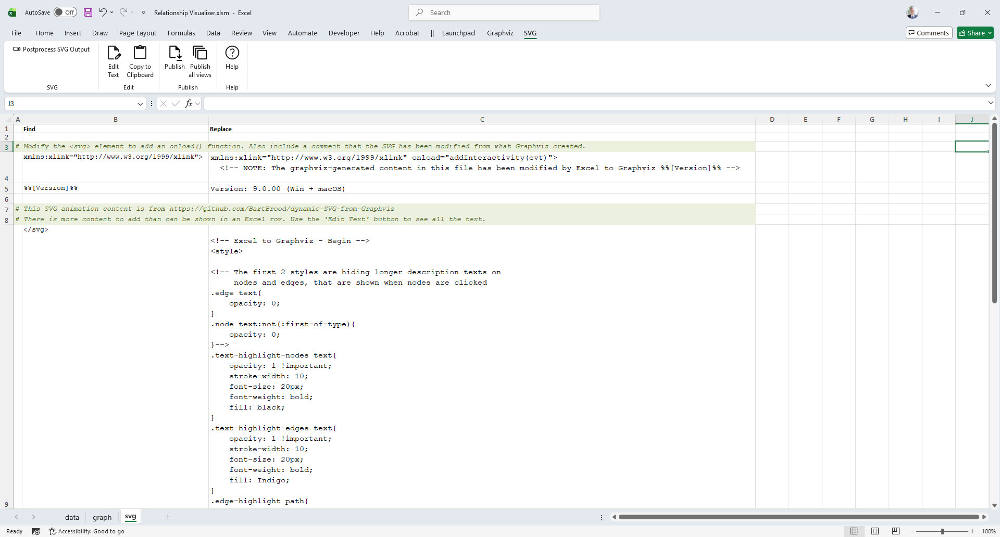|
|-------------------------------|

### `source` Worksheet

The `source` worksheet displays the DOT language source code generated from the data in the `data` worksheet after a graph has been created.

It also provides links to Graphviz editing and rendering tools, allowing you to experiment with the DOT language outside the workbook.

This worksheet is described in more detail in [Viewing DOT Source Code](../source/).

||
|-------------------------------|

### `settings` Worksheet

The `settings` worksheet provides options for customizing how Graphviz runs, storing ribbon settings persistently, and configuring behavior across various worksheets.

This worksheet is described in more detail in [Changing Master Settings](../settings/).

|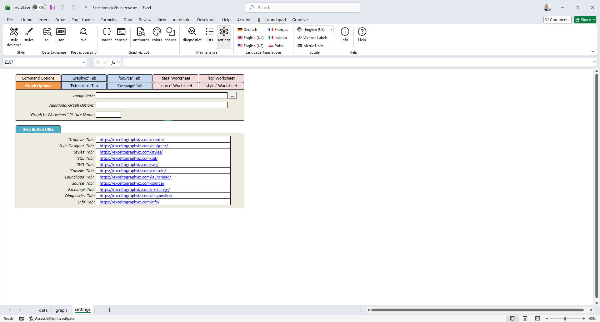|
|-------------------------------|

### `HELP - shapes` Worksheet

The `HELP - shapes` worksheet provides a glossary of the node shapes supported by Graphviz, along with their corresponding shape names.

|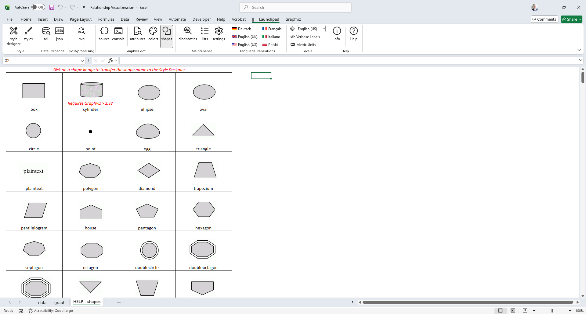|
|-------------------------------|

### `HELP - colors` Worksheet

The `HELP - colors` worksheet provides a glossary of the color schemes and color names used by Graphviz, along with a visual sample of each color.

This worksheet is also used to generate the preview images shown in the color dropdown lists on the `style designer` tab.

|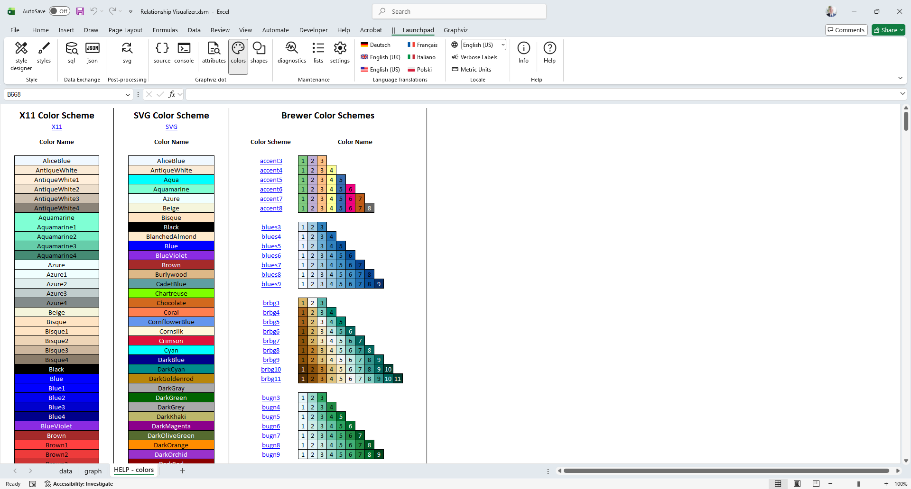|
|-------------------------------|

### `HELP - attributes` Worksheet

The `HELP - attributes` worksheet provides detailed descriptions of Graphviz language attributes, along with a cross‑reference showing where each attribute is used and which Graphviz layout engines recognize it.

|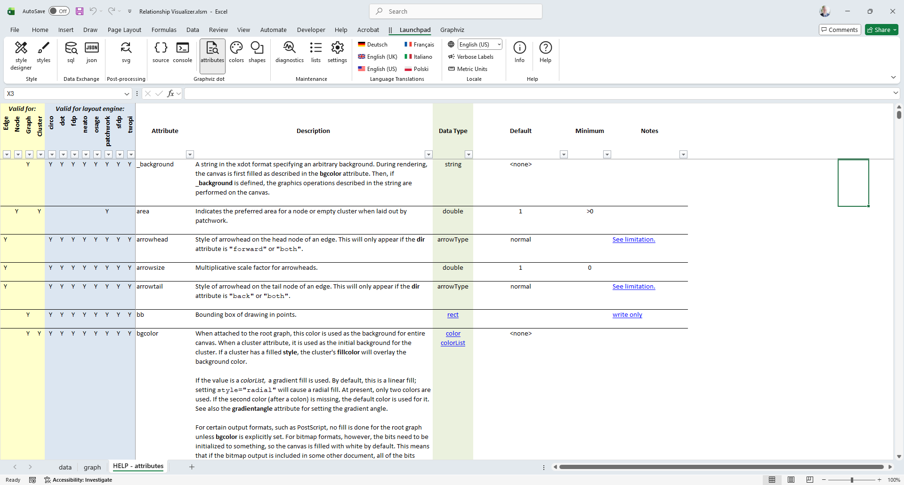|
|-------------------------------|

### `info` Worksheet

The `info` worksheet provides the Relationship Visualizer version number, contact information for the program’s author, and the licenses for both the Relationship Visualizer and the open‑source components it incorporates.

|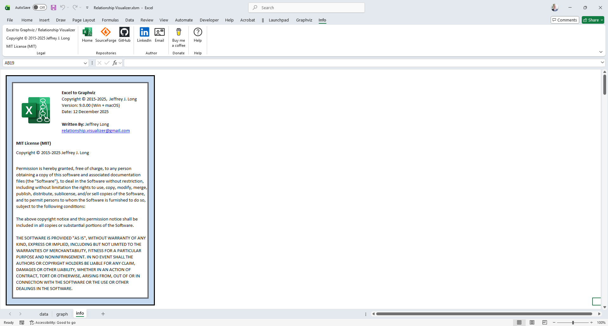|
|-------------------------------|

## Fluent UI Ribbon Tabs

The Office Fluent ribbon replaced Microsoft’s earlier system of layered menus, toolbars, and task panes. The ribbon provides a simpler, more discoverable interface designed to improve efficiency. It includes enhanced context menus, screen tips, a mini toolbar, and keyboard shortcuts that streamline user productivity.

The Relationship Visualizer extends Excel’s ribbon interface with additional tabs dedicated to Relationship Visualizer actions, making its features easier to find and use.

### `Graphviz` Tab

The `Graphviz` tab provides action buttons for creating graphs, along with numerous Graphviz options that control how the graph will be rendered. See [The `Graphviz` Ribbon Tab](../create/#the-graphviz-ribbon-tab) for full details.

|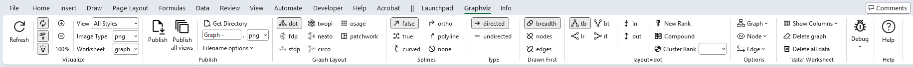|
|-------------------------------|

### `Style Designer` Tab

The `Style Designer` ribbon tab contains the action buttons and settings used to create style‑attribute strings for nodes, edges, and clusters. The `style designer` worksheet uses this tab exclusively.

The `Style Designer` ribbon tab is explained in more detail in [Using the `style designer` Worksheet](../designer/README.md#ribbon-controls).

|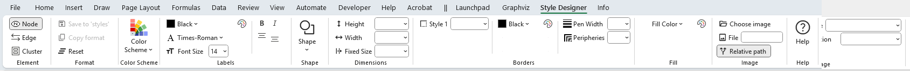|
|-------------------------------|

### `SQL` Tab

The `SQL` tab provides action buttons and run‑time options for working with the `sql` worksheet. It contains the controls used to run Excel SQL statements, and the `sql` worksheet uses this tab exclusively.

See the section [SQL Ribbon Controls](../sql/#the-sql-ribbon-tab) for full details.

|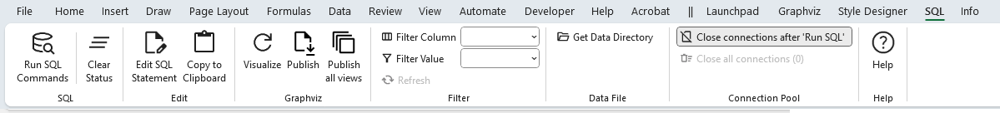|
|-------------------------------|

### `SVG` Tab

The `SVG` tab provides action buttons and run‑time options for working with the `svg` worksheet. It includes a checkbox that enables or disables post‑processing of SVG files. The `svg` worksheet uses this tab exclusively.

See the section [The `SVG` Ribbon Tab](../svg/README.md#the-svg-ribbon-tab) for full details.

|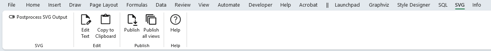|
|-------------------------------|

### `Source` Tab

The `Source` tab provides action buttons and run‑time options for working with the `source` worksheet. It includes controls for creating, viewing, and saving Graphviz source code generated from the information in the `data` worksheet. The `source` worksheet uses this tab exclusively.

The `Source` ribbon tab is explained in more detail in [Viewing DOT Source Code](../source/). See [The `Source` Ribbon Tab](../source/#the-source-ribbon-tab) for full details.

|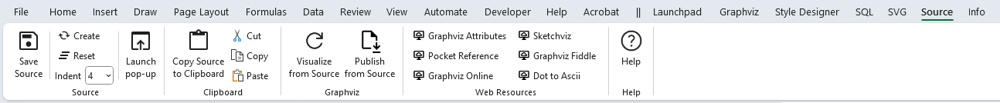|
|-------------------------------|

### `Exchange` Tab

The `Exchange` tab provides action buttons and run‑time options for exporting and importing Relationship Visualizer data using JSON text files. This tab is not tied to a specific worksheet, as it works with data drawn from multiple worksheets.

See [The `Exchange` Ribbon Tab](../exchange/#the-exchange-ribbon-tab) for more details.

|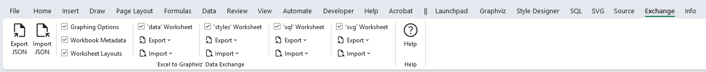|
|-------------------------------|

## Tooltips

All ribbon controls include tool tips that explain their purpose, such as the example shown below for the `dot` layout button on the `Graphviz` ribbon tab. Pause the mouse pointer over any control to display its tool tip.

|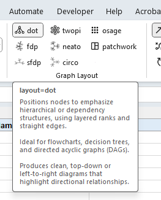|
|-------------------------------|

 

Like this tool? <a href="https://www.buymeacoffee.com/exceltographviz">Buy me a coffee! ☕</a>

