# Creating Graphs

If you have made it this far in this manual, Congratulations. We are past all the software installation steps, graph theory discussions, and definitions. It is time to have some fun and create some simple diagrams.

## Create a New Workbook from the Relationship Visualizer Template

The first action is to launch Excel. When Excel starts, it will suggest sample spreadsheets you can create. This will contain the Relationship Visualizer template which you saved as a template as part of the installation steps. Select this template to create a new workbook. (Note: If you do not see it in the FEATURED list, click on PERSONAL to see your individual list.)

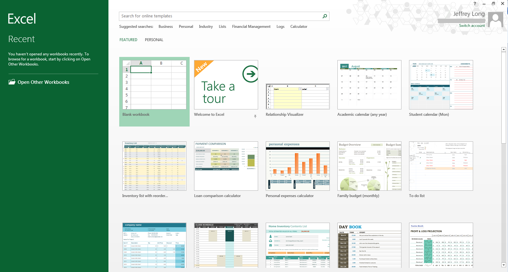

## Save the Workbook as a Macro-Enabled Workbook

The workbook will appear as shown below.

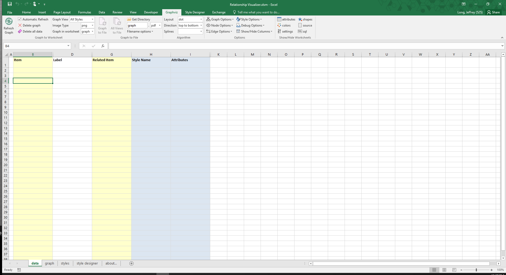

Perform a "**FILE -\> Save As**" action. Choose a directory where you would like to save the file and change the file name from ```Relationship Visualizer1 ```to something meaningful to you.

The most important step is to set the ```Save as type:``` dropdown list item as **Excel Macro-Enabled Workbook**. You will not be able to run the macros that create the visualizations unless the workbook is *macro-enabled*.

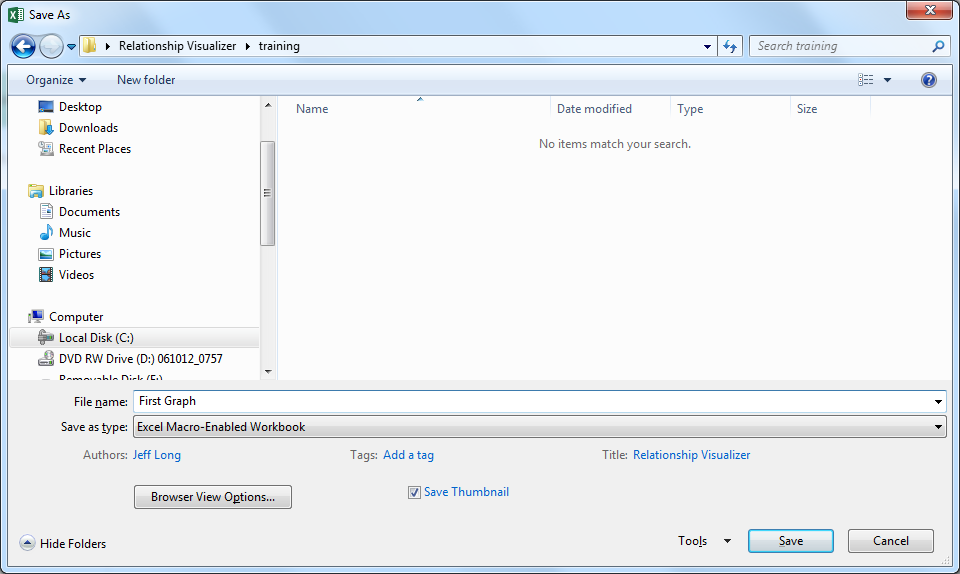

You may or may not receive a security warning that the workbook contains macros. If you get such a warning, click the "**Enable Content**" button to acknowledge the risk and enable the macros.

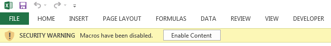

The Relationship Visualizer provides macros through five Excel Fluent UI ribbon tabs named ```Graphviz```, ```Style Designer```, ```SQL```, and ```Source```. The appropriate ribbon tab will activate as you change worksheets.

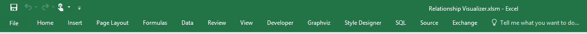

Note: There is a known bug in Excel pertaining to custom ribbons. It occurs after a ```File``` -> ```Save As``` action changes the Excel workbook file name. The ribbon holds a reference to the original file name and breaks the ability to programmatically switch the tab focus. You can manually switch tabs as you move between worksheets, or you can close the file, and reopen it to have the ribbon tabs automatically change according to worksheet selections.

The ```Graphviz``` tab contains the action buttons to create the graphs, and many Graphviz option choices to control how the graph will look. 

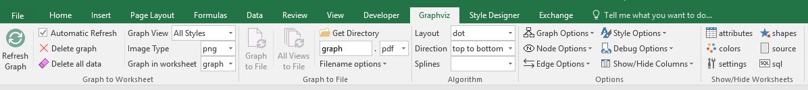

This tab is explained in more detail in [The ```Graphviz``` Ribbon Tab](#the-graphviz-ribbon-tab).

The ```Style Designer``` ribbon tab contains the action buttons and settings to create style attribute strings for nodes, edges, and clusters. The 'style designer' worksheet uses this tab exlusively.

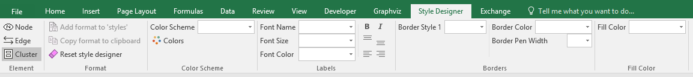

The ```Style Designer``` ribbon tab is explained in more detail in [Using the ```style designer``` Worksheet](#using-the-style-designer-worksheet).

The ```SQL``` ribbon tab contains the action buttons to run Excel SQL statements. The ```sql``` worksheet uses this tab exlusively.

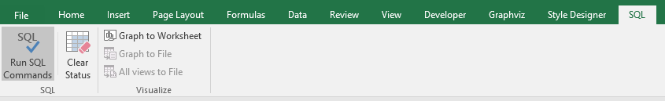

The ```SQL``` ribbon tab is explained in more detail in [Using SQL to Import Data from other Excel Spreadsheets](#using-sql-to-import-data-from-other-excel-spreadsheets).

The ```Source``` ribbon tab contains the action buttons to creating, viewing, and saving Graphviz source code from the information in the 'data' worksheet. The 'source' worksheet uses this tab exlusively.

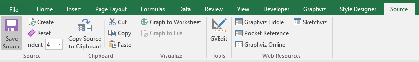

The ```Source``` ribbon tab is explained in more detail in [Working with the DOT Language](#working-with-the-dot-language).

The ```Exchange``` ribbon tab contains the action buttons to export or import the data contents of a Relationship Visualizer spreadsheet to a text file in JSON format. There is no worksheet associated with this tab as it accesses data from multiple worksheets.

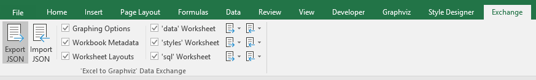

The ```Exchange``` ribbon tab is explained in more detail in [The ```Exchange``` Ribbon](#the-exchange-ribbon-tab).

All ribbon controls contain tool tips which explain their purpose, such as example below for the ```Refresh Graph``` button on the ```Graphviz``` ribbon tab. Simply pause the mouse over the control to make the tool tips appear.

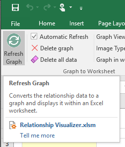

## Creating Your First Graph

For our first example, we will make the simplest graph possible with the tool. This graph will be a directed graph from a node named 'a' to a node named 'b'. To do so we must enter the edge information into the ```data``` Worksheet. The ```data``` Worksheet has 10 columns:

1. **Column A** - The **```Indicator```** column. This column allows you to specify a flag to treat the row as a comment. To do so enter a ```#``` hash tag character in the column. The row will turn green, and no data in this row will be included in the graph. If errors are detected in your data a ```!``` exclamation mark character will appear in the column, the row will turn red, and an error message will be displayed in the ```Messages``` column.

2. **Column B** - The **```Item```** column. This column serves two purposes. For nodes, it is a unique identifier of the node. For edges, it is the unique identifier of the "from" node in a ("from", "to") node pairing.

3. **Column C** - The **```Tail Label```** column. This column is only used when specifying a relationship. It is the text label to be placed near the tail of an edge.

4. **Column D** - The **```Label```** column. This column is optional. When specified for nodes, the value is placed inside the shape; for edges, the value is placed near the spline.

4. **Column E** - The **```External Label```** column. This column is also optional. When specified for nodes, the value is placed outside the shape, typically above and to the left of the shape; for edges, the value is placed away from the spline. If neither a ```Label``` or ```External Label``` is specified then the graph will default to showing the ```Item``` value as the inside label of nodes, and no data for edges.

6. **Column F** - The **```Head Label```** column. This column is only used when specifying a relationship. It is the text label to be placed near the head of an edge.

7. **Column G** - The **```Tooltip```** column. This column is only used when specifying a tooltip in for clusters, nodes, and edges in graphs saved as files in the ```SVG``` format.

7. **Column H** - The **```Related Item```** column. This column is only used when specifying a relationship. It is the unique identifier of the "to" node in a ("from", "to") node pairing.

8. **Column I** - The **```Style Name```** column. Optional information in this column indicates what kind of data is in the row and relates it back to a style definition in the ```styles``` worksheet which controls how the node or element should be graphed. For now, we will only use the styles of ```edge``` and ```node``` in our graphs. Later chapters will explain how you can create additional styles to introduce shapes, colors, and images into your graphs.

9. **Column J** - The **```Attributes```** column. Optional information in this column provides a means to add extra elements of style which will only apply to a single row. For example, you can place style attributes in this column which would allow you to illustrate the route from Michigan to California as described in the introduction to this manual.

10. **Column K** - The **```Messages```** column. When the graphing macros run they check for common mistakes in the data, such as specifying only one node for an edge. When mistakes are found, they are reported in this column. In addition, and exclamation mark ```!``` is placed in the ```Indicator``` column, and the row is highlighted in red to draw your attention to the error.

The columns for ```Tail Label```, ```External Label```, , ```Head Label``` ```Tooltip```, and ```Messages``` (columns C, E, F, G, and K) are hidden by default, since they are less frequently used. Display of these columns can be quickly toggled to be visible by selecting the column name on the list of columns in the dropdown list beneath the ```Show/Hide Columns``` button.

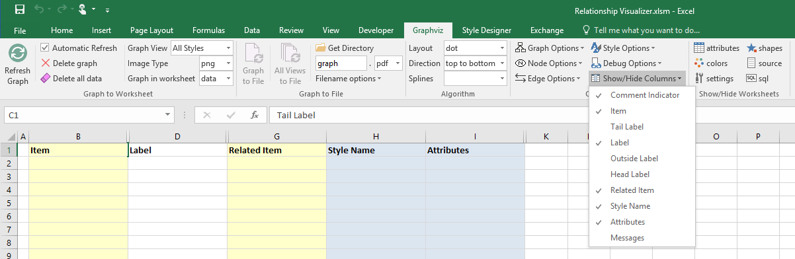

The simplest way to draw a graph is to place values in the ```Item``` and the ```Related Item``` columns. If the 'Automatic Refresh' checkbox is checked the graph will draw as data is entered into each cell. If unchecked, then press the ```Refresh Graph``` button.

For our first graph, we will draw an 'a' is related to 'b' relationship.

1. In row 3 type 'a' in the ```Item``` column, and 'b' in the ```Related Item``` column.
2. Click on the ```Graphviz``` ribbon tab to activate it (if it is not the current active tab)
3. Press the ```Refresh Graph``` button

    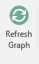

4. See the result beside the data

The results should resemble the following example:

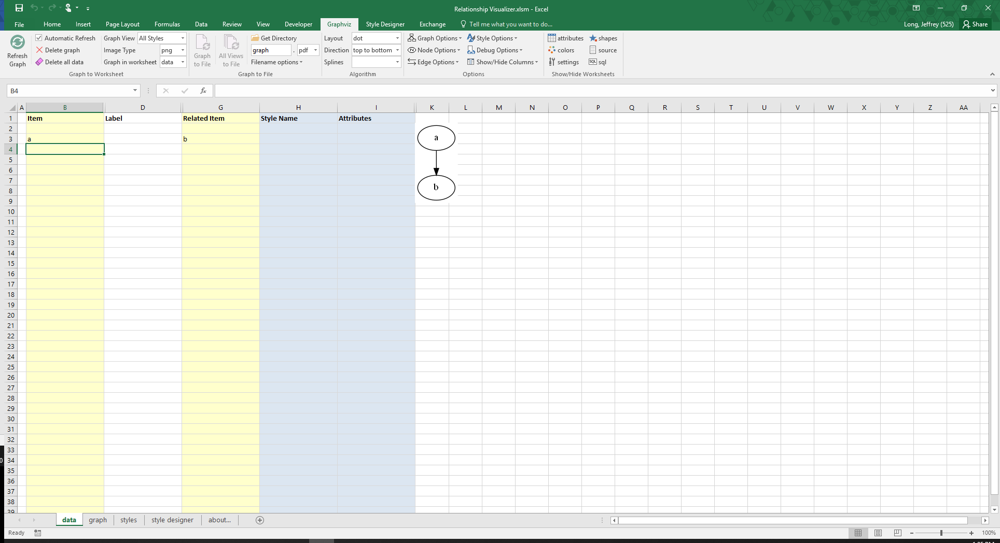

**Congratulations**, you have created your first graph!

The next section will discuss the concepts of creating graphs in Excel. You only need to use the ```Refresh Graph``` button of the ```Graphviz``` ribbon tab for these tutorials. We explain ```Graphviz``` ribbon tab details after the graphing concepts are mastered.

