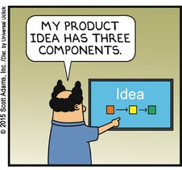
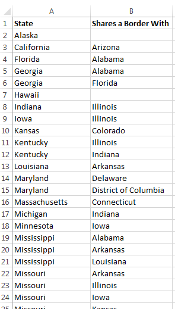
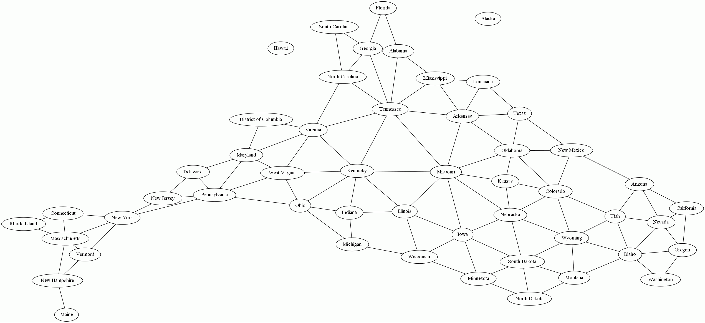

# Overview

## Foreword

**Relationships** are the way in which two or more concepts, objects, or people are connected.

**Visualization** is any technique for creating images, diagrams, or animations to communicate a message. Visualization through visual imagery has been an effective way to communicate both abstract and concrete ideas since the dawn of man. Examples from history include cave paintings, Egyptian hieroglyphs, Greek geometry, and Leonardo da Vinci's revolutionary methods of technical drawing for engineering and scientific purposes.

Individuals often ask to be shown the "big picture", that broad, overall perspective of a problem or situation. So much so that related common clichés or adages have found their way into our vocabulary.

- _"A picture is worth a thousand words"_ refers to the notion that a complex idea can be conveyed with just a single still image. It also aptly characterizes one of the main goals of visualization, namely making it possible to absorb large amounts of data quickly.
- _"He/she can't see the forest for the trees"_ refers to the inability to discern an overall pattern from a mass of detail; or to see the broader, more general situation.

If big picture views are so valued, then why are they so uncommon? The simple answer is that big picture views are hard to produce. Think of it this way, it is much easier to read a map than it is to draw a map. Often, we are drowning in volumes of data, and drawing diagrams is a difficult and time consuming task.

The **Relationship Visualizer for Excel** tool described in this manual derived from personal work to solve this conundrum. A philosophy of breaking a complex situation into descriptions of its simplest relationships guided the solution. Since people are comfortable collecting data in Microsoft Excel, it made for the ideal data entry tool. Finally, pairing Microsoft Excel with the free, open-source graphing engine Graphviz facilitated converting the data in spreadsheets into graphs and views providing alternate perspectives.

The Relationship Visualizer tool was inspired by the work of Martin F. James, and his visualization tool **Lego™ Charts for Excel** which you can learn about and obtain at <http://sourceforge.net/projects/legocharts/> . Martin's tool is a brilliant piece of work and makes an excellent companion for the Relationship Visualizer.

I hope you find this tool useful.

_Jeff Long_

[Relationship.Visualizer@gmail.com](mailto:Relationship.Visualizer@gmail.com)

## Introduction

Everything around us has relationships. These relationships can be between two or more concepts, objects, people, etc. Relationships describe the state of being connected. For example, an apple is related to an apple tree; an apple tree is related to an orchard; an orchard is related to a plot of land; a plot of land is related to an owner as well as a geographical location.

It can be difficult to see the breadth of relationships because either the information about the connections is spread across many people and sources, or the volume of information makes the challenge of depicting the relationships too daunting. The Relationship Visualizer makes it easy to capture relationships using language and see the relationships in pictures using graphs.

Let's look at a simple example. The states in the United States of America are related through the borders they share.

- Michigan shares a border with Ohio, Indiana, and Wisconsin.
- Wisconsin shares a border with Illinois, Iowa, Minnesota, and Michigan.
- And so on…

In businesses throughout the world people like to step up to white boards and draw these relationships as shape and lines because it is simple to represent the concept, and as the old adages says "a picture is worth a thousand words". Using the examples above, the pictures of the border relationships described above is graphed as follows:

and

As the number of relationships grow, people tend to abandon the pictures, and revert to collecting the information in lists. Microsoft Excel is an excellent tool for this task, and people find it easy to use. To capture the state border relationships in this example, one only needs two columns in Excel, a column containing the name of the state, and another column containing the name of the state which it borders. It only takes a small amount of time to collect the information for all 50 states in a table such as:

Contrast entering information into Excel with illustrating the state border relationships for all 50 states in a drawing. Most people would agree that it would be a tedious, time-consuming task. First you would need to have access to a drawing tool such as Visio. Next you would need to create 50 shapes to depict each of the states. You would then need to connect all the shapes with lines, and finally you would need to arrange the shapes to optimize the drawing so that shapes are spaced evenly, and the lines do not cross over one another. Each time you move a shape it will require moving other shapes and lines until a crisp, balanced view is created. Most people are not willing devote the time necessary to create such a drawing when the information can be collected in Excel in a fraction of the time.

While collecting the information in Excel might be expedient, some problems are easier to solve using a picture. If we were give the question "What is the least number of states you must pass through to get from Michigan to California, and what are the names of those states?" the answer can be found in the Excel table data, but it won't be easy. Getting the answer however will take many, many enumerations, jumping from row to row.

The easier way to solve this problem is to see the information in a graph and walk the connections with your finger. Your eyes will scan ahead to see the shortest routes, and you can count which path leads to the lowest number.

The Relationship Visualizer gives you the ability to use the ease of collecting relationship information as a list within Excel and draw relationship graphs within seconds. Copying the data from the table above into the Relationship Visualizer and asking it to generate a graph turns the data into the following visual information:

From here we can begin to determine that the route which connects Michigan and California through the least number of borders would occur approximately along a straight line from Michigan to California. This line is depicted by the blue arrow drawn on the graph below.

We can draw orange arrows on this graph to depict a route which answers the question "What is the least number of states you must pass through to get from Michigan to California?" Our eyes quickly tell us that six states are least number of states that must be crossed.

The graph shows us that there are multiple answers to the question "and what are the names of those states?" The answer we have drawn in orange arrows is "Wisconsin, Iowa, Nebraska, Wyoming, Utah, and Nevada", however scanning the graph visually we can see there are alternate portions of the route which keeps the number of states at 6, but directs you through different states. These segments are depicted by the green, red, and purple arrows.

A common thought when viewing a graph such as the one above is that it does not resemble the way that the United States are laid out geographically on a map. That is true. In this case, it the graph appears somewhat as an inverted version of the USA, with Maine's location in the Southwest, while geographically it is in the Northeast. The reason for this depiction is that the Graphviz graphing engine does not know anything about geography. It builds the graph from the relationships and lays them out in a manner which most efficiently utilizes the diagram space so that collisions between the shapes and lines is minimized.

By releasing the mental paradigm of where shape and line placements should occur you will reap the benefit of rapid visualizations. Give the Relationship Visualizer a bunch of simple **'A' is related to 'B'** statements, and it will give back a big-picture graphical depiction of the data.

## Caveats

The Relationship Visualizer is not primarily an interactive tool. Given very high-level instructions, it will draw the relationship diagrams for you, considering all the low-level details such as the optimal placement of shapes and the lines that connect them. Though you have a large choice of customization options and can control the final output in many ways, it is not at all easy to force DOT to produce exactly what you want, down to the pixel. If you want to control every single pixel in your diagram, or if you are an artistic person who likes to draw free hand, then this tool is not for you.

This tool is intended for the person who wants the visualization performed with the minimum effort and without caring too much about the details of how the diagram was produced.
