# Using SQL to Import Data from other Excel Spreadsheets

Have you ever wished that you could graph data that resides in some other spreadsheet? Do you have spreadsheets which change frequently, and thus need frequent re-graphing? The Relationship Visualizer provides a powerful solution which lets you write Structured Query Language (SQL) statements which can pull in your data from other worksheets in an easily repeatable manner.

::: tip

Using the SQL capability is optional. You do not have to use this feature to create graphs. This is a feature for the Relationship Visualizer power user and requires some working knowledge of how to write SQL statements.

:::

## SQL Explained

Structured Query Language (SQL) is a domain-specific language designed for stream processing in a relational data stream management system (RDSMS). It is particularly useful in handling structured data where there are relations between different entities/variables of the data.

SQL `SELECT` statements are designed for a specific purpose: to query data contained in a relational database. The SQL `SELECT` statement selects data from a database, specifying column(s) headings, table(s) from which columns are to be selected, and the criteria for selection. `SELECT \*` is used to select all columns from a table. The `FROM` clause in a `SELECT` statement specifies the Table from which columns are to be selected. The `WHERE` clause in a SELECT statement specifies the criteria for selection.

Syntax: `SELECT column_name FROM table_name [WHERE clause]`

## ActiveX Data Objects (ADO) SQL Queries

Excel can function as a flat-file RDBMS database that can be accessed using ActiveX Data Objects (ADO) and SQL queries. Microsoft Excel handles SQL via its own SQL dialect. See the references at the end of this chapter for detailed information on the Excel SQL dialect.

The Relationship Visualizer contains a worksheet named 'sql' which hides most of the complexities of writing ADO SQL. It allows you to write SQL `SELECT` queries conforming to the ADO syntax conventions and it takes care of the rest. The SQL `SELECT` statements can reference either the Relationship Visualizer spreadsheet or another Excel spreadsheet as the source of the data. When the query is executed, the query results are written to the 'data' worksheet ready for graphing.

ADO has many features, but the only features which the Relationship Visualizer uses are SQL `SELECT` queries of the form:

```sql
    SELECT [Country Code] as [Item],
           [Country Name] as [Label]
    FROM [Countries\$]
```

This is a standard SQL query, one that selects two columns in the database (which in our case is a worksheet) and names the results to correspond to the column names of the 'data' worksheet. Notice that we specify the name of an individual worksheet in the query, in the same way that we would specify an individual table name if we were connecting to a database, with a couple of minor exceptions. The worksheet name is enclosed in square brackets and that the actual worksheet name - **Countries** - has a **\$** appended to it.

Square brackets are also used to wrap the column names since the column names may have spaces present. The square brackets inform ADO to treat the value inside as the column name. Square brackets are used instead of quotes because quotes denote a string value to place in the results.

The results of the `SELECT` statements are processed by the Relationship Visualizer to place the selected values into the appropriate columns of the 'data' worksheet. The processing logic only recognizes the column names, and will discard all other data. The default English column names on the `data` worksheet are:

- [Comment]
- [Item]
- [Label]
- [External Label]
- [Tail Label]
- [Head Label]
- [Related Item]
- [Style Name]
- [Attributes]

Excel SQL also allows you to specify strings values as selection columns. The string is repeated for each row of the query results when the SQL is executed. This is a useful feature for specifying values such as a style name.

Assume that there is a style defined on the `styles` worksheet named "Country". The query is modified as follows to add a style named "Country" to each row of the results:

```sql
    SELECT [Country Code] as [Item],
           [Country Name] as [Label],
           'Country'      as [Style Name]
    FROM   [Countries\$]
```

SQL allows you to specify `WHERE` conditions which control what information is returned. The `WHERE` clause, states the qualifying conditions for a query. Multiple conditions can be joined by the `AND` and `OR` clauses, optionally surrounded by (parentheses) to group them. Only the records that satisfy the specified criteria are returned by the query.

Assume that we wanted a list of countries which use US Dollars as their national currency. The international code for US Dollars is "USD" so the SQL would be modified to appear as follows:

```sql
    SELECT [Country Code] as [Item],
           [Country Name] as [Label],
           'Country' as [Style Name]
    FROM   [Countries\$]
    WHERE  [Currency Code] = 'USD'
```

A column often contains duplicate values. To list the distinct values, use the `SELECT DISTINCT` clause. The `DISTINCT` keyword can be used to return only unique values from a set of records. For example, if our worksheet contains the continent names where countries reside, we can obtain a list of the continents without duplicate rows using the following SQL statement:

```sql
    SELECT DISTINCT [Continent] as [Item],
           [Continent]          as [Label],
           'Continent'          as [Style Name]
    FROM   [Countries\$]
```

Now that you understand the basics of writing SQL SELECT statements, let us look at the features contained in the 'sql' worksheet and ribbon tab.

The 'sql' worksheet is hidden by default. To expose the 'sql' worksheet select the 'sql' button on the `Graphviz` tab.

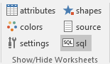

## SQL Ribbon Controls

The 'SQL ribbon tab is activated whenever the 'sql' worksheet is activated. It appears as follows:

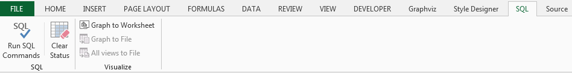

It contains the following major groups:

- SQL
- Visualize

### SQL

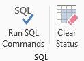

| Label            | Control Type | Description                                                                                          |
| ---------------- | ------------ | ---------------------------------------------------------------------------------------------------- |
| Run SQL Commands | Button       | Sequentially runs the SQL statements in this worksheet, writing the results to the 'data' worksheet. |
| Clear Status     | Button       | Clear the values from the 'Status' column.                                                           |

### Visualize

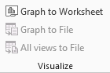

| Label             | Control Type | Description                                                                                                                                                                                                                                                                                                                           |
| ----------------- | ------------ | ------------------------------------------------------------------------------------------------------------------------------------------------------------------------------------------------------------------------------------------------------------------------------------------------------------------------------------- |
| Refresh Graph     | Button       | Graphs the data in the 'data' worksheet and displays the results in Excel. This button does the same work as the like-named button on the `Graphviz` ribbon tab and is included here to speed the creation of graphs after running SQL statements.                                                                                    |
| Graph to File     | Button       | Graphs the data in the 'data' worksheet and writes the graph to a file using the values specified on the Graphviz ribbon tab. This button does the same work as the like-named button on the `Graphviz` ribbon tab and is included here to speed the creation of graphs after running SQL statements.                                 |
| All views to File | Button       | Graphs the data in the 'data' worksheet against all the views specified and writes the graphs to files using the values specified on the Graphviz ribbon tab. This button does the same work as the like-named button on the `Graphviz` ribbon tab and is included here to speed the creation of graphs after running SQL statements. |

## Writing SQL Queries to create graphs

In the Relationship Visualizer download zip file, there is a directory named "SQL - World Map" within the "samples" directory. We will use this example to show how to use the 'sql' worksheet. The "SQL - World Map" directory has in it a copy of the Relationship Visualizer spreadsheet containing SQL statements, and predefined styles on the 'styles' worksheet, as well as 'data' directory which has 5 representations of a "countries" worksheet corresponding to the supported file extensions of csv, xls, xlsb, xlsm, and xslx. All of the "countries" spreadsheets have the same data. The query logic has to treat each file extension a little differently (I won't bore you with the details) and is included in the different formats simply for testing purposes. An example of a "countries" workbook appears as follows:

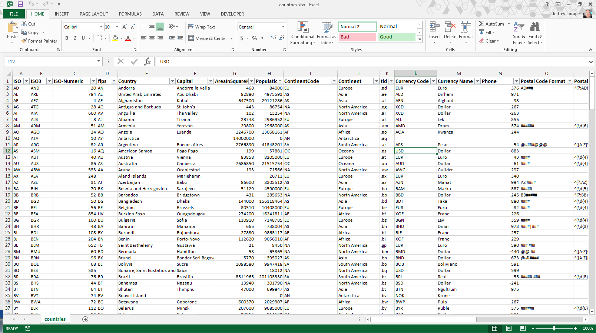

Now open the file "Relationship Visualizer.xslm", select the 'sql' worksheet. Note that there are 4 rows with SQL statements. We will use these statements to extract the values out the 'countries' workbooks and draw a graph view of the continents, countries, and connected borders. The 'sql' worksheet appears as follows:

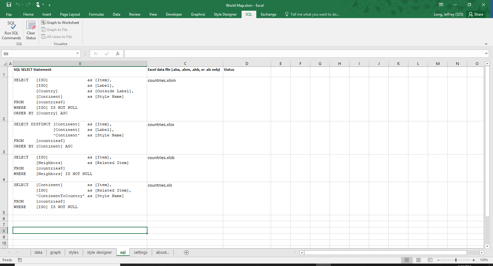

The first SQL statement on row 2 selects the column "ISO" to represent the Item ID, as well as the node label. The country name is selected to be an External Label, and the continent name is selected to be the style name. Within the 'styles' worksheet there are 7 node style definitions which correspond to the continent names.

The SQL is written as follows:

```sql

SELECT [ISO]       as [Item],
       [ISO]       as [Label],
       [Country]   as [External Label],
       [Continent] as [Style Name]
FROM  [countries\$]
WHERE [ISO] IS NOT NULL
ORDER BY [Country] ASC

```

The second SQL statement on row 3 will extract the 7 seven unique continent names from the list of countries by using the DISTINCT clause. The continent name will be used as the Item ID as well as the node label. A style name of "Continent" will be used for all the rows.

The SQL is written as follows:

```sql

SELECT DISTINCT [Continent] as [Item],
                [Continent] as [Label],
                'Continent' as [Style Name]
FROM [countries\$]
ORDER BY [Continent]


```

The third SQL statement on row 4 creates edge relationship rows by selecting the ISO value as the Item ID, and the "Neighbors" column as the `Related Item` value. The "Neighbors" column in the source worksheet contains comma-delimited ISO values which are neighboring countries to that row. The Relationship Visualizer has built-in logic to expand the comma-delimited list into multiple relationships. No style name is provided, so the default edge style will be used. Note that on the WHERE clause the directive "IS NOT NULL" has been added. This clause causes the query to skip rows with empty cells, as there are no values with which to express relationships.

The SQL is written as follows:

```sql

SELECT [ISO]       as [Item],
       [Neighbors] as [Related Item]
FROM   [countries\$]
WHERE [Neighbors] IS NOT NULL

```

The fourth SQL statement on row 5 is used to group countries by continent. It creates edge relationships by placing the Continent name as the Item ID, and the ISO country code in the `Related Item` column. The style name is specified as "ContinentToCountry".

The SQL is written as follows:

```sql

SELECT [Continent]          as [Item],
       [ISO]                as [Related Item],
       'ContinentToCountry' as [Style Name]
FROM [countries\$]
WHERE [ISO] IS NOT NULL

```

Each of these queries have to specify the name of the workbook against which the SQL is to run. This information is contained in column C. There are three ways the file name may be specified.

1.  Specify the full path to the file as shown in the sample file.
2.  Specify just the file name. The Relationship Visualizer will assume that the data workbook is contained in the same directory as the Relationship Visualizer workbook.
3.  Leave the cell blank. If the cell is blank the Relationship Visualizer assumes that the data is contained within the current Relationship Visualizer workbook.

Once the file paths are specified, we can run the SQL. Press the "Run SQL Commands" button

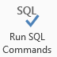

The SQL commands are run in sequence from top to bottom. Results are written to the 'data' worksheet, and the query result status is displayed in column D such as:

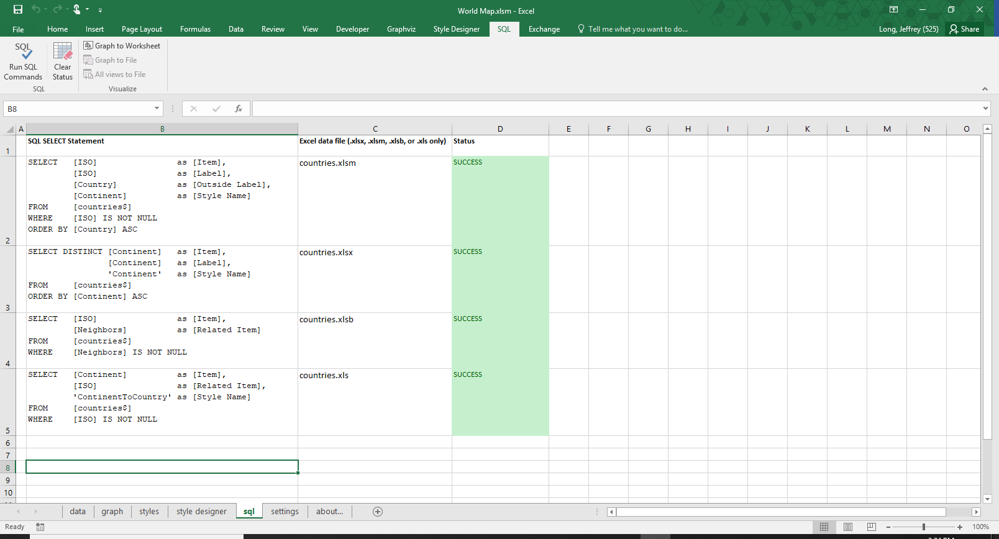

If we switch worksheets to the 'data' worksheet, it appears as follows:

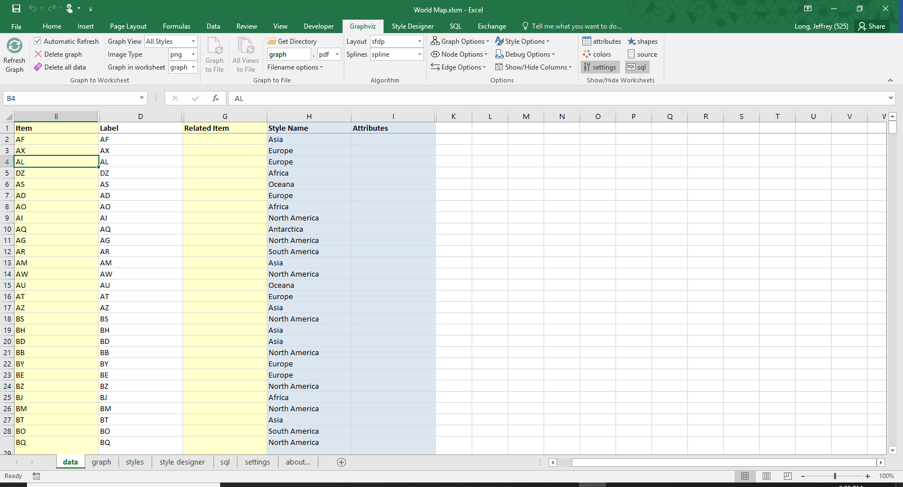

The data is all present and in the appropriate columns for graphing. In this example 678 rows of data have been created using 4 SQL statements! Press the `Refresh Graph` button to graph the data. Since this is a large data set, be prepared to wait a little while for the results.

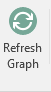

When Graphviz completes its work, you should see a logical world graph which appears as follows (sent to 'graph' worksheet with zoom level set to 30%):

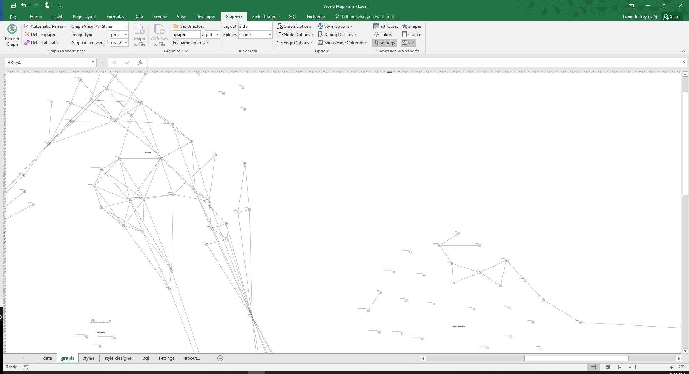

## For more information on Excel SQL

- Writing SQL Queries against Excel files (Excel SQL) - <https://querysurge.zendesk.com/hc/en-us/articles/205766136-Writing-SQL-Queries-against-Excel-files>
- SQL Query Reference - <https://www.aquaclusters.com/app/home/project/public/aquadatastudio/wikibook/MS-Excel/page/SQL-Query-Reference/SQL-Query-Reference>
- Fundamental Microsoft Jet SQL for Access 2000 - <https://docs.microsoft.com/en-us/previous-versions/office/developer/office2000/aa140011%28v%3doffice.10%29>
- Intermediate Microsoft Jet SQL for Access 2000 - <https://docs.microsoft.com/en-us/previous-versions/office/developer/office2000/aa140015%28v%3doffice.10%29>
