# Workbook Structure

## Overview

The Relationship Visualizer tool is a macro-enabled Excel workbook. It allows you to collect data in Excel's familiar table format and use Excel's wide set of functions.

The Relationship Visualizer uses multiple worksheets to accomplish its mission. Some worksheets provide the basic functions, while others assist in creating advanced visualizations, or presentation customizations. The sections that follow provide a basic overview of the worksheets to help you navigate the workbook. Later chapters describe how to use each worksheet.

## Worksheets

### `data` Worksheet

The `data` worksheet is the core of the Relationship Visualizer. This is the place where you will list the nodes and edge relationships to build your visualizations.

This worksheet is described in more detail in the section [Creating Your First Graph](#creating-your-first-graph).

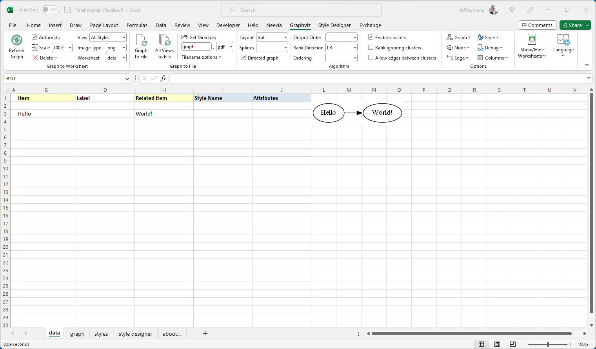

### `graph` Worksheet

The `graph` worksheet is where image representations of data in the `data` worksheet is displayed whenever the `Refresh Graph` button is pressed within the workbook.

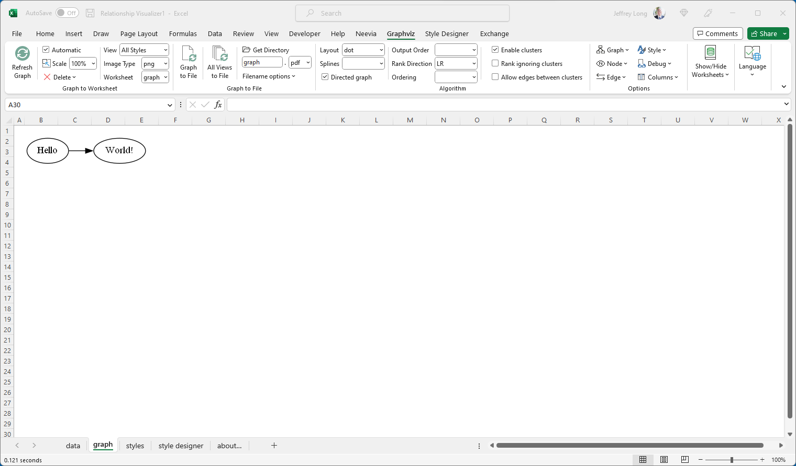

### `styles` Worksheet

The `styles` worksheet is where you can create style definitions for nodes and edges. It in a manner like an HTML Cascading Style Sheet where you can define a style name, and how the style should appear (shape, color, font, etc.). A defined style can then be associated with many nodes or edges in the `data` Worksheet.

This worksheet is described in more detail in the section [Using the 'styles' Worksheet](#using-the-styles-worksheet).

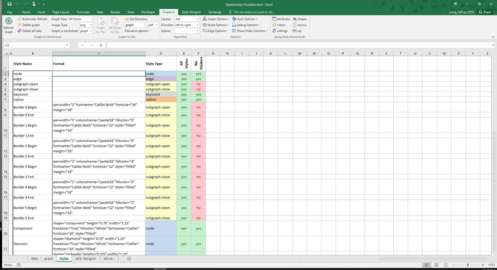

### `style designer` Worksheet

The `style designer` makes it easy for you to create style definitions for nodes and edges. It removes the burden of knowing the Graphviz attributes required to achieve a visual effect. The style designer provides the capability to change settings using dropdown lists, and see a preview example of how Graphviz renders the node, edge, or cluster from the attributes.

The style designer lets you adjust the attributes until you are happy with the look, then allows you to save the style definition in the `styles` worksheet.

This worksheet is described in the section [Using the 'style designer' Worksheet](#using-the-style-designer-worksheet).

### `sql` Worksheet

The `sql` worksheet provides capabilities to run Excel ADODB SQL statements to bring data from external Excel spreadsheets into the `data` Worksheet for graphing.

This worksheet is described in the section [Using SQL to Import Data from other Excel Spreadsheets](#using-sql-to-import-data-from-other-excel-spreadsheets).

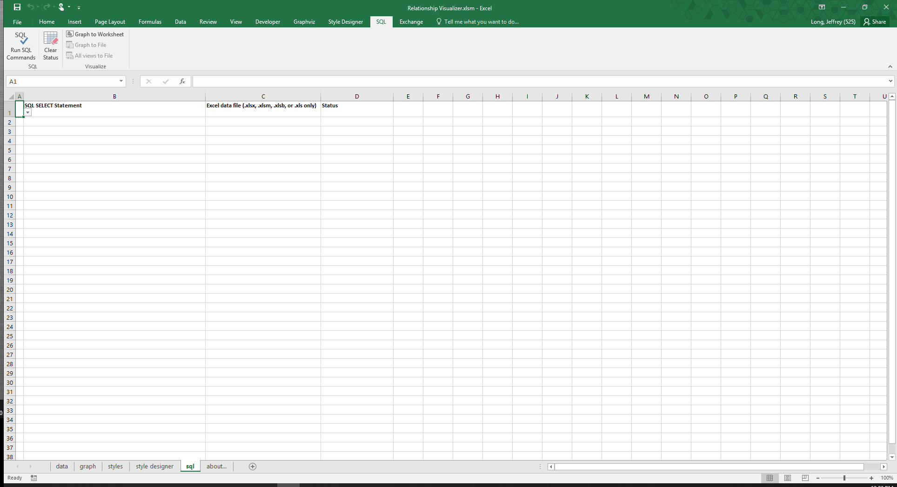

### `source` Worksheet

The `source` worksheet is where you can see the DOT language source code created from the data in the `data` Worksheet when a graphing button was pressed, which in-turn resulted in the graph in being created. The worksheet also contains links to Graphviz language editing/rendering tools that for experimenting with the DOT language.

This worksheet is described in the section [Viewing DOT Source Code](#viewing-dot-source-code).

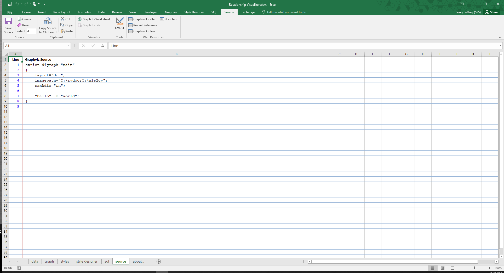

### `settings` Worksheet

The `settings` worksheet provides capabilities to customize how Graphviz runs.

This worksheet is described in the section [Changing Master Settings](#changing-master-settings).

### `HELP - shapes` Worksheet

The `HELP - shapes` worksheet is intended to provide a glossary of the node shapes which Graphviz supports along with the shape names. This reference can be of great assistance when using the "style designer" capabilities.

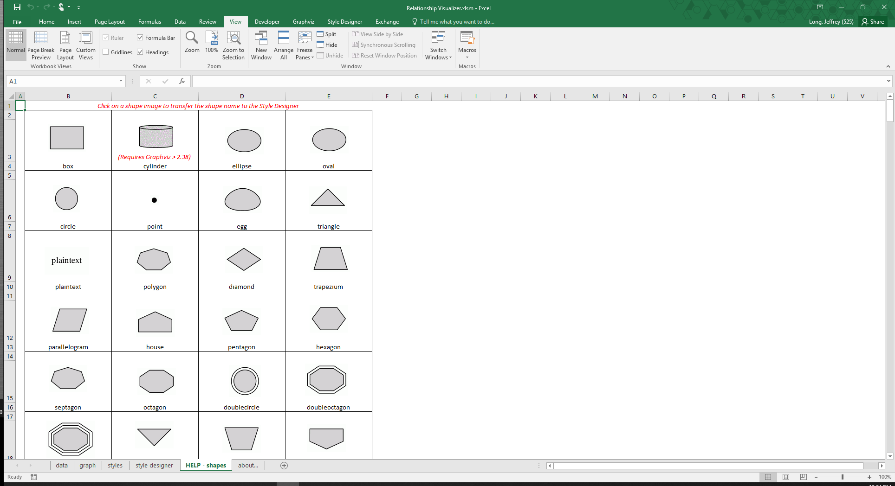

### `HELP - colors` Worksheet

The `HELP - colors` worksheet is intended to provide a glossary of the color schemes and color names which Graphviz uses and what the color looks like. This reference can be of great assistance when using the "style designer" capabilities.

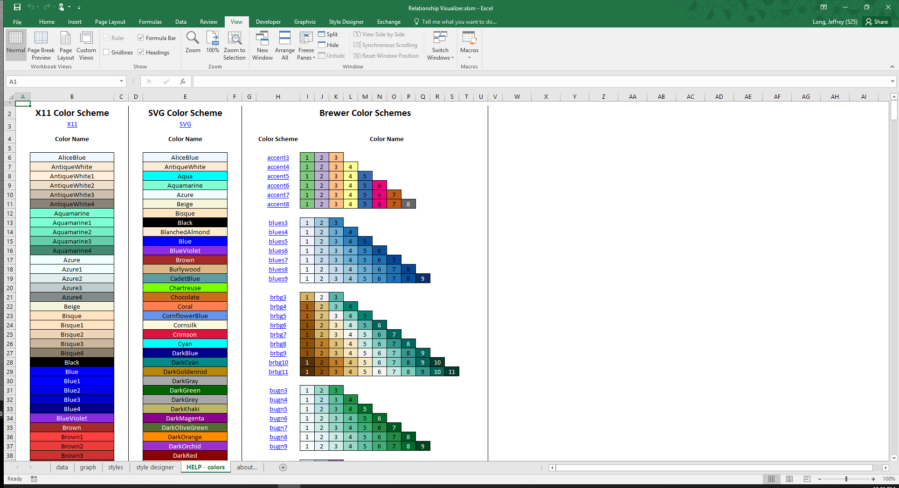

### `HELP - attributes` Worksheet

The `HELP - attributes` worksheet provides detailed descriptions of the Graphviz language attributes and a cross-reference of where they are used, and what graphing layout programs recognize them.

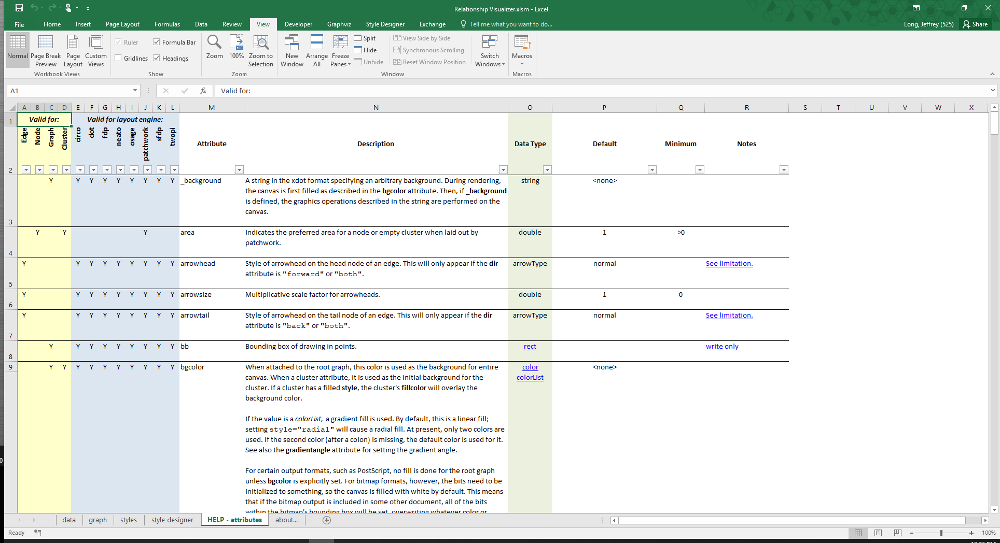

### `about…` Worksheet

The `about...` worksheet provides the Relationship Visualizer version number, contact information for reaching the program's author, and licenses of the Relationship Visualizer and the open-source components it incorporates.

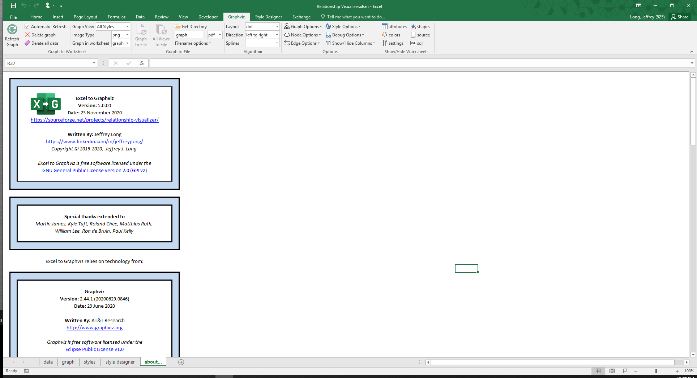

## Fluent UI Ribbon Tabs

The Office Fluent ribbon replaced Microsoft's previous system of layered menus, toolbars, and task panes from previous versions of Office. The ribbon has a simpler system of interfaces that is optimized for efficiency and discoverability. The ribbon has improved context menus, screen tips, a mini toolbar, and keyboard shortcuts that improve user efficiency and productivity.

The Relationship Visualizer spreadsheet has extended Excel's ribbon interface with 5 additional tabs for performing Relationship Visualizer related actions.

### `Graphviz` Tab

The `Graphviz` tab of the Excel Fluent UI ribbon provides action buttons to create the graphs, and many Graphviz option choices to control how the graph will look. See the section [The Graphviz Ribbon Tab](#the-graphviz-ribbon-tab) for full details.

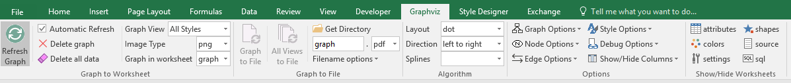

### `Style Designer` Tab

The `Style Designer` ribbon tab contains the action buttons and settings to create style attribute strings for nodes, edges, and clusters. The 'style designer' worksheet uses this tab exlusively.

The `Style Designer` ribbon tab is explained in more detail in [Using the `style designer` Worksheet](#using-the-style-designer-worksheet).

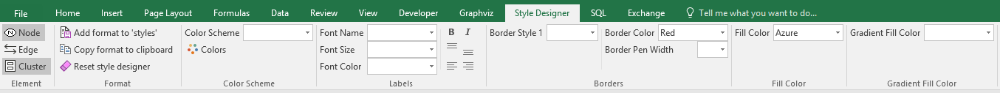

### `SQL` Tab

The `SQL` tab of the Excel Fluent UI ribbon provides action buttons and run-time option choices pertaining to the `sql` worksheet. The `SQL` ribbon tab contains the action buttons to run Excel SQL statements. The `sql` worksheet uses this tab exlusively.

See the section [SQL Ribbon Controls](#sql-ribbon-controls) for full details.

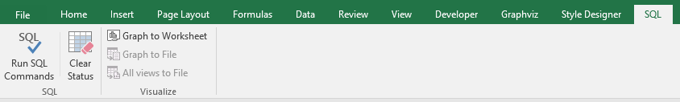

### `Source` Tab

The `Source` tab of the Excel Fluent UI ribbon provides action buttons and run-time option choices pertaining to the 'source' worksheet. The `Source` ribbon tab contains the action buttons to creating, viewing, and saving Graphviz source code from the information in the 'data' worksheet. The 'source' worksheet uses this tab exlusively.

The `Source` ribbon tab is explained in more detail in [Working with the DOT Language](#working-with-the-dot-language). See the section [The "Source" Ribbon Tab](#the-source-ribbon-tab) for full details.

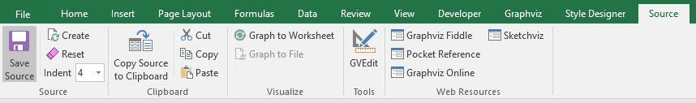

### `Exchange` Tab

The `Exchange` tab of the Excel Fluent UI ribbon provides action buttons and run-time option choices pertaining to the Export and Import of Relationship Visualizer data utilizing text files in the JSON format. There is no worksheet associated with this tab as it accesses data from multiple worksheets.

See the section [The Exchange Ribbon Tab](#the-exchange-ribbon-tab) for more details.

## Tooltips

All ribbon controls contain tool tips which explain their purpose, such as example below for the `Refresh Graph` button on the `Graphviz` ribbon tab. Simply pause the mouse over the control to make the tool tips appear.

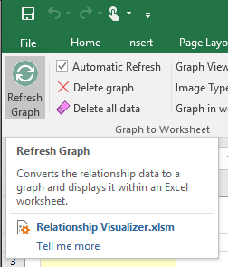
